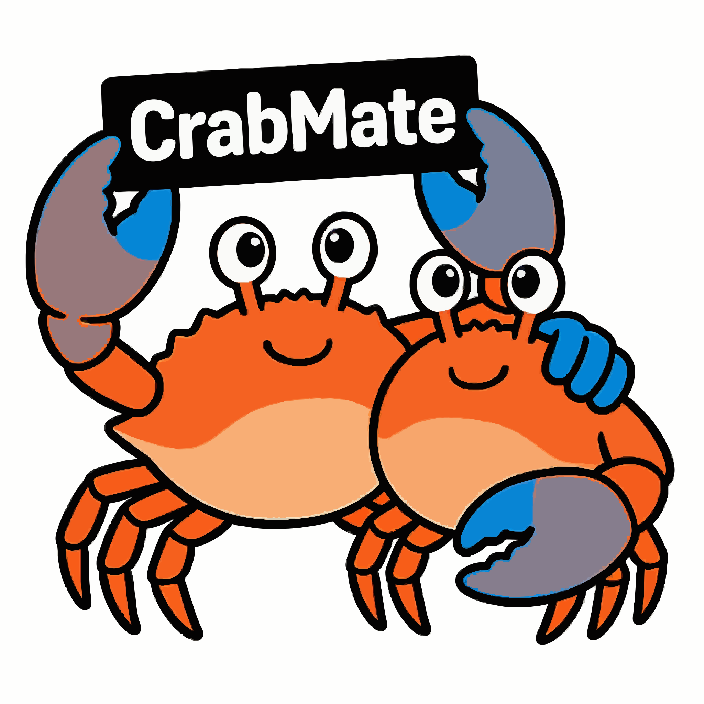

**Languages / 语言:** English (this page) · [中文](README.md)

# CrabMate

<p align="center">
  
</p>

**CrabMate** is a Rust-based AI agent that talks to DeepSeek, MiniMax, Zhipu GLM, Moonshot Kimi, local Ollama, and other backends through **OpenAI-compatible** `chat/completions`. It includes **function calling** plus workspace commands, files, and more tools, with both a **Web UI** and **CLI**.

## Contents

- [CrabMate](#crabmate)
  - [Contents](#contents)
  - [Features](#features)
  - [Documentation index](#documentation-index)
  - [Backend models](#backend-models)
  - [Quick start](#quick-start)
  - [Build and packaging](#build-and-packaging)
  - [Deployment and security](#deployment-and-security)
  - [Project layout](#project-layout)
  - [References](#references)

## Features

- **Chat and models**: OpenAI-compatible `chat/completions`; switch models via config.
- **Built-in tools**: Files, commands, HTTP, web search, multi-language dev helpers (including **JVM**: Maven/Gradle; **containers**: minimal `docker` / `podman` / `docker compose` wrappers); **capabilities and JSON examples** in [docs/en/TOOLS.md](docs/en/TOOLS.md). Structured built-ins **`gh_pr_*` (incl. `gh_pr_diff`), `gh_issue_*`, `gh_run_*` (incl. `gh_run_view`), `gh_release_*`, `gh_search`, `gh_api`** are also available (see [docs/en/TOOLS.md](docs/en/TOOLS.md)). The default `run_command` allowlist includes **GitHub CLI `gh`** (install locally and authenticate; same arg rules as other allowlisted commands: no `..`, no `/`-prefixed args). If missing, **`GET /health`** shows **`dep_gh`** degraded; **`crabmate doctor`** reports it too. `cargo_test` / `npm run test` and some `run_command cargo test` paths reuse truncated output in-process by source fingerprint + args and mark **cache hits** (`test_result_cache_*`, see [docs/en/CONFIGURATION.md](docs/en/CONFIGURATION.md)).
- **CLI**: Default `cargo run` / `crabmate repl` opens an **interactive CLI** (streaming chat, slash commands like `/config` / `/doctor` / `/probe` / `/models` including `/models choose` to pick the current model, optional `bash#:` one-line shell); `crabmate chat` for **one-shot** use in scripts/pipes; `crabmate serve` shares the same agent and tools as the Web UI. Also `doctor`, `config`, `bench`, `save-session` / `export-session`, `tool-replay`, `mcp list`, etc. Global options include `--config`, `--workspace`, `--agent-role` (multi-role first system; [docs/en/CONFIGURATION.md](docs/en/CONFIGURATION.md)), `--no-tools`, `--no-stream`. Full list, exit codes, and `man crabmate`: [docs/en/CLI.md](docs/en/CLI.md).
- **Web UI**: Chat, workspace browse/edit (sidebar can **`GET /workspace/pick`** for a native folder picker on the server host, then auto **`POST /workspace`**; manually edited paths submit on **Enter**, subject to `workspace_allowed_roots`; `GET /workspace/file` optional `encoding` query, same semantics as `read_file` for legacy encodings), task list (in-process `/tasks`, cleared on restart), status bar; workspace list refreshes after agent writes files; open **Changelog preview** to fetch **`GET /workspace/changelog`** (same Markdown as **`session_workspace_changelist`** model injection; refreshes while open when **`workspace_changed`** fires). After the **first user message** is sent, the session title is auto-set from a truncated summary of that text, unless you already renamed it from the default placeholder title. Optional **multi-role**: configure `[[agent_roles]]` or `config/agent_roles.toml`, then send `agent_role` on the first request (or set `default_agent_role` / `AGENT_DEFAULT_AGENT_ROLE`). The repo ships built-in **`companion`** (casual chat), **`scientist`** (rigorous, evidence-aware), **`engineer`** (delivery, tradeoffs, reliability), **`philosopher`** (concepts, arguments, traditions), **`literary`** (close reading, craft, context), and **`code_reviewer`** (structured code review) roles in `config/agent_roles.toml` and `config/prompts/*_system_prompt.md`. See [docs/en/CONFIGURATION.md](docs/en/CONFIGURATION.md) § Multi-role.
- **Project profile**: Sidebar read-only summary (`Cargo.toml` / `package.json`, directories, tokei); can merge with workspace memo for first-turn injection (`project_profile_inject_*`). Optional **cargo metadata** workspace crate dependency graph (Mermaid + JSON) and dependency name excerpts from root `package.json` (`project_dependency_brief_inject_*`). The `repo_overview_sweep` tool can pull the same profile (`include_project_profile` / `project_profile_max_chars`, [docs/en/TOOLS.md](docs/en/TOOLS.md)).
- **Streaming and approval**: Web SSE; `run_command` and `http_fetch` / `http_request` without a matching prefix can use `POST /chat/approval`. On client disconnect or cooperative cancel you may get control-plane `error` + `code: STREAM_CANCELLED` when SSE can still deliver (see [docs/en/SSE_PROTOCOL.md](docs/en/SSE_PROTOCOL.md)). CLI uses the same approval path for non-whitelist `run_command` and unmatched HTTP tools (TTY: dialoguer menu; pipe: line `y` / `a` / `n`; or `--yes` / `--approve-commands`). **Web vs CLI matrix**: [docs/en/CLI.md](docs/en/CLI.md) § CLI vs Web.
- **Sessions and export**: Web optional `conversation_id` + `conversation_store_sqlite_path` (TTL/limits in config), export JSON/MD from the UI. CLI: `crabmate save-session` (alias `export-session`; reads `.crabmate/tui_session.json`, writes `.crabmate/exports/`, same shape as the frontend), `/save-session` or `/export` in interactive CLI. `crabmate tool-replay` extracts tool-call sequences from session JSON (see [docs/en/CLI.md](docs/en/CLI.md)). Optional restore from `tui_session.json` (`tui_load_session_on_start`); by default **no** background `initial_workspace_messages` unless `repl_initial_workspace_messages_enabled` (or `AGENT_REPL_INITIAL_WORKSPACE_MESSAGES_ENABLED`). Per-session **tool write paths + unified diff** injected before each model request (`session_workspace_changelist_*`, stripped before save). Memo `agent_memory_file`, long-term memory: [docs/en/CONFIGURATION.md](docs/en/CONFIGURATION.md).
- **Optional MCP (stdio)**: With `mcp_enabled` + `mcp_command`, remote tools merge as `mcp__{slug}__{tool}`; one stdio connection per process fingerprint (`serve` / `repl` / `chat` share it). `crabmate mcp list` shows cached sessions and merged tool names (**no** `API_KEY`); `mcp list --probe` tries one connection (starts `mcp_command`). Configure only in trusted environments.

## Documentation index

| Doc | Contents |
|-----|----------|
| [docs/en/DEVELOPMENT.md](docs/en/DEVELOPMENT.md) | Architecture, module index, protocols |
| [docs/en/TOOLS.md](docs/en/TOOLS.md) | Built-in tools and call examples |
| [docs/en/SSE_PROTOCOL.md](docs/en/SSE_PROTOCOL.md) | `/chat/stream` control-plane JSON |
| [docs/en/CONFIGURATION.md](docs/en/CONFIGURATION.md) | Env vars, `AGENT_*`, planning/context |
| [docs/en/CLI.md](docs/en/CLI.md) | Subcommands, HTTP routes, `.deb` |
| [docs/en/CLI_CONTRACT.md](docs/en/CLI_CONTRACT.md) | `chat` exit codes, `--output json`, SSE codes |
| [docs/en/TODOLIST.md](docs/en/TODOLIST.md) | Open work: P0–P5 + by-module |
| [docs/en/CODEBASE_INDEX_PLAN.md](docs/en/CODEBASE_INDEX_PLAN.md) | Unified codebase index + incremental cache plan |

Maintenance: user-visible changes should update README / DEVELOPMENT / TOOLS as in [docs/en/DEVELOPMENT.md](docs/en/DEVELOPMENT.md) § TODOLIST conventions.

## Backend models

CrabMate uses `POST {api_base}/chat/completions` (OpenAI shape, optional SSE, tools; exact behavior depends on the vendor). Set `api_base`, `model`, and `llm_http_auth_mode` under `[agent]`; put secrets only in env `API_KEY` when using `bearer`—**never** commit real keys in repo config.


| Scenario | Notes |
|----------|--------|
| **DeepSeek** | `api_base`: `https://api.deepseek.com/v1`; models such as `deepseek-chat`, `deepseek-reasoner`; see [DeepSeek](https://platform.deepseek.com/) and [API docs](https://api-docs.deepseek.com/api/create-chat-completion). |
| **MiniMax** | `api_base`: `https://api.minimaxi.com/v1`; models such as `MiniMax-M2.7`, `MiniMax-M2.7-highspeed`, `MiniMax-M2.5`. CrabMate **auto-folds** `system` into `user` when `model` / `api_base` identify MiniMax. If `llm_reasoning_split` is omitted, MiniMax gateways default to **on** (`reasoning_split`); set `false` / `AGENT_LLM_REASONING_SPLIT=0` to disable. See [docs/en/CONFIGURATION.md](docs/en/CONFIGURATION.md) § MiniMax. |
| **Zhipu GLM** | `api_base`: `https://open.bigmodel.cn/api/paas/v4`; e.g. `glm-5`. Optional `llm_bigmodel_thinking`. See CONFIGURATION § GLM. |
| **Moonshot Kimi** | `api_base`: `https://api.moonshot.cn/v1`; e.g. `kimi-k2.5`. Temperature coercion and optional `llm_kimi_thinking_disabled` for k2.5. See CONFIGURATION § Kimi. |
| **Local Ollama** | e.g. `http://127.0.0.1:11434/v1`; `llm_http_auth_mode = "none"`; no `API_KEY` needed. Tool calling quality depends on model/Ollama version. |

Run `crabmate doctor` (**no** `API_KEY`), `crabmate probe`, `crabmate models` locally. Full `AGENT_*` table: [docs/en/CONFIGURATION.md](docs/en/CONFIGURATION.md).

Vendor docs are authoritative for model IDs, limits, and vendor-specific fields; this repo only documents how to wire `api_base` / `model` in CrabMate.

## Quick start

- **Rust**: 1.85+ (edition 2024, see [AGENTS.md](AGENTS.md))
- **Docker dev image** (optional): root [Dockerfile](Dockerfile) on **Ubuntu 24.04** with stable Rust, `wasm32-unknown-unknown`, `rustfmt` / `clippy`, `trunk`, `libssl-dev`, `libssh2-1-dev`, `g++` (matches `.cargo/config.toml` Linux linker notes). Example: `docker build -t crabmate-dev .` then `docker run --rm -it -v "$(pwd)":/workspace -w /workspace crabmate-dev`. If your host UID/GID ≠ 1000, pass `--build-arg DEV_UID=$(id -u) --build-arg DEV_GID=$(id -g)` on build. Does **not** include `pre-commit` or Node by default.
- **Env**: `API_KEY` for cloud Bearer when `llm_http_auth_mode=bearer` (not required for `doctor` / `save-session`, etc.). `AGENT_API_BASE`, `AGENT_MODEL` override config. See CONFIGURATION for the full `AGENT_*` list.

```bash
# export AGENT_API_BASE="https://api.deepseek.com/v1"
# export AGENT_MODEL="deepseek-chat"

export API_KEY="your-api-key"
cargo build
cargo run              # default: interactive CLI

cd frontend-leptos && trunk build   # dev: faster, no wasm-opt
# For release-sized WASM: trunk build --release
cargo run -- serve     # Web, default :8080 (serves frontend-leptos/dist)
```

**CLI**: Slash commands and `bash#:` are documented in [docs/en/CLI.md](docs/en/CLI.md).

**Frontend**: run `cd frontend-leptos && trunk build` before `serve` (static assets from `frontend-leptos/dist`). Use **`trunk build --release`** for production-sized WASM (default `wasm-opt`); see **`frontend-leptos/README.md`** / **`docs/DEVELOPMENT.md`**.

**Config**: Embedded defaults under `config/*.toml` plus optional `config.toml`; `system_prompt_file` can be edited without rebuild (path resolution in CONFIGURATION).

## Build and packaging

- **Debug**: `cargo build` → `target/debug/crabmate`
- **Release**: `cargo build --release`; run `cd frontend-leptos && trunk build --release` before `serve` (WASM optimized)
- **Maintainers**: `cargo fmt --all`, `cargo clippy --all-targets --all-features -- -D warnings`, `cargo test`
- **Install**: `cargo install --path .`
- **Man page**: `cargo run --bin crabmate-gen-man`
- **Debian**: `cargo deb` after release build + frontend build; see [docs/en/CLI.md](docs/en/CLI.md)

## Deployment and security

- **Bind**: `serve` defaults to `127.0.0.1`. For `0.0.0.0` set `web_api_bearer_token` or explicit insecure flag (see README security warnings).
- **Bearer**: Frontend may use `localStorage["crabmate-api-bearer-token"]`.
- **Workspace paths**: Must stay under allowed roots; revalidated per request.
- **Web search key**: Separate from main `API_KEY`; protect file permissions.
- **Optional Docker tool sandbox**: See CONFIGURATION § SyncDefault Docker sandbox.

More boundary notes: [docs/en/DEVELOPMENT.md](docs/en/DEVELOPMENT.md) and `.cursor/rules/security-sensitive-surface.mdc`.

## Project layout

See [docs/en/DEVELOPMENT.md](docs/en/DEVELOPMENT.md) for module map and Mermaid diagram. Message pipeline counters on `GET /status` are described there.

## References

- [DeepSeek API](https://api-docs.deepseek.com/api/create-chat-completion)
- [MiniMax](https://platform.minimaxi.com)
- [Zhipu GLM](https://open.bigmodel.cn/) · [GLM-5](https://docs.bigmodel.cn/cn/guide/models/text/glm-5)
- [Moonshot Kimi](https://platform.moonshot.cn/docs/api/chat)
