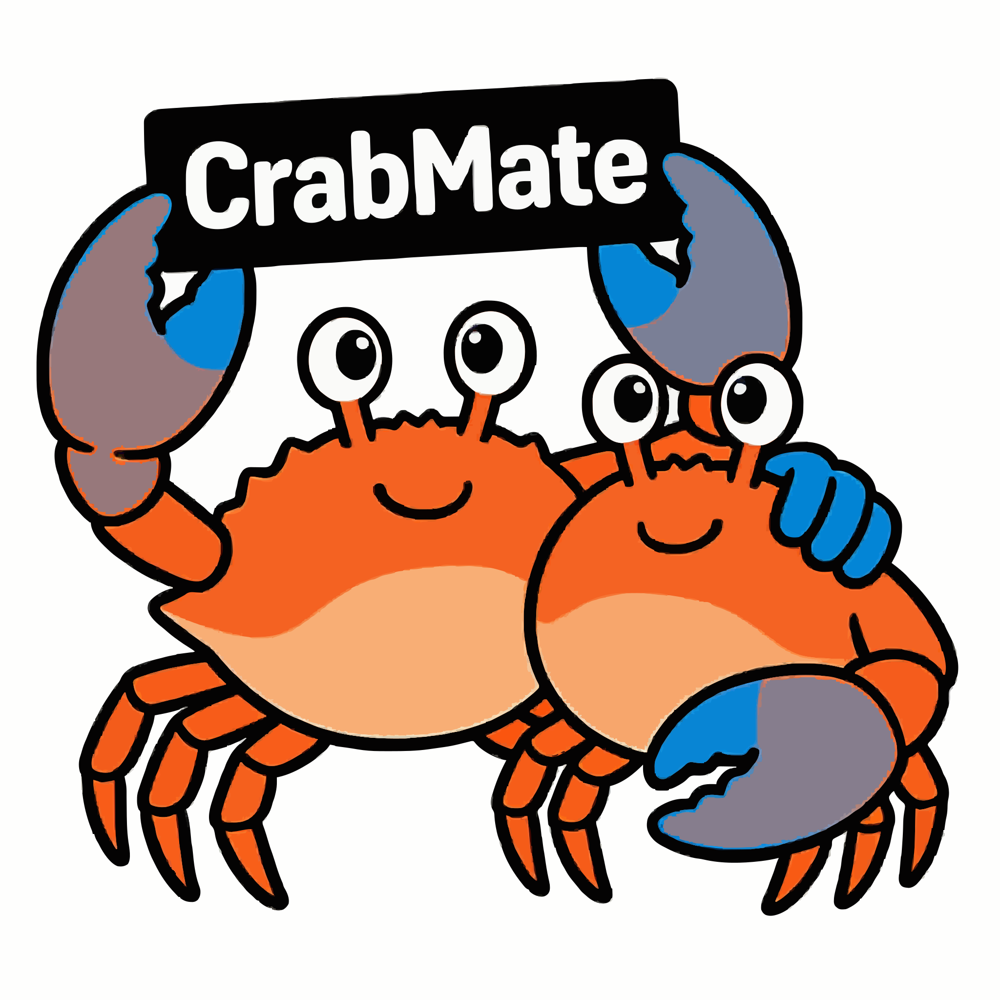

**Languages / 语言:** English (this page) · [中文](README.zh.md)

# CrabMate

<p align="center">
  
</p>

<p align="center">
  <a href="https://github.com/noisystreet/CrabMate/actions/workflows/ci.yml"></a>
  <a href="https://github.com/noisystreet/CrabMate/actions/workflows/code-complexity.yml"></a>
  <a href="https://github.com/noisystreet/CrabMate/actions/workflows/dependency-security.yml"></a>
  <br />
  <a href="https://github.com/noisystreet/CrabMate/stargazers"></a>
  <a href="https://github.com/noisystreet/CrabMate/commits/main"></a>
  <a href="https://github.com/noisystreet/CrabMate/issues"></a>
  <a href="https://github.com/noisystreet/CrabMate/pulls"></a>
  <a href="https://github.com/noisystreet/CrabMate/blob/main/LICENSE"></a>
  <a href="https://www.rust-lang.org"></a>
</p>

**CrabMate** is a Rust-based AI agent that speaks **OpenAI-compatible** `chat/completions` to backends such as DeepSeek, MiniMax, Zhipu GLM, Moonshot Kimi, and local Ollama.

It includes **function calling**, workspace command and file tools, plus **HTTP `serve`**, **CLI**, and an experimental **TUI**.

**Path A (repo split):** this repository maintains **Server** (`serve`, contracts, CLI/TUI). Official Web UI and Desktop/Android shells live in sibling **[`crabmate-client`](../crabmate-client/)** ([ADR](docs/design/client_shell_split.md)).

## Contents

- [Overview](#overview)
- [Common subcommands](#common-subcommands)
  - [TUI (full-screen terminal)](#tui-full-screen-terminal)
- [Build, run, and packaging](#build-run-and-packaging)
  - [Makefile (recommended)](#makefile-recommended)
  - [Backend](#backend)
  - [Web frontend](#web-frontend)
  - [Official Client (Desktop / Android)](#official-client-desktop-android)
  - [Install and release artifacts](#install-and-release-artifacts)
  - [Maintainer QA](#maintainer-qa)
- [Documentation index](#documentation-index)
- [Backend models](#backend-models)
- [Environment variables](#environment-variables)
- [Deployment and security](#deployment-and-security)
- [Project structure](#project-structure)

## Overview

- **Chat and tools**: OpenAI-compatible `chat/completions`; built-in workspace files, **`run_command`** (allowlist; defaults include **`bash`/`sh`** for **`bash -c`/`sh -c`**; argv outside the workspace or path-traversal-shaped `..` defaults to approval via **`allow_external_path_with_approval`**—git `A..B` is not treated as traversal), HTTP, **web search** (default **worbrow** local browser, no API key; optional Brave/Tavily), workspace **code search** (keyword + optional semantic/embeddings). Full list: [docs/en/TOOLS.md](docs/en/TOOLS.md). Subprocess tool output is truncated by **`command_max_output_len`** (embedded default **512KiB**); see **`config/tools.toml`** and [docs/en/CONFIGURATION.md](docs/en/CONFIGURATION.md).
- **Web UI (Client)**: built and shipped from **[`crabmate-client`](../crabmate-client/)**; this repo’s **`serve`** may host its `dist` via **`CM_WEB_STATIC_DIR`** or run **`--no-web`**. Sessions, workspace picker / project pool, editor mode, PR views, terminal-style chat stream, Ask/Plan/Act, and settings—see Client README and [docs/en/CLI.md](docs/en/CLI.md). Tools and **`@relative-path`** apply only after a workspace is selected.
- **Terminal**: **`repl`** (interactive), **`chat`** (one-shot), **`serve`** (HTTP API + optional static UI), **`tui`** (experimental **full-screen**, real TTY—see below). Streaming **SSE**, tool approval/cancel: [docs/en/SSE_PROTOCOL.md](docs/en/SSE_PROTOCOL.md).
- **Sessions and export**: by default **Web `serve`** (and **`tui`** with the same path) persist under **`<workspace>/.crabmate/conversations.db`**; clear **`conversation_store_sqlite_path`** to disable. Web or CLI **`save-session`** (alias **`export-session`**) → JSON/Markdown; shape in [docs/en/CLI.md](docs/en/CLI.md).
- **Advanced (skip by default)**: staged-plan timeline, clarification UI, **`thinking_trace`**, long-term memory, living docs, **MCP**, workspace **`plugins/*.json`**: [docs/en/CONFIGURATION.md](docs/en/CONFIGURATION.md), [docs/en/TOOLS.md](docs/en/TOOLS.md).

## Common subcommands

With no subcommand, **`repl`** runs. Common globals: **`--config`**, **`--workspace`**, **`--no-tools`**, **`--agent-role`**, **`--llm-context-tokens`**, **`--log`** (see **`crabmate --help`**).

| Subcommand | Summary |
| --- | --- |
| **`serve`** | HTTP API; optional static UI (**`CM_WEB_STATIC_DIR`**, default probes Client/`frontend/dist` / install path). Use **`--no-web`** for API-only. Default port **8080**, bind **127.0.0.1**. |
| **`repl`** | Interactive terminal; **`/`** commands and **`/api-key set`**: [docs/en/CLI.md](docs/en/CLI.md). |
| **`chat`** | One-shot then exit (**`--query`** / **`--stdin`** / files); **`--output json`**: [docs/en/CLI_CONTRACT.md](docs/en/CLI_CONTRACT.md). |
| **`tui`** | Experimental **full-screen** terminal UI; needs an **interactive TTY** (otherwise use **`repl`** / **`chat`**). Summary: **[TUI (full-screen terminal)](#tui-full-screen-terminal)**. |
| **`doctor`** | One-page local diagnostics (**no** `API_KEY`). |
| **`config`** | Load config and self-check (e.g. **`--dry-run`**). |
| **`models`** / **`probe`** | Probe **`GET …/models`** on **`api_base`**; **`bearer`** usually needs env **`API_KEY`**. |
| **`save-session`** | Export session file to **`<workspace>/.crabmate/exports/`** (alias **`export-session`**). |
| **`bench`** | Batch evaluation (JSONL): [benchmark/README.md](benchmark/README.md), [docs/基准测试规划.md](docs/基准测试规划.md). |
| **`mcp`** | **`mcp list`** / **`mcp list --probe`**; **`mcp serve`** exposes built-in tools over stdio (**no** transport auth). |
| **`plugin`** | **`init`** / **`list`** / **`validate`**: workspace **`plugins/*.json`** (**`dyn__`** prefix). |
| **`workflow`** | **`compile`** / **`validate`** / **`run`**: workspace YAML/Markdown workflows (**no** `API_KEY`); [docs/工作流编写教程.md](docs/工作流编写教程.md). |
| **`tool-replay`** | Export or replay tool fixtures (**no** `API_KEY`; trusted workspace only). |

Full flags, HTTP routes, **`man crabmate`**: [docs/en/CLI.md](docs/en/CLI.md).

### TUI (full-screen terminal)

**`crabmate tui`** is an experimental **full-screen** UI sharing the same agent/tool stack as **`repl`**.

- **Environment**: real **TTY** required; otherwise use **`repl`** / **`chat`**.
- **Interaction**: **Enter** sends from the composer; with focus on the right **Workspace** pane, **Enter** opens path browse (same as Web **`/workspace`** / REPL **`/workspace`**). **`q`** / **Ctrl+C** to quit. **`/api-key`**, **`/mode`** (Ask/Plan/Act), and other **`/`** commands match **`repl`**.
- **Streaming**: assistant stream is not painted on **stdout**; see **`--no-stream`** in **`crabmate tui --help`**.
- **More**: optional SQLite multi-session (**`/conv`**, **`/branch`**), clarification, **`CM_TUI_CONVERSATION_ID`**—[docs/en/CLI.md](docs/en/CLI.md).

## Build, run, and packaging

**Prerequisites**: **Rust 1.85+** (edition 2024). Official UI is in the Client repo (Trunk / wasm32). More: [AGENTS.md](AGENTS.md).

### Makefile (recommended)

```bash
make help              # list targets
make all / all-dev     # backend-release / backend
make backend           # cargo build -p crabmate
make package           # server-only tar.gz + optional .deb → dist/ (no UI)
make clean             # clean target and dist/
```

UI: `cd ../crabmate-client && make frontend`. **`make package`** / **`package-tar`** / **`package-deb`** are **server-only** (use **`--no-web`** or **`CM_WEB_STATIC_DIR`** at runtime). Desktop / Android: sibling **[`../crabmate-client`](../crabmate-client/)**.

### Backend

```bash
# Debug
cargo build
./target/debug/crabmate serve --no-web    # API-only; or set CM_WEB_STATIC_DIR for UI
# or: API_KEY=… ./target/debug/crabmate serve

# Release
cargo build --release
./target/release/crabmate serve
```

**`serve`** Web API auth (**`CM_WEB_API_BEARER_TOKEN`**, etc.): **[Deployment and security](#deployment-and-security)**. Cloud **`API_KEY`**: **[Environment variables](#environment-variables)** (or Web Settings / REPL **`/api-key set`**).

### Web frontend

Official UI source: **[`../crabmate-client/frontend`](../crabmate-client/frontend)** (path A Phase 4.2).

```bash
cd ../crabmate-client && make frontend
export CM_WEB_STATIC_DIR="$PWD/frontend/dist"
cd ../crabmate_agent && cargo run -- serve
```

API-only: `serve --no-web`. Design notes in this repo: [`docs/frontend/`](docs/frontend/).

### Official Client (Desktop / Android)

> **Canonical repo**: sibling **[`../crabmate-client`](../crabmate-client/)** (path A; [ADR](docs/design/client_shell_split.md)).  
> This repo **removed** `desktop-tauri/` / `mobile-tauri/` / `crates/crabmate-connect` (Phase 4.1).

The shell **does not** spawn `serve`: start **`crabmate serve`**, then enter URL + Web API Bearer on the Client connect page.

```bash
cd ../crabmate-client
make desktop-release    # Linux .deb (no serve sidecar)
# or make apk / cargo tauri dev — see Client README
```

Compat matrix: [`docs/design/client_compat_matrix.md`](docs/design/client_compat_matrix.md).

### Install and release artifacts

| Method | Command / notes |
| --- | --- |
| **Install to PATH** | **`cargo install --path .`** (**does not** ship **man**; install **[man/crabmate.1](man/crabmate.1)** manually if needed). |
| **Tarball / .deb** | **`make package`** (or **`./scripts/package-release.sh --skip-frontend`**) → **`dist/`** (binary, `config/`, man; **no UI by default**). Tar only: **`make package-tar`**; deb only: **`make package-deb`** (needs **`cargo-deb`**). Optional **`--frontend-dist`** is script-only. |
| **Debian (.deb)** | **`make package-deb`** / **`cargo deb`** (UI not required); under **`dist/`** or **`target/debian/`**. Desktop shell `.deb`: Client repo. Details: [docs/en/CLI.md](docs/en/CLI.md). |
| **Desktop / APK** | **Only** the Client repo ([`../crabmate-client`](../crabmate-client/)). |
| **Regenerate man** | **`cargo run --features gen-man --bin crabmate-gen-man`**. |

### Maintainer QA

- **Cargo features**: defaults **`web` + `repl` + `tui`**; opt-in **`mcp`**, **`fastembed`**, **`project_metrics`**, **`docker_sandbox`**, **`gen-man`**. Examples: `cargo build --features mcp`, `--features fastembed`, `--features project_metrics`, or `--all-features`. See root **`Cargo.toml`** **`[features]`** and **`AGENTS.md`**.
- **fmt / clippy / test, pre-commit, SSE, E2E**: [docs/en/TESTING.md](docs/en/TESTING.md) (includes **`./scripts/check-sse-protocol.sh`**). CI also runs **`make package`** (server-only tar.gz + `.deb` smoke).

## Documentation index

| Document | Contents | 中文 |
| --- | --- | --- |
| [docs/en/DEVELOPMENT.md](docs/en/DEVELOPMENT.md) | Architecture overview, main modules, data flow | [zh](docs/开发文档.md) |
| [docs/en/CONFIGURATION.md](docs/en/CONFIGURATION.md) | Env vars, `CM_*`, Web/TOML | [zh](docs/配置说明.md) |
| [docs/en/TOOLS.md](docs/en/TOOLS.md) | Built-in tools and examples | [zh](docs/工具说明.md) |
| [docs/工作流编写教程.md](docs/工作流编写教程.md) | Workflow YAML/steps (Chinese) | — |
| [docs/en/SSE_PROTOCOL.md](docs/en/SSE_PROTOCOL.md) | `/chat/stream` control JSON | [zh](docs/SSE协议.md) |
| [docs/en/CLI.md](docs/en/CLI.md) | Subcommands, HTTP routes, packaging | [zh](docs/命令行与路由.md) |
| [docs/en/CLI_CONTRACT.md](docs/en/CLI_CONTRACT.md) | `chat` exit codes, **`--output json`** | [zh](docs/命令行契约.md) |
| [docs/en/DEBUG.md](docs/en/DEBUG.md) | Logging, `doctor`, `GET /web-ui`, … | [zh](docs/调试指南.md) |
| [docs/个人VPS部署指南.md](docs/个人VPS部署指南.md) | Personal VPS: loopback `serve` + TLS + Bearer (Chinese) | — |
| [docs/en/TESTING.md](docs/en/TESTING.md) | Tests, pre-commit, audits | [zh](docs/测试指南.md) |
| [docs/design/client_shell_split.md](docs/design/client_shell_split.md) | Official Client split (path A) | — |
| [docs/design/frontend_migrate_plan.md](docs/design/frontend_migrate_plan.md) | Phase 4.2 UI migrate plan | — |
| [docs/design/client_compat_matrix.md](docs/design/client_compat_matrix.md) | Server ↔ protocol ↔ Client compat | — |
| [docs/基准测试规划.md](docs/基准测试规划.md) | **`bench`** roadmap | — |
| [benchmark/README.md](benchmark/README.md) | HumanEval convert/run/smoke | — |

**More**: backlog, roadmap, frontend drafts—under **`docs/`** ([docs/中英文文档对照.md](docs/中英文文档对照.md)).

**Maintenance**: keep user-visible docs in sync; conventions in [docs/en/DEVELOPMENT.md](docs/en/DEVELOPMENT.md).

## Backend models

`POST {api_base}/chat/completions` (OpenAI-compatible). Under **`[agent]`** set **`api_base`**, **`model`**, **`max_tokens`** (embedded default **4096**), **`llm_http_auth_mode`**; with **`bearer`**, use env **`API_KEY`**—**never** commit real keys.

| Scenario | Notes |
| --- | --- |
| **DeepSeek** | `api_base`: `https://api.deepseek.com/v1`; `model` e.g. `deepseek-chat` / `deepseek-reasoner`. [Platform](https://platform.deepseek.com/) · [API](https://api-docs.deepseek.com/api/create-chat-completion) |
| **MiniMax** | `api_base`: `https://api.minimaxi.com/v1`; `model` e.g. `MiniMax-M2.7`. [CONFIGURATION](docs/en/CONFIGURATION.md) · [Vendor OpenAI-compatible API](https://platform.minimaxi.com/docs/api-reference/text-openai-api) |
| **Zhipu GLM** | `api_base`: `https://open.bigmodel.cn/api/paas/v4`; `model` e.g. `glm-5`. [CONFIGURATION](docs/en/CONFIGURATION.md) · [GLM-5](https://docs.bigmodel.cn/cn/guide/models/text/glm-5) |
| **Moonshot Kimi** | `api_base`: `https://api.moonshot.cn/v1`; `model` e.g. `kimi-k2.5`. [CONFIGURATION](docs/en/CONFIGURATION.md) · [Kimi Chat API](https://platform.moonshot.cn/docs/api/chat) |
| **Local Ollama** | `llm_http_auth_mode = "none"`; `api_base` e.g. `http://127.0.0.1:11434/v1`; **`API_KEY`** optional. |

Local checks: **`crabmate doctor`** (no `API_KEY`), **`probe`** / **`models`**. Vendor knobs: [docs/en/CONFIGURATION.md](docs/en/CONFIGURATION.md). **Vendor behavior is defined by provider docs.**

## Environment variables

| Variable | Role |
| --- | --- |
| **`API_KEY`** | Cloud bearer (**`llm_http_auth_mode=bearer`**); `serve` / `repl` / `chat` can start first, then set via UI or **`/api-key`** (keychain, not XDG plaintext). |
| **`CM_API_BASE`** / **`CM_MODEL`** | Override gateway and model from config. |
| **`CM_WEB_API_BEARER_TOKEN`** | Protects Web APIs (with **`web_api_require_bearer`**); [docs/en/CONFIGURATION.md](docs/en/CONFIGURATION.md). |
| **`CM_WEB_CORS_ALLOWED_ORIGINS`** | Comma-separated Origin allowlist for cross-origin browsers; empty = no CORS layer. Static UI: Settings **API base** (`localStorage` **`crabmate-api-base-url`**). |
| **`CM_WEB_STATIC_DIR`** | Override **`serve`** static root (Client `frontend/dist` / install path; use **`--no-web`** without UI). |
| **`CM_DESKTOP_SUGGESTED_URL`** | Optional connect-page suggested `serve` URL (default `http://127.0.0.1:8080/`). |
| **`CM_DESKTOP_SERVE_URL`** | Required when skipping connect page (with **`CM_DESKTOP_SKIP_CONNECT`** / **`CM_E2E_FIXTURES`**). |

Other **`CM_*`** (including **`CM_TUI_CONVERSATION_ID`**, skills, staged planning): [docs/en/CONFIGURATION.md](docs/en/CONFIGURATION.md).

## Deployment and security

- **Listen**: default **`127.0.0.1`**; **`0.0.0.0`** needs **`web_api_bearer_token`** or an explicit insecure switch ([docs/en/CONFIGURATION.md](docs/en/CONFIGURATION.md)).
- **LLM API Key**: Web/desktop settings and default **`/api-key set`** use the OS keychain; env **`API_KEY`** remains a fallback.
- **Web API**: embedded default **`web_api_require_bearer = false`**—**`serve`** may start without a shared secret; with **`true`**, require non-empty **`CM_WEB_API_BEARER_TOKEN`** (or TOML). When the token is set, send **`Authorization: Bearer …`** or **`X-API-Key: …`**. Browsers must save the **same** value under **Settings → Web API shared secret** (`localStorage` **`crabmate-api-bearer-token`**)—**not** the LLM **`API_KEY`**. Cross-origin static UI: set **API base** + **`CM_WEB_CORS_ALLOWED_ORIGINS`**. Smoke: **`docs/design/client_turn_smoke_runbook.md`** §9. Temporary local skip: unset the secret and bind **`127.0.0.1`**, or clear it and set **`CM_ALLOW_INSECURE_NO_AUTH_FOR_NON_LOOPBACK=true`** before **`0.0.0.0`**. Prefer **`web_api_require_bearer = true`** on exposed networks. Details: [docs/en/CONFIGURATION.md](docs/en/CONFIGURATION.md).
- **Other**: Web **Settings → Save all** persists via **`/user-data`**; workspace must stay under allowed roots. Debug / **`GET /web-ui`**: [docs/en/DEBUG.md](docs/en/DEBUG.md).
- **Personal VPS (TLS reverse proxy)**: [docs/个人VPS部署指南.md](docs/个人VPS部署指南.md) (Chinese; **`127.0.0.1` + Bearer + Caddy/Nginx**).

## Project structure

Architecture overview: [docs/en/DEVELOPMENT.md](docs/en/DEVELOPMENT.md). **`GET /status`** for full runtime status; Web shell uses **`GET /status?view=shell`**. More: [docs/en/DEBUG.md](docs/en/DEBUG.md).

- **Workspace crates**: `crates/crabmate-sse-protocol` (SSE control-plane contract); **`crates/crabmate-im-bridge`** (optional Feishu webhook → **`POST /chat`**). See [docs/design/feishu_bridge_mvp.md](docs/design/feishu_bridge_mvp.md).
