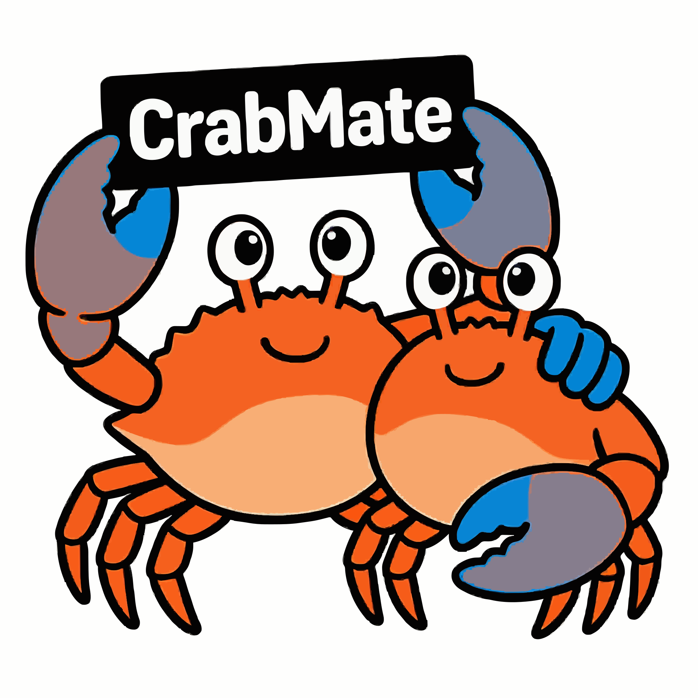

**Languages / 语言:** English (this page) · [中文](README.zh.md)

# CrabMate

<p align="center">
  
</p>

<p align="center">
  <a href="https://github.com/noisystreet/CrabMate/actions/workflows/ci.yml"></a>
  <a href="https://github.com/noisystreet/CrabMate/actions/workflows/dependency-security.yml"></a>
  <a href="https://www.rust-lang.org"></a>
  <a href="https://crates.io/crates/crabmate"></a>
  <a href="https://github.com/noisystreet/CrabMate/blob/main/LICENSE"></a>
</p>

**CrabMate** is a Rust AI agent that speaks **OpenAI-compatible** `chat/completions` to DeepSeek, MiniMax, Zhipu GLM, Moonshot Kimi, or a local Ollama.

This repo is the **Server**: HTTP **`serve`** (always API-only — it never hosts a SPA), the `protocol` contracts, and ops CLIs. The official **Web UI, Desktop/Android, and terminal (`crabmate-tui`)** live in **[`crabmate-client`](https://github.com/noisystreet/crabmate-client)** (local checkouts default to sibling `../crabmate-client`); in-process `repl` / `chat` / `tui` were removed ([ADR](docs/design/client_shell_split.md)).

## Contents

- [CrabMate](#crabmate)
  - [Contents](#contents)
  - [Overview](#overview)
  - [Quick start](#quick-start)
  - [Common subcommands](#common-subcommands)
  - [Backend models](#backend-models)
  - [Deployment and security](#deployment-and-security)
  - [Install and release artifacts](#install-and-release-artifacts)
  - [Documentation](#documentation)

## Overview

- **Chat and tools**: OpenAI-compatible `chat/completions`; built-in workspace file tools, **`run_command`** (allowlist only), HTTP, **web search** (default local **worbrow** browser, no API key; optional Brave/Tavily), and workspace **code search** (keyword + optional semantic). Full list and semantics: [docs/en/TOOLS.md](docs/en/TOOLS.md).
- **Sessions**: **`serve`** persists conversations under **`<workspace>/.crabmate/conversations.db`** by default; retention, deletion, and export are configurable — [docs/en/CONFIGURATION.md](docs/en/CONFIGURATION.md), [docs/en/CLI.md](docs/en/CLI.md).
- **Client UI**: built and hosted by **[`crabmate-client`](https://github.com/noisystreet/crabmate-client)**; browser UIs connect over CORS. Sessions, workspace picker / project pool, editor and PR views, terminal-style chat stream, Ask/Plan/Act, and settings.
- **Advanced (opt-in)**: staged planning, clarification UI, **`thinking_trace`**, long-term memory, living docs, **MCP**, workspace **`plugins/*.json`** — [docs/en/CONFIGURATION.md](docs/en/CONFIGURATION.md).

## Quick start

Requires **Rust 1.85+** (edition 2024).

```bash
# Backend (API-only)
cargo build
./target/debug/crabmate serve            # default 127.0.0.1:8080; or: API_KEY=… ./target/debug/crabmate serve

# Client UI (separate repo)
cd ../crabmate-client && make frontend   # then point it at http://127.0.0.1:8080/ + Bearer
```

Prefer the Makefile: **`make help`**, **`make backend`** (`cargo build -p crabmate`), **`make package`** (server-only tar.gz + optional `.deb` → `dist/`).

## Common subcommands

With no subcommand, clap requires an explicit command (e.g. **`serve`**). Prefer **`serve`** + Client **`crabmate-tui`**. Common globals: **`--config`**, **`--workspace`**, **`--no-tools`**, **`--llm-context-tokens`**, **`--log`** (see **`crabmate --help`**).

| Subcommand | Summary |
| --- | --- |
| **`serve`** | HTTP API (**always API-only**, no SPA). UI is hosted by the Client repo and connects via CORS. Default port **8080**, bind **127.0.0.1**. |
| **`doctor`** | One-page local diagnostics (**no** `API_KEY`). |
| **`config`** | Load config and self-check. |
| **`models`** / **`probe`** | Probe **`GET …/models`** on **`api_base`**; **`bearer`** usually needs env **`API_KEY`**. |
| **`save-session`** | Export session file to **`<workspace>/.crabmate/exports/`** (alias **`export-session`**). |
| **`bench`** | Batch evaluation (JSONL): [benchmark/README.md](benchmark/README.md), [docs/基准测试规划.md](docs/基准测试规划.md). |
| **`mcp`** | **`mcp list`** / **`mcp list --probe`**; **`mcp serve`** exposes built-in tools over stdio (**no** transport auth). |
| **`plugin`** | **`init`** / **`list`** / **`validate`**: workspace **`plugins/*.json`** (**`dyn__`** prefix). |
| **`workflow`** | **`compile`** / **`validate`** / **`run`**: workspace YAML/Markdown workflows (**no** `API_KEY`); [docs/工作流编写教程.md](docs/工作流编写教程.md). |
| **`tool-replay`** | Export or replay tool fixtures (**no** `API_KEY`; trusted workspace only). |

Full flags, HTTP routes, **`man crabmate`**: [docs/en/CLI.md](docs/en/CLI.md).

## Backend models

`POST {api_base}/chat/completions` (OpenAI-compatible). Under **`[agent]`** set **`api_base`**, **`model`**, **`max_tokens`** (embedded default **4096**), **`llm_http_auth_mode`**; with **`bearer`**, use env **`API_KEY`**—**never** commit real keys ([docs/en/CONFIGURATION.md](docs/en/CONFIGURATION.md)).

| Scenario | Notes |
| --- | --- |
| **DeepSeek** | `api_base`: `https://api.deepseek.com/v1`; common `model` ids in **`config/llm_vendors.toml`** (`deepseek-v4-flash`, `deepseek-v4-pro`, `deepseek-v4-flash-vision-exp`, …). Chat attachments stay as `/uploads/` in session; only **vision-exp** inlines them as `data:` on the wire. [Platform](https://platform.deepseek.com/) · [API](https://api-docs.deepseek.com/api/create-chat-completion) |
| **MiniMax** | `api_base`: `https://api.minimaxi.com/v1` (intl. `https://api.minimax.io/v1`); `model` e.g. `MiniMax-M3`. [CONFIGURATION](docs/en/CONFIGURATION.md) · [Vendor OpenAI-compatible API](https://platform.minimax.io/docs/api-reference/text-openai-api) |
| **Zhipu GLM** | `api_base`: `https://open.bigmodel.cn/api/paas/v4`; `model` e.g. `glm-5.3`. [CONFIGURATION](docs/en/CONFIGURATION.md) · [GLM-5.3](https://docs.bigmodel.cn/cn/guide/models/text/glm-5.3) |
| **Moonshot Kimi** | `api_base`: `https://api.moonshot.cn/v1`; `model` e.g. `kimi-k3`. [CONFIGURATION](docs/en/CONFIGURATION.md) · [Kimi Chat API](https://platform.moonshot.cn/docs/api/chat) |
| **Local Ollama** | `llm_http_auth_mode = "none"`; `api_base` e.g. `http://127.0.0.1:11434/v1`; **`API_KEY`** optional. |

Local checks: **`crabmate doctor`** (no `API_KEY`), **`probe`** / **`models`**. Vendor knobs: [docs/en/CONFIGURATION.md](docs/en/CONFIGURATION.md). **Vendor behavior is defined by provider docs.**

## Deployment and security

- **Listen**: default **`127.0.0.1`**; **`0.0.0.0`** needs a **`web_api_bearer_token`** or an explicit insecure switch.
- **Web API auth**: embedded default **`web_api_require_bearer = false`** — **`serve`** may start without a shared secret; when a token is set, send **`Authorization: Bearer …`** or **`X-API-Key: …`**. Configure it via **`CM_WEB_API_BEARER_TOKEN`** / **`web_api_bearer_token`** / **`crabmate web-bearer set`**. Browsers must save the **same** value under **Settings → Web API shared secret** (`localStorage` **`crabmate-api-bearer-token`**) — **not** the LLM **`API_KEY`**. Prefer **`web_api_require_bearer = true`** on exposed networks.
- **CORS**: official shell Origins are allowed by default; add extra browser Origins with **`CM_WEB_CORS_ALLOWED_ORIGINS`**.
- **`http_fetch` / `http_request`**: embedded default **`http_fetch_allowed_prefixes = ["*"]`** — any **http/https** URL skips prefix approval (still rejects `file:` etc.). On multi-tenant or non-loopback listen, set concrete prefixes or **`[]`**.
- **LLM API Key**: the Client stores keys locally and sends **`client_llm.api_key`**; env **`API_KEY`** remains an optional **`serve`** / ops fallback.
- **Personal VPS (TLS reverse proxy)**: [docs/个人VPS部署指南.md](docs/个人VPS部署指南.md) (Chinese).

Details: [docs/en/CONFIGURATION.md](docs/en/CONFIGURATION.md). Debug / **`GET /web-ui`**: [docs/en/DEBUG.md](docs/en/DEBUG.md).

## Install and release artifacts

| Method | Command / notes |
| --- | --- |
| **Install to PATH** | **`cargo install crabmate`** (crates.io **stable `0.6.0`**, default feature **`server`**; git tag **`v0.6.0`**). Does **not** ship **man**; install **[man/crabmate.1](man/crabmate.1)** manually if needed. |
| **Tarball / .deb** | **`make package`** (or **`./scripts/package-release.sh`**) → **`dist/`** (binary, `config/`, man, **`systemd/`**, **`etc/crabmate/`**; **server-only, no UI**). Tar only: **`make package-tar`**; deb only: **`make package-deb`** (needs **`cargo-deb`**). |
| **Desktop / APK** | **Only** the Client repo ([`crabmate-client`](https://github.com/noisystreet/crabmate-client)). |
| **Regenerate man** | **`cargo run --features gen-man --bin crabmate-gen-man`**. |

Versioning / semver surface: [docs/design/crates_io_single_package.md](docs/design/crates_io_single_package.md). Compat matrix: [docs/design/client_compat_matrix.md](docs/design/client_compat_matrix.md).

## Documentation

| Document | Contents |
| --- | --- |
| [docs/en/CONFIGURATION.md](docs/en/CONFIGURATION.md) | Env vars, `CM_*`, Web/TOML |
| [docs/en/TOOLS.md](docs/en/TOOLS.md) | Built-in tools and examples |
| [docs/en/CLI.md](docs/en/CLI.md) | Subcommands, HTTP routes, packaging |
| [docs/en/SSE_PROTOCOL.md](docs/en/SSE_PROTOCOL.md) | `/chat/stream` control JSON |
| [docs/en/DEVELOPMENT.md](docs/en/DEVELOPMENT.md) | Architecture overview, main modules |
| [docs/en/TESTING.md](docs/en/TESTING.md) | Tests, pre-commit, audits |
| [docs/工作流编写教程.md](docs/工作流编写教程.md) | Workflow YAML/steps (Chinese) |
| [CHANGELOG.md](CHANGELOG.md) | Release notes (Keep a Changelog) |

Full bilingual map: [docs/中英文文档对照.md](docs/中英文文档对照.md). Design docs: [docs/design/README.md](docs/design/README.md).

Development: default Cargo feature **`server`**; opt-in **`fastembed`**, **`project_metrics`**, **`docker_sandbox`**, **`gen-man`** (see root **`Cargo.toml`** **`[features]`** and [AGENTS.md](AGENTS.md)). fmt / clippy / test / pre-commit / SSE / E2E: [docs/en/TESTING.md](docs/en/TESTING.md).
