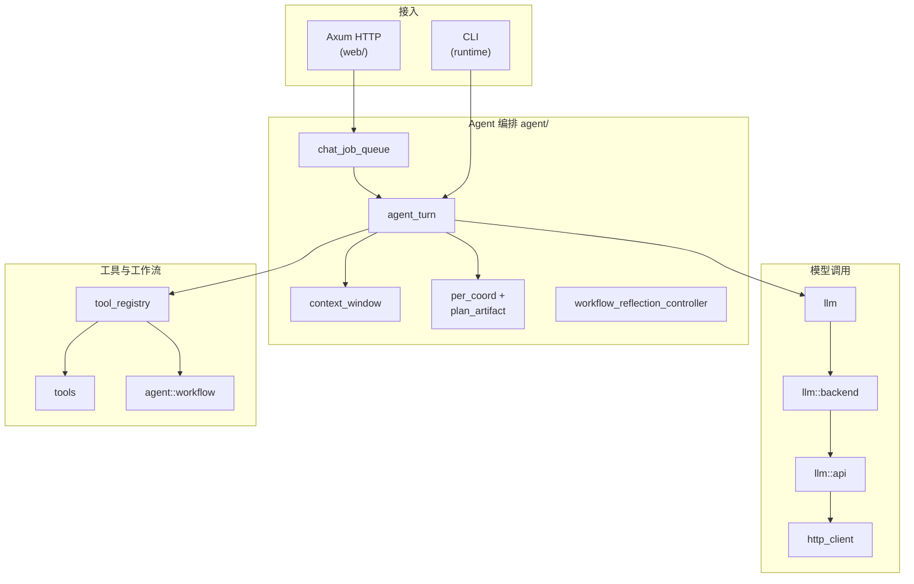
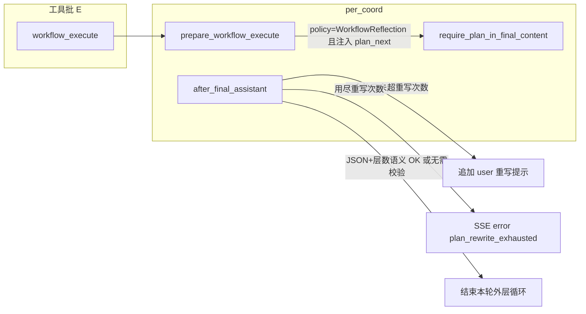

# 开发文档（架构与模块说明）

本文面向**二次开发/维护**，重点解释各模块职责、关键机制与扩展点。  
若你只关心功能与使用方式，请看 `README.md`。

## TODOLIST 与功能文档约定

- **`docs/TODOLIST.md`**：只保留**未完成**项；**上半**为全局优先级（P0–P5），**下半**为「按模块的优先选项」（中长期方向，每域若干条）。实现某条后**从文件中删除该条目**（不要用 `[x]` 长期占位）；空的小节可删掉标题。历史追溯用 Git。
- **新功能 / 用户可见变更**（新 CLI 标志、HTTP 接口、配置键、工具名、Web/CLI 行为等）：合并代码时同步更新 **`README.md`**（面向使用者：功能、命令、配置、安全提示）和/或 **`docs/DEVELOPMENT.md`**（面向维护者：模块、协议、扩展点）。纯内部重构且无行为变化时，可只改 `DEVELOPMENT` 或注释。
- **Cursor 规则**：项目内 `.cursor/rules/todolist-and-documentation.mdc` 对 Agent 重申上述约定；**架构或 `src/` 模块组织变更**时另见 `.cursor/rules/architecture-docs-sync.mdc`（须同步更新本节「架构设计」与「代码模块索引」）。**前端**见 **`frontend-typescript-react.mdc`**；**`src/tools/` 增删改工具**见 **`tools-registry.mdc`**；**聊天 / SSE 协议与双端一致**见 **`api-sse-chat-protocol.mdc`**（`alwaysApply`）；**工作区 / 命令 / 拉取 URL 等安全敏感面**见 **`security-sensitive-surface.mdc`**；**依赖与许可证**见 **`dependencies-licenses.mdc`**。
- **PR / Issue**：仓库提供 **`.github/pull_request_template.md`** 与 **`.github/ISSUE_TEMPLATE/`**（可选模板）；发 PR 时可对照清单自检。
- **提交前检查**：根目录 `.pre-commit-config.yaml`（含 **`cargo fmt --all`**、**`cargo clippy --all-targets -- -D warnings`**、**commit-msg：Conventional Commits 校验**）。安装：`pip install pre-commit && pre-commit install`（配置里含 `default_install_hook_types: [pre-commit, commit-msg]` 时会一并安装 **pre-commit** 与 **commit-msg** 钩子；若本机是旧配置下已装过，请补跑 **`pre-commit install --hook-type commit-msg`**）。手动执行文件检查：`pre-commit run --all-files`（**不**会跑 commit-msg；说明校验仅在 **`git commit`** 时触发）。Cursor 规则 **`.cursor/rules/pre-commit-before-commit.mdc`** 要求 Agent 在 `git commit` 前先跑 pre-commit（无则至少 `fmt` + `clippy`）。改 `src/` 时另见 **`.cursor/rules/rust-clippy-and-tests.mdc`**（测试范围）、**`.cursor/rules/rust-error-handling.mdc`**（unwrap/unsafe）。配置/路由/环境变量与文档的对应关系见 **`.cursor/rules/todolist-and-documentation.mdc`** 中「Rust：默认配置、环境变量与 HTTP 路由」。
- **提交说明**：使用 **Conventional Commits**（`feat:` / `fix:` / `refactor:` 等），见 **`.cursor/rules/conventional-commits.mdc`**；本地由 **conventional-pre-commit** 钩子强制校验。

## 总览：系统由哪些部分组成

- **Rust 后端（`src/`）**：负责与 DeepSeek API 通信、实现 Agent 主循环、提供 HTTP API（含 SSE 流式输出）、执行工具、提供工作区/任务/上传等能力。
- **Web 前端（`frontend/`）**：Vite + React + TS + Tailwind。负责聊天 UI、工作区浏览/编辑、任务清单、状态栏展示，以及消费后端 SSE 流。

## 架构设计

### 总体结构

CrabMate 在**单个 Rust 进程**内使用 **Tokio** 异步运行时：通过 **Axum** 暴露 HTTP，通过 **`runtime/`** 提供 CLI（REPL / 单次提问等），共享同一套 **Agent 回合**（`run_agent_turn` → **`agent::agent_turn`**）、**工具**（`tools`）与 **`AgentConfig`**。

### 逻辑分层（自外而内）

1. **接入层**：HTTP 路由与 chat/upload 等 handler（**`web/`**：`server`、`chat_handlers`）、`serve` 子命令启动 Web 与后台任务（`lib.rs::run`）、CLI 子命令与交互循环（`config::cli`、`runtime/cli` 等）。
2. **编排层**：Web 对话排队（`chat_job_queue`）、Agent 主循环与上下文/PER/工作流（**`agent/`**：`agent_turn`、`context_window`、`per_coord` 等）。
3. **模型层**：共享 HTTP 客户端（`http_client`）、请求拼装与重试（`llm`）、流式响应解析（**`llm::api`**，`stream_chat`）；上游错误体仅经 **`redact`** 截断后写入日志，避免整包进 `log` 输出或 `Err` 链。
4. **工具与工作流**：工具表驱动执行（`tools/mod.rs`）、按名分发与 Web 侧阻塞超时（`tool_registry`）、DAG 工作流（**`agent::workflow`**）。
5. **横向契约**：OpenAI 兼容类型（`types`）、SSE 控制面（**`sse/`**：`protocol` + `line`）、工具结构化结果（`tool_result`）、配置（`config`）、Web 工作区/任务 API（`web/*`）。

### Web 流式对话数据流（概要）

1. 客户端 `POST /chat/stream` → **`ChatJobQueue`** 限流排队。  
2. **`run_agent_turn`** 携带 `messages` 与 `tools` 定义进入循环。  
3. **`llm`**（默认 **`llm::backend::OpenAiCompatBackend`** → **`llm::api::stream_chat`**）请求 `/chat/completions`（SSE），直到得到最终文本或 **`tool_calls`**（可注入自定义 **`ChatCompletionsBackend`**）。  
4. 若有工具调用 → **`agent_turn::per_execute_tools_common`**：若 **`tool_registry::tool_calls_allow_parallel_sync_batch`** 为真，则对整批 **SyncDefault + 只读 + 非 cargo/npm/前端等构建锁类** 工具 **`join_all` + `spawn_blocking` 并行**；否则按序 **`tool_registry::dispatch_tool`** → **`tools::run_tool`**（或 **`agent::workflow`** 路径）→ 结果以 `role: "tool"` 写回 `messages`（顺序与模型给出的 `tool_calls` 一致）。  
5. 控制面事件经 **`sse::protocol`**（`encode_message` / `SsePayload`）编码为 SSE 行下发前端。
6. 若请求携带 `conversation_id`（或服务端自动分配），回合结束后将 `messages` 写回会话存储（内存 `HashMap` 或 **`conversation_store_sqlite_path`** 配置的 SQLite），用于下次同会话延续；**`agent_memory_file_enabled`** 时新会话首轮从工作区根读取备忘文件注入 `messages`（见 `src/agent_memory.rs`）。

## `src/` 代码模块索引

> **维护约定**：增删 `lib.rs` 顶层 `mod`、调整目录/文件职责边界、或改变工具/路由/工作流的调用关系时，应同步更新**本节表格**与上文**架构设计**（含 Mermaid 是否与现状一致）。Cursor 规则见 **`.cursor/rules/architecture-docs-sync.mdc`**。

### 顶层模块（与 `src/lib.rs` 中 `mod` 声明一致）

| 路径 | 职责摘要 |
|------|----------|
| `agent/` | **`agent_turn`**：主循环（Web + CLI 经 `run_agent_turn`）；**`RunLoopParams`** 聚合 `run_agent_turn_common` 与 `run_agent_outer_loop` / `run_staged_plan_then_execute_steps` 共用字段（`render_to_terminal` + `web_tool_ctx`）；**`context_window`**：上下文裁剪/摘要；**`per_coord` / `plan_artifact` / `workflow_reflection_controller`**：PER 与终答规划；**`workflow`**：DAG 执行（审批模式 `WorkflowApprovalMode::Interactive` 对应 Web SSE 通道）。 |
| `chat_job_queue.rs` | Web `/chat`、`/chat/stream` 有界队列与并发上限；运行中任务的 `PerTurnFlight` 注册供 `GET /status` 的 `per_active_jobs`；流式入队参数为 `StreamSubmitParams`。 |
| `config/` | `AgentConfig`、嵌入/文件 TOML、环境变量覆盖、`cli` 参数；`system_prompt` 可在加载阶段按 `cursor_rules_*` / `AGENT_CURSOR_RULES_*` 自动拼接工作区规则文件。内部拆分为 `config/types.rs`（配置与枚举类型）、`config/source.rs`（TOML 段解析辅助）、`config/cursor_rules.rs`（规则文件收集与拼接）与 `config/workspace_roots.rs`（工作区根白名单解析），`mod.rs` 保留主装配流程。 |
| `http_client.rs` | 进程内共享 `reqwest::Client`（连接池、超时、keepalive）。 |
| `redact.rs` | 上游 HTTP 响应体等长文本的**日志预览截断**（`preview_chars` / `single_line_preview`），供 `llm::api`、`tools::web_search` 等使用。 |
| `text_sanitize.rs` | 用户可见正文轻量清洗（DSML 剥离、规划步骤描述自然化等）；**`materialize_deepseek_dsml_tool_calls_in_message`**：API 未返回 `tool_calls` 时从 DeepSeek 风格 DSML 正文解析并写入 `Message.tool_calls`（供 `agent_turn` 在 P 步后执行工具）；供 **`plan_artifact::format_agent_reply_plan_for_display`** 等使用。 |
| `health.rs` | 与 `GET /health` 一致的运行状况报告（`build_health_report` / `format_health_report_terminal` 预留）；由 **`web::chat_handlers::health_handler`** 调用。 |
| `llm/` | **`mod`**：`ChatRequest` 构造、指数退避 **`complete_chat_retrying`**（入参含 **`ChatCompletionsBackend`**）；**`backend`**：可插拔 **`ChatCompletionsBackend`**，默认 **`OpenAiCompatBackend`**（委托 **`api::stream_chat`**）；**`api`**：`chat/completions` HTTP + SSE/JSON 解析、终端 Markdown（公式见 `runtime::latex_unicode`）。 |
| `path_workspace.rs` | 工作区相对路径的语义化规范化（[`path-absolutize`](https://crates.io/crates/path-absolutize) 的 `Absolutize`）与根边界校验；供 `tools/file`、`tools/exec`、`tools/patch`、`web/workspace` 共用，避免手写 `..` 解析分叉。 |
| `runtime/` | `cli`：单次问答/REPL；向 `run_agent_turn` 传入 **`CliToolRuntime`** 以启用 **`run_command`** 非白名单的 stdin 审批；REPL 支持 **`/clear`、`/model`、`/workspace`（含 `/cd`）、`/tools`、`/help`** 等行首内建命令（`classify_repl_slash_command` 单测），不进入 `run_agent_turn`；`workspace_session`：`.crabmate/tui_session.json` 加载与 **`initial_workspace_messages`**（CLI REPL；保存/导出函数保留供后续终端 UI）；`terminal_labels` / `terminal_cli_transcript`：CLI 前缀着色与无 SSE 时的规划/工具 stdout；`plan_section`：分阶段规划块节标题常量；**`benchmark`**：批量无人值守测评子系统；**`message_display`** / **`chat_export`** / **`latex_unicode`**：与 Web/CLI 展示、导出、`frontend/src/chatExport.ts` 对齐（模块内部分符号当前仅单测消费，见各文件 `allow(dead_code)` 说明）。 |
| `sse/` | **`protocol`**：`SsePayload` / `encode_message`（根再导出）；**`line`**：`classify_agent_sse_line` 等（与 `frontend/src/api.ts` 语义对齐；当前无 crate 根再导出）。 |
| `tool_registry.rs` | 按工具名选择 Workflow / 命令超时 / 天气与联网搜索超时 / 默认同步等策略；**`is_readonly_tool`** / **`tool_calls_allow_parallel_sync_batch`** 供同轮安全并行判定。 |
| `tool_result.rs` | 工具输出的结构化 `ToolResult` 与旧式字符串兼容。 |
| `tools/` | 全部 Function Calling 定义、`ToolContext`、`run_tool`；`tools/mod.rs` 与 `tools/markdown_links.rs` 的测试已外移到同名子目录 `tests.rs`，并把工具调用摘要逻辑拆到 `tools/tool_summary.rs`，降低主文件长度；子模块见下表。 |
| `types.rs` | `Message`、`Tool`、流式 chunk 等 OpenAI 兼容类型；`Message::system_only` / `user_only`、`messages_chat_seed` 供 Web 首轮与 CLI 共用。 |
| `conversation_store.rs` | Web 会话可选 **SQLite**：`conversation_id` → `messages` JSON + `revision` + `updated_at_unix`；TTL/条数上限与内存模式一致；`SaveConversationOutcome` 定义于此。 |
| `agent_memory.rs` | 工作区相对路径备忘文件读取与 `messages_chat_seed_with_memory`（Web 新会话首轮）。 |
| `web/` | Web（HTTP）专用 axum 模块：`app_state`（`AppState`、`ConversationBacking`：内存或 SQLite）、`chat_handlers`（`/chat*`、`/upload*`、`/health`、`/status`）、`server`（Router 组装）、`workspace`、`task`。`AppState` 与 `open_conversation_sqlite` 由 `lib.rs::run` 装配；`SaveConversationOutcome` 在 **`conversation_store`**，crate 根再导出供 `chat_job_queue` 等使用。 |

### `lib.rs` 额外职责（非独立文件但需知）

- `run()` 中创建 `AppState`、监听地址与清理任务，Router 组装下沉到 `web::server::build_app`（chat、status、health、workspace、tasks、upload、静态前端 `dist` 等）。
- **`AppState`**：定义于 **`web::app_state`**，`Arc` 持有 `AgentConfig`、共享 `reqwest::Client`、工作区覆盖路径、上传目录、对话队列、**`ConversationBacking`**（内存或 SQLite）等；crate 根 `pub(crate) use` 保持 `chat_job_queue` / `web/workspace` 等路径不变。
- **`RunAgentTurnParams`**：库根 `run_agent_turn` 的唯一入参（Web / CLI / benchmark 共用），避免长形参列表。可选 **`llm_backend: Option<&dyn ChatCompletionsBackend>`**（`None` 时与历史一致，使用 **`llm::default_chat_completions_backend()`** / **`OPENAI_COMPAT_BACKEND`**），便于嵌入方接入自建网关而不改 Agent 主循环。另含 **`temperature_override` / `seed_override`**（与 Web `POST /chat*` 对齐；摘要路径仍固定低温且无 seed）。**`cli_tool_ctx: Option<&CliToolRuntime>`**：终端模式下传入时，**`run_command`** 若命令不在 `allowed_commands`，经 stdin 交互确认（与 Web SSE 审批语义：`y`≈AllowOnce，`a`≈AllowAlways，进程内 `persistent_allowlist`）；Web 队列传 `None`。

### `src/tools/` 子文件（实现域一览）

与 `tools/mod.rs` 中 `mod` 声明保持一致；新增工具文件时请在此**增行**。

| 文件 | 职责域 |
|------|--------|
| `calc.rs` | 数学表达式（`bc`） |
| `unit_convert.rs` | `convert_units`：基于 [`uom`](https://crates.io/crates/uom) 的长度/质量/温度/信息量/时间/面积/压强/速度换算 |
| `cargo_tools.rs` | Cargo 子命令封装（含 `cargo_outdated` / `cargo_machete` / `cargo_udeps` 等） |
| `ci_tools.rs` | 本地 CI / 流水线类工具 |
| `code_metrics.rs` | 代码度量与分析：`code_stats`（tokei/cloc/内置行数统计）、`dependency_graph`（Cargo/Go/npm 依赖图，Mermaid/DOT）、`coverage_report`（LCOV/Tarpaulin/Cobertura 覆盖率解析） |
| `code_nav.rs` | 代码导航、文件大纲等 |
| `command.rs` | `run_command` 白名单与进程执行 |
| `package_query.rs` | `package_query`：apt/rpm 只读包查询（安装状态/版本/来源统一抽象） |
| `debug_tools.rs` | 调试辅助类工具 |
| `diagnostics.rs` | `diagnostic_summary`：脱敏环境/工具链/工作区路径摘要 |
| `dev_tag.rs` | Development 子域标签：`tags_for_tool_name`、`suggest_dev_tags_for_workspace`（供 `build_tools_with_options` 过滤）；标签含 `general`/`rust`/`frontend`/`python`/`cpp`/`vcs`/`quality`/`go`/`security`/`shell`/`docker` |
| `exec.rs` | `run_executable` |
| `file/` | 工作区文件工具目录：`mod.rs` 再导出各 `pub fn`；`path`（`resolve_for_read`/`resolve_for_write` 等）、`write_ops`、`read_tool`、`directory`、`tree_glob`、`inspect`、`extract`、`mutate`、`perm`、`symlink`、`display_fmt`；单元测试 `tests.rs` |
| `format.rs` / `lint.rs` | 格式化（Rust/Python/C++/Go/Shell/JS·TS/Markdown/YAML/XML/SQL + `prettier`）与 lint 聚合 |
| `frontend_tools.rs` | 前端 npm 脚本类 |
| `git.rs` | Git 只读查询（status/diff/log/blame 等）与受控写入（stage/commit/checkout/push/merge/rebase/stash/tag/reset/cherry-pick/revert 等） |
| `go_tools.rs` | Go 工具链：`go build`/`test`/`vet`/`mod tidy`/`gofmt -l`/`golangci-lint` |
| `grep.rs` / `symbol.rs` | 工作区内文本搜索、Rust 符号 |
| `nodejs_tools.rs` | Node.js 生态：`npm install`/`npm run`/`npx`/`tsc --noEmit` |
| `spell_astgrep_tools.rs` | `typos_check`、`codespell_check`（拼写，只读；支持项目词典参数）、`ast_grep_run`（结构化搜索）、`ast_grep_rewrite`（结构化改写，默认 dry-run，写盘需 confirm） |
| `markdown_links.rs` | `markdown_check_links`：Markdown 相对链接 + `#fragment` 锚点检查，支持 text/json/sarif 输出，可选外链前缀 HEAD（同 URL 去重） |
| `structured_data.rs` | `structured_validate` / `structured_query` / `structured_diff` / `structured_patch`：JSON·YAML·TOML·CSV·TSV 校验、路径查询、结构化 diff；以及 JSON/YAML/TOML 的定点补丁（默认 dry-run） |
| `table_text.rs` | `table_text`：CSV/TSV 等分隔文本的预览、列数校验、列筛选与聚合（与 `structured_*` 互补） |
| `tool_summary.rs` | `summarize_tool_call`：将各工具入参映射为前端可展示的简短摘要文案 |
| `tool_specs_registry.rs` | `tool_specs()` 工具注册表（name/description/category/parameters/runner）的大表定义，供 `tools/mod.rs` 薄封装调用 |
| `text_transform.rs` | `text_transform`：纯内存 Base64/URL 编解码、短哈希、按行合并与按分隔符切分（不落盘，有长度上限） |
| `text_diff.rs` | `text_diff`：两段 UTF-8 文本或工作区内两文件的行级 unified diff（与 Git 无关，输出可截断） |
| `patch.rs` | unified diff 应用 |
| `precommit_tools.rs` | `pre-commit run` 封装（依赖 `.pre-commit-config.yaml`） |
| `process_tools.rs` | 进程与端口管理（只读）：`port_check`（ss/lsof）、`process_list`（ps 过滤） |
| `python_tools.rs` | Python：`ruff check`、`python3 -m pytest`、`mypy`、`uv sync` / `uv run`、可编辑安装（uv / pip）；供 `format`（`.py` 的 ruff format）、`lint`、`quality_workspace`、`ci_pipeline_local` 调用 |
| `quality_tools.rs` | 工作区质量组合检查 |
| `release_docs.rs` | `changelog_draft`（git log → Markdown 草稿）、`license_notice`（cargo metadata → 许可证表） |
| `rust_ide.rs` | 编译器 JSON、rust-analyzer LSP（goto/references/hover/documentSymbol 等） |
| `schedule.rs` | 提醒与日程持久化 |
| `security_tools.rs` | 安全审计类 |
| `source_analysis_tools.rs` | 源码分析工具：`shellcheck_check`（Shell 脚本静态分析）、`cppcheck_analyze`（C/C++ 静态分析）、`semgrep_scan`（多语言 SAST）、`hadolint_check`（Dockerfile lint）、`bandit_scan`（Python 安全分析）、`lizard_complexity`（圈复杂度） |
| `time.rs` / `weather.rs` / `web_search.rs` | 时间、天气（Open-Meteo）、联网搜索（Brave/Tavily） |
| `http_fetch.rs` | `http_fetch`（GET/HEAD）与 `http_request`（POST/PUT/PATCH/DELETE + 可选 JSON body）；共享重定向记录、体长上限与 `http_fetch_allowed_prefixes` 的**同源 + 路径前缀边界**校验；`http_fetch` 在携带 `approval_session_id` 的 Web 流式会话中可审批 |

## 核心机制：Agent 主循环与工具调用

核心流程在 `src/lib.rs` 的 `run_agent_turn(RunAgentTurnParams { … })`：内部组装 **`RunLoopParams`** 后调用 **`run_agent_turn_common`**（实现见 **`src/agent/agent_turn.rs`**）。

- **输入**：构造 `ChatRequest`（`src/types.rs`）并携带 `tools`（Function Calling 定义）。
- **P（命名上的「规划」步）**：`per_plan_call_model_retrying(PerPlanCallModelParams { … })` —— **一次** `stream_chat`，由模型产出正文或 `tool_calls`，并非独立规划器。
- **调用模型**：默认经 **`llm::OpenAiCompatBackend`** 调用 **`src/llm/api.rs`** 的 `stream_chat`（`POST {api_base}/chat/completions`）；`stream: true`（SSE 增量）。CLI `--no-stream` 或 `RunAgentTurnParams { no_stream: true, … }` 时为 `stream: false`，按 OpenAI 兼容 `ChatResponse` 解析 `choices[0].message`（有正文则经 `out` 整段下发）。**自定义后端**：实现 **`llm::ChatCompletionsBackend`** 并在 **`RunAgentTurnParams { llm_backend: Some(&your_backend), … }`** 中传入；须保持与现有 `Message` / `tool_calls` / SSE `out` 语义一致。其它协议形态可在该 trait 内适配。**CLI 终端输出**：`RunAgentTurnParams { plain_terminal_stream: true, … }`（仅 `runtime::cli`）时 `render_to_terminal && out.is_none()` 下助手为纯文本流式/整段；Web 队列等传 `plain_terminal_stream: false`，`out.is_none()` 时仍可用 `markdown_to_ansi`（避免污染服务端 stdout 的误用）。
- **分阶段规划**（`[agent] staged_plan_execution` / `AGENT_STAGED_PLAN_EXECUTION`）：为 true 时 `run_agent_turn_common` 先走规划轮（`llm::no_tools_chat_request`，显式传 `tools: []` + `tool_choice: "none"` 硬性禁止工具调用），解析 `agent_reply_plan` v1 后按 `steps` 顺序多次进入外层 Agent 循环；规划轮若出现 `tool_calls` 或 JSON 不合格，SSE 分别带 `staged_plan_tool_calls`、`staged_plan_invalid`。
- **规划器/执行器模式（阶段 1）**（`[agent] planner_executor_mode` / `AGENT_PLANNER_EXECUTOR_MODE`）：
  - `single_agent`（默认）：沿用历史单 agent 逻辑。
  - `logical_dual_agent`：同进程逻辑双 agent。规划轮仅消费去分隔线、去 `tool`、去空 assistant 的自然语言上下文，再追加规划 system 指令产出 `agent_reply_plan`；执行轮仍由既有外层循环负责工具调用与反思校验。该模式可减少工具原始输出对规划拆解的干扰，且不改变 HTTP/SSE 协议形状。
- **上下文窗口策略**（`src/agent/context_window.rs`）：在 `agent::agent_turn::run_agent_turn_common` 的**每次** P 步（`per_plan_call_model_retrying`）之前调用 `prepare_messages_for_model`（与主对话共用同一 **`ChatCompletionsBackend`**）：**`tool` 消息正文截断**（`tool_message_max_chars`）、**按条数保留**（沿用 `max_message_history`）、可选 **`context_char_budget` 按近似字符删旧消息**；若 `context_summary_trigger_chars > 0` 且非 system 总字符超阈值，则额外发起**无 tools** 的 `chat/completions` 将「中间段」压成一条 user 摘要，尾部保留 `context_summary_tail_messages` 条。Web/CLI 侧 `messages` 会随裁剪/摘要变化（工具截断不改变条数）。配置见 `default_config.toml` 与 `AGENT_CONTEXT_*` / `AGENT_TOOL_MESSAGE_MAX_CHARS`。
- **系统提示词规则拼接**（`[agent] cursor_rules_enabled` / `AGENT_CURSOR_RULES_ENABLED`）：在 `config::load_config` 阶段，`system_prompt`/`system_prompt_file` 读取后可追加 `cursor_rules_dir`（默认 `.cursor/rules`）下 `*.mdc`，并可选附加工作区根 `AGENTS.md`（`cursor_rules_include_agents_md`）；按文件名排序拼接，附加段受 `cursor_rules_max_chars` 限制，超出截断并加提示。该拼接结果即后续 `messages_chat_seed` 使用的首条 `system`。
- **处理结束原因**：
  - `finish_reason != "tool_calls"`：本轮对话结束，最后一条 assistant message 即最终回复。
  - `finish_reason == "tool_calls"`：解析 tool calls，逐个执行本地工具，把工具结果作为 `role: "tool"` 的消息追加进 `messages`，然后继续下一轮请求，直到模型返回最终文本。
- **SSE 通道协作**：若本轮由 `/chat/stream` 触发，会通过 channel 向前端发送：
  - 文本 delta（assistant 内容增量）
  - **控制类 JSON**（由 **`src/sse/protocol.rs`** 序列化）：统一带版本字段 `v`（当前为 `1`），并与原有键名兼容，例如：
    - `tool_running`、`tool_result`（可选 `summary`：与 `summarize_tool_call` 同源，与 `output` 同帧；**不再**在工具执行前单独下发 `tool_call`，避免 Web 在工具未完成时先插入摘要）、`workspace_changed`
    - `error`（+ 可选 `code`）、`command_approval_request`（Web / 工作流审批）
    - `staged_plan_notice`（+ 可选 `staged_plan_notice_clear`）：分阶段规划进度；`frontend/src/api.ts` 识别为控制面并吞掉，避免当作正文 delta
    - `staged_plan_started` / `staged_plan_step_started` / `staged_plan_step_finished` / `staged_plan_finished`：分阶段规划结构化进度事件（含 `plan_id`、`step_id`、`step_index`、`status: ok|cancelled|failed` 等），用于前端按状态机消费，避免解析自然语言文案
    - 预留 `plan_required` 等扩展键
- **协议版本 `v`**：当前为 `1`；演进时递增 **`sse::protocol::SSE_PROTOCOL_VERSION`**，前端 `api.ts` 的 `sendChatStream` 已按字段形状解析（`tool_call` / `tool_result` / `plan_required` / `error.code` 等），新事件需在前后端同步扩展。

### PER 与终答 `agent_reply_plan` 强制策略

- **`agent::per_coord::PerCoordinator`**（`src/agent/per_coord.rs`）在 Web 与 CLI 共用：串联 **workflow 反思**（`workflow_reflection_controller`）与 **终答正文**是否含 `plan_artifact` 可解析的 v1 规划。
- **`plan_artifact::format_plan_steps_markdown` / `format_agent_reply_plan_for_display`**：对合法 v1 规划生成**简单 Markdown 有序列表**（后者另含围栏前自然语言段落）；**`format_plan_steps_markdown_for_staged_queue`** 为 CLI 终端「队列」风格摘要（步骤前 `[ ]`/`[✓]`，仅展示 `description`），每步完成后 **`send_staged_plan_notice(clear_before: true)`** 整段刷新；前端 `agentPlanDisplay` / `ChatPanel` 展示用，**不**改写 `Message.content`。
- **配置项** `[agent] final_plan_requirement`（环境变量 `AGENT_FINAL_PLAN_REQUIREMENT`）→ `FinalPlanRequirementMode`：
  - **`never`**：不进入「缺规划则追加 user 重写提示」循环；反思注入仍会下发，但不置位强制标记。
  - **`workflow_reflection`（默认）**：仅当工具路径注入了 `instruction_type == workflow_reflection_controller::INSTRUCTION_WORKFLOW_REFLECTION_PLAN_NEXT` 时，对随后的**最终** assistant 校验；避免与反思 JSON 的字符串散落耦合。
  - **`always`**（实验性）：每次 `finish_reason != tool_calls` 的终答均校验。只要终答缺合格 `agent_reply_plan`，就会计入重写次数并可能再调模型，**轮次与费用通常明显高于** `workflow_reflection`；适用于强约束输出形态、联调规划解析、或审计场景。低成本/闲聊场景不建议开启。
- **`[agent] plan_rewrite_max_attempts`**（`AGENT_PLAN_REWRITE_MAX_ATTEMPTS`，默认 `2`， clamp `1..=20`）：终答规划不合格时，最多追加多少次「请重写」user 消息；用尽后结束外层循环，并在 **有 SSE 通道** 时发送 `{"error":"…","code":"plan_rewrite_exhausted"}`（与 `sse::SsePayload::Error` 一致）。
- **规则化语义（相对 `workflow_validate_only`）**：当策略要求校验规划，且历史中最近一次 `workflow_execute` 的 tool 结果为 `report_type == workflow_validate_result` 时，读取 `spec.layer_count`（拓扑层数），要求 `agent_reply_plan.steps.len() >= layer_count`；否则仅做 JSON 形态校验。重写提示中会附带 `layer_count` 说明。
- **可观测性**：`log` 目标 `crabmate::per`（`RUST_LOG=crabmate::per=info` 或 `RUST_LOG=info`）记录 `after_final_assistant` 的 outcome、`reflection_stage_round`、`plan_rewrite_attempts` 等；`workflow_reflection_controller::WorkflowReflectionController::stage_round()` 供排错对照反思轮次。
- **CLI 消息打印路径**：`log` 目标 **`crabmate::print`**（`RUST_LOG=crabmate::print=debug`）在 `terminal_labels::write_user_message_prefix`、`terminal_cli_transcript::{print_staged_plan_notice, print_tool_result_terminal}`、`llm::api::terminal_render_agent_markdown` 及 `runtime::cli`（REPL/单次提问）等处记录即将打印的正文预览（截断），便于对照终端实际输出。

- **`GET /status`** 返回 `final_plan_requirement`、`plan_rewrite_max_attempts`，便于与 `reflection_default_max_rounds` 一起核对运行态；另返回 **`per_active_jobs`**（仅队列内**正在执行**的 `/chat`、`/chat/stream` 任务）：每项含 `job_id`、`awaiting_plan_rewrite_model`（已追加规划重写 user 消息、等待下一轮模型输出）、`plan_rewrite_attempts`、`require_plan_in_final_content`。与前端「会话」无稳定 id 对应；若需按会话展示，需扩展请求体/存储后再关联 `job_id` 或自建会话字段。

## 后端模块说明（`src/`）

**按文件/目录的职责一览见上文「`src/` 代码模块索引」与「`src/tools/` 子文件」**；本节按主题补充实现细节与扩展点。

### `src/lib.rs` / `src/main.rs`

- **`lib.rs`**：crate 根模块；Agent 主循环（`run_agent_turn`）、Axum Web 路由与 handler、上传清理等。**对外再导出** `run`、`load_config`、`AgentConfig`、`Message`、`Tool`、`build_tools`、`build_tools_filtered`、`build_tools_with_options`、`ToolsBuildOptions`、`dev_tag` 等，供集成测试与其它二进制复用。
- **`main.rs`**：薄入口，仅 `#[tokio::main] async fn main() { crabmate::run().await }`。
- **运行模式**：由 `run()` 内解析 CLI。推荐使用 **子命令**：`serve`（Web）、`repl`（交互，**未写子命令时默认进入 repl**）、`chat`（单次 `--query` / `--stdin`）、`bench`（批量测评）、`config --dry-run`（自检）。全局选项 `--config` / `--workspace` / `--no-tools` / `--log` 须写在子命令**之前**（如 `crabmate --config x serve`）。**兼容**：未写子命令时，历史平铺 flag（`--serve`、`--query`、`--benchmark`、`--dry-run` 等）会在 `parse_args` 前经 `normalize_legacy_argv` 改写为上述子命令形式，旧脚本无需修改。**日志**：`serve` 默认 **info**；`repl` / `chat` / `bench` / `config` 默认 **warn**（未设 `RUST_LOG` 时）；`--log <FILE>` 在未设置 `RUST_LOG` 时默认 **info**，并同时写 stderr 与文件。`--serve` 默认绑定 `127.0.0.1`；`0.0.0.0` 需 `serve --host` 或环境变量 `AGENT_HTTP_HOST`。非 loopback 且无 Bearer 时默认拒绝启动（见 README）。
- **Web 服务**：使用 axum 路由，核心接口包括：
  - `POST /chat`：非流式对话（请求体 `message` + 可选 `conversation_id`；可选 `temperature`（0～2）、`seed`（整数）、`seed_policy`（`omit`/`none` 表示本回合不带 seed，与 `seed` 互斥）；响应含 `conversation_id`）
  - `POST /chat/stream`：SSE 流式对话（同上；响应头 `x-conversation-id` 回传会话 ID；可选 `approval_session_id` 用于 Web 审批会话绑定）
  - `POST /chat/approval`：Web 审批回传（`deny` / `allow_once` / `allow_always`）
  - `GET /status`：状态栏数据（模型、`api_base`、`max_tokens`、`temperature`、**`llm_seed`**（默认 seed，未配置为 `null`）、**`tool_count` / `tool_names` / `tool_dispatch_registry`**、`reflection_default_max_rounds`、**`final_plan_requirement` / `plan_rewrite_max_attempts`**、**`max_message_history` / `tool_message_max_chars` / `context_char_budget` / `context_summary_trigger_chars`**、**`chat_queue_*` / `parallel_readonly_tools_max` / `chat_queue_recent_jobs` / `per_active_jobs`**、`conversation_store_entries`）
  - `GET /health`：健康检查（API_KEY/静态目录/工作区可写/依赖命令）；实现见 `health.rs`。
  - `GET|POST /workspace` + `GET|POST|DELETE /workspace/file`：工作区浏览与读写文件（`GET /workspace/file` 仅读取不超过 1 MiB 的 UTF-8 文本，超限返回错误）。`POST /workspace` 对非空路径执行目录存在性、`workspace_allowed_roots` 白名单与敏感系统目录黑名单校验，避免把运行时工作区切到 `/proc`、`/sys`、`/dev`、`/etc`、`/usr` 等区域。
  - `GET|POST /tasks`：任务清单读写
  - `POST /upload` + `GET /uploads/...`：上传与静态访问
- **状态与工作区选择**：`AppState` 内维护 `workspace_override`，由前端调用 `/workspace` POST 来设置，影响 Agent 的工具执行工作目录与文件 API 根目录。
- **Web 对话队列**：`src/chat_job_queue.rs` 的 `ChatJobQueue` 对 `/chat`、`/chat/stream` 做**有界**排队与**并发上限**（`chat_queue_max_concurrent` / `chat_queue_max_pending`）；满则 **503** + `QUEUE_FULL`。`/status` 暴露 `chat_queue_completed_ok` / `chat_queue_completed_cancelled` / `chat_queue_completed_err` 与 `chat_queue_recent_jobs[*].cancelled`，用于区分真实失败与用户断流取消。单进程内协调，多副本需外部代理（见 `TODOLIST`）。

### `src/llm/mod.rs`

- **与大模型交互的封装层**（在 `backend` / `api` 之上）：`tool_chat_request` / `no_tools_chat_request` 从 `AgentConfig` + `messages`（+ `tools`）构造 `ChatRequest`（含 `temperature`、`seed` 可选字段与 `tool_choice`）；`complete_chat_retrying` 对首个参数 **`&dyn ChatCompletionsBackend`** 调用 `stream_chat`，并做 **指数退避重试**（`api_max_retries` / `api_retry_delay_secs`）。
- **Agent 主循环**（`agent::agent_turn::per_plan_call_model_retrying`）与 **`context_window`** 经同一后端引用调用本模块，避免在 P 步与摘要路径重复拼装重试逻辑。
- HTTP 路径片段见 `types::OPENAI_CHAT_COMPLETIONS_REL_PATH`（`api` / 文档共用）。

### `src/llm/backend.rs`

- **`ChatCompletionsBackend`**：`async_trait` trait，与 `api::stream_chat` 同签名；默认实现 **`OpenAiCompatBackend`**（进程内单例 **`OPENAI_COMPAT_BACKEND`**），**`default_chat_completions_backend()`** 返回其 `&dyn` 引用。
- 库根再导出 **`ChatCompletionsBackend`**、**`OpenAiCompatBackend`**、**`OPENAI_COMPAT_BACKEND`**、**`default_chat_completions_backend`**，供嵌入 `run_agent_turn` 时注入自定义后端。

### `src/http_client.rs`

- **`build_shared_api_client`**：`run()` 内构造**唯一**异步 `reqwest::Client` 写入 `AppState`，供所有 `chat/completions` 与工具内嵌 HTTP 调用以外的模型流量复用。
- **连接优化**（非 WebSocket）：`connect_timeout` 与整请求 `timeout` 分离；`pool_max_idle_per_host`、`pool_idle_timeout`、`tcp_keepalive` 便于 **HTTP Keep-Alive / 连接池** 在多轮对话中复用 TLS（OpenAI 兼容 API 为 HTTP+SSE，无「单条模型 WebSocket」协议）。

### `src/llm/api.rs`

- **单次 HTTP 传输**：`POST {api_base}/chat/completions`，`stream: true` 时对响应进行 `data: ...` 行拆解，聚合 assistant content 与 tool_calls（按 index 累积 arguments）。流结束时若缓冲区内仍有**未以换行结尾**的最后一帧，会在关闭读循环后补解析一次，避免尾部 delta 丢失（此前仅按 `\n` 切行时易丢末包）。
- **终端输出（CLI）**：`render_to_terminal` 为 true 时，SSE **不在**收包过程中向 stdout 写正文（避免半段 Markdown）；**整段到达后**与 **`--no-stream`** 一致：先输出加粗着色的 **`Agent: `** 前缀（`runtime::terminal_labels::write_agent_message_prefix`，洋红），正文经 **`message_display::assistant_markdown_source_for_display`** 再 **`markdown_to_ansi`**。REPL 输入提示 **`我: `** 为加粗青色（`write_user_message_prefix`）。当 **`out: None`**（`run_agent_turn` 的 CLI 路径）时，另由 **`runtime::terminal_cli_transcript`** 打印 **`staged_plan_notice` 等价文本**（`send_staged_plan_notice` 内；经 **`user_message_for_chat_display`**）、**分步注入 user**（`agent_turn` 在 `echo_terminal_staged` 时另调 **`print_staged_plan_notice`**）以及**各工具返回**（与 **`message_display::tool_content_for_display_full`** 一致，超长按 `command_max_output_len` 截断）。**不得**用光标上移 + `Clear(FromCursorDown)` 整屏重绘，以免与 **run_command** 等子进程输出错位。

### `src/sse/protocol.rs`

- **SSE 控制帧**：`SseMessage { v, payload }` + `SsePayload`（`serde` untagged），`encode_message` 生成单行 JSON；Web **`agent::agent_turn`**、**`agent::workflow`** 审批、流式错误等均经此发出，避免手写 JSON 拼写错误。

### `src/sse/line.rs`

- **消费侧分类**：将单条 SSE `data:` 字符串分为工具状态、`tool_call`（含 `name/summary`）、审批请求、`tool_result`（含 `name/summary/ok/exit_code/error_code`）、工作区刷新、流错误、忽略或正文（`Plain`）；与 **`protocol`** 反序列化及若干历史裸 JSON 键名兼容。与 `frontend/src/api.ts` 的 `tryDispatchSseControlPayload` 语义对齐；当前 crate 根**不**再导出本模块符号。

### `src/types.rs`

- **统一数据结构**：请求/响应、message、tool schema、stream chunk 等类型。
- **关键点**：tool calling 依赖 `Tool`（function 名、描述、JSON schema）与 `Message.tool_calls` / `role: "tool"` 消息回填。

### `src/tools/file/`（节选）

- 实现由 **`file/mod.rs`** 聚合子模块，对外仍通过 **`tools::file::read_file`** 等路径调用（`tools/mod.rs` 中 `mod file` 不变）。
- 除 `read_dir` 外，`glob_files`（`glob` crate 模式 + 工作区内递归）与 `list_tree`（先序目录树）均带 **深度/条数上限**，并对 `canonicalize` 结果做工作区根校验，避免符号链接逃逸。
- **`resolve_for_read`**、**`canonical_workspace_root`** 为 `pub(crate)`（由 **`file/mod.rs`** 再导出），供 `markdown_links`、`structured_data`、`table_text` 等只读工具复用（`resolve_for_read` 要求目标已存在）。

### `src/tools/mod.rs`（工具注册与分发的“表驱动”中心）

- **工具注册**：通过 `ToolSpec { name, description, category, parameters, runner }` 静态表定义每个工具。
- **顶层分类 `ToolCategory`**（供 `build_tools_filtered` 与文档）：**`Basic`（基础工具）**——时间/计算/天气、`web_search`、`http_fetch` / `http_request`、日程提醒等；**`Development`（开发工具）**——工作区文件、Git、**Rust**（Cargo/RA）、**前端**（npm）、**Python**（ruff、pytest、mypy、`uv sync`/`uv run`、pip/uv 可编辑安装）、**pre-commit**、Lint 聚合、补丁、符号搜索、工作流等。
- **Development 子域标签**（`src/tools/dev_tag.rs`）：按 **工具名** 映射到字符串标签（可多枚），用于在不增加 `ToolCategory` 枚举的前提下按语言栈/场景裁剪发给模型的工具列表。约定标签名：`general`（工作区/壳/编排/元数据等跨语言）、`vcs`（Git）、`rust`（Cargo/RA 等）、`frontend`（npm 脚本类）、`python`（ruff/pytest/mypy/uv/pip 等）、`quality`（Lint/审计/CI 聚合等与质量相关的工具，常与 `rust`/`frontend`/`python` 重叠）。映射函数为 `dev_tag::tags_for_tool_name`；**新增 `Development` 工具时须在该 `match` 中补全对应分支**（未列出的名称会回落到仅 `general`，便于不崩，但应显式维护）。
- **构建与过滤**：
  - `build_tools()`：等价于 `build_tools_with_options(ToolsBuildOptions::default())`，不按分类与标签过滤。
  - `build_tools_filtered(categories)`：仅按 `ToolCategory` 过滤；`dev_tags` 为不限制。
  - `build_tools_with_options(ToolsBuildOptions { categories, dev_tags })`：`categories` 为 `None` 或空切片时不按分类过滤；`dev_tags` 为 `None` 或空切片时不按标签过滤；否则 **仅对 `Development` 工具** 要求 `tags_for_tool_name(name)` 与 `dev_tags` **有交集**，`Basic` 仍只受 `categories` 约束。
  - `dev_tag::suggest_dev_tags_for_workspace(root)`：根据是否存在 `Cargo.toml`、`frontend/package.json` 或根目录 `package.json`、`pyproject.toml` / `setup.py` / `setup.cfg` / `requirements.txt` 等，返回建议标签列表（始终含 `general` 与 `vcs`）。
- **对外接口**（库根 `lib.rs` 再导出 `build_tools_filtered`、`build_tools_with_options`、`ToolsBuildOptions`、`dev_tag`）：
  - `tool_context_for(cfg, allowed_commands, working_dir)`：从 `AgentConfig` 构造 `ToolContext`（含 `web_search_*` 等）。
  - `run_tool(name, args_json, &ToolContext)`：按 name 分发执行。
  - `summarize_tool_call(...)`：生成前端展示的“工具调用摘要”。
  - `is_compile_command_success(...)`：识别编译命令成功以触发工作区刷新。
- **扩展新工具的建议步骤**：
  - 新增 `src/tools/<tool>.rs` 实现 runner
  - 在 `src/tools/mod.rs`：
    - `mod <tool>;`
    - 增加参数 schema builder（`params_xxx`）
    - 增加 runner（`runner_xxx`）
    - 在 `tool_specs()` 中注册 `ToolSpec`
  - 若为 **`Development`**：在 **`src/tools/dev_tag.rs`** 的 `tags_for_tool_name` 中增加该 `name` 的标签映射

### 典型工具实现说明（`src/tools/`）

- **`time.rs`**：本地时间与月历格式化（`mode=time|calendar|both`）。
- **`calc.rs`**：通过 `bc -l` 计算表达式（避免 shell 注入：通常用 stdin 传参、限制输出）。
- **`unit_convert.rs`**：`convert_units`，基于 **`uom`**（`si` + `f64`）做长度/质量/温度/信息量/时间/面积/压强/速度换算；不执行外部程序。
- **`weather.rs`**：调用 Open‑Meteo（无需 key），带超时控制。
- **`web_search.rs`**：`reqwest::blocking` + `serde` 调用 Brave Web Search 或 Tavily；Key 与 `web_search_provider` 来自 `AgentConfig`。Web 路径在 `tool_registry` 中登记为 `WebSearchSpawnTimeout`（`spawn_blocking` + 超时）。
- **`http_fetch.rs`**：`http_fetch`（阻塞 GET/HEAD）与 `http_request`（阻塞 POST/PUT/PATCH/DELETE + 可选 JSON body）；共用 `redirect::Policy` 记录重定向跳数与响应截断。二者都要求 URL 匹配 `http_fetch_allowed_prefixes` 的**同源 + 路径前缀边界**；其中 `http_fetch` 在携带 `approval_session_id` 的 Web 流式会话中，对未匹配前缀可走审批白名单，而 `http_request` 默认仅白名单前缀放行（更保守）。
- **`command.rs`**：命令白名单 + 超时 + 输出截断；配合 `allowed_commands` 与工作区路径限制。
- **`package_query.rs`**：Linux 包查询（`dpkg-query` / `rpm`）只读封装，统一返回安装状态、版本与来源字段，不执行安装/卸载。
- **`exec.rs`**：仅允许在工作区内运行相对路径可执行文件（禁止绝对路径与 `..` 越界）。
- **`file/`**：工作区内创建/覆盖/复制/移动文件；`resolve_for_read` / `resolve_for_write` 与祖先 symlink 校验是安全边界的关键（见 **`file/path.rs`**）；`copy_file` / `move_file` 仅针对常规文件，`overwrite` 控制目标已存在时的覆盖策略；`hash_file` 仅对常规文件流式哈希（`sha256` / `sha512` / `blake3`），可选 `max_bytes` 前缀模式。
- **`schedule.rs`**：提醒/日程；以 JSON 持久化到 `<working_dir>/.crabmate/reminders.json` 与 `events.json`。
- **`spell_astgrep_tools.rs`**：`typos_check` / `codespell_check` 仅传相对路径、不写回；`typos_check` 支持 `config_path`（项目词典通常通过 typos 配置维护），`codespell_check` 支持 `dictionary_paths`（`-I`）与 `ignore_words_list`（`-L`）；`ast_grep_run` 调用 `ast-grep run` 做结构化搜索；`ast_grep_rewrite` 在此基础上增加 `--rewrite`，默认 dry-run，`dry_run=false` 时需 `confirm=true` 才执行 `--update-all` 写盘。
- **`grep.rs` / `format.rs` / `lint.rs`**：面向开发工作流的辅助能力（搜索/格式化/静态检查聚合）；`format` 对 `.py` 使用 `ruff format`，对 `.c` / `.h` / `.cpp` / `.cc` / `.cxx` / `.hpp` / `.hh` 使用 `clang-format`（检查模式为 `--dry-run --Werror`）；`run_lints` 可选聚合 `ruff check`（`run_python_ruff`）。`run_command` 默认可含 `cmake`、`ninja`、`gcc`、`g++`、`clang`、`clang++`、`c++filt`、`file`、`autoreconf`、`autoconf`、`automake`、`aclocal`、`make`，以及 **GNU Binutils 常用只读分析**：`objdump`、`nm`、`readelf`、`strings`、`size`（**dev** 默认另含可写归档工具 `ar`；**prod** 白名单仅保留前述只读项，不含 `ar`）（见配置 `allowed_commands`）；`cmake`、`c++filt` 与 `clang-format` 等可选依赖会在 **`GET /health`** 中体现为 `dep_cmake` / `dep_cxxfilt` / `dep_clang_format`；**Binutils** 对应 `dep_objdump` / `dep_nm` / `dep_readelf` / `dep_strings_binutils` / `dep_size` / `dep_ar`；可选 CLI **typos** / **codespell** / **ast-grep** 对应 `dep_typos` / `dep_codespell` / `dep_ast_grep`（缺失为 degraded，不阻止启动）。**`run_command` 参数**仍禁止 `..` 与以 `/` 开头的实参，CMake 场景宜使用相对 `-S`/`-B` 与 `--build`。Autotools 会执行项目内生成逻辑，**prod** 白名单默认不含构建类命令。
- **`python_tools.rs` / `precommit_tools.rs`**：见上表；`quality_workspace` / `ci_pipeline_local` 可选步骤含 ruff/pytest/mypy；`pre_commit_run` 依赖仓库根 `.pre-commit-config.yaml`（或 `.yml`）。
- **`source_analysis_tools.rs`**：源码分析工具（均为只读）；`shellcheck_check` 递归查找 `.sh`/`.bash` 文件并运行 ShellCheck；`cppcheck_analyze` 对 C/C++ 代码运行 cppcheck；`semgrep_scan` 运行 Semgrep SAST 安全扫描；`hadolint_check` 对 Dockerfile 运行 Hadolint lint；`bandit_scan` 对 Python 代码运行 Bandit 安全分析；`lizard_complexity` 运行 lizard 圈复杂度分析。均需本机安装对应 CLI，缺失时返回说明性错误。对应 health 检查项：`dep_shellcheck` / `dep_cppcheck` / `dep_semgrep` / `dep_hadolint` / `dep_bandit` / `dep_lizard`。

### `src/web/*` 与 `src/runtime/*`

- **`web`**：承载 Web 侧的“工作区/任务”等 axum handler（与前端面板直接对应）。
- **`runtime`**：CLI 运行时逻辑，负责 REPL、单次问答与调用 `run_agent_turn`。
  - **`runtime/workspace_session`**：`.crabmate/tui_session.json` 加载；**`initial_workspace_messages`** 供 CLI REPL；**仅当** `[agent] tui_load_session_on_start` 为 true 时从磁盘恢复，并按 `tui_session_max_messages` / `AGENT_TUI_SESSION_MAX_MESSAGES` 截断。`save_workspace_session` / `export_*` 保留在代码中供后续全屏终端 UI 再接。
  - **`runtime/benchmark/`**：批量无人值守测评子系统（SWE-bench / GAIA / HumanEval 等）。由 CLI `--benchmark` + `--batch` 触发，在 `lib.rs::run()` 中分派。

## 前端模块说明（`frontend/src/`）

### `frontend/src/api.ts`

- **统一请求封装**：超时、重试、错误分类（`ApiError`）、GET 去重与轻量缓存（SWR）。
- **流式聊天**：`sendChatStream` 消费 `/chat/stream` 的 SSE，把：
  - 请求体中的可选 `conversation_id` 传给后端；若首轮未传，读取响应头 `x-conversation-id` 并缓存到面板状态
  - 纯文本 `data:` 当作 delta
  - JSON `data:` 识别 `tool_running`/`tool_call`（兼容旧服务端）/`tool_result`（含可选 `summary`）/`workspace_changed`/`command_approval_request` 并分发回调；审批决策通过 `submitChatApproval` 发到 `POST /chat/approval`

### `frontend/src/components/ChatPanel.tsx`

- **聊天主面板**：维护消息列表、流式渲染（尽量只更新最后一条 assistant），以及工具输出的“系统消息卡片”（可折叠/复制）。
- **附件**：图片/音频/视频本地压缩/转 DataURL（当前实现以 DataURL 形式随消息发送/展示；上传 API 也已在 `api.ts` 提供，用于走服务端 `/upload`）。
- **会话导出**：把当前对话导出为 JSON。

### `frontend/src/components/WorkspacePanel.tsx`

- **工作区浏览/编辑**：调用 `/workspace` 与 `/workspace/file` 做目录浏览、文件读写、删除与下载。`frontend/src/api.ts` 会在请求时自动附带 `localStorage["crabmate-api-bearer-token"]`（若存在）作为 `Authorization: Bearer <token>`，用于 Web API 鉴权。
- **工作区设置**：把用户选择的目录同步到后端（`POST /workspace`），并本地持久化到 `localStorage`。
- **目录内搜索**：调用 `/workspace/search`，并可“一键把结果发到聊天”。

### `frontend/src/components/TasksPanel.tsx`

- **任务清单**：读写 `/tasks`（后端持久化为工作区根目录的 `tasks.json`）。
- **从描述生成**：用一次独立 `/chat` 请求让模型输出严格 JSON，然后写入 `/tasks`。

### `frontend/src/components/StatusBar.tsx`

- **状态轮询**：轮询 `/status`，页面不可见时暂停；失败指数退避。
- **忙碌状态**：结合 Chat 面板的 `busy` 与 `toolBusy` 展示“模型生成中…”/“工具运行中…”。

## 数据与文件持久化约定

- **工作区根目录（后端当前生效目录）**：
  - `tasks.json`：任务清单
  - `.crabmate/`：提醒与日程（`reminders.json` / `events.json`）
- **前端本地存储（`localStorage`）**：
  - 工作区路径选择（`agent-demo-workspace-dir`）
  - 聊天输入框高度（`agent-demo-input-height`）

## 常见扩展点与注意事项

- **新增/调整工具**：优先在 `src/tools/mod.rs` 的表驱动体系里注册，保证 schema/runner/分类一致。
- **安全边界**：
  - `run_command` 必须受白名单控制，避免破坏性命令；**仅**用于白名单内的系统命令（编译器、make、ls 等）。运行工作区内可执行文件（如 `./main`、编译产物）须用 **`run_executable`**，不要用 `run_command`。
  - 文件读写与 `run_executable` 必须做路径归一化与越界限制。
  - Web 模式下的工作区设置会影响“工具执行目录”，需要明确这一点避免误操作。
  - **密钥与日志**：勿将真实 API key、token、`.env` 内容写入代码、示例配置、commit message 或日志；日志与错误回显须脱敏。Cursor 规则见 **`.cursor/rules/secrets-and-logging.mdc`**。
  - 已知 HTTP 鉴权、监听地址、`workspace_set` 等安全与协议债见 [`docs/TODOLIST.md`](TODOLIST.md)。
- **SSE 协议演进**：后端以 **`sse::protocol::SseMessage` / `SsePayload`**（及 `sse/mod.rs` 再导出）为单一事实来源；`v` 递增时前端可按版本分支。Rust 侧行分类见 **`sse/line.rs`**；浏览器侧统一在 `frontend/src/api.ts` 的 `tryDispatchSseControlPayload`（由 `sendChatStream` 调用）。

