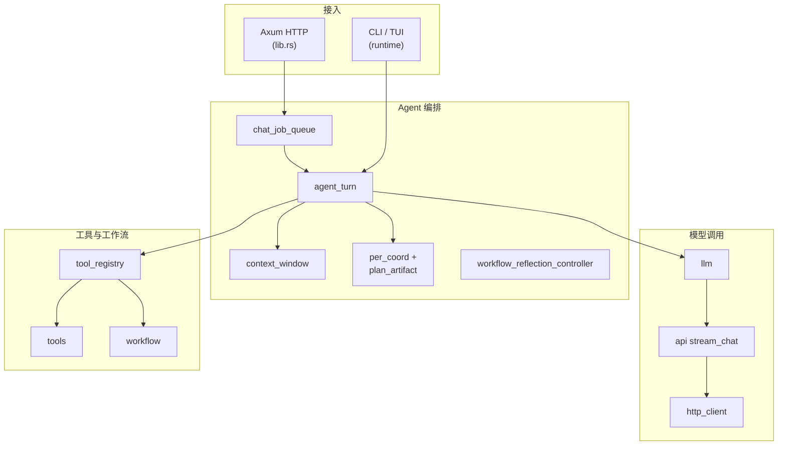
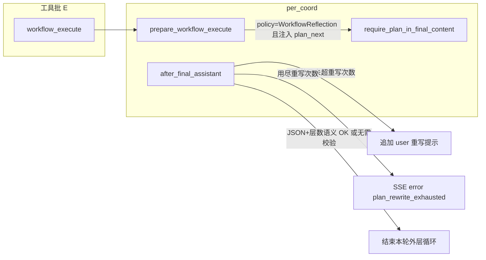

# 开发文档（架构与模块说明）

本文面向**二次开发/维护**，重点解释各模块职责、关键机制与扩展点。  
若你只关心功能与使用方式，请看 `README.md`。

## TODOLIST 与功能文档约定

- **`docs/TODOLIST.md`**：只保留**未完成**项。实现某条后**从文件中删除该条目**（不要用 `[x]` 长期占位）；空的小节可删掉标题。历史追溯用 Git。
- **新功能 / 用户可见变更**（新 CLI 标志、HTTP 接口、配置键、工具名、TUI/Web 行为等）：合并代码时同步更新 **`README.md`**（面向使用者：功能、命令、配置、安全提示）和/或 **`docs/DEVELOPMENT.md`**（面向维护者：模块、协议、扩展点）。纯内部重构且无行为变化时，可只改 `DEVELOPMENT` 或注释。
- **Cursor 规则**：项目内 `.cursor/rules/todolist-and-documentation.mdc` 对 Agent 重申上述约定；**架构或 `src/` 模块组织变更**时另见 `.cursor/rules/architecture-docs-sync.mdc`（须同步更新本节「架构设计」与「代码模块索引」）。
- **提交前检查**：根目录 `.pre-commit-config.yaml`（含 **`cargo fmt --all`**、**`cargo clippy --all-targets -- -D warnings`**、**commit-msg：Conventional Commits 校验**）。安装：`pip install pre-commit && pre-commit install`（配置里含 `default_install_hook_types: [pre-commit, commit-msg]` 时会一并安装 **pre-commit** 与 **commit-msg** 钩子；若本机是旧配置下已装过，请补跑 **`pre-commit install --hook-type commit-msg`**）。手动执行文件检查：`pre-commit run --all-files`（**不**会跑 commit-msg；说明校验仅在 **`git commit`** 时触发）。Cursor 规则 **`.cursor/rules/pre-commit-before-commit.mdc`** 要求 Agent 在 `git commit` 前先跑 pre-commit（无则至少 `fmt` + `clippy`）。改 `src/` 时另见 **`.cursor/rules/rust-clippy-and-tests.mdc`**（测试范围）、**`.cursor/rules/rust-error-handling.mdc`**（unwrap/unsafe）。配置/路由/环境变量与文档的对应关系见 **`.cursor/rules/todolist-and-documentation.mdc`** 中「Rust：默认配置、环境变量与 HTTP 路由」。
- **提交说明**：使用 **Conventional Commits**（`feat:` / `fix:` / `refactor:` 等），见 **`.cursor/rules/conventional-commits.mdc`**；本地由 **conventional-pre-commit** 钩子强制校验。

## 总览：系统由哪些部分组成

- **Rust 后端（`src/`）**：负责与 DeepSeek API 通信、实现 Agent 主循环、提供 HTTP API（含 SSE 流式输出）、执行工具、提供工作区/任务/上传等能力。
- **Web 前端（`frontend/`）**：Vite + React + TS + Tailwind。负责聊天 UI、工作区浏览/编辑、任务清单、状态栏展示，以及消费后端 SSE 流。

## 架构设计

### 总体结构

CrabMate 在**单个 Rust 进程**内使用 **Tokio** 异步运行时：通过 **Axum** 暴露 HTTP，通过 **`runtime/`** 提供 CLI/TUI，共享同一套 **Agent 回合**（`run_agent_turn` → `agent_turn`）、**工具**（`tools`）与 **`AgentConfig`**。

### 逻辑分层（自外而内）

1. **接入层**：HTTP 路由与 multipart（`lib.rs`）、CLI/TUI 参数与交互循环（`runtime/`）。
2. **编排层**：Web 对话排队（`chat_job_queue`）、Agent 主循环（`agent_turn`）、上下文裁剪/摘要（`context_window`）、PER 与终答规划（`per_coord`、`plan_artifact`、`workflow_reflection_controller`）。
3. **模型层**：共享 HTTP 客户端（`http_client`）、请求拼装与重试（`llm`）、流式响应解析（`api`）。
4. **工具与工作流**：工具表驱动执行（`tools/mod.rs`）、按名分发与 Web 侧阻塞超时（`tool_registry`）、DAG 工作流（`workflow`）。
5. **横向契约**：OpenAI 兼容类型（`types`）、SSE 帧（`sse_protocol`）、工具结构化结果（`tool_result`）、配置（`config`）、Web 工作区/任务 API（`ui/*`）。

### Web 流式对话数据流（概要）

1. 客户端 `POST /chat/stream` → **`ChatJobQueue`** 限流排队。  
2. **`run_agent_turn`** 携带 `messages` 与 `tools` 定义进入循环。  
3. **`llm` / `api`** 请求 `/chat/completions`（SSE），直到得到最终文本或 **`tool_calls`**。  
4. 若有工具调用 → **`tool_registry::dispatch_tool`** → **`tools::run_tool`**（或 workflow 路径）→ 结果以 `role: "tool"` 写回 `messages`。  
5. 控制面事件经 **`sse_protocol`** 编码为 SSE 行下发前端。

## `src/` 代码模块索引

> **维护约定**：增删 `lib.rs` 顶层 `mod`、调整目录/文件职责边界、或改变工具/路由/工作流的调用关系时，应同步更新**本节表格**与上文**架构设计**（含 Mermaid 是否与现状一致）。Cursor 规则见 **`.cursor/rules/architecture-docs-sync.mdc`**。

### 顶层模块（与 `src/lib.rs` 中 `mod` 声明一致）

| 路径 | 职责摘要 |
|------|----------|
| `agent_turn.rs` | Agent 主循环共用实现（Web/TUI）：调模型、解析 `tool_calls`、串联 `tool_registry` 与 PER。 |
| `api.rs` | `chat/completions` 单次 HTTP 与 SSE 行解析；CLI/TUI 下终端 Markdown 等展示增强。 |
| `chat_job_queue.rs` | Web `/chat`、`/chat/stream` 有界队列与并发上限。 |
| `config/` | `AgentConfig`、嵌入/文件 TOML、环境变量覆盖、`cli` 参数。 |
| `context_window.rs` | 每次调模型前：`tool` 截断、条数/字符预算、可选摘要请求。 |
| `http_client.rs` | 进程内共享 `reqwest::Client`（连接池、超时、keepalive）。 |
| `llm/mod.rs` | 构造 `ChatRequest`、封装带指数退避的补全调用。 |
| `per_coord.rs` | PER：工作流反思注入与终答 `agent_reply_plan` 策略。 |
| `plan_artifact.rs` | 终答中规划 JSON（v1）解析与规则校验辅助。 |
| `runtime/` | `cli`：单次问答/REPL；`tui`：全屏界面、绘制与输入。 |
| `sse_protocol.rs` | SSE 负载枚举、`encode_message`、协议版本字段。 |
| `tool_registry.rs` | 按工具名选择 Workflow / 命令超时 / 天气与联网搜索超时 / 默认同步等策略。 |
| `tool_result.rs` | 工具输出的结构化 `ToolResult` 与旧式字符串兼容。 |
| `tools/` | 全部 Function Calling 定义、`ToolContext`、`run_tool`；子模块见下表。 |
| `types.rs` | `Message`、`Tool`、流式 chunk 等 OpenAI 兼容类型。 |
| `ui/` | Web 专用 axum handler：`workspace`、`task` 等。 |
| `workflow.rs` | `workflow_execute`：DAG 拓扑、节点并行、工具调用与输出注入。 |
| `workflow_reflection_controller.rs` | 反思回合状态、注入 `plan_next` 等契约校验。 |

### `lib.rs` 额外职责（非独立文件但需知）

- 组装 **完整 axum `Router`**（chat、status、health、workspace、tasks、upload、静态前端 `dist` 等）。
- **`AppState`**：`Arc` 持有 `AgentConfig`、共享 `reqwest::Client`、工作区覆盖路径、上传清理句柄、对话队列等。

### `src/tools/` 子文件（实现域一览）

与 `tools/mod.rs` 中 `mod` 声明保持一致；新增工具文件时请在此**增行**。

| 文件 | 职责域 |
|------|--------|
| `calc.rs` | 数学表达式（`bc`） |
| `cargo_tools.rs` | Cargo 子命令封装 |
| `ci_tools.rs` | 本地 CI / 流水线类工具 |
| `code_nav.rs` | 代码导航、文件大纲等 |
| `command.rs` | `run_command` 白名单与进程执行 |
| `debug_tools.rs` | 调试辅助类工具 |
| `diagnostics.rs` | `diagnostic_summary`：脱敏环境/工具链/工作区路径摘要 |
| `dev_tag.rs` | Development 子域标签：`tags_for_tool_name`、`suggest_dev_tags_for_workspace`（供 `build_tools_with_options` 过滤） |
| `exec.rs` | `run_executable` |
| `file.rs` | 创建/读/改/复制/移动文件、`glob_files`、`list_tree`、`hash_file`（流式 SHA-256/512、BLAKE3）等 |
| `format.rs` / `lint.rs` | 格式化与 lint 聚合 |
| `frontend_tools.rs` | 前端 npm 脚本类 |
| `git.rs` | Git 只读与受控写入 |
| `grep.rs` / `symbol.rs` | 工作区内文本搜索、Rust 符号 |
| `markdown_links.rs` | `markdown_check_links`：Markdown 相对链接存在性检查，可选外链前缀 HEAD |
| `structured_data.rs` | `structured_validate` / `structured_query` / `structured_diff`：JSON·YAML·TOML 校验、路径查询、结构化 diff |
| `patch.rs` | unified diff 应用 |
| `precommit_tools.rs` | `pre-commit run` 封装（依赖 `.pre-commit-config.yaml`） |
| `python_tools.rs` | Python：`ruff check`、`python3 -m pytest`、`mypy`、`uv sync` / `uv run`、可编辑安装（uv / pip）；供 `format`（`.py` 的 ruff format）、`lint`、`quality_workspace`、`ci_pipeline_local` 调用 |
| `quality_tools.rs` | 工作区质量组合检查 |
| `release_docs.rs` | `changelog_draft`（git log → Markdown 草稿）、`license_notice`（cargo metadata → 许可证表） |
| `rust_ide.rs` | 编译器 JSON、rust-analyzer 等 |
| `schedule.rs` | 提醒与日程持久化 |
| `security_tools.rs` | 安全审计类 |
| `time.rs` / `weather.rs` / `web_search.rs` | 时间、天气（Open-Meteo）、联网搜索（Brave/Tavily） |
| `http_fetch.rs` | `http_fetch`：GET/HEAD URL（GET 有体长上限；HEAD 无 body）；重定向链记录；Web 仅允许 `http_fetch_allowed_prefixes`；TUI 审批与白名单键同 GET（`http_fetch:`+ 归一化 URL） |

## 核心机制：Agent 主循环与工具调用

核心流程在 `src/lib.rs` 的 `run_agent_turn`（实现骨架在 `agent_turn.rs`）：

- **输入**：构造 `ChatRequest`（`src/types.rs`）并携带 `tools`（Function Calling 定义）。
- **P（命名上的「规划」步）**：`per_plan_call_model_retrying` —— **一次** `stream_chat`，由模型产出正文或 `tool_calls`，并非独立规划器。
- **调用模型**：通过 `src/api.rs::stream_chat` 请求 `/chat/completions`；默认 `stream: true`（SSE 增量）。CLI `--no-stream` 或 `run_agent_turn(..., no_stream: true)` 时为 `stream: false`，按 OpenAI 兼容 `ChatResponse` 解析 `choices[0].message`（有正文则经 `out` 整段下发）；其它 API 形态需自行适配。
- **上下文窗口策略**（`src/context_window.rs`）：在 `agent_turn::run_agent_turn_common` 的**每次** P 步（`per_plan_call_model_retrying`）之前调用 `prepare_messages_for_model`：**`tool` 消息正文截断**（`tool_message_max_chars`）、**按条数保留**（沿用 `max_message_history`）、可选 **`context_char_budget` 按近似字符删旧消息**；若 `context_summary_trigger_chars > 0` 且非 system 总字符超阈值，则额外发起**无 tools** 的 `chat/completions` 将「中间段」压成一条 user 摘要，尾部保留 `context_summary_tail_messages` 条。TUI/Web 在同步回 `messages` 后，列表长度会随裁剪/摘要变化（工具截断不改变条数）。配置见 `default_config.toml` 与 `AGENT_CONTEXT_*` / `AGENT_TOOL_MESSAGE_MAX_CHARS`。
- **处理结束原因**：
  - `finish_reason != "tool_calls"`：本轮对话结束，最后一条 assistant message 即最终回复。
  - `finish_reason == "tool_calls"`：解析 tool calls，逐个执行本地工具，把工具结果作为 `role: "tool"` 的消息追加进 `messages`，然后继续下一轮请求，直到模型返回最终文本。
- **SSE 通道协作**：若本轮由 `/chat/stream` 触发，会通过 channel 向前端发送：
  - 文本 delta（assistant 内容增量）
  - **控制类 JSON**（由 `src/sse_protocol.rs` 序列化）：统一带版本字段 `v`（当前为 `1`），并与原有键名兼容，例如：
    - `tool_running`、`tool_call`、`tool_result`、`workspace_changed`
    - `error`（+ 可选 `code`）、`command_approval_request`（TUI/工作流审批）
    - 预留 `plan_required` 等扩展键
- **协议版本 `v`**：当前为 `1`；演进时递增 `sse_protocol::SSE_PROTOCOL_VERSION`，前端 `api.ts` 的 `sendChatStream` 已按字段形状解析（`tool_call` / `tool_result` / `plan_required` / `error.code` 等），新事件需在前后端同步扩展。

### PER 与终答 `agent_reply_plan` 强制策略

- **`per_coord::PerCoordinator`**（`src/per_coord.rs`）在 Web/TUI 共用：串联 **workflow 反思**（`workflow_reflection_controller`）与 **终答正文**是否含 `plan_artifact` 可解析的 v1 规划。
- **配置项** `[agent] final_plan_requirement`（环境变量 `AGENT_FINAL_PLAN_REQUIREMENT`）→ `FinalPlanRequirementMode`：
  - **`never`**：不进入「缺规划则追加 user 重写提示」循环；反思注入仍会下发，但不置位强制标记。
  - **`workflow_reflection`（默认）**：仅当工具路径注入了 `instruction_type == workflow_reflection_controller::INSTRUCTION_WORKFLOW_REFLECTION_PLAN_NEXT` 时，对随后的**最终** assistant 校验；避免与反思 JSON 的字符串散落耦合。
  - **`always`**：每次 `finish_reason != tool_calls` 的终答均校验（实验性）。
- **`[agent] plan_rewrite_max_attempts`**（`AGENT_PLAN_REWRITE_MAX_ATTEMPTS`，默认 `2`， clamp `1..=20`）：终答规划不合格时，最多追加多少次「请重写」user 消息；用尽后结束外层循环，并在 **有 SSE 通道** 时发送 `{"error":"…","code":"plan_rewrite_exhausted"}`（与 `sse_protocol::SsePayload::Error` 一致）。
- **规则化语义（相对 `workflow_validate_only`）**：当策略要求校验规划，且历史中最近一次 `workflow_execute` 的 tool 结果为 `report_type == workflow_validate_result` 时，读取 `spec.layer_count`（拓扑层数），要求 `agent_reply_plan.steps.len() >= layer_count`；否则仅做 JSON 形态校验。重写提示中会附带 `layer_count` 说明。
- **可观测性**：`tracing` 目标 `crabmate::per`（`RUST_LOG=crabmate::per=info` 或 `RUST_LOG=info`）记录 `after_final_assistant` 的 outcome、`reflection_stage_round`、`plan_rewrite_attempts` 等；`workflow_reflection_controller::WorkflowReflectionController::stage_round()` 供排错对照反思轮次。

- **`GET /status`** 返回 `final_plan_requirement`、`plan_rewrite_max_attempts`，便于与 `reflection_default_max_rounds` 一起核对运行态。

## 后端模块说明（`src/`）

**按文件/目录的职责一览见上文「`src/` 代码模块索引」与「`src/tools/` 子文件」**；本节按主题补充实现细节与扩展点。

### `src/lib.rs` / `src/main.rs`

- **`lib.rs`**：crate 根模块；Agent 主循环（`run_agent_turn`）、Axum Web 路由与 handler、上传清理等。**对外再导出** `run`、`load_config`、`AgentConfig`、`Message`、`Tool`、`build_tools`、`build_tools_filtered`、`build_tools_with_options`、`ToolsBuildOptions`、`dev_tag` 等，供集成测试与其它二进制复用。
- **`main.rs`**：薄入口，仅 `#[tokio::main] async fn main() { crabmate::run().await }`。
- **运行模式**：由 `run()` 内解析 CLI（`--serve`/`--host`/`--query`/`--stdin`/`--no-tools`/`--no-web`/`--dry-run` 等），选择启动 Web 服务、REPL、单次提问或 TUI。`--serve` 默认绑定 `127.0.0.1`；`0.0.0.0` 需显式 `--host` 或环境变量 `AGENT_HTTP_HOST`（见 README）。
- **Web 服务**：使用 axum 路由，核心接口包括：
  - `POST /chat`：非流式对话
  - `POST /chat/stream`：SSE 流式对话（前端默认走这个）
  - `GET /status`：状态栏数据（模型、`api_base`、`max_tokens`、`temperature`、**`tool_count` / `tool_names` / `tool_dispatch_registry`**、`reflection_default_max_rounds`、**`final_plan_requirement` / `plan_rewrite_max_attempts`**、**`max_message_history` / `tool_message_max_chars` / `context_char_budget` / `context_summary_trigger_chars`**、**`chat_queue_*` 与 `chat_queue_recent_jobs`**）
  - `GET /health`：健康检查（API_KEY/静态目录/工作区可写/依赖命令）
  - `GET|POST /workspace` + `GET|POST|DELETE /workspace/file`：工作区浏览与读写文件
  - `GET|POST /tasks`：任务清单读写
  - `POST /upload` + `GET /uploads/...`：上传与静态访问
- **状态与工作区选择**：`AppState` 内维护 `workspace_override`，由前端调用 `/workspace` POST 来设置，影响 Agent 的工具执行工作目录与文件 API 根目录。
- **Web 对话队列**：`src/chat_job_queue.rs` 的 `ChatJobQueue` 对 `/chat`、`/chat/stream` 做**有界**排队与**并发上限**（`chat_queue_max_concurrent` / `chat_queue_max_pending`）；满则 **503** + `QUEUE_FULL`。单进程内协调，多副本需外部代理（见 `TODOLIST`）。

### `src/llm/mod.rs`

- **与大模型交互的封装层**（在 `api` 之上）：`tool_chat_request` 统一从 `AgentConfig` + `messages` + `tools` 构造 `ChatRequest`（含 `tool_choice: auto`）；`complete_chat_retrying` 封装 `api::stream_chat` 与 **指数退避重试**（`api_max_retries` / `api_retry_delay_secs`）。
- **Agent 主循环**（`agent_turn::per_plan_call_model_retrying`）只委托本模块，避免在 P 步重复拼装请求与重试逻辑。
- HTTP 路径片段见 `types::OPENAI_CHAT_COMPLETIONS_REL_PATH`（`api` / 文档共用）。

### `src/http_client.rs`

- **`build_shared_api_client`**：`run()` 内构造**唯一**异步 `reqwest::Client` 写入 `AppState`，供所有 `chat/completions` 与工具内嵌 HTTP 调用以外的模型流量复用。
- **连接优化**（非 WebSocket）：`connect_timeout` 与整请求 `timeout` 分离；`pool_max_idle_per_host`、`pool_idle_timeout`、`tcp_keepalive` 便于 **HTTP Keep-Alive / 连接池** 在多轮对话中复用 TLS（OpenAI 兼容 API 为 HTTP+SSE，无「单条模型 WebSocket」协议）。

### `src/api.rs`

- **单次 HTTP 传输**：`POST {api_base}/chat/completions`，`stream: true` 时对响应进行 `data: ...` 行拆解，聚合 assistant content 与 tool_calls（按 index 累积 arguments）。流结束时若缓冲区内仍有**未以换行结尾**的最后一帧，会在关闭读循环后补解析一次，避免尾部 delta 丢失（此前仅按 `\n` 切行时易丢末包）。
- **终端渲染增强（CLI/TUI）**：对终端输出做 Markdown 渲染与 LaTeX→Unicode 转换，提升命令行交互体验（Web 模式不依赖这部分展示）。

### `src/sse_protocol.rs`

- **SSE 控制帧**：`SseMessage { v, payload }` + `SsePayload`（`serde` untagged），`encode_message` 生成单行 JSON；Web `agent_turn`、TUI、`workflow` 审批、流式错误等均经此发出，避免手写 JSON 拼写错误。

### `src/types.rs`

- **统一数据结构**：请求/响应、message、tool schema、stream chunk 等类型。
- **关键点**：tool calling 依赖 `Tool`（function 名、描述、JSON schema）与 `Message.tool_calls` / `role: "tool"` 消息回填。

### `src/tools/file.rs`（节选）

- 除 `read_dir` 外，`glob_files`（`glob` crate 模式 + 工作区内递归）与 `list_tree`（先序目录树）均带 **深度/条数上限**，并对 `canonicalize` 结果做工作区根校验，避免符号链接逃逸。
- **`resolve_for_read`**、**`canonical_workspace_root`** 为 `pub(crate)`，供 `markdown_links`、`structured_data`、`diagnostics` 等只读工具复用（`resolve_for_read` 要求目标已存在）。

### `src/tools/mod.rs`（工具注册与分发的“表驱动”中心）

- **工具注册**：通过 `ToolSpec { name, description, category, parameters, runner }` 静态表定义每个工具。
- **顶层分类 `ToolCategory`**（供 `build_tools_filtered` 与文档）：**`Basic`（基础工具）**——时间/计算/天气、`web_search`、`http_fetch`、日程提醒等；**`Development`（开发工具）**——工作区文件、Git、**Rust**（Cargo/RA）、**前端**（npm）、**Python**（ruff、pytest、mypy、`uv sync`/`uv run`、pip/uv 可编辑安装）、**pre-commit**、Lint 聚合、补丁、符号搜索、工作流等。
- **Development 子域标签**（`src/tools/dev_tag.rs`）：按 **工具名** 映射到字符串标签（可多枚），用于在不增加 `ToolCategory` 枚举的前提下按语言栈/场景裁剪发给模型的工具列表。约定标签名：`general`（工作区/壳/编排/元数据等跨语言）、`vcs`（Git）、`rust`（Cargo/RA 等）、`frontend`（npm 脚本类）、`python`（ruff/pytest/mypy/uv/pip 等）、`quality`（Lint/审计/CI 聚合等与质量相关的工具，常与 `rust`/`frontend`/`python` 重叠）。映射函数为 `dev_tag::tags_for_tool_name`；**新增 `Development` 工具时须在该 `match` 中补全对应分支**（未列出的名称会回落到仅 `general`，便于不崩，但应显式维护）。
- **构建与过滤**：
  - `build_tools()`：等价于 `build_tools_with_options(ToolsBuildOptions::default())`，不按分类与标签过滤。
  - `build_tools_filtered(categories)`：仅按 `ToolCategory` 过滤；`dev_tags` 为不限制。
  - `build_tools_with_options(ToolsBuildOptions { categories, dev_tags })`：`categories` 为 `None` 或空切片时不按分类过滤；`dev_tags` 为 `None` 或空切片时不按标签过滤；否则 **仅对 `Development` 工具** 要求 `tags_for_tool_name(name)` 与 `dev_tags` **有交集**，`Basic` 仍只受 `categories` 约束。
  - `dev_tag::suggest_dev_tags_for_workspace(root)`：根据是否存在 `Cargo.toml`、`frontend/package.json` 或根目录 `package.json`、`pyproject.toml` / `setup.py` / `setup.cfg` / `requirements.txt` 等，返回建议标签列表（始终含 `general` 与 `vcs`）。
- **对外接口**（库根 `lib.rs` 再导出 `build_tools_filtered`、`build_tools_with_options`、`ToolsBuildOptions`、`dev_tag`）：
  - `tool_context_for(cfg, allowed_commands, working_dir)`：从 `AgentConfig` 构造 `ToolContext`（含 `web_search_*` 等）。
  - `run_tool(name, args_json, &ToolContext)`：按 name 分发执行。
  - `summarize_tool_call(...)`：生成前端展示的“工具调用摘要”。
  - `is_compile_command_success(...)`：识别编译命令成功以触发工作区刷新。
- **扩展新工具的建议步骤**：
  - 新增 `src/tools/<tool>.rs` 实现 runner
  - 在 `src/tools/mod.rs`：
    - `mod <tool>;`
    - 增加参数 schema builder（`params_xxx`）
    - 增加 runner（`runner_xxx`）
    - 在 `tool_specs()` 中注册 `ToolSpec`
  - 若为 **`Development`**：在 **`src/tools/dev_tag.rs`** 的 `tags_for_tool_name` 中增加该 `name` 的标签映射

### 典型工具实现说明（`src/tools/`）

- **`time.rs`**：本地时间与月历格式化（`mode=time|calendar|both`）。
- **`calc.rs`**：通过 `bc -l` 计算表达式（避免 shell 注入：通常用 stdin 传参、限制输出）。
- **`weather.rs`**：调用 Open‑Meteo（无需 key），带超时控制。
- **`web_search.rs`**：`reqwest::blocking` + `serde` 调用 Brave Web Search 或 Tavily；Key 与 `web_search_provider` 来自 `AgentConfig`。Web 路径在 `tool_registry` 中登记为 `WebSearchSpawnTimeout`（`spawn_blocking` + 超时）。
- **`http_fetch.rs`**：阻塞 GET/HEAD（`method` 参数，默认 GET）；自定义 `redirect::Policy` 记录重定向跳数；`tool_registry` 登记为 `HttpFetchSpawnTimeout`。Web 仅当 URL 以 `http_fetch_allowed_prefixes` 中任一项为前缀时执行；TUI 另可经 `CommandApproval`（`allowlist_key` 为上述持久化键；`args` 对 HEAD 带 `HEAD` 前缀）在「本次允许 / 永久允许」后执行。`CommandApprovalBody.allowlist_key` 可选；`run_command` 审批不传时 TUI 仍以命令名小写写入白名单。
- **`command.rs`**：命令白名单 + 超时 + 输出截断；配合 `allowed_commands` 与工作区路径限制。
- **`exec.rs`**：仅允许在工作区内运行相对路径可执行文件（禁止绝对路径与 `..` 越界）。
- **`file.rs`**：工作区内创建/覆盖/复制/移动文件；`resolve_for_read` / `resolve_for_write` 与祖先 symlink 校验是安全边界的关键；`copy_file` / `move_file` 仅针对常规文件，`overwrite` 控制目标已存在时的覆盖策略；`hash_file` 仅对常规文件流式哈希（`sha256` / `sha512` / `blake3`），可选 `max_bytes` 前缀模式。
- **`schedule.rs`**：提醒/日程；以 JSON 持久化到 `<working_dir>/.crabmate/reminders.json` 与 `events.json`。
- **`grep.rs` / `format.rs` / `lint.rs`**：面向开发工作流的辅助能力（搜索/格式化/静态检查聚合）；`format` 对 `.py` 使用 `ruff format`，`run_lints` 可选聚合 `ruff check`（`run_python_ruff`）。
- **`python_tools.rs` / `precommit_tools.rs`**：见上表；`quality_workspace` / `ci_pipeline_local` 可选步骤含 ruff/pytest/mypy；`pre_commit_run` 依赖仓库根 `.pre-commit-config.yaml`（或 `.yml`）。

### `src/ui/*` 与 `src/runtime/*`

- **`ui`**：承载 Web 侧的“工作区/任务”等 API handler（与前端面板直接对应）。
- **`runtime`**：CLI/TUI 运行时逻辑，负责 REPL、单次问答、TUI 的交互渲染与调用 `run_agent_turn`。
  - TUI 实现位于 `runtime/tui/`：`mod`（主循环）、`state`、`draw`、`input`（键鼠）、`text_input`（输入光标与折行；折行近似 `Paragraph::Wrap`，极端情况与 Markdown 区可能略有偏差）、`clipboard`（`arboard` 读系统剪贴板）、`edit_history`（输入区撤销/重做栈）、`chat_session`（`.crabmate/tui_session.json` 与导出）、`chat_nav`（聊天区逻辑行搜索/跳转，与 `draw::build_chat_scroll_lines` 的纯文本列对齐）、`workspace_ops`、`sse_line`、`styles`、`status`、`allowlist`、`agent`（委托 `agent_turn`）。

## 前端模块说明（`frontend/src/`）

### `frontend/src/api.ts`

- **统一请求封装**：超时、重试、错误分类（`ApiError`）、GET 去重与轻量缓存（SWR）。
- **流式聊天**：`sendChatStream` 消费 `/chat/stream` 的 SSE，把：
  - 纯文本 `data:` 当作 delta
  - JSON `data:` 识别 `tool_running`/`tool_call`/`tool_result`/`workspace_changed` 并分发回调

### `frontend/src/components/ChatPanel.tsx`

- **聊天主面板**：维护消息列表、流式渲染（尽量只更新最后一条 assistant），以及工具输出的“系统消息卡片”（可折叠/复制）。
- **附件**：图片/音频/视频本地压缩/转 DataURL（当前实现以 DataURL 形式随消息发送/展示；上传 API 也已在 `api.ts` 提供，用于走服务端 `/upload`）。
- **会话导出**：把当前对话导出为 JSON。

### `frontend/src/components/WorkspacePanel.tsx`

- **工作区浏览/编辑**：调用 `/workspace` 与 `/workspace/file` 做目录浏览、文件读写、删除与下载。
- **工作区设置**：把用户选择的目录同步到后端（`POST /workspace`），并本地持久化到 `localStorage`。
- **目录内搜索**：调用 `/workspace/search`，并可“一键把结果发到聊天”。

### `frontend/src/components/TasksPanel.tsx`

- **任务清单**：读写 `/tasks`（后端持久化为工作区根目录的 `tasks.json`）。
- **从描述生成**：用一次独立 `/chat` 请求让模型输出严格 JSON，然后写入 `/tasks`。

### `frontend/src/components/StatusBar.tsx`

- **状态轮询**：轮询 `/status`，页面不可见时暂停；失败指数退避。
- **忙碌状态**：结合 Chat 面板的 `busy` 与 `toolBusy` 展示“模型生成中…”/“工具运行中…”。

## 数据与文件持久化约定

- **工作区根目录（后端当前生效目录）**：
  - `tasks.json`：任务清单
  - `.crabmate/`：提醒与日程（`reminders.json` / `events.json`）
- **前端本地存储（`localStorage`）**：
  - 工作区路径选择（`agent-demo-workspace-dir`）
  - 聊天输入框高度（`agent-demo-input-height`）

## 常见扩展点与注意事项

- **新增/调整工具**：优先在 `src/tools/mod.rs` 的表驱动体系里注册，保证 schema/runner/分类一致。
- **安全边界**：
  - `run_command` 必须受白名单控制，避免破坏性命令。
  - 文件读写与 `run_executable` 必须做路径归一化与越界限制。
  - Web 模式下的工作区设置会影响“工具执行目录”，需要明确这一点避免误操作。
  - **密钥与日志**：勿将真实 API key、token、`.env` 内容写入代码、示例配置、commit message 或日志；日志与错误回显须脱敏。Cursor 规则见 **`.cursor/rules/secrets-and-logging.mdc`**。
  - 已知 HTTP 鉴权、监听地址、`workspace_set` 等安全与协议债见 [`docs/TODOLIST.md`](TODOLIST.md)。
- **SSE 协议演进**：后端以 `sse_protocol::SseMessage` / `SsePayload` 为单一事实来源；`v` 递增时前端可按版本分支。解析逻辑在 `frontend/src/api.ts` 的 `sendChatStream`。

