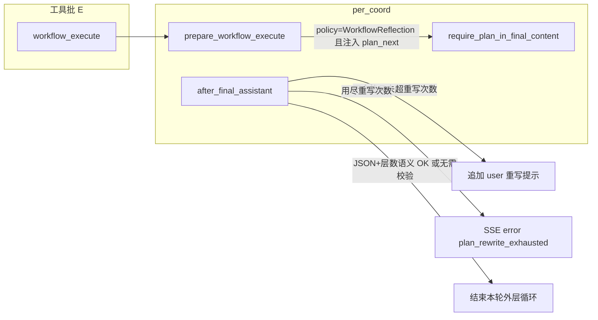

# 开发文档（架构与模块说明）

本文面向**二次开发/维护**，重点解释各模块职责、关键机制与扩展点。  
若你只关心功能与使用方式，请看 `README.md`。

## TODOLIST 与功能文档约定

- **`docs/TODOLIST.md`**：只保留**未完成**项。实现某条后**从文件中删除该条目**（不要用 `[x]` 长期占位）；空的小节可删掉标题。历史追溯用 Git。
- **新功能 / 用户可见变更**（新 CLI 标志、HTTP 接口、配置键、工具名、TUI/Web 行为等）：合并代码时同步更新 **`README.md`**（面向使用者：功能、命令、配置、安全提示）和/或 **`docs/DEVELOPMENT.md`**（面向维护者：模块、协议、扩展点）。纯内部重构且无行为变化时，可只改 `DEVELOPMENT` 或注释。
- **Cursor 规则**：项目内 `.cursor/rules/todolist-and-documentation.mdc` 对 Agent 重申上述约定。

## 总览：系统由哪些部分组成

- **Rust 后端（`src/`）**：负责与 DeepSeek API 通信、实现 Agent 主循环、提供 HTTP API（含 SSE 流式输出）、执行工具、提供工作区/任务/上传等能力。
- **Web 前端（`frontend/`）**：Vite + React + TS + Tailwind。负责聊天 UI、工作区浏览/编辑、任务清单、状态栏展示，以及消费后端 SSE 流。

## 核心机制：Agent 主循环与工具调用

核心流程在 `src/lib.rs` 的 `run_agent_turn`（实现骨架在 `agent_turn.rs`）：

- **输入**：构造 `ChatRequest`（`src/types.rs`）并携带 `tools`（Function Calling 定义）。
- **P（命名上的「规划」步）**：`per_plan_call_model_retrying` —— **一次** `stream_chat`，由模型产出正文或 `tool_calls`，并非独立规划器。
- **调用模型**：通过 `src/api.rs::stream_chat` 请求 `/chat/completions`；默认 `stream: true`（SSE 增量）。CLI `--no-stream` 或 `run_agent_turn(..., no_stream: true)` 时为 `stream: false`，按 OpenAI 兼容 `ChatResponse` 解析 `choices[0].message`（有正文则经 `out` 整段下发）；其它 API 形态需自行适配。
- **处理结束原因**：
  - `finish_reason != "tool_calls"`：本轮对话结束，最后一条 assistant message 即最终回复。
  - `finish_reason == "tool_calls"`：解析 tool calls，逐个执行本地工具，把工具结果作为 `role: "tool"` 的消息追加进 `messages`，然后继续下一轮请求，直到模型返回最终文本。
- **SSE 通道协作**：若本轮由 `/chat/stream` 触发，会通过 channel 向前端发送：
  - 文本 delta（assistant 内容增量）
  - **控制类 JSON**（由 `src/sse_protocol.rs` 序列化）：统一带版本字段 `v`（当前为 `1`），并与原有键名兼容，例如：
    - `tool_running`、`tool_call`、`tool_result`、`workspace_changed`
    - `error`（+ 可选 `code`）、`command_approval_request`（TUI/工作流审批）
    - 预留 `plan_required` 等扩展键
- **协议版本 `v`**：当前为 `1`；演进时递增 `sse_protocol::SSE_PROTOCOL_VERSION`，前端 `api.ts` 的 `sendChatStream` 已按字段形状解析（`tool_call` / `tool_result` / `plan_required` / `error.code` 等），新事件需在前后端同步扩展。

### PER 与终答 `agent_reply_plan` 强制策略

- **`per_coord::PerCoordinator`**（`src/per_coord.rs`）在 Web/TUI 共用：串联 **workflow 反思**（`workflow_reflection_controller`）与 **终答正文**是否含 `plan_artifact` 可解析的 v1 规划。
- **配置项** `[agent] final_plan_requirement`（环境变量 `AGENT_FINAL_PLAN_REQUIREMENT`）→ `FinalPlanRequirementMode`：
  - **`never`**：不进入「缺规划则追加 user 重写提示」循环；反思注入仍会下发，但不置位强制标记。
  - **`workflow_reflection`（默认）**：仅当工具路径注入了 `instruction_type == workflow_reflection_controller::INSTRUCTION_WORKFLOW_REFLECTION_PLAN_NEXT` 时，对随后的**最终** assistant 校验；避免与反思 JSON 的字符串散落耦合。
  - **`always`**：每次 `finish_reason != tool_calls` 的终答均校验（实验性）。
- **`[agent] plan_rewrite_max_attempts`**（`AGENT_PLAN_REWRITE_MAX_ATTEMPTS`，默认 `2`， clamp `1..=20`）：终答规划不合格时，最多追加多少次「请重写」user 消息；用尽后结束外层循环，并在 **有 SSE 通道** 时发送 `{"error":"…","code":"plan_rewrite_exhausted"}`（与 `sse_protocol::SsePayload::Error` 一致）。
- **规则化语义（相对 `workflow_validate_only`）**：当策略要求校验规划，且历史中最近一次 `workflow_execute` 的 tool 结果为 `report_type == workflow_validate_result` 时，读取 `spec.layer_count`（拓扑层数），要求 `agent_reply_plan.steps.len() >= layer_count`；否则仅做 JSON 形态校验。重写提示中会附带 `layer_count` 说明。
- **可观测性**：`tracing` 目标 `crabmate::per`（`RUST_LOG=crabmate::per=info` 或 `RUST_LOG=info`）记录 `after_final_assistant` 的 outcome、`reflection_stage_round`、`plan_rewrite_attempts` 等；`workflow_reflection_controller::WorkflowReflectionController::stage_round()` 供排错对照反思轮次。

- **`GET /status`** 返回 `final_plan_requirement`、`plan_rewrite_max_attempts`，便于与 `reflection_default_max_rounds` 一起核对运行态。

## 后端模块说明（`src/`）

### `src/lib.rs` / `src/main.rs`

- **`lib.rs`**：crate 根模块；Agent 主循环（`run_agent_turn`）、Axum Web 路由与 handler、上传清理等。**对外再导出** `run`、`load_config`、`AgentConfig`、`Message`、`Tool`、`build_tools` 等，供集成测试与其它二进制复用。
- **`main.rs`**：薄入口，仅 `#[tokio::main] async fn main() { crabmate::run().await }`。
- **运行模式**：由 `run()` 内解析 CLI（`--serve`/`--query`/`--stdin`/`--no-tools`/`--no-web`/`--dry-run` 等），选择启动 Web 服务、REPL、单次提问或 TUI。
- **Web 服务**：使用 axum 路由，核心接口包括：
  - `POST /chat`：非流式对话
  - `POST /chat/stream`：SSE 流式对话（前端默认走这个）
  - `GET /status`：状态栏数据（模型、`api_base`、`max_tokens`、`temperature`、**`tool_count` / `tool_names` / `tool_dispatch_registry`**、`reflection_default_max_rounds`、**`final_plan_requirement` / `plan_rewrite_max_attempts`**）
  - `GET /health`：健康检查（API_KEY/静态目录/工作区可写/依赖命令）
  - `GET|POST /workspace` + `GET|POST|DELETE /workspace/file`：工作区浏览与读写文件
  - `GET|POST /tasks`：任务清单读写
  - `POST /upload` + `GET /uploads/...`：上传与静态访问
- **状态与工作区选择**：`AppState` 内维护 `workspace_override`，由前端调用 `/workspace` POST 来设置，影响 Agent 的工具执行工作目录与文件 API 根目录。

### `src/llm/mod.rs`

- **与大模型交互的封装层**（在 `api` 之上）：`tool_chat_request` 统一从 `AgentConfig` + `messages` + `tools` 构造 `ChatRequest`（含 `tool_choice: auto`）；`complete_chat_retrying` 封装 `api::stream_chat` 与 **指数退避重试**（`api_max_retries` / `api_retry_delay_secs`）。
- **Agent 主循环**（`agent_turn::per_plan_call_model_retrying`）只委托本模块，避免在 P 步重复拼装请求与重试逻辑。
- HTTP 路径片段见 `types::OPENAI_CHAT_COMPLETIONS_REL_PATH`（`api` / 文档共用）。

### `src/api.rs`

- **单次 HTTP 传输**：`POST {api_base}/chat/completions`，`stream: true` 时对响应进行 `data: ...` 行拆解，聚合 assistant content 与 tool_calls（按 index 累积 arguments）。
- **终端渲染增强（CLI/TUI）**：对终端输出做 Markdown 渲染与 LaTeX→Unicode 转换，提升命令行交互体验（Web 模式不依赖这部分展示）。

### `src/sse_protocol.rs`

- **SSE 控制帧**：`SseMessage { v, payload }` + `SsePayload`（`serde` untagged），`encode_message` 生成单行 JSON；Web `agent_turn`、TUI、`workflow` 审批、流式错误等均经此发出，避免手写 JSON 拼写错误。

### `src/types.rs`

- **统一数据结构**：请求/响应、message、tool schema、stream chunk 等类型。
- **关键点**：tool calling 依赖 `Tool`（function 名、描述、JSON schema）与 `Message.tool_calls` / `role: "tool"` 消息回填。

### `src/tools/mod.rs`（工具注册与分发的“表驱动”中心）

- **工具注册**：通过 `ToolSpec { name, description, category, parameters, runner }` 静态表定义每个工具。
- **对外接口**：
  - `build_tools()`：生成给模型的 tools 定义（Function Calling schema）。
  - `run_tool(...)`：按 name 分发执行。
  - `summarize_tool_call(...)`：生成前端展示的“工具调用摘要”。
  - `is_compile_command_success(...)`：识别编译命令成功以触发工作区刷新。
- **扩展新工具的建议步骤**：
  - 新增 `src/tools/<tool>.rs` 实现 runner
  - 在 `src/tools/mod.rs`：
    - `mod <tool>;`
    - 增加参数 schema builder（`params_xxx`）
    - 增加 runner（`runner_xxx`）
    - 在 `tool_specs()` 中注册 `ToolSpec`

### 典型工具实现说明（`src/tools/`）

- **`time.rs`**：本地时间与月历格式化（`mode=time|calendar|both`）。
- **`calc.rs`**：通过 `bc -l` 计算表达式（避免 shell 注入：通常用 stdin 传参、限制输出）。
- **`weather.rs`**：调用 Open‑Meteo（无需 key），带超时控制。
- **`command.rs`**：命令白名单 + 超时 + 输出截断；配合 `allowed_commands` 与工作区路径限制。
- **`exec.rs`**：仅允许在工作区内运行相对路径可执行文件（禁止绝对路径与 `..` 越界）。
- **`file.rs`**：工作区内创建/覆盖文件；路径归一化与越界检查是安全边界的关键。
- **`schedule.rs`**：提醒/日程；以 JSON 持久化到 `<working_dir>/.crabmate/reminders.json` 与 `events.json`。
- **`grep.rs` / `format.rs` / `lint.rs`**：面向开发工作流的辅助能力（搜索/格式化/静态检查聚合）。

### `src/ui/*` 与 `src/runtime/*`

- **`ui`**：承载 Web 侧的“工作区/任务”等 API handler（与前端面板直接对应）。
- **`runtime`**：CLI/TUI 运行时逻辑，负责 REPL、单次问答、TUI 的交互渲染与调用 `run_agent_turn`。
  - TUI 实现位于 `runtime/tui/`：`mod`（主循环）、`state`、`draw`、`input`（键鼠）、`workspace_ops`、`sse_line`、`styles`、`status`、`allowlist`、`agent`（委托 `agent_turn`）。

## 前端模块说明（`frontend/src/`）

### `frontend/src/api.ts`

- **统一请求封装**：超时、重试、错误分类（`ApiError`）、GET 去重与轻量缓存（SWR）。
- **流式聊天**：`sendChatStream` 消费 `/chat/stream` 的 SSE，把：
  - 纯文本 `data:` 当作 delta
  - JSON `data:` 识别 `tool_running`/`tool_call`/`tool_result`/`workspace_changed` 并分发回调

### `frontend/src/components/ChatPanel.tsx`

- **聊天主面板**：维护消息列表、流式渲染（尽量只更新最后一条 assistant），以及工具输出的“系统消息卡片”（可折叠/复制）。
- **附件**：图片/音频/视频本地压缩/转 DataURL（当前实现以 DataURL 形式随消息发送/展示；上传 API 也已在 `api.ts` 提供，用于走服务端 `/upload`）。
- **会话导出**：把当前对话导出为 JSON。

### `frontend/src/components/WorkspacePanel.tsx`

- **工作区浏览/编辑**：调用 `/workspace` 与 `/workspace/file` 做目录浏览、文件读写、删除与下载。
- **工作区设置**：把用户选择的目录同步到后端（`POST /workspace`），并本地持久化到 `localStorage`。
- **目录内搜索**：调用 `/workspace/search`，并可“一键把结果发到聊天”。

### `frontend/src/components/TasksPanel.tsx`

- **任务清单**：读写 `/tasks`（后端持久化为工作区根目录的 `tasks.json`）。
- **从描述生成**：用一次独立 `/chat` 请求让模型输出严格 JSON，然后写入 `/tasks`。

### `frontend/src/components/StatusBar.tsx`

- **状态轮询**：轮询 `/status`，页面不可见时暂停；失败指数退避。
- **忙碌状态**：结合 Chat 面板的 `busy` 与 `toolBusy` 展示“模型生成中…”/“工具运行中…”。

## 数据与文件持久化约定

- **工作区根目录（后端当前生效目录）**：
  - `tasks.json`：任务清单
  - `.crabmate/`：提醒与日程（`reminders.json` / `events.json`）
- **前端本地存储（`localStorage`）**：
  - 工作区路径选择（`agent-demo-workspace-dir`）
  - 聊天输入框高度（`agent-demo-input-height`）

## 常见扩展点与注意事项

- **新增/调整工具**：优先在 `src/tools/mod.rs` 的表驱动体系里注册，保证 schema/runner/分类一致。
- **安全边界**：
  - `run_command` 必须受白名单控制，避免破坏性命令。
  - 文件读写与 `run_executable` 必须做路径归一化与越界限制。
  - Web 模式下的工作区设置会影响“工具执行目录”，需要明确这一点避免误操作。
  - 已知 HTTP 鉴权、监听地址、`workspace_set` 等安全与协议债见 [`docs/TODOLIST.md`](TODOLIST.md)。
- **SSE 协议演进**：后端以 `sse_protocol::SseMessage` / `SsePayload` 为单一事实来源；`v` 递增时前端可按版本分支。解析逻辑在 `frontend/src/api.ts` 的 `sendChatStream`。

