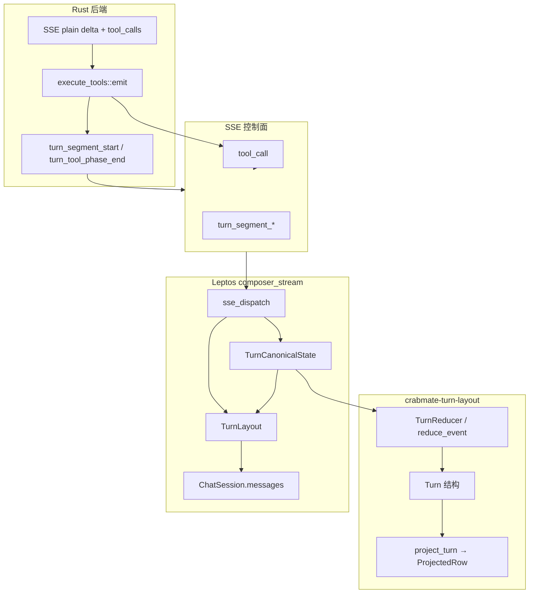

# Turn 布局：单轮工具回合的消息顺序设计

**状态**：Web 流式 **Phase 0–3** 已落地（见 §12）；TUI/CLI 仅消费 SSE 控制面镜像，尚未做完整 canonical 投影。  
**目标读者**：维护者；变更 **`turn_segment_*`**、**`frontend/src/app/chat/composer_stream/`** 或 **`crates/crabmate-turn-layout`** 前须读本文，并同步 **`docs/SSE协议.md`**、**`fixtures/turn_project_golden.jsonl`**、**`fixtures/sse_control_golden.jsonl`**。

---

## 1. 背景：传输有序 ≠ 展示有序

`/chat/stream` 在 **TCP/SSE 层**按到达顺序下发事件，但 **语义顺序**由多轮 LLM 与工具编排决定，常见交错包括：

| 现象 | 示例 |
|------|------|
| 工具前旁注晚于 `tool_call` SSE | 模型已发出 `create_file` 控制面，plain delta「工作区是空的…」仍在路上 |
| 终局总结早于后续工具 | post-tool 尾泡被 finalize 后，同轮仍有 `tool_call` |
| 思维链/正文/工具控制面交织 | `reasoning_*`、plain delta、`tool_call`、`assistant_answer_phase` 混排 |

若前端仅按 **`messages.push` 顺序**或 **单一 loading 尾泡** 追加正文，导出与聊天气泡会出现「旁注在工具之后」「总结插在工具中间」等错位。

本设计用 **三层结构** 把「canonical 回合形状 → SSE 段边界 → UI `StoredMessage` 投影」拆开，便于单测与金样锁定。

---

## 2. 目标展示顺序（单轮含工具）

Web 单轮流式会话中，用户可见的 **`ChatSession.messages`** 目标顺序为：

```text
[时间线/意图等 system 旁注*]
[工具前 assistant 旁注*]        ← 可多条，每条锚在某 tool_call_id 之前
[工具占位/结果*]
[post-tool loading 尾泡]       ← 仅流式进行中；终答写入或 finalize
[终局 assistant 答*]
```

**`TurnLayout`**（前端 imperative 状态机）负责 **尾泡 peel/restore、loading 插入位置、时间线插入**；  
**`crabmate-turn-layout`**（共享 crate）负责 **与到达顺序无关** 的 canonical 归约；  
**`TurnCanonicalState`**（前端 scratch）把 reducer 结果 **upsert** 为带 `tool_call_id` 锚点的 assistant 行。

---

## 3. 三层架构



| 层 | 位置 | 职责 |
|----|------|------|
| **Canonical Turn** | `crates/crabmate-turn-layout` | `Turn` + `TurnEvent` reducer；`project_turn` 输出金样行类型 |
| **SSE 段边界** | `sse::protocol`（`turn_segment_start` / `turn_segment_end` / `turn_tool_phase_end`） | 在 `tool_call` 前声明锚点；工具批结束标记 |
| **Web 投影** | `frontend/.../composer_stream/` | `TurnLayout` 操作 `messages`；`TurnCanonicalState` 驱动旁注 upsert |

协议字段详见 **`docs/SSE协议.md`**（`before_tool_call_id`：本段展示在该 `tool_call_id` **之前**）。

---

## 4. 模块与文件索引

### 4.1 共享 crate：`crates/crabmate-turn-layout`

| 文件 | 内容 |
|------|------|
| `model.rs` | `Turn`、`ToolStep`、`TurnSegment`、`SegmentKind` |
| `event.rs` | `TurnEvent`（`SegmentStart/Delta/End`、`ToolCall`、`ToolPhaseEnd`、`AnswerDelta` 等） |
| `reduce.rs` | `reduce_event`：允许 **晚到 `SegmentDelta`** 挂到已关闭段或 `seg-before-{tool_call_id}` |
| `project.rs` | `project_turn` → `Vec<ProjectedRow>` |

**金样**：`fixtures/turn_project_golden.jsonl`  
**测试**：`cargo test -p crabmate-turn-layout golden_turn_project`

### 4.2 后端 emit

| 位置 | 行为 |
|------|------|
| `src/agent/agent_turn/execute/tools/emit.rs` | 每个 **`tool_call` SSE 之前** 发送 `turn_segment_start`（execute 阶段；流式段见 `crates/crabmate-llm` SSE 解析） |
| 同目录 `mod.rs` | 工具批结束发送 **`turn_tool_phase_end: true`**（在 `tool_running: false` 之前） |

TUI **`sse_mirror`** 对 `turn_segment_*` 仅 `Ignore`（不追加附录行），与 Web 消费分叉一致。

### 4.3 前端 Web

| 路径 | 职责 |
|------|------|
| `composer_stream/callbacks/turn_layout.rs` | **`TurnLayout`**：demote、peel 过早总结、post-tool loading 尾泡、时间线 push |
| `composer_stream/turn_canonical.rs` | **`TurnCanonicalState`**：消费 `TurnSegmentStartInfo`；`try_apply_commentary_delta` |
| `composer_stream/stream_sse_scratch.rs` | 单 attach 内挂载 canonical turn + lane/FIFO |
| `composer_stream/callbacks/delta_apply.rs` | plain delta：工具相/尾泡 active 时 **优先** canonical 路由，避免写入错误尾泡 |
| `composer_stream/callbacks/builders/tool_callbacks.rs` | `on_tool_call` → `TurnLayout` + `on_turn_tool_call` + `sync_commentary_before_tool` |
| `composer_stream/callbacks/builders/turn_layout_callbacks.rs` | `turn_segment_*` / `turn_tool_phase_end` 回调 |
| `frontend/src/sse_dispatch/dispatch.rs` | 控制面分支（与 **`crabmate-sse-protocol`** 同序） |

**`StreamModelOutputLane`**（`stream_turn_state.rs`）与 **`TurnLayout`** 分工：lane 决定 delta 写 reasoning 还是 answer；布局决定 **消息在列表中的位置**。

---

## 5. `TurnLayout` 状态机（方向 A）

单一入口，避免在 `timeline_tail` / `tool_callbacks` / `delta_apply` 中分散 peel 逻辑。

| 事件 | 方法 | 效果 |
|------|------|------|
| `parsing_tool_calls` / 即将执行工具 | `demote_answer_before_tools` | 已流出正文降级为旁注车道；overlay/stored 同步 |
| `tool_call` 占位 | `on_tool_call_declared` | peel 过早 finalize 的总结 → 插入工具 → 开 post-tool loading → restore 总结 → pin 尾泡 |
| `tool_result` 新建行 | `on_tool_result_inserted` | 缺占位新建工具行时的布局收口 |
| 时间线/意图 | `push_assistant_timeline` | 插在 loading 尾泡 **之前** |
| 多轮 `assistant_answer_phase` | `rotate_followup_model_round` | finalize → 新 loading 尾泡 |
| `final_response` | `remove_loading_placeholder_or_rotate` | 撤 loading 或轮换 |

**Pin 尾泡**：任意后续 push 后调用 `pin_loading_tail`，保证 post-tool `loading` 助手仍在列表末尾（流式写入目标）。

---

## 6. Canonical reducer 与晚到旁注

### 6.1 问题

`turn_segment_start` 在 **`tool_call` 之前**下发，但 plain delta **不带 `segment_id`**。工具 SSE 到达后 segment 常已 **关闭**，若只写入「仍 open 的段」，晚到 delta 会落入 **post-tool loading 尾泡**（位于工具 **之后**）。

### 6.2 策略

1. **`try_apply_commentary_delta`**（前端）  
   - 若有 **open** commentary 段 → `SegmentDelta` 写入该段。  
   - 否则取 **最近** `turn_segment` 的 `before_tool_call_id`，或 **首个仍缺** `before_commentary` 的 `ToolStep` → 以 `seg-before-{tool_call_id}` 调用 reducer（`reduce.rs` 支持该 id 直接 attach 到 step）。

2. **`commentary_before_tool`**（读路径）  
   合并 **`step.before_commentary`** 与 **segments 中同锚点未 flush 文本**，供 sync 即时反映流式增量。

3. **`TurnLayout::sync_commentary_before_tool`**  
   在对应 `tool_call_id` 的工具行 **之前** upsert assistant 行（`tool_call_id` 锚点；**普通** assistant，非 `CommentaryBeforeTools` 隐藏态，以便导出可见）。

4. **`delta_apply`**  
   当 `post_tool_stream_tail_active` 或 lane 为 `Reasoning` / `AnsweringCommentaryBeforeTools` 时，**优先**尝试 canonical 路由并 `sync_all_turn_commentary`，成功则 **不再** `append_assistant_chunk` 到尾泡。

### 6.3 Reducer 金样场景

| 金样 id | 断言 |
|---------|------|
| `commentary_before_create_file` | 旁注 → create 工具 → 终答 |
| `late_commentary_delta_after_tool_call` | `tool_call` 先于 `SegmentDelta` 仍挂到 create 前 |

---

## 7. SSE 事件（摘要）

完整表格见 **`docs/SSE协议.md`**。

| 键 | 发送时机 | Web |
|----|----------|-----|
| `turn_segment_start` | 每个 `tool_call` 摘要 **之前** | `on_turn_segment_start` → reducer |
| `turn_segment_end` | （可选）关闭段 | `on_turn_segment_end` → sync |
| `turn_tool_phase_end` | 工具批结束 | `on_turn_tool_phase_end` |
| `tool_call` | 工具占位 | `TurnLayout::on_tool_call_declared` |
| plain delta | LLM 流 | `try_apply_commentary_delta` 或 lane 写入 |

分类金样：**`fixtures/sse_control_golden.jsonl`**；`cargo test golden_sse_control -p crabmate-sse-protocol`。

---

## 8. 测试与回归

| 命令 | 覆盖 |
|------|------|
| `cargo test -p crabmate-turn-layout` | reducer + `golden_turn_project` |
| `cargo test -p crabmate-sse-protocol golden_sse_control` | 控制面 `handled` 分类 |
| `cd frontend && cargo test --lib turn_layout` | peel/尾泡单测 |
| `cd frontend && cargo test --lib turn_canonical` | 晚到 delta attach |

**手动**：`trunk build` 后重启 `serve`，跑含多工具（read_dir → create → cmake）的任务，导出 Markdown 核对旁注是否在对应工具 **之前**。

---

## 9. 非目标与已知边界

- **TUI/CLI** 尚未将 `Turn` 投影到终端 transcript 行序；仅 HTTP SSE 路径完整实现。
- **服务端 `Message` 列表**顺序仍按 OpenAI 工具协议；本设计主要修正 **Web `StoredMessage` 展示/导出**。
- **`CommentaryBeforeTools` 状态**仍用于 demote 路径的部分旁注；canonical sync 使用 **可见 assistant + `tool_call_id` 锚点**（与 `message_chunks` 跳过 `CommentaryBeforeTools` 的策略并存，后续可统一）。
- **多 create 工具共享一段旁注**时， reducer 默认挂到 **首个仍空** `before_commentary` 的 step；更细粒度需模型或后端显式多段 `turn_segment_start`。
- **Phase 0 未覆盖的错位形态**（导出样例、`chat_export_*` 手测）见 **§12**；勿将「仅 reducer 金样通过」等同于「多工具长回合 UI/导出已正确」。

---

## 10. 变更检查清单

- [ ] 新增/修改 **`turn_segment_*`** → `sse/protocol.rs`、`emit.rs`、`docs/SSE协议.md`、中英文 SSE 文档、`sse_control_golden.jsonl`、`dispatch.rs`、`control_classify.rs`
- [ ] 修改 reducer 语义 → `fixtures/turn_project_golden.jsonl` + `cargo test -p crabmate-turn-layout`
- [ ] 修改 **`TurnLayout` 分支顺序** → `turn_layout.rs` 单测 + 导出场景手测
- [ ] 修改 plain delta 路由 → `delta_apply.rs` + `turn_canonical` 单测
- [ ] 实现 §12 某 Phase → 同步本节金样 + 手测导出场景

---

## 11. 相关文档

- **`docs/SSE协议.md`** — 控制面字段与前端处理列  
- **`docs/frontend/ARCHITECTURE.md`** — `composer_stream` 分层与 `wire_*`  
- **`docs/开发文档.md`** — Web 流式概要  
- **`.cursor/rules/api-sse-chat-protocol.mdc`** — 协议双端同步规则

---

## 12. 已知缺口与细化方案（Phase 0–3）

§6 主要解决 **「旁注 delta 晚于 `tool_call` SSE」**（错位在工具 **之后**）。§12 记录三类错位形态及分阶段收口；**Phase 1–3 已实现**（2026-07 手测仍建议跑 C++/HPCG 导出回归）。

### 12.1 三种错位形态

| 形态 | 导出表现 | 典型根因 | Phase 0 覆盖 |
|------|----------|----------|--------------|
| **A. 晚到旁注** | 旁注出现在对应工具 **之后** | plain delta 在 segment 关闭后写入 post-tool 尾泡；`try_apply` 无锚点时仍 `append` | 部分（reducer + sync；锚点失败时仍漏） |
| **B. 整段聚合** | 多步旁注 + 部分总结挤在 **第一个工具之前一条** 气泡里；工具块整段在后 | LLM **先**流式整段 narration **再**出 `tool_calls`；`parsing_tool_calls` demote 后第一次 `tool_call` **peel 被跳过**（`post_tool_stream_tail_active == false`）；`turn_segment_start` 仅在 **execute** 发出，晚于全部 delta | **未覆盖** |
| **C. 终答重复** | 聚合块末尾与流结束后的终答 **同文两段** | post-tool 尾泡 finalize 未与已 peel/sync 的总结去重 | **未覆盖** |

形态 B 不是 Markdown 导出「合并章节」，而是 **`messages` 里本就只有一条超长 assistant**（例：`chat_export_*` 中「编译 hpcg」一轮：L55 巨块 → L75 起连续工具 → L298 重复总结）。

### 12.2 事件时间线：设计假设 vs 现状

**设计隐含假设**（§3 图）：plain delta 与 `turn_segment_start` / `tool_call` **交错**到达，reducer 按锚点归并。

**现状时间线**（单轮多工具常见）：

```text
LLM 流式：  [plain delta × N ────────────────────────][finish + tool_calls JSON]
前端：      全部 delta → 单一 loading 尾泡（或 demote 后一条旁注）
execute：   [seg-start₁][tool_call₁][result₁][seg-start₂][tool_call₂]…
            ↑ segment 与 tool_call_id 此时才可用，无法拆分已写入的 N 段 delta
```

因此 **仅在前端/reducer 上 patch** 无法把已合并的长文本自动拆成「每工具一条」；必须在 **时间线** 或 **布局状态机** 上补约束。

### 12.3 细化目标（Invariants）

单轮含工具时，维护者验收应满足：

1. **I1 锚点可见**：每个非空 `before_commentary` 在对应 `tool_call_id` 的 **工具行之前** 有独立 assistant 行（可短、可多条，不可与无关工具绑在同一锚点行内无限追加——除非 reducer 明确合并策略）。
2. **I2 尾泡职责单一**：post-tool loading 尾泡 **仅**承接 `tool_phase` 结束后的终答增量；工具相旁注 **不得**在 `try_apply` 失败时静默 `append` 到尾泡（见 §12.4 P1）。
3. **I3 首次工具边界**：第一次 `tool_call` 与后续工具 **同一套** peel/切段规则（不得因 `post_tool_stream_tail_active == false` 跳过 peel，导致 demote 整泡留在工具区之前）。
4. **I4 终答唯一**：finalize 时若尾泡正文与已存在的终局 assistant **前缀/哈希**重复，去重或删空尾泡（形态 C）。
5. **I5 段唯一 open**：同一时刻 reducer 至多一个 open commentary segment；新 `segment_start` 须 **先** `segment_end` 上一段（后端 emit 或 reducer 自动 close）。

### 12.4 分阶段实现

| Phase | 范围 | 动作 | 主要触点 |
|-------|------|------|----------|
| **0（已落地）** | 晚到旁注 | reducer 晚到 attach、`sync_turn_projection`、`delta_apply` 优先 canonical | `reduce.rs`、`turn_canonical.rs`、`delta_apply.rs` |
| **1（已落地）** | 形态 A 漏网 + I2 | canonical 车道 **不再** fallback `append`；demote 迁入 pending；首次 `tool_call` peel 去掉 `post_tool` 门控 | `delta_apply.rs`、`turn_layout.rs` |
| **1（已落地）** | 形态 B 首次 peel | `ingest_pre_tool_commentary` + `pending-stream-commentary` 段 | `turn_canonical.rs`、`reduce.rs` |
| **2（已落地）** | 段边界时机 I5 | LLM 流内解析 `tool_call.id` 时 emit `turn_segment_start/end`；reducer `SegmentStart` 关闭其它 open 段 | `crates/crabmate-llm/.../sse_parser.rs`、`stream_host.rs`、`reduce.rs` |
| **2（已落地）** | 形态 B 投影 | `sync_turn_projection` 按 **`project_turn`** 行序 upsert | `turn_layout.rs`、`project.rs` |
| **3（已落地）** | 形态 C I4 | `dedupe_redundant_loading_tail` 于 `on_done` | `turn_layout.rs`、`stream_end.rs` |
| **3（已落地）** | 金样 | `pre_tool_bulk_deltas_pending_stream`、`multi_tool_interleaved_segments` | `fixtures/turn_project_golden.jsonl` |

**不建议** 用纯文本启发式（按「现在」「接下来」分句）拆分已聚合长泡；优先 **SSE 段边界前移** + **布局状态机**。

### 12.5 `TurnLayout` 与 `TurnReducer` 职责再划分

| 职责 | 归属 | 说明 |
|------|------|------|
| 晚到 / 按锚点归并旁注文本 | **Reducer** | 与到达顺序无关的 canonical 真值 |
| 尾泡 peel/restore/pin、工具 push 位置 | **TurnLayout** | 列表 imperative 操作；Phase 1 修正「首次 tool_call peel 门控」 |
| plain delta 路由决策 | **`delta_apply`** | Phase 1：canonical 车道 miss 时不写尾泡 |
| 段 open/close 生命周期 | **后端 emit + reducer** | Phase 2：避免多 open 段导致 `.find(first open)` 永远写最早段 |
| 终答去重 | **TurnLayout + done_session** | Phase 3 |

### 12.6 手测回归场景（细化后必跑）

| 场景 | 期望 |
|------|------|
| C++/CMake（read → create ×2 → cmake ×2 → run） | 每段旁注在 **对应** 工具前；无空「工具：create_file」占位 |
| 目录分析 → 用户追问「编译 hpcg」 | 第二轮 **无** 整段聚合块；工具间可有短旁注；终答 **一段** |
| 晚到 delta（金样 `late_commentary_delta_after_tool_call`） | 旁注仍在 create 前 |
