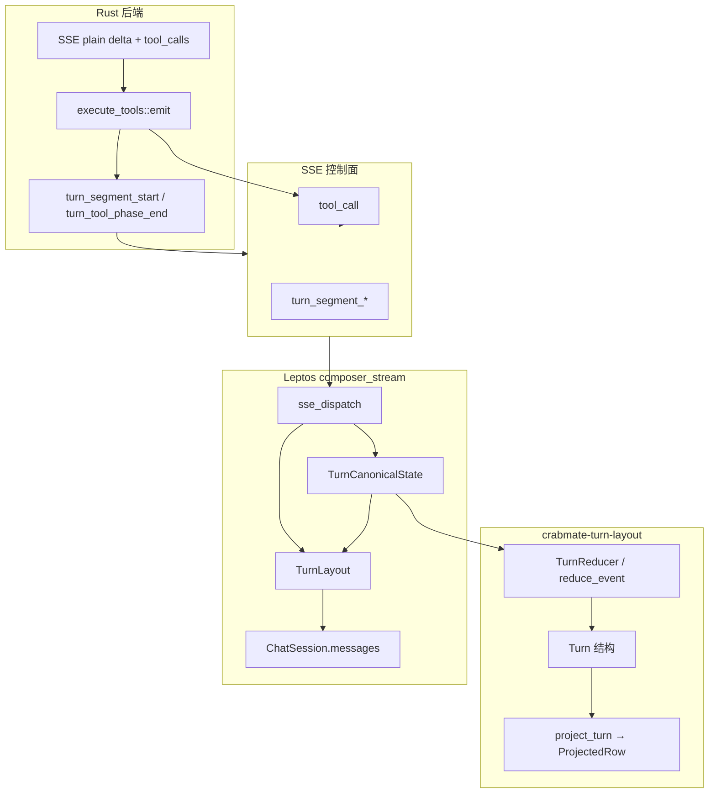

# Turn 布局：单轮工具回合的消息顺序设计

**状态**：Web 流式 **Phase 0–4** 已落地（见 §12）；**Phase 5（单一读路径）** 已落地（§12.8）；**Phase 6（消息块 → 气泡）** 已落地（§12.9）；**Phase 7 P0（写入收敛）** 已落地（§12.10）；旁注 loading↔commentary **I14 同帧原子移交**已落地（§12.10.1）；**Phase 7 P1（补丁层退役）** 已落地（§12.11）；~~**Phase 7 P2（per-tool 即时投影）**~~ 已退役（§12.12）；**Phase 8（块布局）** 已落地（§13）；**已知过渡债**见 **§15**；**Phase E**：**E1（终态序）已落地**（§16.5）；E2–E4 未落地。本仓同进程 TUI（曾用 `crabmate-turn-layout` / `project_turn_web_v2`）已于 **D2.2 硬删**；官方终端为 Client **`crabmate-tui`**（HTTP/SSE）。运维 CLI stdout 仍仅镜像控制面、未做完整 canonical 投影。  
**目标读者**：维护者；变更 **`turn_segment_*`**、Client [`frontend/src/app/chat/composer_stream/`](https://github.com/noisystreet/crabmate-client/tree/main/frontend/src/app/chat/composer_stream) 或 **`src/cm_turn_layout`**（`crabmate::cm_turn_layout`）前须读本文，并同步 **`docs/SSE协议.md`**、**`fixtures/turn_project_golden.jsonl`**、**`fixtures/sse_control_golden.jsonl`**。下文 **`frontend/src/...`** 均指 [crabmate-client](https://github.com/noisystreet/crabmate-client) 仓路径（本机测试命令假定同级 `../crabmate-client`）。

---

## 1. 背景：传输有序 ≠ 展示有序

`/chat/stream` 在 **TCP/SSE 层**按到达顺序下发事件，但 **语义顺序**由多轮 LLM 与工具编排决定，常见交错包括：

| 现象 | 示例 |
|------|------|
| 工具前旁注晚于 `tool_call` SSE | 模型已发出 `create_file` 控制面，plain delta「工作区是空的…」仍在路上 |
| 终局总结早于后续工具 | post-tool 尾泡被 finalize 后，同轮仍有 `tool_call` |
| 思维链/正文/工具控制面交织 | `reasoning_*`、plain delta、`tool_call`、`assistant_answer_phase` 混排 |

若前端仅按 **`messages.push` 顺序**或 **单一 loading 尾泡** 追加正文，导出与聊天气泡会出现「旁注在工具之后」「总结插在工具中间」等错位。

本设计用 **三层结构** 把「canonical 回合形状 → SSE 段边界 → UI `StoredMessage` 投影」拆开，便于单测与金样锁定。

---

## 2. 目标展示顺序（单轮含工具）

Web 单轮流式会话中，用户可见的 **`ChatSession.messages`** 目标顺序为：

```text
[时间线/意图等 system 旁注*]
[无旁注的工具*]                ← 可选
([已关闭 commentary] → [工具])* ← 每条旁注按 tool_call_id 稳定锚定（§13）
[post-tool loading 尾泡]       ← 仅流式进行中；终答写入或 finalize
[终局 assistant 答*]
```

**v2 不可变布局**（§13）为每个已有旁注的 `tool_call_id` 发布独立 assistant 行；发布后正文、ID 与相对顺序不可再改变。旧 `turn-batch-narration` 仅作为普通历史 assistant 行读取，不再参与流式布局判断。

**`TurnLayout`**（前端 imperative 状态机）负责 **尾泡 peel/restore、loading 插入位置、时间线插入**；  
**`crabmate-turn-layout`**（共享 crate）负责 **与到达顺序无关** 的 canonical 归约；  
**`TurnCanonicalState`**（前端 scratch）把 reducer 结果 **upsert** 为带 `tool_call_id` 锚点的 assistant 行。

---

## 3. 三层架构


```mermaid
flowchart TB
  subgraph backend [Rust 后端]
    LLM[SSE plain delta + tool_calls]
    Emit[execute_tools::emit]
    Seg[turn_segment_start / turn_tool_phase_end]
  end
  subgraph protocol [SSE 控制面]
    TC[tool_call]
    TS[turn_segment_*]
  end
  subgraph canonical [crabmate-turn-layout]
    Reducer[TurnReducer / reduce_event]
    Turn[Turn 结构]
    Proj[project_turn → ProjectedRow]
  end
  subgraph web [Leptos composer_stream]
    Dispatch[sse_dispatch]
    Canon[TurnCanonicalState]
    Layout[TurnLayout]
    Msg[ChatSession.messages]
  end
  LLM --> Emit
  Emit --> Seg
  Emit --> TC
  Seg --> protocol
  TC --> protocol
  protocol --> Dispatch
  Dispatch --> Canon
  Dispatch --> Layout
  Canon --> Reducer
  Reducer --> Turn
  Turn --> Proj
  Canon --> Layout
  Layout --> Msg
```

| 层 | 位置 | 职责 |
|----|------|------|
| **Canonical Turn** | `src/cm_turn_layout`（`protocol`） | `Turn` + `TurnEvent` reducer；`project_turn` 输出金样行类型 |
| **SSE 段边界** | `sse::protocol`（`turn_segment_start` / `turn_segment_end` / `turn_tool_phase_end`） | 在 `tool_call` 前声明锚点；工具批结束标记 |
| **Web 投影** | `frontend/.../composer_stream/` | `TurnLayout` 操作 `messages`；`TurnCanonicalState` 驱动旁注 upsert |

协议字段详见 **`docs/SSE协议.md`**（`before_tool_call_id`：本段展示在该 `tool_call_id` **之前**）。

---

## 4. 模块与文件索引

### 4.1 共享模块：`src/cm_turn_layout`

| 文件 | 内容 |
|------|------|
| `model.rs` | `Turn`、`ToolStep`、`TurnSegment`、`SegmentKind` |
| `event.rs` | `TurnEvent`（`SegmentStart/Delta/End`、`ToolCall`、`ToolPhaseEnd`） |
| `reduce.rs` | `reduce_event`：允许 **晚到 `SegmentDelta`** 挂到已关闭段或 `seg-before-{tool_call_id}` |
| `project.rs` | `project_turn` → `Vec<ProjectedRow>` |

**金样**：`fixtures/turn_project_golden.jsonl`（逐步 `project_turn`）、`fixtures/turn_project_web_golden.jsonl`（Web 事件形状 + v2 stored sync）
**测试**：`cargo test --lib golden_turn_project` · `golden_turn_project_web` · `cd ../crabmate-client/frontend && cargo test --lib golden_turn_web_stored_sync`

### 4.2 后端 emit

| 位置 | 行为 |
|------|------|
| `src/agent/agent_turn/execute/tools/emit.rs` | 每个 **`tool_call` SSE 之前** 发送 `turn_segment_start`（execute 阶段；流式段见 `crates/crabmate-llm` SSE 解析） |
| 同目录 `mod.rs` | 工具批结束发送 **`turn_tool_phase_end: true`**（在 `tool_running: false` 之前） |

TUI **`sse_mirror`**：工具 / `ThinkingTrace` / `TimelineLog` 等经 **`turn_project`** 或流式 scratch 承接，**不**写入 `[SSE 控制面]` 附录（见 **`docs/design/tui_align_tauri_display.md`** Phase 3）。附录**仅**保留错误，避免生成过程中刷出该标题。

### 4.3 前端 Web

| 路径 | 职责 |
|------|------|
| `composer_stream/callbacks/turn_layout.rs` | **`TurnLayout`**：demote、peel 过早总结、post-tool loading 尾泡、时间线 push |
| `composer_stream/turn_canonical.rs` | **`TurnCanonicalState`**：消费 `TurnSegmentStartInfo`；`try_apply_commentary_delta` |
| `composer_stream/stream_sse_scratch.rs` | 单 attach 内挂载 canonical turn + lane/FIFO |
| `composer_stream/callbacks/delta_apply.rs` | plain delta：工具相/尾泡 active 时 **优先** canonical 路由，避免写入错误尾泡 |
| `composer_stream/callbacks/builders/tool_callbacks.rs` | `on_tool_call` → `TurnLayout` + `on_turn_tool_call` + `sync_commentary_before_tool` |
| `composer_stream/callbacks/builders/turn_layout_callbacks.rs` | `turn_segment_*` / `turn_tool_phase_end` 回调 |
| `frontend/src/api/chat_stream/parser_v2.rs` | 控制面分支（与 **`crabmate-sse-protocol`** 同序） |

**`StreamModelOutputLane`**（`stream_turn_state.rs`）与 **`TurnLayout`** 分工：lane 决定 delta 写 reasoning 还是 answer；布局决定 **消息在列表中的位置**。

---

## 5. `TurnLayout` 状态机（方向 A）

单一入口，避免在 `timeline_tail` / `tool_callbacks` / `delta_apply` 中分散 peel 逻辑。

| 事件 | 方法 | 效果 |
|------|------|------|
| `parsing_tool_calls` / 即将执行工具 | `demote_answer_before_tools` | 已流出正文降级为旁注车道；overlay/stored 同步 |
| `tool_call` 占位 | `on_tool_call_declared` | peel 过早 finalize 的总结 → 插入工具 → 开 post-tool loading → restore 总结 → pin 尾泡 |
| `tool_result` 新建行 | `on_tool_result_inserted` | 缺占位新建工具行时的布局收口 |
| 时间线/意图 | `push_assistant_timeline` | 插在 loading 尾泡 **之前** |
| 多轮 `assistant_answer_phase` | `rotate_followup_model_round` | finalize → 新 loading 尾泡 |
| `final_response` | `remove_loading_placeholder_or_rotate` | 撤 loading 或轮换 |

**Pin 尾泡**：任意后续 push 后调用 `pin_loading_tail`，保证 post-tool `loading` 助手仍在列表末尾（流式写入目标）。

---

## 6. Canonical reducer 与晚到旁注

### 6.1 问题

`turn_segment_start` 在 **`tool_call` 之前**下发，但 plain delta **不带 `segment_id`**。工具 SSE 到达后 segment 常已 **关闭**，若只写入「仍 open 的段」，晚到 delta 会落入 **post-tool loading 尾泡**（位于工具 **之后**）。

### 6.2 策略

1. **`try_apply_commentary_delta`**（前端）  
   - 若有 **open** commentary 段 → `SegmentDelta` 写入该段。  
   - 否则取 **最近** `turn_segment` 的 `before_tool_call_id`，或 **首个仍缺** `before_commentary` 的 `ToolStep` → 以 `seg-before-{tool_call_id}` 调用 reducer（`reduce.rs` 支持该 id 直接 attach 到 step）。

2. **`commentary_before_tool`**（读路径）  
   合并 **`step.before_commentary`** 与 **segments 中同锚点未 flush 文本**，供 sync 即时反映流式增量。

3. **`TurnLayout::sync_commentary_before_tool`**  
   在对应 `tool_call_id` 的工具行 **之前** upsert assistant 行（`tool_call_id` 锚点；**普通** assistant，非 `CommentaryBeforeTools` 隐藏态，以便导出可见）。

4. **`delta_apply`**  
   当 `post_tool_stream_tail_active` 或 lane 为 `Reasoning` / `AnsweringCommentaryBeforeTools` 时，**优先**尝试 canonical 路由并 `sync_all_turn_commentary`，成功则 **不再** `append_assistant_chunk` 到尾泡。

### 6.3 Reducer 金样场景

| 金样 id | 断言 |
|---------|------|
| `commentary_before_create_file` | 旁注 → create 工具 → 终答 |
| `late_commentary_delta_after_tool_call` | `tool_call` 先于 `SegmentDelta` 仍挂到 create 前 |

---

## 7. SSE 事件（摘要）

完整表格见 **`docs/SSE协议.md`**。

| 键 | 发送时机 | Web |
|----|----------|-----|
| `turn_segment_start` | 每个 `tool_call` 摘要 **之前** | `on_turn_segment_start` → reducer |
| `turn_segment_end` | （可选）关闭段 | `on_turn_segment_end` → sync |
| `turn_tool_phase_end` | 工具批结束 | `on_turn_tool_phase_end` |
| `tool_call` | 工具占位 | `TurnLayout::on_tool_call_declared` |
| plain delta | LLM 流 | `try_apply_commentary_delta` 或 lane 写入 |

分类金样：**`fixtures/sse_ag_ui_golden.jsonl`**；`cd ../crabmate-client/frontend && cargo test golden_ag_ui_v2_parser_matches_expected`。

---

## 8. 测试与回归

| 命令 | 覆盖 |
|------|------|
| `cargo test -p crabmate-turn-layout` | reducer + `golden_turn_project` + `golden_turn_project_web` |
| `cd ../crabmate-client/frontend && cargo test --lib golden_turn_web_stored_sync` | `project_turn_web_v2` 逐旁注不可变落盘 |
| `cd ../crabmate-client/frontend && cargo test golden_ag_ui_v2_parser_matches_expected` | AG-UI 控制面分类 |
| `cd ../crabmate-client/frontend && cargo test --lib turn_layout` | peel/尾泡单测 |
| `cd ../crabmate-client/frontend && cargo test --lib turn_canonical` | 晚到 delta attach |

**手动**：`trunk build` 后重启 `serve`，跑含多工具（read_dir → create → cmake）的任务，导出 Markdown 核对旁注是否在对应工具 **之前**。

---

## 9. 非目标与已知边界

- **终端 TUI** 已将本轮 `Turn` 经 `project_turn_web_v2` 投影到中区 `[Turn 投影]`（`turn_project.rs`）；历史消息仍按 `Message[]` 序；**CLI** 尚未将 `Turn` 投影到 stdout transcript。金样：`cargo test --lib golden_web_v2_row_order_preserved_in_tui_projection_block`（复用 `fixtures/turn_project_golden.jsonl`）。
- **服务端 `Message` 列表**顺序仍按 OpenAI 工具协议；本设计主要修正 **Web `StoredMessage` 展示/导出** 与终端 TUI 本轮投影。
- **`CommentaryBeforeTools` 状态**仍用于 demote 路径的部分旁注；canonical sync 使用 **可见 assistant + `tool_call_id` 锚点**；读侧经 `is_ephemeral_timeline_assistant_for_chat_ui` 对主列与导出一并跳过。
- **多 create 工具共享一段旁注**时， reducer 默认挂到 **首个仍空** `before_commentary` 的 step；更细粒度需模型或后端显式多段 `turn_segment_start`。
- **Phase 0 未覆盖的错位形态**（导出样例、`chat_export_*` 手测）见 **§12**；勿将「仅 reducer 金样通过」等同于「多工具长回合 UI/导出已正确」。

---

## 10. 变更检查清单

- [ ] 新增/修改 **`turn_segment_*`** → `sse/protocol.rs`、`emit.rs`、`docs/SSE协议.md`、中英文 SSE 文档、`sse_ag_ui_golden.jsonl`、`parser_v2.rs`（必要时 `control_classify.rs` / `sse_control_golden.jsonl`）
- [ ] 修改 reducer / Web 投影语义 → `fixtures/turn_project_golden.jsonl` 与/或 `fixtures/turn_project_web_golden.jsonl` + `cargo test -p crabmate-turn-layout golden_turn_project` / `golden_turn_project_web` + `cd ../crabmate-client/frontend && cargo test --lib golden_turn_web_stored_sync`
- [ ] 修改 **`TurnLayout` 分支顺序** → `turn_layout.rs` 单测 + 导出场景手测
- [ ] 修改 plain delta 路由 → `delta_apply.rs` + `turn_canonical` 单测
- [ ] 实现 §12 某 Phase → 同步本节金样 + 手测导出场景

---

## 11. 相关文档

- **`docs/SSE协议.md`** — 控制面字段与前端处理列  
- **`docs/frontend/ARCHITECTURE.md`** — `composer_stream` 分层与 `wire_*`  
- **`docs/开发文档.md`** — Web 流式概要  
- **`docs/design/tui_align_tauri_display.md`** — 终端 TUI 对齐 Tauri/Web 展示规划（历史投影、终答、控制面收敛等）  
- **`.cursor/rules/api-sse-chat-protocol.mdc`** — 协议双端同步规则

---

## 12. 已知缺口与细化方案（Phase 0–3）

§6 主要解决 **「旁注 delta 晚于 `tool_call` SSE」**（错位在工具 **之后**）。§12 记录三类错位形态及分阶段收口；**Phase 1–3 已实现**（2026-07 手测仍建议跑 C++/HPCG 导出回归）。

### 12.1 三种错位形态

| 形态 | 导出表现 | 典型根因 | Phase 0 覆盖 |
|------|----------|----------|--------------|
| **A. 晚到旁注** | 旁注出现在对应工具 **之后** | plain delta 在 segment 关闭后写入 post-tool 尾泡；`try_apply` 无锚点时仍 `append` | 部分（reducer + sync；锚点失败时仍漏） |
| **B. 整段聚合** | 多步旁注 + 部分总结挤在 **第一个工具之前一条** 气泡里；工具块整段在后 | LLM **先**流式整段 narration **再**出 `tool_calls`；`parsing_tool_calls` demote 后第一次 `tool_call` **peel 被跳过**（`post_tool_stream_tail_active == false`）；`turn_segment_start` 仅在 **execute** 发出，晚于全部 delta | **未覆盖** |
| **C. 终答重复** | 聚合块末尾与流结束后的终答 **同文两段** | post-tool 尾泡 finalize 未与已 peel/sync 的总结去重 | **未覆盖** |

形态 B 不是 Markdown 导出「合并章节」，而是 **`messages` 里本就只有一条超长 assistant**（例：`chat_export_*` 中「编译 hpcg」一轮：L55 巨块 → L75 起连续工具 → L298 重复总结）。

### 12.2 事件时间线：设计假设 vs 现状

**设计隐含假设**（§3 图）：plain delta 与 `turn_segment_start` / `tool_call` **交错**到达，reducer 按锚点归并。

**现状时间线**（单轮多工具常见）：

```text
LLM 流式：  [plain delta × N ────────────────────────][finish + tool_calls JSON]
前端：      全部 delta → 单一 loading 尾泡（或 demote 后一条旁注）
execute：   [seg-start₁][tool_call₁][result₁][seg-start₂][tool_call₂]…
            ↑ segment 与 tool_call_id 此时才可用，无法拆分已写入的 N 段 delta
```

因此 **仅在前端/reducer 上 patch** 无法把已合并的长文本自动拆成「每工具一条」；必须在 **时间线** 或 **布局状态机** 上补约束。

### 12.3 细化目标（Invariants）

单轮含工具时，维护者验收应满足：

1. **I1 旁注锚定工具前**：每个非空 `ToolStep.before_commentary` 投影为独立 assistant 行，稳定 id `turn-commentary-{tool_call_id}`，位于对应工具之前；同 key **允许 upsert 正文与纠错序搬回工具前**；**禁止**第二行与跨 key 合并（§13、Phase D `TurnProjection`）。
2. **I2 尾泡职责单一**：post-tool loading 尾泡 **仅**承接 `tool_phase` 结束后的终答增量；工具相旁注 **不得**在 `try_apply` 失败时静默 `append` 到尾泡（见 §12.4 P1）。
3. **I3 首次工具边界**：第一次 `tool_call` 与后续工具 **同一套** peel/切段规则（不得因 `post_tool_stream_tail_active == false` 跳过 peel，导致 demote 整泡留在工具区之前）。
4. **I4 终答唯一**：finalize 时若尾泡正文与已存在的终局 assistant **前缀/哈希**重复，去重或删空尾泡（形态 C）。
5. **I5 段唯一 open**：同一时刻 reducer 至多一个 open commentary segment；新 `segment_start` 须 **先** `segment_end` 上一段（后端 emit 或 reducer 自动 close）。

### 12.4 分阶段实现

| Phase | 范围 | 动作 | 主要触点 |
|-------|------|------|----------|
| **0（已落地）** | 晚到旁注 | reducer 晚到 attach、`sync_turn_projection`、`delta_apply` 优先 canonical | `reduce.rs`、`turn_canonical.rs`、`delta_apply.rs` |
| **1（已落地）** | 形态 A 漏网 + I2 | canonical 车道 **不再** fallback `append`；demote 迁入 pending；首次 `tool_call` peel 去掉 `post_tool` 门控 | `delta_apply.rs`、`turn_layout.rs` |
| **1（已落地）** | 形态 B 首次 peel | `ingest_pre_tool_commentary` + `pending-stream-commentary` 段 | `turn_canonical.rs`、`reduce.rs` |
| **2（已落地）** | 段边界时机 I5 | LLM 流内解析 `tool_call.id` 时 emit `turn_segment_start/end`；reducer `SegmentStart` 关闭其它 open 段 | `crates/crabmate-llm/.../sse_parser.rs`、`stream_host.rs`、`reduce.rs` |
| **2（已落地）** | 形态 B 投影 | `sync_turn_projection` 按 **`project_turn`** 行序 upsert | `turn_layout.rs`、`project.rs` |
| **3（已落地，P1 退役）** | 形态 C I4 | ~~`dedupe_redundant_loading_tail` 于 `on_done`~~ → P1 删除 | 曾：`turn_layout.rs`、`stream_end.rs` |
| **3（已落地）** | 金样 | `pre_tool_bulk_deltas_pending_stream`、`multi_tool_interleaved_segments` | `fixtures/turn_project_golden.jsonl` |
| **4（已落地）** | **收敛写入 I6–I8** | plain delta / `final_response` 仅经 canonical 投影写正文；`final_response` 不 push 新泡；overlay 与投影互斥 | `delta_apply.rs`、`timeline_dispatch.rs`、`turn_layout.rs`、`stream_text_overlay.rs` |
| **5（已落地）** | **单一读路径** | 导出与 TUI 共用 ephemeral / 空壳过滤（P1 起无 assistant fuzzy dedupe） | `visible_messages.rs`、`session_export.rs`、`tui_transcript_sync.rs` |

**不建议** 用纯文本启发式（按「现在」「接下来」分句）拆分已聚合长泡；优先 **SSE 段边界前移** + **布局状态机**。

### 12.7 收敛写入（Phase 4）

**目标**：`StoredMessage` 助手正文 **仅** 由 `TurnReducer` + `project_turn` + `sync_turn_projection` 写入；`TurnLayout` **只改形状**（工具行/loading 位置/peel/pin）；`StreamTextOverlay` **不**与投影并行持有同段正文。

| Invariant | 规则 |
|-----------|------|
| **I6 旁注/终答单写** | plain `on_delta`：commentary 车道 → `try_apply_commentary_delta` + sync；post-tool / 无工具正文相 → `try_apply_answer_state_transition`（仅状态转换）+ `stream_overlay_append` 写 overlay；**禁止** sync 成功后再 `append_assistant_chunk` 写 answer |
| **I7 final_response 不增行** | `timeline_log` `kind=final_response` → `try_ingest_final_response_text` + sync + finalize loading；**不** `push_assistant_timeline_bubble` / `final_response_snapshot` 新行 |
| **I8 overlay 从属** | 每次 `sync_turn_projection` 后对该 loading id 执行 `stream_overlay_clear_answer_for_message`；`on_done` merge 幂等 |

**多工具 `tool_call` 追加写入**：`demote_answer_before_tools` **仅**在首个 `tool_call` 前（`!post_tool_stream_tail_active`）把尾泡迁入 pending 旁注；post-tool 阶段勿再把终答正文 `ingest_pre_tool_commentary`。同次 `on_tool_call_declared` 不再二次 ingest（`demote` 已做）。

**仍走 overlay（非 assistant 正文真源）**：纯 reasoning 车道（非 commentary canonical 路径）的思维链增量。

**仍独立 push 的时间线**：审批 / 工具摘要等 `timeline_log` 旁注按 kind 分发（Web 对 `orchestration_route` 等不造气泡）。

### 12.8 单一读路径（Phase 5）

**目标**：主列 TUI 与 JSON/Markdown 导出 **不再** 各自维护 skip + fuzzy dedupe；读侧统一经 `frontend/src/visible_messages.rs`（与 `timeline_scan` 的 ephemeral 谓词）。

| API | 说明 |
|-----|------|
| `is_ephemeral_timeline_assistant_for_chat_ui` | 主列噪声：`final_response_snapshot`、编排路由、`CommentaryBeforeTools`、规划拒绝旁注、与正式助手重复的本地 snapshot |
| `is_ephemeral_timeline_assistant_for_export` | **包含**上表，另藏规划轮 `agent_reply_plan` JSON 与工具参数残留启发式 |
| `visible_message_indices_for_export(messages)` | 经 export ephemeral + 空助手壳；**不**对 assistant 正文 fuzzy dedupe（Phase 7 P1） |
| `tui_should_render_message(m, messages, session_id, overlay)` | 经 **chat_ui** ephemeral；空助手壳仅在有 stream overlay 正文时挂载（规划轮仍可在主列展示） |

**消费方**：

- `session_export::stored_messages_to_export` — 仅格式转换，可见下标来自 `visible_message_indices_for_export`
- `tui_transcript_sync::{build_tui_transcript_html,plan_tui_sync}` — 经 `tui_should_render_message` 跳过主列噪声 / 空壳；首 token / overlay 有文后再 append

**E2E（Victauri）**：`victauri_visible_messages.rs`（snapshot / ephemeral 隐藏）；`victauri_turn_layout.rs`（块布局：说明块在工具组前、segment_end 早于 tool_call）。

### 12.9 消息块 → 气泡（Phase 6）

**目标**：多工具轮次中，每段工具前旁注与终答各占 **一块** assistant 行；UI 按 `messages` 顺序渲染，loading 尾泡 **仅** 承载当前 open commentary 段流式增量，不再把 post-tool narration 累积进单一终答泡。

| 机制 | 说明 |
|------|------|
| `project_turn` | 已 flush 的 `before_commentary` → `assistant_commentary` 行；终答由 overlay 承载，`flush_final_answer_row` 从 overlay 读取 |
| post-tool + `tool_phase_open` | plain delta → `CommentaryDelta`（`delta_apply`），**不**进终答 |
| `sync_turn_projection` | 工具批进行中：跳过 `assistant_answer`；尾泡 = `streaming_commentary_block_text()` |
| `turn_segment_start` | 段一开即 sync，占位/更新当前块 |
| `apply_answer_body_delta` fallback | canonical 拒答时 **禁止** `append_assistant_chunk` 累积尾泡（I6 补全） |

### 12.10 写入收敛（Phase 7 P0 / P0′）

**目标**：assistant 正文真值 = `TurnReducer`（canonical）；**禁止** canonical miss 时按 chunk `append_assistant_chunk` 正文。

**P0′（preview / commit 分离，2026-07）**：

| 阶段 | 写入 | 展示 |
|------|------|------|
| open 段 / 流式终答 delta | `sync_stream_preview` → **`stream_overlay_replace_answer_for_message`**（**不** `sessions.update`） | `loading` 且 `stored.text` 空 → 读 overlay |
| 段/工具边界 | `sync_turn_projection` → flush 旁注 **完整行**到 stored；`pin`；清 overlay answer | stored 行 + 空 loading 壳 |
| 流结束 / finalize | sync 刷终答行 → `drain` 从 overlay（或残留 loading）补 `turn-final-answer` → **清** overlay 与 loading 正文（**不** take 进壳升格） | stored 终答行 + 空 loading 句柄 |

| 机制 | 说明 |
|------|------|
| `delta_apply` | canonical miss → **no-op**（勿 chunk append 正文）；命中 → `sync_stream_preview` |
| `stream_text_overlay` 展示 | `loading` 且 `stored.text` **非空** → 只读 stored（边界已落盘）；**空** → 读 overlay preview |
| `sync_turn_projection` | **仅** flush 旁注行 + relocate；**不**把 open 段 preview 写入 loading `stored.text` |
| `demote_answer_before_tools` | peel + canonical ingest；**暂不清** overlay（旁注未 flush） |
| `sync_turn_projection`（I14） | flush 旁注/终答后 **同帧** `clear_loading_tail_text_if_persisted_owns`（同文定稿行）；已移交则清 overlay |
| `release_loading_after_tool_projection` | 幂等补清 overlay（定稿行已持有同文时） |
| `finalize_loading_row_at` | 若正文与已有定稿助手行（旁注 / 终答 / 普通）完全相同 → 删空壳，禁止升格双写 |
| `should_allow_final_answer_flush` | **仅** 形态 B 终答门 **或** `on_done` 的 `projecting_stream_end`；**禁止**因「已有工具行」放行 |
| post-tool 工具边界 | 新 loading **空壳**；preview 仅 overlay |

### 12.10.1 旁注所有权：设计张力与 I14 原子移交

**问题本质**不是「缺一次 fuzzy dedupe」，而是 **展示所有者**（loading / overlay）与 **持久化所有者**（`turn-commentary-*` / `turn-final-answer`）若分帧双持有，会落入双写或零写。

| 约束 | 来源 | 要求 |
|------|------|------|
| **I6 / I8 / I11** | Phase 4–9 写入收敛 | 旁注真源 = canonical → `turn-commentary-*`；overlay / loading **从属** |
| **反闪空** | 工具相正文闪空回归 | `demote` 瞬间 **不得** 在 commentary 尚未落盘前掏空同 mid 的 live 正文 |

| 失败模式 | 典型路径 |
|----------|----------|
| **双写（首工具前）** | demote keep-ui → flush commentary → loading 仍握同文 → `finalize` 升格第二条 |
| **双写（中间过程）** | 首工具后 `allow_final_answer` 因「已有工具」过宽 → `segment_end` 把旁白写入 `turn-final-answer` → 随后 demote 再 flush `turn-commentary-*` → 导出成对（`chat_export_20260729_210001.md`）；重载后服务端快照无双写（`210740.md`） |
| **零写** | 见「任意 commentary 已存在」就清 loading → 多轮时误清本轮尚未 flush 的旁白 |

**落地（I14 + 终答门收紧）**：

1. `demote_answer_before_tools`：`drain(..., clear_loading_ui=false)`，**仅**在工具行尚未插入、commentary 尚未 flush 的窗口内 keep-ui。
2. `sync_turn_projection` 的 **同一次** `update_bound_session` 内：`sync_web_projection` → `loading_handoff::clear_loading_tail_text_if_persisted_owns`（同文定稿行）→ 若已移交则清 overlay。
3. `should_allow_final_answer_flush`：仅 `post_tool_final_answer_open` 或 `projecting_stream_end`（`on_done` 窗口）；中间多步旁白不得进 `turn-final-answer`。
4. `release_loading_after_tool_projection`：幂等补清 overlay。
5. `finalize_loading_row_at`：同文已在定稿助手行则删空壳，禁止升格。

不变量：`LiveOwnsPreview` →（同帧 flush 成功且同文）→ `PersistedOwnsText`（loading 不得再持有该段持久化正文）。**勿**恢复读侧 assistant fuzzy dedupe（Phase 7 P1）。

**复现**：真实 LLM 多工具回合（如 C++/CMake）；流式结束后、重载前导出 Markdown，中间旁白成对。重载后再导出应变正常（服务端无双写）。e2e：`mock-mid-process-commentary-duplicate.spec.ts`（防回归）；单测：`allow_final_answer_flush_requires_gate_or_stream_end`、`finalize_loading_drops_text_already_on_final_answer_row`。

**回归**：`e2e/specs/mock-commentary-no-duplicate.spec.ts`；`mock-mid-process-commentary-duplicate.spec.ts`；`loading_handoff` 单测；`finalize_loading_drops_text_already_on_commentary_row`。

### 12.11 补丁层退役（Phase 7 P1）

**目标**：写入收敛（P0）后删除读/写两侧的 fuzzy 补丁；旁注位置仅由 `project_turn` + `sync_commentary_before_tool` 保证。

| 已删除 | 原用途 |
|--------|--------|
| `repair_commentary_rows_before_tools` / `relocate_misplaced_commentary_rows` | sync 后补行 / 删 stray 旁注 |
| `dedupe_redundant_loading_tail` / `remove_redundant_loading_tail_at` | on_done 删与前行重复的 loading 壳 |
| `dedupe_assistant_duplicates_in_messages`（on_done） | 流结束全表 assistant fuzzy dedupe |
| `visible_messages` assistant fuzzy dedupe | 读侧去重；legacy 会话若存 duplicate 行则均展示 |

**仍保留**：`final_response_snapshot` 重复隐藏、ephemeral/orchestration scope 过滤；`message_dedupe` 模块供 snapshot 判定与单元测试。

### 12.12 工具边界即时投影（Phase 7 P2，已退役）

> **退役原因**：per-tool flush（`commentary-before-{tool_call_id}` + `pin_commentary_rows_before_anchored_tools`）导致列表重排闪烁，且与 Cursor/OpenAI 默认「一条说明 + 工具组」形态不一致。由 **§13 块布局** 取代。

| 原机制 | 说明 |
|------|------|
| peel → canonical | `ingest_commentary_for_tool_from_peel`（已改为一律 `ingest_pending_stream_commentary`） |
| sync | `flush_complete_commentary_rows` + `relocate_stray` |
| 稳定 id | `commentary-before-{tool_call_id}` |

### 12.5 `TurnLayout` 与 `TurnReducer` 职责再划分

| 职责 | 归属 | 说明 |
|------|------|------|
| 晚到 / 按锚点归并旁注文本 | **Reducer** | 与到达顺序无关的 canonical 真值 |
| 尾泡 peel/restore/pin、工具 push 位置 | **TurnLayout** | 列表 imperative 操作；Phase 1 修正「首次 tool_call peel 门控」 |
| plain delta 路由决策 | **`delta_apply`** | Phase 1：canonical 车道 miss 时不写尾泡；Phase 4：**I6** 收敛写入 |
| `final_response` 时间线 | **`timeline_dispatch`** | Phase 4：**I7** 仅 ingest + sync + finalize |
| 段 open/close 生命周期 | **后端 emit + reducer** | Phase 2：避免多 open 段导致 `.find(first open)` 永远写最早段 |
| 终答去重 | **写入收敛（P0–P1）** | 不再 on_done / 读侧 fuzzy dedupe；依赖 canonical replace |

### 12.6 手测回归场景（细化后必跑）

| 场景 | 期望 |
|------|------|
| C++/CMake（read → create ×2 → cmake ×2 → run） | 每条已关闭旁注稳定显示在对应工具前；无空「工具：create_file」占位 |
| 目录分析 → 用户追问「编译 hpcg」 | 第二轮旁注不聚合回旧气泡；终答保持独立 |
| 晚到 delta（金样 `late_commentary_delta_after_tool_call`） | reducer 仍挂到正确锚点；v2 投影按工具键发布；e2e：`mock-late-commentary.spec.ts` |

---

## 13. 不可变逐旁注布局（v2）

**目标**：active/loading 行可流式增长；旁注以稳定 `turn-commentary-{tool_call_id}` 落在锚定工具**之前**。晚到 open 旁注可 upsert 正文；若误落在工具后须搬回工具前（不得长期挂在 loading 尾泡）。

| 机制 | 说明 |
|------|------|
| canonical | reducer 继续按 `before_tool_call_id` 归并；Web sync 消费 [`project_turn_web_v2`](../../src/cm_turn_layout/project.rs) |
| 落盘 | `TurnRowQueue::upsert_commentary_before_tool` / `upsert_streaming_anchored_commentary`：按 `tool_call_id` upsert `turn-commentary-*`；工具未到时暂挂 loading 前，到达后锚定工具前 |
| 流式 | 带 `before_tool_call_id` 的 open 旁白**不**写 loading overlay；无锚点的短暂段仍可走 overlay。锚定旁白在**工具尚未声明**时即落盘（见 §14 I15） |
| peel | 工具边界 peel 正文一律 `ingest_pending_stream_commentary`（不再 per-tool peel ingest） |
| 可见性 | commentary 为普通 assistant 行；overlay 只从属于唯一 active 行 |
| E2E | `mock-commentary-before-tool-order.spec.ts`（含晚到）；`mock-ready-bubble-stability.spec.ts` |

### 13.1 落盘位置（`project_turn_web_v2` → `StoredMessage`）

**生产投影**：[`project_turn_web_v2`](../../src/cm_turn_layout/project.rs)。Web 已移除 v1 batch 特判；模块级 [`project_turn_web`](../../src/cm_turn_layout/project.rs) 与 replay 输出暂留到发布观察窗口结束。

Web `sync_turn_projection` / `sync_stream_preview` 以 `tool_call_id` 稳定消息 ID upsert 到对应工具之前；同 ID 可更新正文，错序时重排到工具前。

**行序示例（HPCG）**：

```text
project_turn_web_v2: [tool: archive] → [commentary @ unpack] → [tool: unpack] → …
messages:            同上（旁注行 id 为 turn-commentary-{tool_call_id}）
```

**仍保留**：`demote_answer_before_tools`、post-tool loading peel/pin、`TurnReducer` 金样（`fixtures/turn_project_golden.jsonl` 仍可按 step 锚点断言 canonical，与 UI 投影可分叉）。

### 13.2 Hydration 与缓存版本

- `ChatSession.layout_schema_version`：旧缓存缺字段按 v1 读取；新建会话及流式投影写 v2。
- 加载缓存时，`turn-commentary-*` / `turn-final-answer` 稳定 key 可将未带版本字段的早期 v2 缓存识别为 v2。
- 流结束边界立即发起 best-effort `keepalive` 会话快照 PUT，覆盖常规大小会话“状态就绪后马上刷新”；常规 400ms 防抖写盘继续作为兜底。
- 非空 v2 finalized 投影是浏览器展示快照；服务端 revision 相同或仅覆盖已有回合时不进入 assistant/tool pool 启发式重排。若较新 revision 含更多 user 回合，则保留本地 v2 行不变，并从首个服务端独有 user 起追加 canonical 后缀，避免另一浏览器新增的回合被本地快照遮蔽。
- 本地缓存为空或只有 v1 行时，`GET /conversation/messages` 在响应**无** `layout`（或缺 segment 键）时继续走 v1 legacy adapter；旧会话无需迁移。响应已可带可选 **`layout`**（B2 expand）；**生产保存路径尚未写入**该列。

---

## 14. 写入收敛（Phase 9）

**目标**：finalized commentary / 终答 / 工具占位经 `TurnReducer` → `project_turn_projection` → [`projection_reconciler`] 落盘；`TurnLayout` 只维护 scratch、overlay 与 active/loading 句柄。

| Invariant | 规则 |
|-----------|------|
| **I9 唯一落盘** | `reconcile_web_projection` = commentary upsert-before-tool + final upsert；工具占位经 `insert_declared_tool` |
| **I10 边界 commit** | 每个 `tool_call` 前 `drain_loading_commentary_to_canonical`（overlay/stored → canonical **仅**） |
| **I11 overlay 从属** | preview 仅 open 段 / 未落盘终答增量；已 flush 行与 overlay 互斥 |
| **I12 on_done** | 投影优先：`sync` 后 `drain` 仅补 `turn-final-answer` 并清空 overlay / loading 正文；**禁止** merge overlay 进 loading 再升格 |
| **I13 open 段关段** | `ToolPhaseEnd` / `on_done` 前关闭 open 旁注，并按工具键发布 |
| **I14 旁注所有权单写** | `sync_turn_projection` 同一次 `update_bound_session` 内：flush `turn-commentary-*` 后按同文清空 loading `text`，并清 overlay。见 **§12.10.1**、`loading_handoff.rs` |
| **I15 旁注可见性不等工具** | 旁注一旦离开 overlay 进入 canonical，须**当帧**有可见落点：`project_turn_web_v2` 只从 `ToolStep` 出行，故 **pending 段必须尽早取得锚点**——`turn_segment_start{beforeToolCallId}` 吸收 pending（`reduce_segment_start`），`tool_result` 无 START 时补登记工具步（`on_tool_result_inserted`），且 `try_upsert_open_anchored_commentary` **不**以 `tool_phase_open` 为前提 |
| **I16 旁注键仅本回合唯一** | `turn-commentary-{tool_call_id}` 的 upsert 与工具行查找一律限定在**最后一条 user 行之后**；模型跨回合复用同一 `tool_call_id` 时，上一回合的同键行改名为 `…#prev{n}` 让出规范键（仿 `detach_final_answer_projection`，仍保留 `turn-commentary-` 前缀，故 `is_commentary_row_id` 与 v2 缓存识别不变）。见 `turn_row_queue::archive_stale_commentary_rows`、`mock-v2-multi-turn-boundaries.spec.ts` |

**顺序（`tool_call`）**：`demote`（keep-ui）→ `on_turn_tool_call`（canonical）→ `on_tool_call_declared`（布局）→ `sync_turn_projection` → `release_loading_after_tool_projection`（同文移交）→ `sync_stream_preview`。

**I15 的两条真实回归**（`real-llm-tool-bubble-vanish` 派生，见 `e2e/specs/mock-real-tool-bubble-vanish.spec.ts`）：真实 SSE 在 `parsing_tool_calls` 后**先**发 `turn_segment_start{beforeToolCallId}`、数百毫秒后才发 `TOOL_CALL_START`；而 `reset_loading_tail_streaming_text` 在段开始时已清 overlay。若 pending 段此刻仍无锚点，助手气泡会整段消失直到工具到达。`TOOL_CALL_RESULT` 未经 START 到达时同理（`drain(clear=true)` 已掏空 overlay，canonical 却无该工具步）。

**`on_done`**：关 open 段 → `sync_turn_projection` → `drain_stream_tail_into_canonical_for_done`（补终答 + 清 loading 句柄）→ tail 决策。

**测试**：`project_turn_web_v2_keeps_closed_commentary_rows_stable` · `golden_turn_web_stored_sync` · `mock-ready-bubble-stability.spec.ts` · `mock-storage-consistency.spec.ts` · `mock-streaming-overlap.spec.ts` · `mock-commentary-no-duplicate.spec.ts` · `finalize_loading_drops_text_already_on_commentary_row`。

---

## 15. 已知过渡债（收敛中）

v2 逐旁注与 `layout_schema_version=2` 已落地；**Phase A–D** 与正文所有权收口 / `TurnProjection` 金样已合入主线（PR [#723](https://github.com/noisystreet/CrabMate/pull/723)、[#724](https://github.com/noisystreet/CrabMate/pull/724)）。主路径：`TurnReducer` → `project_turn_projection` → `projection_reconciler` → `StoredMessage`；`TurnLayout` 管 scratch / overlay / loading 句柄。

| 债 | 表现 | 状态 |
|----|------|------|
| 三真源 | overlay / loading.text / `turn-commentary-*` 可同文 | **已收窄**：`text_ownership`；handoff 仅兼容非空 `loading.text`；overlay ≡ active 收口不计 handoff |
| 尾泡决定视觉序 | pin loading 到工具后 → 晚到旁白曾错位 | **已收敛**：顺序只认 `before_tool_call_id` + reconciler |
| 读路径曾分叉 | 旧气泡列 / 导出 / TUI 过滤不一致 | **已对齐**：主列与导出共用 `is_ephemeral_timeline_assistant_for_chat_ui`；导出另叠 export-only 启发式；TUI 空壳允许 overlay；禁止新入口绕过 |
| I1 演进 | 原「insert-once 不可移」→ 同 key upsert / 纠错序 | **已定稿**（§12 I1 / Phase D） |
| 投影类型曾隐式 | reconciler 散落在 `TurnLayout` | **已显式**：`project_turn_projection` + `projection_reconciler` |

**残余 backlog**（正式规范以本节与 **§16** 为准）：

| 项 | 说明 |
|----|------|
| 真实 LLM 冒烟 | 流中空壳 / 相邻同文 / 旁白在工具前；见 `e2e/specs/real-llm-bubble-layout.spec.ts` |
| 削薄 `TurnLayout` | rotate / peel / demote / on_done 的**消息列表**操作已收进 `projection_reconciler`；`TurnLayout` 保留 scratch / overlay / lane 编排。继续：更多编排入口可再下沉 |
| 旁白路径 ideal `handoff=0` | 兼容路径可留；主路径应接近零 `commentary_handoff` |
| Phase E | 终态协议与 hydration；见 **§16** |

历史 Phase A–D 实施草案已删除；正式规范与残余 backlog **仅以本节、§12 与 §16 为准**（勿再恢复「finalized 禁止改文」类过时 I1）。

**回归基线（流中采样，勿只验就绪后）**：

- `e2e/specs/mock-mid-process-commentary-duplicate.spec.ts`
- `e2e/specs/mock-commentary-before-tool-order.spec.ts`
- `e2e/specs/mock-empty-assistant-shell.spec.ts`
- 金样：`fixtures/turn_project_projection_golden.jsonl`（`cargo test --lib golden_turn_project_projection`）

**Debug 观测**（仅 debug 构建）：`layout_debug_counters` 累计 `empty_shell_skip` / `commentary_handoff`，控制台 `[layout_debug]`。

---

## 16. Phase E：终态协议与 hydration（E1 已落地；E2–E4 进行中）

> 自原草稿吸收；改协议时同步 **`docs/SSE协议.md`**（AG-UI 附录）与金样。切片跟踪以 **`docs/待办清单.md`**「兼容层收缩」为准（B1=E1 已完成）。

### 16.1 现状

- **服务端（E1）**：成功路径为 `stream_draining` → 落盘 → `conversation_saved` →（可选 `STATE_SNAPSHOT`）→ **最后** `RUN_FINISHED`；冲突时先业务错误再由 worker 发 `RUN_FINISHED`(conflict)。软能力 `sse_capabilities.terminal_order=saved_before_finished`。
- **前端（双序）**：`RUN_FINISHED` 进入 Draining，**延迟 `on_done`**，继续读 body；亦接受旧序（终态后再来 `conversation_saved`）；`stream_draining` 经专用 `on_stream_draining` 提前进入 Draining 文案，**不**清 abort/resume、**不**写终态 reason、不置 `saw_stream_ended`（见 `frontend/src/api/chat_stream/sse_frame.rs`）。
- hydration：same-revision 守卫仍保留（E4 前不删）。`GET /conversation/messages` 已可省略或携带可选 **`layout`**（契约 expand）；当前回合保存**不**写该元数据，故线上仍走 legacy。
- Web 块布局（Phase 8/9）与服务端持久化的 OpenAI 兼容 `Message[]` **仍非同一种结构**；流式路径已用 `crabmate-turn-layout` + `layout_schema_version=2`，hydration / 冷启动尚未完全同一投影键权威。

长期方向：**不再堆 merge / dedupe / sleep**，而是统一终态顺序、canonical 事实来源与确定性投影。

### 16.2 目标与非目标

**目标**

1. `RUN_FINISHED` / `RUN_ERROR` 成为**最后一个**业务 SSE 事件。
2. 流式显示、落盘、重载 hydration、冷启动得到**相同**可见消息布局。
3. 服务端 canonical 为事实来源；Web 行为是确定性投影，不靠本地到达顺序猜测。
4. 旧前端 / 旧服务端短期共存，可安全回滚。
5. 空助手行、重复终答、丢失 revision、重复 `on_done` 有自动化门禁。

**非目标**

- 不要求严格「助手—工具」逐行交替；Web 继续块布局（§13）。
- 不在本阶段改 CLI/TUI 展示样式（TUI 已消费 `project_turn_web_v2` 则保持对齐，不另开布局体系）。
- 不以固定 sleep 解决竞态。
- 不一次性删除 legacy hydration；须经兼容窗口（expand → dual-read → switch → contract）。

### 16.3 目标 SSE 生命周期

```text
内容与工具事件
  → stream_draining（可选，非终态）
  → 服务端保存会话
  → conversation_saved(revision)
  → final_state_snapshot（可选）
  → RUN_FINISHED 或 RUN_ERROR（终态）
  → HTTP body 关闭
```

约束：

| 规则 | 说明 |
|------|------|
| 终态后无业务事件 | `RUN_FINISHED` / `RUN_ERROR` 之后禁止再发控制面业务帧 |
| `stream_draining` | 仅表示模型/工具执行结束；可更新「收尾中」文案，**不**释放 stream context |
| `conversation_saved` | 须在成功终态**之前**；保存失败 → 明确错误终态，不伪装成功 |
| `on_done` | 至多一次；仅由终态或 body 正常结束驱动 |

协议形状与 capability 变更须更新 **`docs/SSE协议.md`**、`crabmate-sse-protocol`、`parser_v2` / 金样（见 api-sse 清单）。

### 16.4 Canonical + 投影键

1. 服务端持久化 canonical messages，并逐步补充可选布局元数据（示例字段，落地时以 serde/OpenAPI 为准）：`turn_id`、`segment_id`、`segment_kind`、`before_tool_call_id`、`sequence`、与现有 **`layout_schema_version`**（Web 侧已用 **2**）对齐的服务端字段。
2. **`crabmate-turn-layout`** 为 canonical → Web 行的唯一投影；流式与 hydration **同一**规则与同一组 golden（含 `turn_project_*` / `turn_project_projection_*`）。
3. 浏览器 `/user-data` 只缓存投影；缓存身份至少含：`conversation_id`、`server_revision`、`layout_schema_version`、`projection_hash`。本地缓存可加速首屏，**不得**成为第二事实来源。

**目标 hydration 决策**

| 条件 | 动作 |
|------|------|
| 服务端 revision 更新 | 重新确定性投影 |
| revision 相同且 projection hash/version 相同 | 跳过计算 |
| revision 相同但 hash/version 不同 | 重新投影并记诊断 |
| 旧会话缺布局元数据 | legacy merge，标记 `legacy_projection` |
| 本地空 / 跨浏览器 / 缓存丢失 | 仅从 canonical 生成，与原浏览器一致 |

### 16.5 迁移阶段（expand → contract）

| 阶段 | 内容 | 备注 |
|------|------|------|
| **E0** | 固化现状：保留终态后读 body、same-revision 守卫（标明临时）；文档记录旧序 vs 目标 | ✅ 文档 |
| **E1** | 修正终态顺序（expand-first）：前端吃可选 `stream_draining` 并兼容旧序；协议/parser/金样同步；后端先保存与 `conversation_saved`，**最后** `RUN_FINISHED`；`terminal_order` 软能力 | ✅ 已落地（兼容层 B1） |
| **E2** | 版本化布局契约：服务端可选布局元数据；共享 golden（无工具 / 单多工具 / 审批旁注 / 失败 / reasoning / cancel / resume）；分清 canonical 行 vs Web 本地 timeline | ⬜ 流式与 hydration 投影幂等、逐字段一致 |
| **E3** | 双读：新会话写元数据；hydration 优先确定性投影；无元数据走 legacy；差分模式只记行数/角色序/文本 hash（不记全文） | ⬜ 稳定前**不**删 same-revision 守卫 |
| **E4** | 收缩：删终态后业务事件兼容、same-revision 止血、assistant/tool pool legacy merge、仅为旧布局的 dedupe | ⬜ 删除条件见下 |

**E4 删除条件（须同时满足）**：新序覆盖受支持客户端；投影差分达稳定期；冷启动 / 跨浏览器 / resume 通过；线上无终态后业务事件；legacy 会话比例可接受。

### 16.6 测试与可观测性（落地时）

- **单元**：生命周期 Running → Draining → Persisted → Finished；`on_done` ≤ 1；投影幂等；hash 对 revision/version 敏感。
- **协议金样**：`conversation_saved` 在终态前；终态后业务事件 → 违规；`golden_sse_control` / AG-UI 金样三方一致。
- **E2E**：流结束立即重载；冷启动；第二浏览器；保存延迟/失败；resume；cancel / `RUN_ERROR`；多工具无空壳/无重复终答（现有 mock 基线见 §15）。
- **指标（脱敏）**：`stream_draining_to_saved_ms`、`conversation_saved_to_finished_ms`、`event_after_terminal_count`、`hydration_projection_source`、`projection_hash_changed` 等；**禁止**记密钥与完整正文。告警：终态后事件、revision 久不到达、同 revision hash 抖动、hydration 后空壳增加、`on_done` 重复。

### 16.7 验收

1. `RUN_FINISHED` / `RUN_ERROR` 为最后一个业务事件。  
2. 正常流、立即重载、冷启动、跨浏览器可见序列一致。  
3. 同 revision + 同 layout version 的 projection hash 稳定。  
4. 无空 finalized assistant；无重复终答 / 重复工具结果展示。  
5. 保存失败有明确错误语义。  
6. legacy 路径有可验证退出条件后再删。
