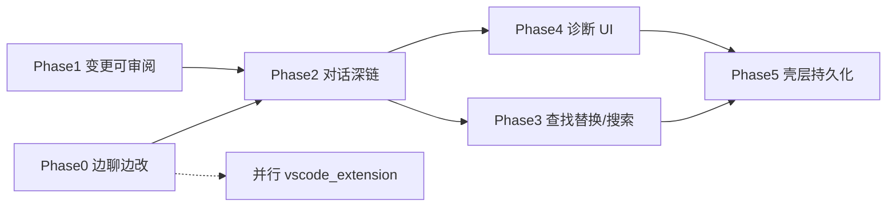

# Web / 桌面内置 IDE 模式：完善规划

**状态**：设计备忘 / 路线图（**未**承诺实现顺序与版本日期）。**受众**：计划增强「对话 ↔ 编辑器」体验的维护者与产品评审。  
**语言**：中文。  
**存放位置**：`docs/design/`（与 **`vscode_extension.md`**、**`web_ui_todo.md`** 同级）。

**关联**：

- 用户可见说明：**`README.md`**（主区「对话 / 编辑器」切换、保存、`@相对路径`、磁盘同步）
- 前端模块：**`frontend/src/app/ide_layout.rs`**、**`ide_layout_switch.rs`**、**`ide_codemirror.rs`**、**`ide_tabs.rs`**、**`ide_disk_sync.rs`**、**`ide_find.rs`**、**`app/ide_menu_bar/`**
- SSE：**`docs/SSE协议.md`**（**`workspace_changed`**）；前端 **`on_workspace_changed`** → **`ide_sync_disk_nonce`**
- 工作区文件 API：**`GET`/`POST /workspace/file`**（见 **`docs/命令行与路由.md`**）
- Agent 侧诊断 / LSP 工具：**`docs/工具说明.md`**（**`rust_compiler_json`**、**`rust_analyzer_*`**）；实现 **`crates/crabmate-tools/src/tools/rust_ide.rs`**
- 并行产品路线（外部编辑器壳）：**`docs/design/vscode_extension.md`**
- 用户数据偏好：**`docs/design/user_data_dir.md`**（**`editor_layout_mode`**、**`ide_editor_*`**）
- E2E：**`desktop-tauri/src-tauri/tests/victauri_ide_layout.rs`**
- CLI / TUI / Web 复用原则：**.cursor/rules/cli-tui-web-shared-logic.mdc**（IDE UI 不必三端复刻；路径/事件契约宜共享）

---

## 1. 目标与边界

### 1.1 产品定位

内置 IDE 模式是 **Agent 工作流的可视编辑面**，不是第二套 VS Code：

- 用户能**看见并轻改**工作区文件，并与对话中的工具写盘结果对齐；
- 重度多语言编辑、调试、扩展生态交给 **Cursor / VS Code**（或未来官方扩展）；
- 默认投入应落在 **「边聊边改 + 变更可审阅 + 深链跳转」**，而非完整 Language Server 宿主。

### 1.2 本文讨论什么

- 当前能力基线与架构事实；
- 按优先级分期的完善项、建议触点与验收要点；
- 与 VS Code 扩展、TUI/CLI 的分工；
- 协议 / 安全 / 测试约束。

### 1.3 本文不讨论什么

- 在 WASM 前端**常驻** rust-analyzer 或任意语言 LSP 进程；
- 完整调试器、Git Graph、扩展市场；
- 终端 TUI 复刻 CodeMirror UI（TUI 最多消费「变更路径列表」类文本能力）；
- 官方 VS Code 扩展的实现细节（见 **`vscode_extension.md`**）。

---

## 2. 现状基线（事实）

| 能力 | 现状 |
|------|------|
| 布局切换 | **`editor_layout_mode`**；对话层与 IDE 层**互斥**（`main-row-chat-layer` / `main-row-ide-layer`） |
| 布局结构 | 左工作区树 + 右多标签编辑器 + 顶栏菜单（项目 / 编辑 / 视图） |
| 编辑器 | CodeMirror 6（**`frontend/vendor/ide-codemirror.js`**，由 **`scripts/ide-codemirror-entry.mjs`** 构建）；语法高亮、折行、行号、字体等本机偏好 |
| 读写 | **`GET`/`POST /workspace/file`**；Ctrl/Cmd+S、全部保存、新建文件、关闭标签确认 |
| 查找 | 当前文件查找、跳转行（**无**替换、**无**工作区搜索结果面板） |
| Agent 联动 | SSE **`workspace_changed: true`** → 刷新树 + **`spawn_sync_ide_tabs_from_disk`**（脏标签确认后重载）；双击树项插入 **`@相对路径`** 并切回对话 |
| Agent 工具 | **`rust_analyzer_*`** / **`rust_compiler_json`** 供模型调用；**未**接到编辑器 hover / 定义跳转 / Problems UI |
| 壳层差异 | IDE 模式下**隐藏**主状态栏；侧栏收起状态进出 IDE 时记忆/恢复 |
| 测试 | Victauri：进入 IDE、打开文件、编辑保存、回对话 |

```text
                    prefs.editor_layout_mode
                            │
         ┌──────────────────┴──────────────────┐
         ▼                                     ▼
  对话布局（chat + 侧栏）              IDE 布局（树 + CM 标签）
         │                                     │
         │  SSE workspace_changed                │
         └──────────► refresh_workspace ───────┤
                      ide_sync_disk_nonce ─────► 标签 vs 磁盘同步
```

---

## 3. 原则

1. **Agent 优先**：任何编辑器增强应服务「看懂 / 审阅 / 轻改工具结果」，避免与对话主路径脱节。
2. **协议复用**：打开路径、跳行、变更列表、诊断请求尽量走已有 HTTP/SSE；扩展字段须同步 **`docs/SSE协议.md`**、前端 **`sse_dispatch`** / **`api/chat_stream`**、金测（若动控制面）。
3. **后端一份能力**：LSP / 编译诊断以工具与可选薄 HTTP 封装服务 **Agent + UI**，禁止前端私有协议分叉。
4. **安全不削弱**：文件读写仍受工作区根与 **`resolve_for_read` / `resolve_for_write`** 约束；勿为「IDE 便利」绕过路径沙箱。
5. **与外部 IDE 分工**：内置模式做到「够用」；完整 IDE 体验走扩展或用户自有编辑器。
6. **分期可交付**：每期应有独立可测切片（Victauri 或单元），避免大爆炸 PR。

---

## 4. 分期路线图

### Phase 0 — 边聊边改（P0）

**问题**：IDE 打开时聊天层隐藏，无法边看改盘边发下一轮。

**候选方案（择一落地，可演进）**：

| 方案 | 描述 | 成本 | 体验 |
|------|------|------|------|
| **A. 分栏** | 主区编辑器 + 固定窄聊天列（或底栏 transcript） | 高 | 最接近 AI IDE |
| **B. IDE 内 composer 抽屉** | 顶/底可展开输入，仍走同一 **`/chat/stream`** | 中 | 快速补齐主路径 |
| **C. 深链回切** | 保持互斥；工具卡 / 变更列表「在编辑器打开」并可选「回对话」快捷键 | 低 | 改善切换摩擦 |

**建议**：先 **B 或 C**，用量证明后再上 **A**。

**验收**：

- IDE 可见时至少能发起一轮流式对话（B）或一键打开文件并回到对话不丢上下文（C）；
- 偏好仍经 **`/user-data/prefs`**；新增布局态须有明确键名与默认值；
- Victauri：IDE 下发送（或打开深链）不断开现有会话。

**主要触点**：`frontend/src/app/mod.rs`（叠层）、`ide_layout*`、`chat_composer`、可选 `shell_prefs_storage` / `user_prefs_sync`。

---

### Phase 1 — 变更可审阅（P0）

**问题**：仅「脏则确认重载」，缺少路径级变更感知与 diff。

**建议**：

1. 评估扩展 **`workspace_changed`** 载荷：由布尔升级为可选 **`paths: string[]`**（或并列事件）；**兼容**旧前端（缺字段则全量同步，行为与今相同）。
2. IDE 侧栏或标签条旁「本回合已变更」列表；点击 → 打开 / 聚焦标签。
3. 脏标签：展示本地 vs 磁盘差异（最小：统一 diff 视图或复用 changelist UI）；与 **`changelist`** 模态对齐，避免两套「变更真相」。

**验收**：

- Agent 写文件后，IDE 在不切回对话的情况下能列出变更路径；
- 脏文件不会静默覆盖；用户可选择保留本地或采用磁盘；
- SSE / OpenAPI / **`docs/SSE协议.md`** 与前端解析一致。

**主要触点**：SSE 发射处、`parser_v2` / `sse_dispatch`、`ide_disk_sync.rs`、changelist 相关前端与路由。

**安全**：路径列表必须是**工作区相对路径**且经服务端规范化；勿下发绝对路径或越界路径。

---

### Phase 2 — 对话深链（P1）

**问题**：工具摘要、`file:line`、代码引用无法一键落到编辑器光标。

**建议**：

- 统一 **`open_in_ide(path, line?)`**（复用 **`make_ide_open_file_handler`** + **`goto_line_in_editor`**）；
- 工具卡、助手代码块路径、错误栈启发式解析可点击；
- 若当前在对话布局：进入 IDE（或开抽屉）并定位；可选同时保留 chat 可见（依赖 Phase 0）。

**验收**：从一条含 `path:line` 的工具结果点击后，编辑器显示对应文件且行可见。

**主要触点**：`message_row` / tool card、`ide_tabs.rs`、`ide_find.rs`（goto）、布局切换。

---

### Phase 3 — 查找替换与工作区搜索（P1）

**建议**：

- 当前文件：**Replace / Replace all**（CodeMirror `@codemirror/search` 已部分引入，补齐 UI）；
- 工作区：结果列表接现有搜索 / codebase API，点击打开标签并跳行；
- 快捷键与菜单「编辑」对齐（Ctrl/Cmd+H 等，注意与对话查找面板冲突）。

**验收**：单文件替换写入经保存路径；跨文件搜索不绕过工作区 API。

---

### Phase 4 — 诊断进 UI（P1，可选）

**原则**：复用 **`rust_compiler_json`** / 现有 LSP 工具，**不**在浏览器内嵌语言服务器。

| 子阶段 | 内容 |
|--------|------|
| 4a | Problems 面板或 gutter：对当前（或变更）Rust 文件拉取编译诊断 |
| 4b | Hover / 转到定义：经薄 HTTP 包装现有 `rust_analyzer_*`（超时、工作区根、输出截断与工具一致） |
| 4c | （慎选）常驻 LSP 会话与 CM 扩展——仅当 4a/4b 不足且有明确性能预算时 |

**验收**：无 rust-analyzer 时 UI 降级文案清晰；有则 hover/定义与工具输出语义一致；密钥与路径不进日志。

---

### Phase 5 — 壳层与持久化（P2）

- IDE 布局下保留**精简状态栏**（回合中、审批、token 粗估）或等价指示；
- 打开标签列表持久化到 prefs / 工作区分桶（恢复时校验文件仍存在）；
- 大文件 / 二进制：大小上限、拒绝编辑与预览策略（与后端 file API 错误对齐）；
- 可选：IDE 底栏只读终端输出（复用 `terminal_session` / `tool_output_chunk` 展示，不新开 PTY 协议）。

---

## 5. 明确不做或外置

| 项 | 处理 |
|----|------|
| 完整多语言 LSP / 调试 | 外置编辑器或 **`vscode_extension.md`** |
| TUI 像素级 IDE | 不对齐；最多文本侧「变更列表」 |
| 为 IDE 单独写第二套写盘工具 | 禁止；继续走工作区工具与 `/workspace/file` |
| 弱化路径沙箱换便利 | 禁止 |

---

## 6. 与 VS Code 扩展的关系

```text
内置 IDE（本文）              官方 VS Code 扩展（vscode_extension.md）
─────────────────            ─────────────────────────────────────
Leptos + CM，同进程 Web UI      Extension Host + Webview 客户端
服务「本应用内」轻编辑           服务「已在 VS Code 的用户」
优先：分栏/抽屉、diff、深链     优先：连 serve、SSE、审批、工作区绑定
```

两者共享 **HTTP/SSE 契约**；UI 不互相复刻。若资源冲突，**内置 Phase 0–2** 通常优先于扩展 MVP（本机桌面用户已有 Tauri 壳）。

---

## 7. 测试与文档门槛

每期合并前建议：

- [ ] `cd frontend && cargo check --target wasm32-unknown-unknown`（及必要的 `trunk build`）
- [ ] 相关 Victauri 用例更新或新增（IDE 布局套件）
- [ ] 若改 SSE 控制面：同步 **`docs/SSE协议.md`**、**`classify_sse_control_outcome`** / 金测、前端 dispatch
- [ ] 用户可见行为：更新 **`README.md`**；维护者模块说明：按需更新 **`docs/开发文档.md`**
- [ ] 安全敏感路径改动：对照 **`.cursor/rules/security-sensitive-surface.mdc`**

落地任务写入 **`docs/待办清单.md`**（`frontend/` 章）并随实现删除条目；**本文保留方向共识**，不堆已完成 checkbox。

---

## 8. 建议落地顺序（摘要）



**最小有价值切片（MVP+）**：**Phase 0（B 或 C）+ Phase 1（变更路径列表）+ Phase 2（打开 path:line）**。

---

## 9. 修订记录

| 日期 | 说明 |
|------|------|
| 2026-07-31 | 初稿：基线、原则、Phase 0–5、与 VS Code 扩展分工 |
