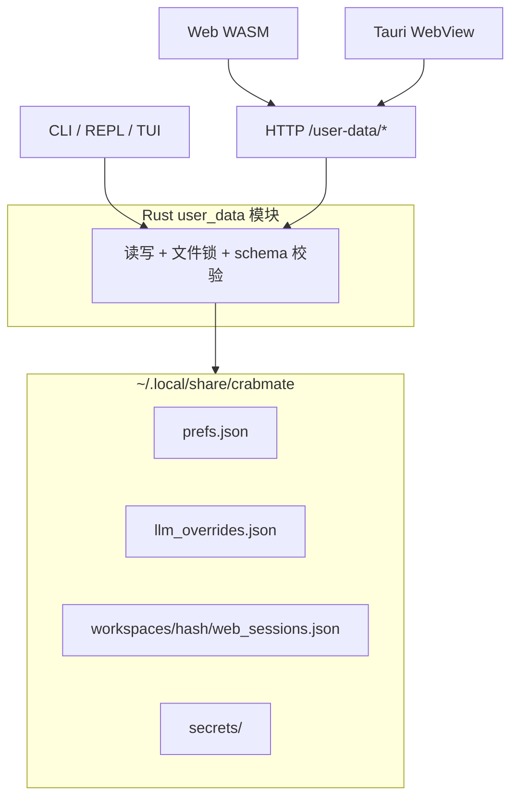

# 本机用户数据目录（`~/.local/share/crabmate`）设计

## 1. 背景与问题

当前 Web / Tauri 将大量**用户级**状态写在浏览器 **`localStorage`**（键见 `frontend/src/app/local_storage_index.rs`）。Tauri 桌面端由 WebKit 落盘到 **`~/.local/share/com.crabmate.desktop/localstorage/`**，按来源 `http://127.0.0.1:<port>` 分文件，导致：

- 与系统浏览器访问同端口时可能**同源共享**，与不同端口/纯 `serve` 实例则**分叉**；
- 路径隐蔽、难以备份与手工排查（例如工作区被记为固定目录）；
- CLI / TUI **无法**读取侧栏会话列表、主题、上次工作区等非机密偏好。

**工作区内**数据（`conversations.db`、导出、`repl_history.txt` 等）已落在 **`<workspace>/.crabmate/`**，与本设计**互补**，不合并。

**状态**：**已实现（P0–P4）**；Web 经 **`/user-data/*`** 读写 **`~/.local/share/crabmate`**，**不再**使用浏览器 `localStorage` 存会话/偏好/LLM 覆盖。

---

## 2. 目标与非目标

### 2.1 目标

| 目标 | 说明 |
|------|------|
| **单一真源** | 用户级 UI 状态与 LLM 本机覆盖集中至 **`~/.local/share/crabmate`**（可配置根目录） |
| **三端共用** | Web、Tauri（经本机 `serve`）、CLI/TUI（Rust 直读或同一 HTTP API）共用同一套文件 |
| **可迁移** | （已移除）旧版 `localStorage` 导入；新装直接使用磁盘目录 |
| **安全分级** | 非机密进 JSON；API Key 等进 **`secrets/`** 且 HTTP 不回传明文 |

### 2.2 非目标（本阶段不替代）

- **不**替代 `<workspace>/.crabmate/conversations.db`（服务端对话持久化，`conversation_id` 消息链）；
- **不**替代 REPL **`repl_history.txt`**（按工作区）；
- **不**将大段对话正文迁入 home（仅侧栏会话元数据、草稿、绑定 id）；
- **不**使用 **`~/.cache/crabmate`** 存放需长期保留的会话与密钥（cache 语义可被系统清理）。

---

## 3. 目录布局

根目录解析（Rust 单点，三端共用）：

```text
CM_CRABMATE_USER_DATA_DIR  → 若设置且非空，使用该路径
否则 XDG_DATA_HOME/crabmate → Linux 通常为 ~/.local/share/crabmate
```

```text
~/.local/share/crabmate/
├── meta.json                         # schema_version、migrated_from、updated_at_ms
├── prefs.json                        # 全局非机密偏好（见 §4.1）
├── llm_overrides.json                # LLM 非机密覆盖（见 §4.2）；可与 prefs 合并为一文件
├── mcp_servers.json                  # MCP stdio 多服务器（见 §4.5）；Web 设置 → MCP
├── global/
│   └── web_sessions.json             # 未设置 Web 工作区时的会话桶（现 agent-demo-sessions-v1）
├── workspaces/
│   └── <ws_sha256>/                  # SHA256(hex)，与 frontend sessions_json_storage_key 一致
│       ├── manifest.json             # workspace_root 规范绝对路径
│       └── web_sessions.json         # 侧栏 ChatSession[] + active_session_id
└── secrets/                          # chmod 0700；文件 chmod 0600
    ├── client_llm                    # 主模型 API Key（单行或极小 TOML）
    ├── executor_llm                  # 可选：执行器 API Key
    └── web_api_bearer                # 可选：访问 CrabMate HTTP API 的 Bearer
```

**`ws_sha256` 算法**：与 `frontend/src/storage.rs` 中 `normalize_workspace_partition_path` + SHA256 相同，便于从 `agent-demo-sessions-v1::ws::<hex>` 键名一对一迁移。

---

## 4. 文件 Schema

### 4.1 `meta.json`

```json
{
  "schema_version": 1,
  "migrated_from": ["localStorage", "tauri-webkit"],
  "updated_at_ms": 0
}
```

### 4.2 `prefs.json`（全局，非机密）

| 字段 | 现 localStorage 键（参考） | 说明 |
|------|---------------------------|------|
| `last_workspace_root` | （计划键 `crabmate-last-workspace-root`） | 上次手动 `POST /workspace` 成功的规范路径 |
| `locale` | `crabmate-locale` | |
| `theme` | `crabmate-theme` | |
| `side_panel_view` | `agent-demo-side-panel-view` | |
| `side_width` | `agent-demo-workspace-width` | |
| `editor_layout_mode` | `crabmate-editor-layout-mode` | |
| `timeline_panel_expanded` | `crabmate-timeline-panel-expanded` | |
| `sidebar_rail_collapsed` | `crabmate-sidebar-rail-collapsed` | |
| `session_ui_font` / `session_chat_font` | `crabmate-session-*-font` | |
| `ide_editor_*` | `crabmate-ide-editor-*` | |

**不含**：`api_key`、完整 `web_api_bearer_token`（见 §4.4）。

### 4.3 `workspaces/<ws_sha256>/web_sessions.json`

与现 `SessionsFile` 同形（`frontend/src/storage.rs`）：

```json
{
  "schema_version": 1,
  "sessions": [],
  "active_session_id": "s_..."
}
```

每条 `ChatSession` 可含 `server_conversation_id`、`workspace_root`、草稿、`messages` 本地展示缓存等（字段保持与前端 serde 一致）。

### 4.4 `llm_overrides.json`（非机密 LLM 覆盖）

```json
{
  "schema_version": 1,
  "client_llm": {
    "api_base": "https://api.deepseek.com/v1",
    "model": "deepseek-chat",
    "temperature": null,
    "llm_context_tokens": null,
    "llm_thinking_mode": "server"
  },
  "executor_llm": {
    "api_base": "",
    "model": ""
  },
  "execution_mode": null,
  "saved_models": []
}
```

对应现 `frontend/src/api/client_llm_storage.rs` 中非密钥字段。

### 4.5 `mcp_servers.json`（MCP stdio 多服务器）

仅存本机 user-data（**不**写 TOML / 工作区）。`slug` 由 **`name` 自动生成**（小写字母数字与下划线；冲突时追加 `_2` 等），OpenAI 工具名为 `mcp__{slug}__{remote}`。

```json
{
  "schema_version": 1,
  "global_enabled": true,
  "tool_timeout_secs": 60,
  "servers": [
    {
      "id": "mcp_1730000000000",
      "name": "Filesystem",
      "slug": "filesystem",
      "command": "npx -y @modelcontextprotocol/server-filesystem /path",
      "enabled": true,
      "created_at_ms": 0,
      "updated_at_ms": 0
    }
  ]
}
```

若文件为空且 TOML 仍启用 legacy 单条 `mcp_command`，**一次性**导入为单服务器；之后以本文件为准。HTTP：`GET/PUT /user-data/mcp-servers`（**GET 响应**不含 `command`，仅 `has_command`）、`POST …/import`（JSON 解析并追加）、`GET …/status`、`POST …/{id}/probe`。

Web **设置 → MCP → 从 MCP JSON 导入**：粘贴含 **`mcpServers`** 的配置（可为整份 **`mcp.json`** 或其中一段），解析后追加到列表（`name` 取自键名，`command` 由 `command`+`args`+`env`+`cwd` 合成；`slug` 仍于保存时由 `name` 生成）。仅 **stdio**（含 `command`）；仅 `url` 的远程 MCP 会跳过。含 `${env:…}` / `${workspaceFolder}` 等占位符时保留原文并提示手动改路径或环境变量。

### 4.6 `secrets/`（机密）

| 文件 | 内容 |
|------|------|
| `client_llm` | 云厂商 Bearer（现 `crabmate-client-llm-api-key`） |
| `executor_llm` | 可选（现 `crabmate-executor-llm-api-key`） |
| `web_api_bearer` | 访问 `/chat`、`/user-data` 等的 CrabMate 鉴权（现 `localStorage` 可选键） |

**禁止**写入 `prefs.json` / `web_sessions.json` / 日志 / `doctor` 明文输出。

---

## 5. 与工作区 `.crabmate/` 的边界

| 数据 | 位置 | 三端 |
|------|------|------|
| 供应商对话消息链、`conversation_id` | `<workspace>/.crabmate/conversations.db` | Web `serve`、TUI（配置非空时）、**不**迁入 home |
| 导出 JSON/Markdown | `<workspace>/.crabmate/exports/` | Web / `save-session` |
| REPL 行历史 | `<workspace>/.crabmate/repl_history.txt` | REPL only |
| TUI 单链快照（无 SQLite 时） | `<workspace>/.crabmate/tui_session.json` | TUI；Phase 2 可选与 `web_sessions` 对齐 |
| 侧栏多会话、壳层偏好、本机 LLM 覆盖 | **`~/.local/share/crabmate`** | Web + Tauri + CLI 读 |

---

## 6. 三端访问架构



| 端 | 方式 | 说明 |
|----|------|------|
| **Web** | `GET/PUT /user-data/*` | WASM 无法直接读 `$HOME`；与现有 Bearer 鉴权一致 |
| **Tauri** | 同 Web（`serve` 动态 loopback URL，见 **`web_ready` JSON**） | 业务数据不再依赖 `com.crabmate.desktop/localstorage/` |
| **CLI** | `user_data` 直读；`doctor` 打印路径 | REPL 可读 `prefs.last_workspace_root` 提示；密钥优先 `API_KEY` env |
| **TUI** | 直读 `prefs` + 可选 HTTP | 会话链仍以 SQLite / `tui_session.json` 为主 |

---

## 7. HTTP API（草案）

挂载于受保护路由（与 `/chat`、`/workspace` 同级），前缀 **`/user-data`**：

| 方法 | 路径 | 作用 |
|------|------|------|
| `GET` | `/user-data/prefs` | 读 `prefs.json` |
| `PUT` | `/user-data/prefs` | 写回；可选 `If-Match` / revision |
| `GET` | `/user-data/llm-overrides` | 读 `llm_overrides.json` |
| `PUT` | `/user-data/llm-overrides` | 写回非机密 LLM 字段 |
| `PUT` | `/user-data/secrets/client-llm` | 仅写密钥；**无**对应 GET 明文 |
| `GET` | `/user-data/secrets/status` | `{ "client_llm": { "set": true }, ... }` 脱敏状态 |
| `GET` | `/user-data/workspaces/current/sessions` | 按当前 `workspace_override` 解析桶 |
| `PUT` | `/user-data/workspaces/current/sessions` | 写 `web_sessions.json` |
| `GET` | `/user-data/workspaces` | 列出 `manifest.json` |
**工作区未设置**：`current` 映射到 `global/web_sessions.json`。

---

## 8. LLM 配置合并优先级（运行时）

对单次 `POST /chat` / `POST /chat/stream`，建议合并顺序（后者覆盖前者）：

1. `AgentConfig` / TOML / 嵌入默认  
2. 进程环境 **`API_KEY`**（`llm_http_auth_mode=bearer` 时）  
3. **`~/.local/share/crabmate/llm_overrides.json`**  
4. **`secrets/client_llm`**（仅 `api_key`）  
5. 请求体 **`client_llm`**（Web 设置页当次提交，**不写盘**除非用户显式保存）

与现文档一致：**`client_llm.api_key` 随请求发送**；落盘仅为本机便利，**服务端 `serve` 进程不把 Web 密钥写入 `AppState` 持久字段**。

---

## 9. 迁移（已废弃）

不再提供 `POST /user-data/migrate` 与 `localStorage` 回退；请直接使用 **`~/.local/share/crabmate`** 或设置 **`CM_CRABMATE_USER_DATA_DIR`**。

---

## 10. 安全与运维

- 创建目录 **`0700`**，`secrets/` 下文件 **`0600`**。
- API 与 `/chat` 相同 Bearer；日志禁止打印 `secrets/` 与 `sessions` 全文。
- `GET` 类接口**不得**返回完整 `api_key`（允许 `has_key`、`key_suffix` 等脱敏字段）。
- 备份：复制 `~/.local/share/crabmate` 即备份侧栏会话与偏好（**含密钥**）；勿将目录提交到 git 或公开网盘。
- 多 `serve` 实例：对 `web_sessions.json` 使用文件锁或单写者，避免并发写坏。

环境变量：

| 变量 | 说明 |
|------|------|
| `CM_CRABMATE_USER_DATA_DIR` | 覆盖本机用户数据根（绝对路径） |

---

## 11. 实现分期（建议）

| 阶段 | 内容 | 验收 |
|------|------|------|
| **P0** | Rust `user_data` 模块；`prefs` / `web_sessions` / `llm_overrides` 读写；`doctor` 显示路径 | 可手工编辑 JSON，CLI 可读 |
| **P1** | HTTP `/user-data/*`；Web 会话列表改 HTTP；`last_workspace_root` | Web + Tauri 共用；告别 Tauri localStorage 分叉 |
| **P2** | 壳层 prefs 迁出 `localStorage`；`migrate` 端点 | 主题/侧栏跨实例一致 |
| **P3** | `secrets/` + 脱敏 API；CLI 可选读 secrets；TUI 读 `prefs` | 三端 LLM URL/模型/密钥策略一致 |
| **P4** | OpenAPI、`docs/配置说明.md`、e2e 使用临时 `CM_CRABMATE_USER_DATA_DIR` | 可测、可文档化 |

实现位置：

- `src/user_data/`、`src/web/user_data/`、`frontend/src/api/user_data.rs`、`frontend/src/user_prefs_sync.rs`

---

## 12. 与 Tauri 的关系（补充）

当前 `desktop-tauri` 子进程启动：**`crabmate serve --host 127.0.0.1 --port 0 --desktop-ready-json`**（**无** `--workspace`）；`current_dir` 为开发时仓库根、**`.deb`** 下默认可写 **`$HOME`**（或 **`CM_DESKTOP_WORKDIR`** 覆盖）；安装布局下 sidecar 自动设 **`CM_WEB_STATIC_DIR=/usr/share/crabmate/frontend/dist`** 提供 UI 静态资源（**勿**把 `current_dir` 指到只读的 **`/usr/share/crabmate`**，否则 **`.crabmate/conversations.db`** 无法创建）。壳层解析 stdout 中 **`{"event":"web_ready",…}`** 后再加载 WebView URL（**勿**假设固定端口如 3000）。  
WebView 连上后，**用户级**状态应由 **`/user-data`** 读写，而非 `~/.local/share/com.crabmate.desktop/localstorage/`。

详见 **`docs/design/tauri_gui_mvp_design.md`**（进程壳层）与 **`desktop-tauri/DEVELOPMENT.md`**（开发与故障排查）；本文件负责**数据落盘**。

---

## 13. 参考

- `frontend/src/storage.rs` — 会话分桶与 `ChatSession` 形状  
- `frontend/src/api/client_llm_storage.rs` — LLM localStorage 键  
- `docs/命令行与路由.md` — CLI 与 Web 会话持久对照  
- `docs/配置说明.md` — `API_KEY`、`client_llm`、鉴权  
- `.cursor/rules/secrets-and-logging.mdc` — 密钥与日志  
- `.cursor/rules/api-sse-chat-protocol.mdc` — HTTP 变更须同步前端  
