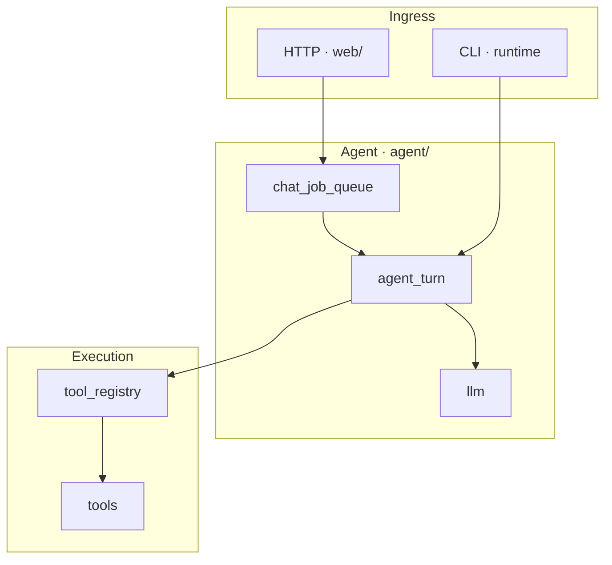

**Languages / 语言:** [中文](../开发文档.md) · English (this page)

# Developer guide (architecture overview)

For **contributors and maintainers**: **major modules and data flow** in CrabMate; **no** per-file source tree listing. End-user usage: **`README.md`**; configuration and environment variables: **`docs/en/CONFIGURATION.md`**; CLI and HTTP routes: **`docs/en/CLI.md`**; SSE contract: **`docs/en/SSE_PROTOCOL.md`**; built-in tools: **`docs/en/TOOLS.md`**.

## Documentation and collaboration (summary)

- **`docs/待办清单.md`** (**`docs/en/TODOLIST.md`**): open items only; remove entries when done; history lives in Git.
- **User-visible changes**: update **`README.md`**; when protocol or architecture boundaries change, update this guide and **`docs/en/SSE_PROTOCOL.md`** (when relevant).
- **Architecture-level changes**: if you add/remove top-level modules in **`src/lib.rs`** or change layering, update the **“Main modules”** section and the **Mermaid** diagram, and follow **`.cursor/rules/architecture-docs-sync.mdc`**.
- **Commits and quality**: root **`.pre-commit-config.yaml`** (`cargo fmt`, root + conditional **`frontend/`** `cargo clippy -D warnings`, complexity ratchets, etc.); commit messages **Conventional Commits** — **`.cursor/rules/conventional-commits.mdc`**.
- **Dependencies and licenses**: when changing **`Cargo.toml`** / **`Cargo.lock`**, align with **`deny.toml`** and CI — **`.cursor/rules/dependencies-licenses.mdc`**.

## Overview: system composition

- **Rust backend (`src/`)**: OpenAI-compatible **`chat/completions`**, Agent main loop, HTTP API (including SSE), tool execution, workspace and sessions.
- **Web frontend (`frontend/`)**: Leptos + WASM, Trunk build; static assets served by the backend. Interaction and SSE consumption: **`frontend/README.md`**, **`docs/frontend/ARCHITECTURE.md`** (when present in the repo).
- **CLI (`runtime/cli`, etc.)**: REPL / `chat` / `serve` and **`run_agent_turn`** share the same orchestration and tools.

## Architecture

### Process and layers

Single **Tokio** process: **Axum** serves HTTP; **`runtime/`** powers the CLI; shared **`AgentConfig`**, **`tools`**, **`run_agent_turn`** (implementation mainly in **`agent::agent_turn`**).

**Outside → inside:**

1. **Ingress**: HTTP routes and handlers (**`web/`**), **`serve`** / **`cli_run`**.
2. **Orchestration**: chat queue (**`chat_job_queue`**), Agent turns (**`agent/`**: **`agent_turn`**, context and message pipeline, **`per_coord`**, optional layered **hierarchy**, **workflow**).
3. **Model**: shared **`http_client`**, **`llm`** (**`complete_chat_retrying`** → default **`OpenAiCompatBackend`** → **`api::stream_chat`**), vendor adapters **vendor**.
4. **Tools**: table-driven **tools**, dispatch by name **tool_registry**, optional Docker sandbox **tool_sandbox**, structured results **tool_result**.
5. **Contracts**: **`crabmate-types`** (OpenAI-shaped messages; root re-exports as **`types`**), **sse** (control plane and version **`crabmate-sse-protocol`**), **config**.

### Configuration

Runtime **`AgentConfig`** merges TOML shards / environment variables and is validated in **`finalize`**; **`POST /config/reload`** hot-reloads most fields (exceptions such as session DB paths — see **`config/hot_reload`**).

### Agent main loop (mental model)

- **Calling the model**: call **`llm::complete_chat_retrying`** from business code; **do not** bypass it with **`api::stream_chat`** from **`agent`** (except tests and **`llm`** internals).
- **P / R / E**: **P** = one model round; **R** = reflection / final-answer gating after an assistant message (**`reflect`**, **`per_coord`**); **E** = **tool execution** (**`execute_tools`** → **tool_registry** / **workflow**).
- **Message transforms**: stripping / normalization before the vendor body lives in **`message_pipeline`** / **`context_window`**, aligned with **`llm::api`** last-mile behavior.

### Web streaming chat (summary)

`POST /chat/stream` → **`ChatJobQueue`** → **`run_agent_turn`** → **`llm`** SSE → if **`tool_calls`**, run tools (**serial or parallel read-only batch**) → append **`role: tool`** → control-plane events via **`sse::protocol`**. Event keys and error codes are authoritative in **`docs/en/SSE_PROTOCOL.md`**; Rust / frontend / **`crabmate-sse-protocol`** must stay aligned.

### Observability (summary)

**`observability`**: tracing setup; default log timestamps use local timezone (RFC3339). Web jobs may use **`TracingChatTurn`** (**`chat_turn`** span: **`job_id`**, **`conversation_id`**, **`outer_loop_iteration`**, short **`tool_call_id`** labels for tools). JSON logs: **`CM_LOG_JSON`**.

---

## Main modules (by responsibility, not a file index)

| Area | Responsibility |
|------|----------------|
| **`agent/`** | Single- and multi-turn orchestration: **`agent_turn`** (outer loop, **staged** planning, intent gating, **`execute_tools`**), **`context_window`** / **`message_pipeline`**, **`per_coord`** (final answer and workflow coordination), **`workflow`** (DAG), optional **`hierarchy`** (layered Manager/Operator). |
| **`llm/`** | **`complete_chat_retrying`**, request construction, **vendor** quirks, **`api`** HTTP/SSE. |
| **`tools/`** | Function-calling implementations, **`run_tool`**, schemas and **tool_specs_registry**. |
| **`tool_registry/`** | Dispatch by tool name, parallelism policy, Web/CLI approvals and timeouts. |
| **`sse/`** | **`SsePayload`**, encoding, stream hub, control-plane classification aligned with the protocol crate. |
| **`web/`** | Axum routes, **`AppState`**, chat / workspace / tasks / upload / status handlers. |
| **`chat_job_queue/`** | Queue and worker for `/chat` and `/chat/stream`. |
| **`config/`** | Load, merge, **finalize**, hot reload. |
| **`workspace/`** | Workspace path policy and safe opens (consistent with tools and Web). |
| **`memory/`** | Long-term memory, optional semantic index, etc. |
| **`runtime/`** | REPL, one-shot `chat`, **`chat_export`**, TUI bridge, benchmark helpers, etc. |
| **`tool_result/`** | Tool output envelopes, aligned with SSE **`tool_result`**. |
| **`crabmate-types`** (`crates/crabmate-types`) | OpenAI-compatible messages; root **`pub use crabmate_types as types`**. |
| **`crabmate-config`** (`crates/crabmate-config`) | **`AgentConfig`** loading, `finalize`, hot reload, CLI definitions; root **`pub use crabmate_config as config`**. |
| **`crabmate-llm`** (`crates/crabmate-llm`) | **`vendor`**, shared **`http_client`**, **`ChatCompletionsBackend`** trait, error types; root **`llm`** re-exports and hosts **`api::stream_chat`** / **`complete_chat_retrying`**. |
| **`types` (root re-export)** | Same as `crabmate-types`; in-repo code still commonly uses **`crate::types::`**. |
| **`observability.rs`** | Tracing init and **`TracingChatTurn`**. |

For **sub-paths** (e.g. **`agent_turn/staged`**, **`tools/file`**), browse or search the repo; this guide does **not** maintain a per-file index table (it duplicates **`lib.rs`** `mod` lists and goes stale).

---

## Frontend (`frontend/`)

Leptos CSR: **`api`** / **`sse_dispatch`** consume SSE; **`app/`** chat and workspace UI; **`message_format`** and rendering pipeline. Component layout and dependencies: **`docs/frontend/ARCHITECTURE.md`** when present. Build: **`cd frontend && trunk build`**.

---

## Data and persistence (summary)

- **Sessions**: in-memory or SQLite (**`conversation_store`**); rules for omitting entries from vendor requests live in **`message_pipeline`**.
- **Workspace**: tools and **`POST /workspace`** share the current working directory; **`.crabmate/`** may hold reminders, exports, etc. (see **`README`** / **`docs/en/CONFIGURATION.md`**).
- **Browser**: **`localStorage`** for session list, theme, partial LLM drafts (not server-side secrets).

---

## Common extension points

- **New tools**: register in the tools table + schema + **`docs/en/TOOLS.md`**; register execution policy in **tool_registry** when non-trivial; follow **`.cursor/rules/security-sensitive-surface.mdc`**.
- **SSE / API changes**: keep Rust routes, **`crabmate-sse-protocol`**, frontend dispatch, and **`docs/en/SSE_PROTOCOL.md`** in sync — **`.cursor/rules/api-sse-chat-protocol.mdc`**.
- **New HTTP routes or config keys**: update **`README.md`**, **`docs/en/CONFIGURATION.md`**, and this guide when architecture narrative is affected.

---

## Further reading (design notes and topics)

Staged planning, workflow orchestration, context trimming, Web theming, and other **topic designs** remain in **`docs/`** (and **`docs/en/`** where mirrored); this page is an **entry-level index**, not a full copy of those documents.
