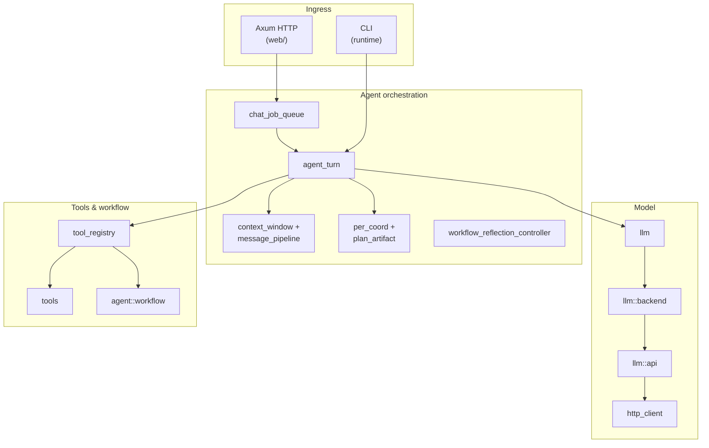
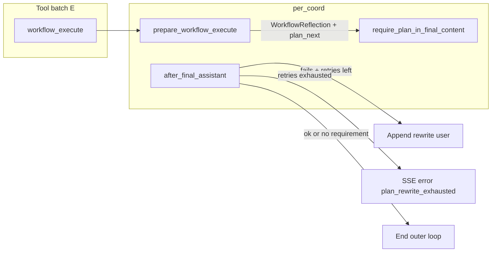

**Languages / 语言:** [中文](../DEVELOPMENT.md) · English (this page)

# Developer guide (architecture and modules)

For **maintainers and contributors**: module responsibilities, key mechanisms, and extension points.  
End-user features: **`README.md`**; env/config: **`docs/en/CONFIGURATION.md`**; CLI + HTTP: **`docs/en/CLI.md`**; `chat` exit codes and `--output json`: **`docs/en/CLI_CONTRACT.md`** (cross-ref **`docs/en/SSE_PROTOCOL.md`**). Testing commands: **`docs/en/TESTING.md`** (Chinese **`docs/TESTING.md`**).

## TODOLIST and documentation conventions

- **`docs/TODOLIST.md`**: **Open items only**; global P0–P5 plus per-module sections. **Delete** a line when done (no permanent `[x]`); drop empty section headers. History lives in Git.
- **User-visible changes** (new CLI flags, HTTP routes, config keys, tool names, Web/CLI behavior): update **`README.md`** and/or this file; **built-in tools** live in **`docs/en/TOOLS.md`**. Pure refactors: `DEVELOPMENT` and/or comments may suffice.
- **Cursor rules**: `.cursor/rules/todolist-and-documentation.mdc`; architecture/module moves: `.cursor/rules/architecture-docs-sync.mdc` (keep § Architecture + module index + Mermaid in sync). Web UI (Leptos): `frontend-leptos.mdc`; tools: `tools-registry.mdc`; SSE/chat: `api-sse-chat-protocol.mdc`; security surfaces: `security-sensitive-surface.mdc`; deps/licenses: `dependencies-licenses.mdc`.
- **PR/Issue templates**: `.github/pull_request_template.md`, `.github/ISSUE_TEMPLATE/`.
- **Pre-commit**: `.pre-commit-config.yaml` (`cargo fmt`, `cargo clippy -D warnings`, Conventional Commits on `commit-msg`). Install: `pip install pre-commit && pre-commit install` (add `--hook-type commit-msg` if needed). Agent rule: `.cursor/rules/pre-commit-before-commit.mdc`. Rust tests/error handling: `rust-clippy-and-tests.mdc`, `rust-error-handling.mdc`.
- **Commits**: Conventional Commits (`.cursor/rules/conventional-commits.mdc`).
- **Dependency security**: GitHub Actions **`.github/workflows/dependency-security.yml`** runs **`cargo audit`** and **`cargo deny check licenses bans sources`** (see root **`deny.toml`**). Locally: `cargo install cargo-audit cargo-deny`, then the same commands. Full **`cargo deny check`** includes advisory lints that overlap with audit warnings; CI uses the subset above on purpose.

## System overview

- **Rust backend (`src/`)**: OpenAI-compatible **`chat/completions`** to configured **`api_base`**; agent loop, HTTP + SSE, tools, workspace/tasks/upload.
- **Web frontend (`frontend-leptos/`)**: Leptos (CSR) + WASM, **Trunk** build; static assets served from **`frontend-leptos/dist`**. Chat UI, workspace browser/editor, tasks, status bar, SSE consumer.

## Architecture

### Overall

Single **Tokio** process: **Axum** HTTP, **`runtime/`** CLI (interactive + one-shot `chat`), shared **`run_agent_turn` → `agent::agent_turn`**, **`tools`**, **`AgentConfig`**.

### Layers (outside → in)

1. **Ingress**: HTTP handlers (`web/server`, `web/chat_handlers/`), `serve`, CLI parsing (`config::cli`, `runtime/cli`).
2. **Orchestration**: `chat_job_queue`, agent loop, context/PER/workflow (`agent/`).
3. **Model**: `http_client`, `llm` request/retry, **`llm::api::stream_chat`**; upstream bodies redacted before logs.
4. **Tools & workflow**: table-driven tools (`tools/mod.rs`), `tool_registry` dispatch/timeouts, DAG workflows (`agent::workflow`). **`workflow_execute`** validates **`tool_name`** and required JSON keys (see `tools/schema_check.rs`); results carry **`workflow_run_id`**, **`trace`**, **`completion_order`**; **`max_retries`** only for retryable infra errors (see **`docs/en/TOOLS.md`**).
5. **Contracts**: `types`, SSE (`sse/protocol`, `line`, `mpsc_send`), `tool_result`, `config`, `web/*`.

### Workflow orchestration extensions (design)

For **state-machine-style configuration**, **conditional branching**, and **bounded loops**—how they relate to today’s **`workflow_execute` DAG**, **staged planning**, and **`agent_reply_plan` / workflow reflection**—see **`docs/WORKFLOW_ORCHESTRATION_ARCHITECTURE.md`** (Chinese design doc).  
For the **plan → execute → verify** closed loop (explicit subtasks, deterministic acceptance, boundaries vs **`plan_rewrite` / workflow reflection / `final_plan_semantic_check`**), see **`docs/PLAN_EXECUTE_VERIFY_ARCHITECTURE.md`**.  
If you extend **`src/agent/workflow/`** or **`plan_artifact` / `per_coord` / staged`** semantics, update those design docs, **`docs/TOOLS.md`**, and (if needed) this chapter’s architecture/module index; SSE changes must follow **`.cursor/rules/api-sse-chat-protocol.mdc`**.

### `agent_turn` vs `llm`: single entrypoint and anti-patterns

This section records **maintainer rules** (aligned with `src/llm/mod.rs`): **one** OpenAI-compatible **`chat/completions`** round-trip—transport, parsing, and backoff—lives in **`llm`**; **multi-step orchestration** (when to call the model again, how `messages` evolve, tools, PER) lives in **`agent`**.

#### Single entrypoint for model calls (production)

| Entry | Role |
|-------|------|
| **`llm::complete_chat_retrying`** | **Only** supported way to perform a `chat/completions` round with **`CompleteChatRetryingParams`** (prefer **`CompleteChatRetryingParams::new`** + **`LlmRetryingTransportOpts`** for `out` / streaming / cancel flags). Internally **`ChatCompletionsBackend::stream_chat`** → default **`llm::api::stream_chat`**. **Exponential backoff** applies only when **`LlmCallError`** is **`retryable`** (e.g. **408/429/5xx** and some transport errors; **401/400** fail fast). **DSML materialization** runs **after** a successful return from **`complete_chat_retrying`**, not inside `stream_chat`. |
| **`llm::tool_chat_request` / `llm::no_tools_chat_request`** (and similar) | **Request builders** for **`ChatRequest`** (`tools`, `tool_choice`, sampling); they **do not** perform HTTP. **`agent`** fills `messages` then calls **`complete_chat_retrying`**. |

**`agent` paths that call `complete_chat_retrying`** (keep this pattern when adding calls): **`agent/context_window.rs`** (**`LlmRetryingTransportOpts::headless_no_stream`**), **`agent/agent_turn/plan_call.rs`** (main-loop **P**), **`agent/agent_turn/staged.rs`** (**`AgentLlmCall`** + **`RunLoopParams::llm_transport_opts`**, planner rounds may override `out` / `render_to_terminal`), **`agent/per_plan_semantic_check.rs`** (side LLM for final-plan consistency). Other modules (e.g. **`per_coord`**, **`outer_loop`**) reach the model **through** these paths—do not open a parallel HTTP stack.

#### Anti-patterns (do not do)

- Under **`agent/`**: **do not** call **`llm::api::stream_chat`** or **`reqwest`** for `chat/completions` directly (**tests** and **`llm` itself** excepted). You would fork retry semantics, error typing, and `out`/terminal rendering from **`complete_chat_retrying`**.
- **`llm`**: **no** ownership of agent-round state (“which plan step”, “rewrite count”, “tools executed”); **no** **`tool_registry`** dispatch. Vendor shaping (temperature, `thinking`, preserving **`reasoning_content`** on tool rounds) stays in **`llm::vendor`** (**`llm_vendor_adapter`**, etc.) and request construction / normalize paths.
- **Session-side `messages` transforms** (tool compression, trim, injection strip, …): **`agent::message_pipeline`** / **`agent::context_window`**—not **`llm::api`** (`stream_chat` may still run **`conversation_messages_to_vendor_body`** as a **last-mile** normalize before HTTP).

#### P/R/E mapping (read-only mental model)

- **P**: one **`complete_chat_retrying`** (usually **`per_plan_call_model_retrying`** → **`plan_call`**).
- **R**: **`per_reflect_after_assistant`**; **`StopTurnPendingPlanConsistencyLlm`** → **`per_plan_semantic_check::evaluate_plan_consistency_with_recent_tools_llm`** → another **`complete_chat_retrying`** (no tools).
- **E**: **`per_execute_tools_*`**, not **`llm`**.

**`llm::LlmRetryingTransportOpts`** and **`CompleteChatRetryingParams::new`** dedupe boilerplate; **`agent_turn::agent_llm_call::AgentLlmCall`** wraps **`request_chrome_trace`** and **`complete_chat_retrying`** when **`RunLoopParams`** is in scope—it must still **delegate to `complete_chat_retrying`** (single HTTP entrypoint).

#### Error and observability layering (`llm` → `agent_turn` → SSE)

- **`llm::complete_chat_retrying`** surfaces **`llm::LlmCompleteError`**: wraps **`LlmCallError`** (**`retryable`**, **`http_status`**, redacted **`user_message`**), cancellation, and other **`Other`** cases—**without** orchestration text like “plan step N failed”.
- **`agent_turn`** maps those failures (and orchestration early stops) to **`RunAgentTurnError`** (**`agent_turn::errors`**), tracking **`sub_phase`** (**`planner` / `executor` / `reflect`**, aligned with P/R/E). Web uses **`TracingChatTurn::job_id`** as **`turn_id`** (same as **`x-stream-job-id`**).
- **`chat_job_queue`** encodes **`RunAgentTurnError`** into SSE **`SsePayload::Error`** (**`code`**, optional **`turn_id` / `sub_phase`**); see **`docs/en/SSE_PROTOCOL.md`** (e.g. **`LLM_RATE_LIMIT`**, **`turn_aborted`**).

### Web streaming flow (summary)

1. `POST /chat/stream` → **`ChatJobQueue`**.
2. **`run_agent_turn`** with `messages` + tool defs.
3. **`llm`** (default **`OpenAiCompatBackend`** → **`stream_chat`**) to `/chat/completions` (SSE) until text or **`tool_calls`** (injectable **`ChatCompletionsBackend`**).
4. Tools → **`per_execute_tools_common`**: if **`tool_calls_allow_parallel_sync_batch`**, parallel **`spawn_blocking`** for safe read-only, non-locking tools ( **`SyncDefault`**, **`http_fetch`**, weather, search; **`prefetch_http_fetch_parallel_approvals`** serializes HTTP approval first; cap **`parallel_readonly_tools_max`**); else serial **`dispatch_tool` → `run_tool`**. **`read_file`** may use **`ReadFileTurnCache`**; cleared on writes / **`workspace_changed`**.
5. Control plane → **`sse::protocol`** SSE lines.
6. With `conversation_id` (or server-assigned), persist `messages` (memory or SQLite); strip **`crabmate_long_term_memory`** and **`crabmate_workspace_changelist`** before save; changelist refreshed each P-step end. Optional **`agent_memory_file`** first-turn injection.

### Context pipeline (observability)

**`message_pipeline::apply_session_sync_pipeline`** runs before each **P** step; stage order = `message_pipeline.rs` docs vs **`MessagePipelineStage`**.

- **`GET /status`**: **`message_pipeline_trim_*`**, **`message_pipeline_tool_compress_hits`**, **`message_pipeline_orphan_tool_drops`** — **process-lifetime** counters (not per-session).
- **Logs**: `RUST_LOG=crabmate=debug` → one **`message_pipeline session_sync`** line per model call; `crabmate::message_pipeline=trace` → per-stage **`session_sync_step`**.
- **Warnings**: **`config::finalize`** warns if **`context_char_budget > 0`** and **`context_min_messages_after_system >= max_message_history`** (see **`docs/en/CONFIGURATION.md`**).

## `src/` module index

> When you add/remove `lib.rs` mods or change call chains, update this table and the Mermaid diagram (`.cursor/rules/architecture-docs-sync.mdc`).

### Top-level modules (match `src/lib.rs`)

| Path | Responsibility (summary) |
|------|---------------------------|
| `agent/` | **`agent_turn/`**: main loop; **`errors`** (**`RunAgentTurnError`**, **`AgentTurnSubPhase`**), **`agent_llm_call`** (**`AgentLlmCall`**), **`params`** (**`RunLoopParams::llm_transport_opts`**); **`message_pipeline`**, **`context_window`**, **`reflection/plan_rewrite`** (final-plan rewrite text + workflow history scans + semantic-check digest; no `complete_chat_retrying`), **`per_coord`**, **`per_plan_semantic_check`**, **`plan_artifact`**, **`workflow/`**, staged planning, tool execution (**E**), reflection (**R**), planner (**P**). |
| `chat_job_queue.rs` | Bounded queue for `/chat` + `/chat/stream`; **`per_active_jobs`** for `/status`. |
| `codebase_semantic_index.rs` | **`codebase_semantic_search`**: **fastembed** + SQLite **FTS5** (**`crabmate_codebase_chunks_fts`** external content + triggers) per workspace; **`crabmate_codebase_files`** stores per-file **`size` / `mtime_ns` / `content_sha256`** for **workspace-wide** incremental rebuild (**`codebase_semantic_rebuild_incremental`**, tool **`incremental:false`** for full); subtree **`path`** replaces that prefix. Rust **symbol hints** before embed. **`query`** default **hybrid** (BM25 + cosine, **`codebase_semantic_hybrid_alpha`**); **`retrieve_mode`** **`semantic_only`** / **`fts_only`**. Schema **v4**; removed from tool list when disabled. |
| `config/` | **`AgentConfig`**, embedded TOML shards + user file + optional **`config/agent_roles.toml`** (or sibling of **`--config`**) + env, CLI parsing (**`ParsedCliArgs::agent_role_cli`**), secrets as **`SecretString`**, cursor rules merge, **`agent_roles` / `default_agent_role_id`** (**`system_prompt_for_new_conversation`**), long-term memory keys (`finalize` rejects external vector backends not wired). |
| `observability.rs` | **`init_tracing_subscriber`**: process logging (**`RUST_LOG`**, **`--log` stderr+file mirror**, optional **`AGENT_LOG_JSON`**). **`TracingChatTurn`**: Web **`chat_turn`** span fields (**`job_id` / `conversation_id` / `outer_loop_iteration` / `tool_call_id`**) for correlating logs with HTTP/SSE. |
| `http_client.rs` | Shared `reqwest::Client`. |
| `redact.rs` | Log previews for long HTTP bodies. |
| `text_encoding.rs` | Shared decoding for **`read_file`**, **`extract_in_file`**, **`GET /workspace/file`** (`encoding`, `auto`, strict UTF-8 errors). |
| `text_sanitize.rs` | DSML materialization for DeepSeek-style tool calls (`materialize_deepseek_dsml_tool_calls_*`). |
| `tool_stats.rs` | In-process global tool-outcome stats (`ok` / `error_code`); **`record_tool_outcome`** from **`execute_tools::emit_tool_result_sse_and_append`**; **`augment_system_prompt`** for new-chat first `system` (Web / CLI / REPL; disk-resumed sessions use base system only). Config **`agent_tool_stats_*`** / **`AGENT_TOOL_STATS_*`**. |
| `health.rs` | **`build_health_report`** for **`GET /health`**; optional **`append_llm_models_endpoint_probe`** (**GET …/models** via **`llm::fetch_models_report`**, cached per **`health_llm_models_probe_cache_secs`** when **`health_llm_models_probe`** is enabled). Optional CLI checks include **`dep_gh`**. |
| `llm/` | **`complete_chat_retrying`** (returns **`LlmCompleteError`**; **`LlmRetryingTransportOpts`**, **`CompleteChatRetryingParams::new`**), **`ChatCompletionsBackend`**, **`api::stream_chat`**, vendor quirks (reasoning_split, GLM thinking, Kimi temperature/thinking), CLI terminal rendering, **`openai_models`**. |
| `path_workspace.rs` | Canonical workspace resolution, allowlist validation, web read/write path helpers. Works with **`workspace_fs.rs`** on **Unix** to open under a root fd (**`openat2` `RESOLVE_IN_ROOT`** on Linux). Residual risks: see module docs; **README** / **CONFIGURATION.md** (workspace). |
| `workspace_fs.rs` | Unix helpers to open files/directories for reads/writes/deletes under the workspace root (**nix** + **`openat2`** on Linux). |
| `runtime/` | CLI: `chat`, interactive REPL, **`save-session`**, **`tool-replay`**, slash commands, doctor/probe/models, reedline completion, **`CliExitError`**, **`CliToolRuntime`**, transcripts, benchmark, export. |
| `sse/` | **`protocol`** (incl. **`ToolCallSummary`**: **`arguments_preview`** + optional redacted **`arguments`** when **`sse_tool_call_include_arguments`**), **`line`**, test mirror + golden fixtures, **`web_approval`**. |
| `tool_approval/` | Single source for Web + CLI approval (`SensitiveCapability`, dialoguer / pipe fallback). |
| `tool_registry.rs` | Macro-built dispatch map, readonly/parallel rules, Docker sandbox dispatch for selected tools, **`CliToolRuntime`**. |
| `tool_sandbox/` | Docker runner config + bollard backend. |
| `tool_call_explain.rs` | Explain-card strip/annotate for mutating tools. |
| `tool_result/` | **`crabmate_tool`** payload version **`v`** (see **`NormalizedToolEnvelope`**, **`fixtures/tool_result_envelope_golden.jsonl`**) + SSE **`result_version`** alignment + compression helpers; **`failure_category_for_error_code`** maps **`error_code`** to stable strings matching **`ToolFailureCategory::as_str`** ( **`crabmate_tool.failure_category`**, SSE **`tool_result.failure_category`**). |
| `tools/` | All tool specs, **`run_tool`**, **`ToolContext`**, summaries (see sub-table below). |
| `types.rs` | OpenAI-shaped messages/tools/chunks; normalization for vendor requests. |
| `conversation_store.rs` | Optional SQLite conversations + revision updates. |
| `long_term_memory_store.rs` / `long_term_memory.rs` | Long-term memory SQLite (`expires_at_unix`, `tags_json`, `source_kind`) + injection (`crabmate_long_term_memory`, filtered upstream) + optional auto-index TTL; explicit tools **`long_term_remember` / `long_term_forget` / `long_term_memory_list`**. |
| `living_docs.rs` | Optional first-turn summary from **`.crabmate/living_docs/`** Markdown files. |
| `mcp/mod.rs` | MCP: **client** (stdio child, `mcp__` prefix, session reuse by fingerprint); **server** (`mcp/server.rs`, **`crabmate mcp serve`**, stdio `serve_server` → `tools::run_tool`, no transport auth). |
| `agent_memory.rs` / `project_profile.rs` / `project_dependency_brief.rs` | Workspace memo + living-docs snippet + project profile + dependency brief for first-turn context. |
| `read_file_turn_cache.rs` | Per-turn **`read_file`** cache. |
| `workspace_changelist.rs` | Session write tracking + injected changelist user message; Web **`GET /workspace/changelog`** returns the same Markdown for UI preview. |
| `web/` | Axum **`AppState`**, chat handlers (including **`GET /workspace/changelog`**), **`GET /openapi.json`** (OpenAPI 3.0 spec), workspace, tasks (in-memory per workspace), static **`frontend-leptos/dist`**, config reload path alignment. |

### `lib.rs` responsibilities

- **`run()`**: builds **`AppState`**, **`web::server::build_app`**, listeners, cleanup.
- **`AppState`**: shared config `Arc<RwLock<AgentConfig>>`, HTTP client, conversation backing, task map, upload dirs; queue clones config snapshot per turn.
- **`RunAgentTurnParams`**: optional **`llm_backend`**, seed/temperature overrides, **`cli_tool_ctx`** for CLI approvals.
- **`CliExitError`**: mapped in `main` to exit codes (see **`README.md`** / **`tests/cli_contract.rs`**).

### `src/tools/` files (keep in sync with `tools/mod.rs`)

| File | Area |
|------|------|
| `calc.rs`, `unit_convert.rs`, `time.rs`, `weather.rs`, `web_search.rs`, `http_fetch.rs` | Basic utilities + HTTP tools (`http_fetch` / `http_request`: charset / meta / sniff, optional **`html_text`** via **`scraper`**, **`User-Agent: crabmate/<version>`**) |
| `command.rs`, `exec.rs`, `test_result_cache.rs`, `package_query.rs` | Process execution + package query |
| `file/` | Workspace file ops (path safety in `path.rs`) |
| `cargo_tools.rs`, `ci_tools.rs`, `rust_ide.rs`, `frontend_tools.rs` | Rust / CI / RA / npm |
| `python_tools.rs`, `precommit_tools.rs`, `go_tools.rs`, `jvm_tools.rs`, `container_tools.rs`, `nodejs_tools.rs` | Language/ecosystem tools |
| `git.rs`, `github_cli.rs`, `grep.rs`, `symbol.rs`, `code_nav.rs`, `call_graph_sketch.rs`, `code_metrics.rs` | VCS, GitHub CLI wrappers, search, metrics |
| `format.rs`, `lint.rs`, `quality_tools.rs`, `security_tools.rs`, `source_analysis_tools.rs` | Format/lint/quality/security scanners |
| `structured_data.rs`, `table_text.rs`, `text_diff.rs`, `text_transform.rs`, `patch.rs`, `markdown_links.rs` | Structured data + diffs + patches + links |
| `spell_astgrep_tools.rs`, `repo_overview.rs`, `docs_health_sweep.rs`, `release_docs.rs` | Docs / overview / changelog / license |
| `dev_tag.rs`, `tool_params/`, `tool_specs_registry/`, `schema_check.rs`, `tool_summary.rs`, `tool_summary_args.rs` | Tool metadata, schemas, workflow arg checks, typed dynamic summaries |
| `debug_tools.rs`, `diagnostics.rs`, `error_playbook.rs`, `schedule.rs`, `process_tools.rs` | Debug, diagnostics, playbooks, reminders, process/port |

*(For line-by-line Chinese prose matching upstream commits, see [`../DEVELOPMENT.md`](../DEVELOPMENT.md).)*

## Core mechanism: agent loop and tools

Entry: **`run_agent_turn`** → **`run_turn_common`** (`src/agent/agent_turn.rs`).

- **Optional MCP** at turn start (`mcp_enabled` + `mcp_command`); merged tools in **`tools_defs`**.
- **P step**: one `stream_chat` via **`per_plan_call_model_retrying`** (not a separate planner process).
- **Model**: default OpenAI-compatible SSE; **`--no-stream`** uses JSON response path. **DSML materialization** after successful stream in **`complete_chat_retrying`**. **Custom `ChatCompletionsBackend`** via **`RunAgentTurnParams.llm_backend`**.
- **Staged planning** (`staged_plan_execution`, `staged_plan_optimizer_round`, `staged_plan_optimizer_requires_parallel_tools`, `staged_plan_ensemble_count`, `staged_plan_skip_ensemble_on_casual_prompt`, `staged_plan_feedback_mode`, `staged_plan_cli_show_planner_stream`, `staged_plan_two_phase_nl_display`, …): planner rounds without tools; default planner **system** is `staged_plan_phase_instruction_default()` and embeds **`PLAN_V1_SCHEMA_RULES`** only (no extra casual `no_task` prose). **`staged_plan_allow_no_task` / `AGENT_STAGED_PLAN_ALLOW_NO_TASK`** remain in config for **compat** and are **ignored** at runtime. Optional optimizer/ensemble (with cost-saving gates), patch feedback with max attempts, CLI option to hide planner stream text; when **`staged_plan_two_phase_nl_display`** is on, finalized planner JSON is not streamed to the user, then a no-tools NL follow-up round runs (see Chinese **`docs/DEVELOPMENT.md`**); invalid JSON handling preserves legacy error types for tests. **Per-step sub-agent roles**: optional **`steps[].executor_kind`** in **`agent_reply_plan` v1** (`review_readonly` / `patch_write` / `test_runner`) narrows the tool list for that staged step and rejects out-of-role tool calls at execution time with a short allowed-tool-name hint (see **`agent_turn::sub_agent_policy`**). **`test_runner`** defaults to allowing **`run_command`** as well as built-in test runners; executable commands remain restricted by **`allowed_commands`**. **`[tool_registry] sub_agent_*`** extends default patch/test allowlists or adds readonly-step denials. SSE **`staged_plan_step_started`** / **`staged_plan_step_finished`** may include optional **`executor_kind`** (finished mirrors started). **`merge_staged_plan_steps_after_step_failure`** backfills missing `executor_kind` from same-index base steps (with `debug!` when applied). **Leptos** appends prefixed `role: system` timeline rows on step start/finish (local UI only; **not** sent to the model).
- **`planner_executor_mode`**: `single_agent` vs `logical_dual_agent` (dual planner context stripping).
- **P/R/E matrix**: see Chinese **`docs/DEVELOPMENT.md`** table *配置与 P/R/E 路径对照* for exact routing (`run_logical_dual_agent_then_execute_steps` vs `run_staged_plan_then_execute_steps` vs `run_agent_outer_loop`).
- **Context window**: **`apply_session_sync_pipeline`** then optional LLM summarization; tool compression, **`tool_result_envelope_v1`**, **`session_workspace_changelist`** injection after summary; vendor message normalization via **`conversation_messages_to_vendor_body`**.
- **Cursor rules injection** (on by default): `.cursor/rules/*.mdc` + optional `AGENTS.md` append to system prompt; disable with `cursor_rules_enabled = false` / `AGENT_CURSOR_RULES_ENABLED=0`.
- **Long-term memory**: SQLite + optional fastembed; injection tag filtered from upstream requests.
- **Finish reasons**: tool_calls → execute tools and continue; else final assistant text.
- **SSE** (`/chat/stream`): deltas + control JSON (`tool_running`, `tool_result`, `workspace_changed`, `error`+`code`, approvals, staged plan events). Protocol version **`v`** in **`sse::protocol`**.

### PER and `agent_reply_plan` enforcement

**`PerCoordinator`** (from **`PerCoordinatorInit`**) ties workflow reflection to final-answer plan validation; caches **`workflow_validate_result` layer_count** scans; optional **`final_plan_require_strict_workflow_node_coverage`** and **`final_plan_semantic_check_*`** (side LLM via **`per_plan_semantic_check`**); **`plan_rewrite_max_attempts`**; SSE **`plan_rewrite_exhausted`** with optional **`reason_code`** (**`PlanRewriteExhaustedReason`**, see **`docs/en/SSE_PROTOCOL.md`**). Step **`id`** / optional **`workflow_node_id`** rules as in Chinese doc; after **`workflow_validate_only`**, when **`nodes`** is non-empty, **`validate_plan_binds_workflow_validate_nodes`** enforces a **1:1 multiset bind** to **`nodes[].id`** (see Chinese **`docs/DEVELOPMENT.md`**); **`per_reflect_after_assistant`** is **`async`**. CLI logging target **`crabmate::print`** for transcript-style debug.

## Backend topics (`src/`)

**Module tables above are canonical;** this section adds topic notes.

### `src/lib.rs` / `src/main.rs`

Crate root exports **`run`**, **`load_config`**, tool builders, **`dev_tag`**, etc. **`main`** is thin `crabmate::run().await`. CLI contract tests in **`tests/cli_contract.rs`**. Subcommands: `serve`, `repl` (default), `chat`, `bench`, `config`, `doctor`, `save-session`/`export-session`, `tool-replay`, `models`, `probe`; legacy argv normalization unless explicit subcommand present. Logging defaults: `serve` info, others warn without `RUST_LOG`. Non-loopback serve requires auth (see **`README.md`**).

### Web routes (summary)

`POST /chat`, `POST /chat/stream`, `POST /chat/approval`, `POST /chat/branch`, `GET /status`, `GET /health`, workspace + file APIs (1 MiB read cap, **`encoding`** query), `/tasks`, `/upload`. **`ChatJobQueue`**: 503 when full; cooperative cancel → **`STREAM_CANCELLED`** when possible (see **`docs/en/SSE_PROTOCOL.md`**).

### `src/llm/*`

**`tool_chat_request` / `no_tools_chat_request`**, folding via **`llm::fold_system_into_user_for_config`** (MiniMax auto), Kimi reasoning preservation flags, **`complete_chat_retrying`** backoff. **`openai_models`**: `GET /models` with optional Bearer.

### `src/http_client.rs`

Shared client; separate connect vs request timeout; pool tuning for keep-alive.

### `src/llm/api/` (`mod.rs` + `sse_parser` / `terminal_render` / `error_handler`)

**`stream_chat`** orchestrates HTTP + branches. **`sse_parser`**: SSE line scan, delta ingest, tail-frame flush; vendor fields (`reasoning_split`, `reasoning_details`). **`error_handler`**: non-2xx bodies and non-stream JSON parse errors (retry remains in **`complete_chat_retrying`**). **`terminal_render`**: CLI Markdown/ANSI and plain streaming; defer ANSI until complete assistant message when streaming; **`terminal_cli_transcript`** for staged notices and tool output; no full-screen redraw (avoids clobbering subprocess output). GLM `thinking`, Kimi `thinking` disable + temperature clamps unchanged in behavior.

### `src/sse/protocol.rs` / `line.rs`

**`SsePayload`** encoding; **`SSE_PROTOCOL_VERSION`** from **`crates/crabmate-sse-protocol`** (re-exported in `protocol`); consumer classification aligned with **`frontend-leptos/src/sse_dispatch.rs`** / **`api.rs`**.

### `src/types.rs`

**`ChatRequest`** extras (`reasoning_split`, `thinking`); **`Message`** reasoning fields; outbound normalization pipeline.

### `src/tools/file/`

Aggregated in **`file/mod.rs`**; glob/tree limits; **`resolve_for_read`** for other read-only tools.

### `src/tools/mod.rs` (table-driven hub)

**`ToolCategory`**: **`Basic`** vs **`Development`**. **`dev_tag`**: filter **`Development`** tools via `build_tools_with_options`. Extension steps: new module, `mod` + `params_*` + `runner_*` + `ToolSpec` + **`dev_tag`** mapping.

### `src/web/*` and `src/runtime/*`

**`web`**: handlers matching UI. **`runtime`**: CLI session file (`.crabmate/tui_session.json`), optional background **`initial_workspace_messages`** gated by **`repl_initial_workspace_messages_enabled`**, benchmark runner, MCP list, config reload, tool replay exit code 6 on mismatch. Product differences vs Web: **`docs/en/CLI.md`** § CLI vs Web.

## Frontend (`frontend-leptos/`)

- **`src/api.rs`**: `fetch` + **`send_chat_stream`**（**`client_sse_protocol`** 与 **`crabmate_sse_protocol::SSE_PROTOCOL_VERSION`**）等。
- **`src/sse_dispatch.rs`**: 控制面 JSON 分类（含 **`sse_capabilities`** 版本核对）。
- 其余 UI 模块：`app/` 等（CSR WASM）。
- **E2E (`e2e/`)**: Playwright smoke tests with stubbed **`/chat/stream`** and **`/workspace`**; see the Chinese **[docs/DEVELOPMENT.md](DEVELOPMENT.md)** § “E2E” for commands (`npm ci`, `npx playwright install chromium`, `npm test`).

## Persistence notes

- **Tasks**: in-process only (`/tasks`), not workspace files.
- **`.crabmate/`**: reminders/events JSON.
- **`localStorage`**: workspace path choice, input height.

## Extension points and safety

- Register tools in the table-driven pipeline (schema + runner + category + dev_tag).
- **`run_command`**: allowlist only; workspace programs → **`run_executable`**.
- Enforce path canonicalization on file/exec tools.
- Workspace switch affects tool CWD—document UX implications.
- Never log secrets; follow **`.cursor/rules/secrets-and-logging.mdc`**.
- Open security/protocol debt: **`docs/TODOLIST.md`**.
- SSE changes: update **`docs/en/SSE_PROTOCOL.md`**, **`crates/crabmate-sse-protocol`** (`SSE_PROTOCOL_VERSION` / **`control_classify`**), Leptos **`sse_dispatch`**, `fixtures/sse_control_golden.jsonl`, run **`cargo test golden_sse_control --workspace`**.
