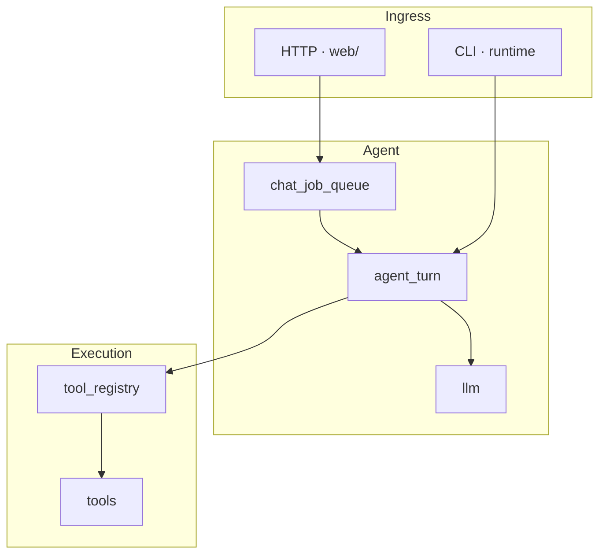

**Languages / 语言:** [中文](../开发文档.md) · English (this page)

# Developer guide (architecture overview)

For **contributors and maintainers**: major modules and data flow. **No** per-file source tree (goes stale; use `src/lib.rs` and topic docs).

| Topic | Doc |
|-------|-----|
| Usage / quick start | **`README.md`** |
| Config / env | **`docs/en/CONFIGURATION.md`** |
| CLI and HTTP routes | **`docs/en/CLI.md`** |
| SSE / AG-UI | **`docs/en/SSE_PROTOCOL.md`** |
| Built-in tools | **`docs/en/TOOLS.md`** |
| Turn display order | **`docs/Turn布局设计.md`** (Chinese authoritative) |
| Debug | **`docs/en/DEBUG.md`** |
| Frontend layout | **`docs/frontend/`** (pointers in this repo) · source [crabmate-client `frontend/`](https://github.com/noisystreet/crabmate-client/tree/main/frontend) |

## Documentation and collaboration (summary)

- **TODOLIST**: open items only; remove when done; history in Git.
- **User-visible changes**: update **`README.md`**; protocol boundaries → **SSE_PROTOCOL**.
- **Architecture changes**: update **Main modules** + Mermaid below; see **`.cursor/rules/architecture-docs-sync.mdc`**. Keep this page an **overview**—put deep detail in design docs, not here.
- **Quality**: `.pre-commit-config.yaml`; Conventional Commits (bilingual subject in this repo).
- **Deps**: `deny.toml` + CI when touching manifests / lockfiles.

## Overview

- **Backend** (`src/` + workspace crates): OpenAI-compatible chat, agent turns, HTTP/SSE, tools, workspace, sessions.
- **Official UI** (Client [frontend](https://github.com/noisystreet/crabmate-client/tree/main/frontend)): Leptos + WASM (Trunk); this repo’s `serve` is **API-only by default**; host SPA with **`--with-web`** + **`CM_WEB_STATIC_DIR`**. Local checkouts default to sibling `../crabmate-client` (Playwright forwarding honors **`CRABMATE_CLIENT_DIR`**).
- **CLI / TUI** (`runtime/`): share **`run_agent_turn`** and tool execution with Web.
- **Dev / package container** (optional): root **`Dockerfile`** is a **toolchain** image on **Ubuntu 24.04** (Rust + `cargo-deb`; glibc **2.39** / deb `libc6 (>= 2.39)`; not a production runtime). `docker build -t crabmate-dev .` (use `--network=host` only if DNS fails) then `docker run --rm -it -v "$PWD":/workspace -w /workspace crabmate-dev`, or **`make package-docker`**. UI/Trunk stays in Client.

## Architecture

### Process and layers

Single **Tokio** process: Axum HTTP + `runtime` CLI; shared `AgentConfig`, tools, `run_agent_turn`.

1. **Ingress**: `web/`, `serve` / `cli_run`
2. **Orchestration**: `chat_job_queue`, `agent/` (`agent_turn`, pipelines, `per_coord`, workflow)
3. **Model**: `llm` (`complete_chat_retrying` → backend → `api::stream_chat`), vendors
4. **Tools**: table-driven tools, `tool_registry`, optional sandbox, `tool_result`
5. **Contracts**: `cm_types` / `cm_config` / `cm_llm` / `cm_agent`, `cm_api_contract` (HTTP JSON + OpenAPI schemars), `cm_sse_protocol`, `cm_web_host` (handler shell re-exports)

```mermaid
flowchart TB
  subgraph entry [Ingress]
    WEB["HTTP · web/"]
    CLI["CLI · runtime"]
  end
  subgraph agent [Agent]
    Q[chat_job_queue]
    AT[agent_turn]
    LL[llm]
  end
  subgraph exec [Execution]
    TR[tool_registry]
    TS[tools]
  end
  WEB --> Q --> AT
  CLI --> AT
  AT --> LL
  AT --> TR --> TS
```

### Configuration

`AgentConfig`: TOML shards + `CM_*` → `finalize`. Embedded **`config/llm_vendors.toml`** (vendor matchers, `models` lists, outbound caps; not `[agent]` hot-reload). Before HTTP, outbound `chat/completions` flatten or inline **`/uploads/`** and workspace **`@` raster refs** as **`data:`** per catalog **`image_url_content_parts`** (session does not store base64; files live in **`chat_uploads/`** beside the session store). **`POST /config/reload`** hot-reloads most fields. Details: **CONFIGURATION**.

### Agent main loop (mental model)

- Call **`llm::complete_chat_retrying`** from business code (do not bypass via `api::stream_chat` from `agent`).
- **P / R / E**: plan → reflect / final-answer gate → tool execute.
- Message transforms: `message_pipeline` / `context_window`. **`agent/context_compaction`** estimates the final request from this round’s actual tools plus vendor-shaped messages, reserves output and safety tokens, and compacts only complete `ConversationTurnGroup` units. Count/character fallbacks also preserve `assistant.tool_calls` / `tool` chains. Timeline sidecars are removed before the default **256-message** fallback is applied; `context_trim.detail` carries soft before/after Token totals, component counts, counting source, and compaction reason.
- Runtime path: **session_mode → (Act utterance keyword heuristics) → `assess_turn_routing` → ReAct outer loop**; phase vocabulary in **`phase_vocabulary`**; design: **`docs/design/per_state_machine_consolidation.md`**.

### Web streaming (summary)

`POST /chat/stream` → queue → `TurnRunner` → LLM SSE → tools → SSE control plane. Authority: **SSE_PROTOCOL**; layout: **Turn布局设计** (§15 debt, §16 Phase E).

### Observability (summary)

`observability` / tracing; optional `TracingChatTurn`; `CM_LOG_JSON`. Pipeline counters via **`GET /status`** (see OpenAPI / handlers—not enumerated here).

## Main modules (by responsibility)

Update this table when top-level duties or crate boundaries change. **Do not** maintain per-file indexes here. Tools → **TOOLS.md**; HTTP → **CLI.md**.

| Area | Responsibility |
|------|----------------|
| **`agent/`** | Turn orchestration, pipelines, `per_coord`, workflow glue |
| **`llm/`** | Retried completion, vendor, streaming API (`cm_llm`) |
| **`tools/`** / **`tool_registry/`** | Implementations, dispatch, approval, timeouts |
| **`sse/`** | Control-plane payloads (`cm_sse_protocol`; `protocol` has no tokio) |
| **`web/`** | Axum, `AppState`, domain routes; JSON DTOs in **`cm_api_contract`**, handlers re-exported via **`cm_web_host`** |
| **`chat_job_queue/`** | `/chat*` queue and workers |
| **`config/`** | Load, finalize, hot reload (`cm_config`) |
| **`workspace/`** | Path policy and safe opens |
| **`memory/`** | Long-term memory / optional semantic index |
| **`runtime/`** | Ops CLI exit codes, export, bench glue (`cm_runtime`) |
| **`tool_result/`** | Tool output envelopes |
| **`cm_types`** | Messages, tools, gateway presets (`protocol`) |
| **`cm_agent`** | Intent, outer-loop FSM, completion core; root `agent/` hosts IO |
| **`cm_turn_layout`** | Canonical Turn → Web/TUI projection (`protocol`; W3 deferred — [`crates_io_single_package.md`](../design/crates_io_single_package.md)) |
| **`cm_approval`** | Web tool approval + SSE |
| **`cm_chat_export`** | Export envelope (raw / display, `protocol`) |
| **`observability`** | Tracing init |

Implementations live under `src/cm_*` with root composition in `src/{agent,llm,runtime,web,…}`. crates.io **stable** is still **`crabmate` `0.4.0`**; this tree is **`0.5.0-alpha.3`** (git **`v0.5.0-alpha.3`**, not published to crates.io). **Public surface:** `protocol` exports only the six `cm_*` contract modules (no `types`/`sse` aliases); server composition is `agent` / `config` / `llm`. Domain modules without a module-level re-export are `pub(crate)`; the rest are `#[doc(hidden)]` (**not** a semver promise — see [`crates_io_single_package.md`](../design/crates_io_single_package.md) §2.4). Forbidden edges: **`scripts/check-crate-deps.sh`**, **`docs/design/crate_dep_policy.md`**, **`web_host_extract.md`**.

## Frontend (summary)

UI **source is not in this repo** (path A). Leptos CSR lives under Client [`frontend/src/api/`](https://github.com/noisystreet/crabmate-client/tree/main/frontend/src/api) + [`sse_dispatch`](https://github.com/noisystreet/crabmate-client/tree/main/frontend/src/sse_dispatch); design notes: **`docs/frontend/ARCHITECTURE.md`**. Build: clone [crabmate-client](https://github.com/noisystreet/crabmate-client) as a sibling, then `cd ../crabmate-client && make frontend`.

Authority: prefs → `/user-data/prefs`; sessions → in-memory + per-workspace `web_sessions.json`; streaming tail → `stream_text_overlay` (merged on finish). Use overlay-aware helpers for full display text.

## Data and persistence (summary)

- **Sessions**: default workspace SQLite; can disable.
- **Workspace**: shared root with tools / `POST /workspace`; `.crabmate/` for reminders/exports.
- **User data**: `/user-data/*` → `$XDG_DATA_HOME/crabmate` (**`docs/design/user_data_dir.md`**); **not** browser `localStorage` for sessions/prefs/LLM overrides.
- **Desktop**: use local `serve` `/user-data`.

## Common extension points

- **New tools**: table + schema + **TOOLS.md**; non-trivial policy in `tool_registry`; **security-sensitive-surface**.
- **SSE / HTTP**: sync Rust, protocol crate, frontend, docs (**api-sse-chat-protocol**).
- **Config / routes**: README, CONFIGURATION, CLI.
- **Side orchestration**: hang on existing P/R; see **`run_loop_state_ownership.md`**, **`audience_critic_role.md`**.
- **System prompt assembly**: **`docs/design/system_prompt_assembly.md`** (L0–L8).

## Further reading

`docs/design/` (agent_turn_split, turn_host_decouple, client_shell_split + client_shell_split_todo + client_contract_versioning, **client_display_crate_sink**, **crates_io_single_package**, per_state_machine_consolidation, run_loop_state_ownership, system_prompt_assembly, crate_dep_policy, **long_running_tool_execution_todo**, …), **`docs/规划执行验证架构.md`**. This page is an entry index only.
