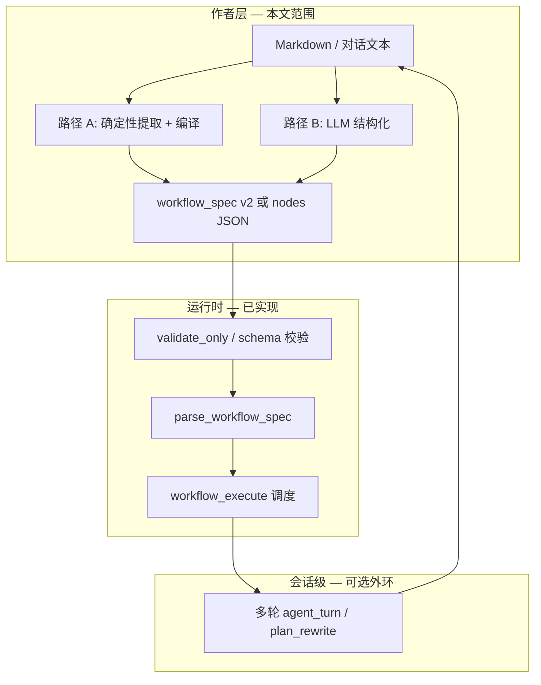
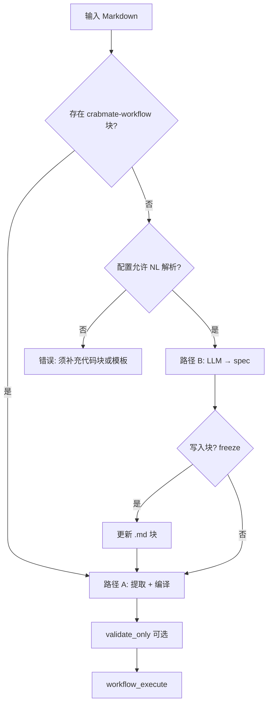

# 工作流 Markdown 作者层：两种路径对比与演进设计

**状态**：设计稿（**未**承诺实现时间表）。**受众**：维护者、产品与协议设计者。  
**语言**：中文（暂无独立英文全译本）。  
**关联**：

- 轮内 DAG 能力边界、FSM/分支/循环原则 → **`docs/工作流编排架构.md`**
- 运行时 JSON 契约、`workflow_execute` / `validate_only` → **`docs/工具说明.md`**
- 会话级规划—执行—验证 → **`docs/规划执行验证架构.md`**
- 源码：`src/agent/workflow/`（**`parse_workflow_spec`**、模板、调度）

---

## 1. 背景与动机

当前 CrabMate 已支持：

| 能力 | 入口 | 说明 |
|------|------|------|
| 手写 DAG | `workflow_execute` 的 `workflow.nodes` + `deps` | 解析见 **`parse.rs`**，规格见 **`model.rs`** |
| 内置模板 | `workflow.workflow_template` | `rust_ci_light`、`code_review`、`refactor_precheck` 等 |
| 仅校验 | `workflow.validate_only: true` | 返回拓扑层、节点表，不执行工具 |
| 占位符 | `{{node_id.output}}` 等 | 节点间注入（见工具说明） |

用户希望用**接近自然语言**的方式描述流程（含分支、循环叙事），同时仍走现有 **DAG 执行器**（审批、补偿、trace、`workflow_node_id` 对齐）。

本文定义 **「作者层（Author Layer）」**：把 Markdown（或对话中的 MD 片段）变成 **`WorkflowSpec` 可消费的中间表示**，再交给既有 **`workflow_execute`**。作者层 **不** 替代调度器，也 **不** 在单轮 DAG 内引入无界环（与 **`工作流编排架构.md` §4.3** 一致）。

---

## 2. 分层模型（统一用语）



| 层 | 职责 | 确定性 |
|----|------|--------|
| **作者层** | 可读、可版本管理、可 review | 路径 A 高；路径 B 依赖模型 |
| **编译层**（建议新增） | `workflow_spec` → `workflow.nodes`；`when` / `for_each` 展开 | 必须 100% 可复现 |
| **运行时** | 拓扑、并行、审批、补偿、trace | 已实现 |

**原则**：无论路径 A 还是 B，**执行前**必须经过 **`parse_workflow_spec` + `workflow_tool_args_satisfy_required`**（及未来的 spec schema）；**禁止**「模型直接输出可执行 DAG 且跳过校验」作为唯一路径。

---

## 3. 路径 A：Markdown + 确定性代码块（编译器）

### 3.1 形态

工作区或仓库内文件，例如 `examples/workflows/ci_from_markdown.md`（或工作区 `.crabmate/workflows/ci.md`）：

```markdown
# Rust 轻量 CI

提交前在仓库根跑 fmt → check → clippy → test。

```crabmate-workflow
version: 2
workflow:
  fail_fast: true
  steps:
    - id: fmt
      label: 格式化检查
      tool: cargo_fmt
      args: { check: true }
    - id: clippy
      label: Clippy
      tool: cargo_clippy
      after: [fmt]
      args: { all_targets: true }
```
```

**围栏标识**：`crabmate-workflow`（info string 精确匹配；大小写敏感，与 CommonMark 惯例一致）。

**块内语法**：首版推荐 **YAML**（人类友好）；可选接受 **JSON**（`version` 字段区分）。块内根对象对齐 **`workflow_execute` 的 `workflow` 键** 或独立的 **`workflow_spec`** 包装（见 §6）。

### 3.2 处理流水线

1. **`extract_md_workflow_blocks(path | text)`**  
   - 扫描 fenced code block；仅处理 `crabmate-workflow`。  
   - 同一文件多块时：默认 **按出现顺序** 视为独立工作流；或要求 front matter 指定 `workflow_id`（Phase 2）。

2. **`parse_workflow_spec_yaml(bytes)`** → `serde_json::Value`（与现有 JSON 入口汇合）。

3. **`compile_workflow_spec(spec)`**（新模块，建议 `src/agent/workflow/compile_spec.rs`）  
   - 将 `steps[]` 的 `after` / `when` / `for_each` 编译为 **`nodes[]` + `deps`**。  
   - 编译期强制 **`max_items` / `max_iterations`** 上限。  
   - 输出与手写 DAG **同形**，供 **`parse_workflow_spec`** 消费。

4. **`workflow.validate_only`**（可选）→ 展示 `execution_layers` 给用户或 CI。

5. **`workflow_execute`**（实际执行）。

### 3.3 优点

| 点 | 说明 |
|----|------|
| **可复现** | 同文件、同版本编译器 → 同一 DAG；适合 CI、`crabmate workflow validate` |
| **可 diff** | Git review 聚焦代码块，而非整段 prose |
| **安全** | 无任意代码执行；仅声明工具名与 args |
| **离线** | 不消耗 LLM；适合 air-gapped |
| **与现网一致** | 编译产物即今日 `workflow.nodes` 语义 |

### 3.4 缺点与缓解

| 缺点 | 缓解 |
|------|------|
| 作者仍需学习块内 YAML | 提供 snippet、LSP/JSON Schema 校验、`doctor` 子命令 |
| 纯 prose 段落不参与执行 | 正文仅文档；或 Phase 2 用 LLM **仅生成块**（见 §5） |
| 动态分支需 `when` 或 choice 节点 | 与 **`工作流编排架构.md` Phase 2** 对齐；MVP 可静态展开 |

### 3.5 建议入口（实现时）

| 入口 | 行为 |
|------|------|
| CLI | `crabmate workflow validate path.md` / `run path.md --dry-run` |
| 工具 | `workflow_from_file`：`{ "path": "...", "validate_only": true }` |
| Web | 工作区浏览器打开 `.md` → 预览编译后的层图（只读） |

三端共用 **`compile_spec` + `parse_workflow_spec`**（符合 **CLI/TUI/Web 共享逻辑** 规则）。

---

## 4. 路径 B：Markdown + 大模型解析

### 4.1 形态

**纯自然语言** MD（可无代码块），或 **正文 + 由模型补全的代码块**：

```markdown
# 发布前检查

1. 先看 git diff（含 staged）
2. 跑 cargo clippy（all targets）
3. 若 clippy 失败，再 cargo test
4. 对改动列表里最多 10 个 .rs 文件各跑 rust_file_outline
```

模型输出（强制 JSON 围栏或 tool result）：

```json
{
  "workflow_spec": {
    "version": 2,
    "workflow": { "fail_fast": false },
    "steps": [ "..."]
  }
}
```

或（仅简单串行、无 `when` 时）直接：

```json
{
  "workflow": {
    "nodes": [ "..."]
  }
}
```

**推荐**：优先让模型产出 **`workflow_spec` v2**，由 **同一编译器** 生成 `nodes`，避免模型手写 `deps` 出错。

### 4.2 处理流水线

1. **输入**：文件路径、粘贴文本、或对话 turn 中的用户消息。  
2. **LLM 调用**（专用短请求或 Agent 子步）：  
   - System：工具白名单、禁止密钥、`max_items` 规则、输出 schema。  
   - User：Markdown 全文 + 可选工作区上下文（**不**含 API key）。  
   - 参数：**低温**、**`max_tokens` 上限**、优先 **JSON mode**（若后端支持）。  
3. **提取**：从回复中 parse JSON / 写入 `` ```crabmate-workflow ``。  
4. **与路径 A 汇合**：`compile_workflow_spec` → `validate_only` → `workflow_execute`。  
5. **可选落盘**：`--freeze` 将生成块写回 MD，下次走路径 A。

### 4.3 优点

| 点 | 说明 |
|----|------|
| **作者体验** | 产品、测试、运维可用母语写流程 |
| **从 prose 到结构** | 适合探索期、一次性流水线 |
| **与 Agent 一体** | 对话中「帮我按这个 md 跑一遍」无需手写 JSON |
| **分支叙事** | 模型擅长把「如果…则…」译为 `when` 或展开节点 |

### 4.4 缺点与缓解

| 缺点 | 缓解 |
|------|------|
| **非确定性** | 默认 `validate_only` + 用户确认；`--freeze` 落盘块 |
| **幻觉工具名** | `workflow_tool_args_satisfy_required` + 未知工具硬失败 |
| **成本与延迟** | 缓存编译结果；仅无块时调 LLM |
| **安全** | 不把 MD 全文打进 info 日志；侧向请求 fail-closed 可选（配置） |
| **审计难** | 记录 `workflow_run_id` + 输入 hash + 模型 id，不记录密钥 |

### 4.5 与现有 Agent 能力的关系

| 模式 | 说明 |
|------|------|
| **隐式（今日可做）** | 用户贴 MD，模型直接 `workflow_execute` 手写 `nodes` | 缺统一 schema，易漂移 |
| **显式（推荐）** | 新工具 `workflow_from_markdown` 或编排提示词要求先出 `workflow_spec` 再执行 | 可测、可 validate |
| **外环循环** | 「直到测试通过」用 **多轮 `agent_turn`** + 每轮小 DAG，而非单次解析无限循环 | 与 P-E-V 一致 |

**`final_plan_semantic_check`** 类侧向 LLM 仅用于**规划一致性**，不替代 workflow 编译；若对「解析结果 vs 用户 MD」做语义检查，应单独开关并 **fail-open/fail-closed** 在配置中写明（默认建议 **fail-closed 仅阻止执行、不静默改 DAG**）。

---

## 5. 推荐：混合策略（生产默认）



| 配置键（建议） | 含义 |
|----------------|------|
| `workflow_author_mode` | `deterministic_only` \| `llm_fallback` \| `llm_always` |
| `workflow_llm_freeze_on_success` | 解析成功后是否写回围栏块 |
| `workflow_spec_max_steps` | 编译后节点数硬顶 |
| `workflow_for_each_max_items` | `for_each` 默认与上限 |

**严格环境**（CI、受信工作区）：`deterministic_only`。  
**交互环境**（Web/REPL）：`llm_fallback`（无块才调模型）。

---

## 6. 中间表示：`workflow_spec` v2（草案）

与现有 **`workflow.nodes` 对象/数组** 并存；编译后仅保留 `nodes`。

```yaml
version: 2
workflow:
  fail_fast: true
  max_parallelism: 4
steps:
  - id: diff
    label: 查看改动
    tool: git_diff
    args: { mode: all }
  - id: clippy
    label: Clippy
    tool: cargo_clippy
    after: [diff]
    args: { all_targets: true }
  - id: test_on_clippy_fail
    label: Clippy 失败时补跑测试
    tool: cargo_test
    when:
      from: clippy
      branch: failure   # 编译为 choice / 条件边，见工作流编排架构 Phase 2
    after: [clippy]
  - id: outlines
    tool: rust_file_outline
    for_each:
      from: diff
      json_path: "/changed_rs_paths"  # 或固定工具输出 schema
      max_items: 10
```

**字段约定（摘要）**：

| 字段 | 必填 | 说明 |
|------|------|------|
| `id` | 是 | 稳定节点 id，满足现有 `workflow_node_id` 字符规则 |
| `label` | 否 | 仅展示；进入 trace `display_name`（扩展） |
| `tool` / `args` | 是 | 与工具 registry 一致 |
| `after` | 否 | 串行依赖；编译为 `deps` |
| `when` | 否 | 守卫；MVP 可要求「守卫工具 + choice」或静态两支展开 |
| `for_each` | 否 | 须有 `max_items`；编译为有界节点链 |
| `requires_approval` / `node_tool_role` | 否 | 透传到 **`WorkflowNodeSpec`** |

**禁止**：块内 shell、任意表达式语言、`while` 无上限。

**示例夹具**：`fixtures/workflows/`（纯 YAML 与带围栏的 `.md`）；实现 `compile_spec` 后对照同目录 `*.expected.json` 跑金样测试（见 §11）。

### 6.1 分支（YAML）

分支在作者层用 **`when`** 或集中式 **`kind: choice`** 表达；**不**在 YAML 里写 `if (expr)`。执行层由调度器根据**前驱节点结果**（或守卫工具的结构化 JSON）**剪枝**，未选分支在 **`trace`** 中记为 **`skipped`**（见 **`docs/工作流编排架构.md` §4.2**）。

#### 6.1.1 `when` + `branch`：成功 / 失败二分支

适用：「A 失败才跑 B」「A 成功才通知」。

```yaml
version: 2
workflow:
  fail_fast: false   # 有失败分支时通常关闭，避免 fail_fast 在分支判断前截断整图
steps:
  - id: clippy
    tool: cargo_clippy
    args: { all_targets: true }

  - id: test_on_fail
    label: 仅 clippy 失败时跑测试
    tool: cargo_test
    after: [clippy]
    when:
      from: clippy
      branch: failure    # success | failure

  - id: notify_ok
    label: 仅 clippy 通过时（示例）
    tool: diagnostic_summary
    after: [clippy]
    when:
      from: clippy
      branch: success
```

| `when.branch` | 含义（`from` 节点结束后） |
|---------------|---------------------------|
| `success` | 工具成功且无未捕获错误 |
| `failure` | 工具失败、超时或策略视为失败 |

夹具：`fixtures/workflows/02_branch_when_success_failure.yaml`。

#### 6.1.2 `when` + `match`：多路分支（守卫工具输出）

适用：「根据 classify 结果走 hotfix / feature / skip」。前驱须输出**固定 schema**（如 `{ "branch": "hotfix" }`），编译器只支持 **`equals`** / **`in`**（首版），不支持任意表达式。

```yaml
steps:
  - id: classify
    tool: diagnostic_summary
    args: {}

  - id: hotfix_flow
    tool: git_diff
    after: [classify]
    when:
      from: classify
      match:
        field: branch
        equals: hotfix

  - id: feature_flow
    tool: cargo_test
    after: [classify]
    when:
      from: classify
      match:
        field: branch
        equals: feature

  - id: noop_skip
    tool: diagnostic_summary
    after: [classify]
    when:
      from: classify
      match:
        field: branch
        in: [skip, none]
```

| `match` 键 | 说明 |
|------------|------|
| `field` | 前驱工具结果 JSON 内的字段路径（点分或 JSON Pointer，实现时二选一并在文档固定） |
| `equals` | 标量相等 |
| `in` | 枚举列表命中其一 |

夹具：`fixtures/workflows/03_branch_when_match.yaml`。

#### 6.1.3 `kind: choice`（可选语法糖）

多路分支表集中在一处；**编译期**展开为带 `when` 的普通 `steps`，运行时仍走同一 choice 调度器。

```yaml
steps:
  - id: lint
    tool: cargo_clippy
    args: { all_targets: true }

  - id: route
    kind: choice
    after: [lint]
    branches:
      - when: { from: lint, branch: success }
        steps:
          - id: ship
            tool: git_diff
      - when: { from: lint, branch: failure }
        steps:
          - id: fix
            tool: cargo_fmt
          - id: retest
            tool: cargo_test
            after: [fix]
```

夹具：`fixtures/workflows/07_choice_node.yaml`。

#### 6.1.4 今日可用：手写 `workflow.nodes`（无 `when`）

**已实现**：`parse_workflow_spec` 只认 **`workflow.nodes` + `deps`**，**不会**按成功/失败剪枝，只会按依赖顺序调度。

```yaml
workflow:
  fail_fast: false
  nodes:
    - id: check
      tool: cargo_clippy
      tool_args: { all_targets: true }
      deps: []
    - id: test
      tool: cargo_test
      tool_args: {}
      deps: [check]
```

「仅失败才跑 test」在今日须靠：**(a)** 接受 test 总在 check 之后执行，或 **(b)** 等 `when` 落地，或 **(c)** 会话外环由 Agent 再发一轮更小 DAG。

夹具：`fixtures/workflows/08_nodes_only_today.yaml`（可直接 `validate_only`）。

---

### 6.2 循环（YAML）

单轮 DAG **禁止无界环**。循环只允许 **编译期展开** 为有界节点序列（或同层并行批），对应 **`for_each`** 与 **`repeat`**。

#### 6.2.1 `for_each`：对集合逐项

```yaml
steps:
  - id: diff
    tool: git_diff
    args: { mode: all }

  - id: outline_each
    tool: rust_file_outline
    after: [diff]
    for_each:
      from: diff
      json_path: "/changed_rs_paths"
      item_var: path
      max_items: 10          # 必填；缺省则编译错误 WORKFLOW_COMPILE_FOR_EACH_UNBOUND
    args:
      path: "{{path}}"
```

| `for_each` 键 | 必填 | 说明 |
|---------------|------|------|
| `from` | 是 | 提供数组的前驱 step `id` |
| `json_path` | 是* | 从前驱工具结果 JSON 取数组（*或与 `static_items` 二选一） |
| `static_items` | 否 | 作者显式字符串列表（仍受 `max_items` 约束） |
| `item_var` | 否 | 默认 `item`；展开时替换 `args` 内 `{{item_var}}` |
| `max_items` | 是 | 硬上限；超出编译失败或截断并写 `trace` 警告（实现时择一并在文档固定） |
| `parallel` | 否 | 默认 `false`（串行 `outline_0 → outline_1 → …`）；`true` 时同层 `deps: [diff]` + 受 `max_parallelism` 约束 |

编译结果（概念）：`outline_each_0` … `outline_each_{n-1}`，**无**回边。

夹具：`fixtures/workflows/04_loop_for_each.yaml`。

#### 6.2.2 `repeat`：固定次数

```yaml
steps:
  - id: flaky_test
    tool: cargo_test
    repeat:
      count: 3
      stop_on: success    # success：任一轮成功则不再生成后续节点；never：跑满 count
    args: {}
```

| `repeat` 键 | 说明 |
|-------------|------|
| `count` | 1–`workflow_repeat_max`（配置顶，建议默认 ≤ 5） |
| `stop_on` | `success` \| `never` |

编译为 `flaky_test_1` → `flaky_test_2` → …（链式 `deps`），**不是** `while`。

夹具：`fixtures/workflows/05_loop_repeat.yaml`。

#### 6.2.3 禁止写法与替代

```yaml
# ❌ 不支持
while:
  condition: tests_pass
  body: [cargo_test]
```

| 需求 | 替代 |
|------|------|
| 最多试 N 次 | `repeat: { count: N, stop_on: success }` |
| 直到 CI 全绿（次数未知） | **多轮 `agent_turn`** / 每轮 `workflow_template: rust_ci_light` / `plan_rewrite` |
| 很长文件列表 | `for_each` + 较小的 `max_items` |

#### 6.2.4 分支 + 循环组合

夹具：`fixtures/workflows/06_branch_and_loop_combined.yaml`（`for_each` → `clippy` → `when` 失败分支 → `repeat`）。

---

### 6.3 字段速查（分支 / 循环）

| 场景 | YAML | 编译产物（概念） |
|------|------|------------------|
| 串行 | `after: [id]` | `deps: [id]` |
| 成功/失败 | `when.branch` | choice 剪枝 + `skipped` trace |
| 多路 | `when.match` / `kind: choice` | 互斥 `steps` 展开 |
| 遍历 | `for_each` + `max_items` | `id_0…id_{n-1}` |
| 重试 | `repeat.count` | `id_1…id_count` 链 |
| 无界 while | — | **拒绝编译** |

---

## 7. 两种路径对比总表

| 维度 | 路径 A：确定性块 | 路径 B：LLM 解析 |
|------|------------------|------------------|
| **输入** | `` ```crabmate-workflow `` | Prose MD 或 A+B 混合 |
| **确定性** | 高 | 低（可 freeze 后变高） |
| **实现核心** | 提取器 + `compile_spec` | Prompt/schema + 同上编译器 |
| **CI 友好** | 是 | 仅 freeze 后 |
| **分支/循环** | 声明式 `when` / `for_each` | 模型翻译为同上；须编译器落地 |
| **失败模式** | YAML/编译错误，信息 локаль | 模型拒答、JSON 破损、工具幻觉 |
| **密钥风险** | 低（静态文件） | 中（勿把 .env 贴进 MD） |
| **与模板关系** | 块内可写 `workflow_template: rust_ci_light` + overlay | 模型可选用模板名减少 token |
| **观测** | `workflow_run_id` + 源文件 path:line | 外加 `author_source=llm`、input_hash |

---

## 8. 分支、循环与「直到通过」（摘要）

YAML 写法详见 **§6.1–§6.3** 与 **`fixtures/workflows/`**。两种作者路径**共享** **`docs/工作流编排架构.md`** 的边界：

| 用户叙事 | 作者层表达 | 执行层 |
|----------|------------|--------|
| 「clippy 不过就跑 test」 | `when: { from: clippy, branch: failure }` | choice 剪枝（Phase 2）；MVP 见 §6.1.4 |
| 「每个改动文件跑 outline」 | `for_each` + `max_items: 10` | 展开为 N 个节点 |
| 「直到 CI 全绿」 | **不**编译为单 DAG 环 | 多轮 Agent + 每轮 `workflow_execute` 或 `rust_ci_light` 模板 |

LLM 路径的额外风险：模型生成**无界** `for_each` → 编译器 **拒绝**，错误码建议 **`WORKFLOW_COMPILE_FOR_EACH_UNBOUND`**。

---

## 9. 安全、审批与可观测性

| 主题 | 要求 |
|------|------|
| **工具白名单** | 编译后仍走现有 registry；`run_command` 等受审批与 explain 约束 |
| **路径** | `workflow_from_file` 仅允许工作区内相对路径（与 `read_file` 同类规则） |
| **日志** | 记录块序号、spec version、编译后节点数；**不**记录完整 MD 若含用户机密 |
| **审批** | 动态 `when` 引入后须 **惰性审批**（见编排架构 §6） |
| **trace** | 编译阶段事件：`workflow_compile_start/end`；skipped 分支须可见 |
| **SSE** | 若 Web 展示「编译预览」，用控制面事件，**不**污染正文 delta（见 api-sse 规则） |

---

## 10. 演进阶段（建议）

| 阶段 | 内容 | 路径 |
|------|------|------|
| **P0** | 本文 + `workflow_spec` v2 示例 fixture；`extract_md_workflow_blocks` 单测 | A |
| **P1** | `compile_spec`：仅 `after` 串行 + 模板 overlay；CLI `workflow validate` | A |
| **P2** | `when` + trace skipped；`for_each` 有界展开 | A |
| **P3** | `workflow_from_markdown` 工具 + `llm_fallback` 配置 | B |
| **P4** | freeze 写回 MD；Web 预览层图 | A+B |
| **P5** | 工作区 `.crabmate/workflows/*.md` 发现与 `doctor` 检查 | A |

**非目标**：Markdown 内嵌任意 Rust/Python；单轮 DAG 内 `while(true)`；用 LLM **直接调度**工具而不经 `workflow_execute`。

---

## 11. 测试策略

| 类型 | 内容 |
|------|------|
| **单元** | 提取围栏、YAML 错误行号、`compile_spec` 展开与上限 |
| **金样** | `fixtures/workflows/*.yaml` + `*.expected.json`（`compile_spec` 落地后 `cargo test workflow_compile_golden`） |
| **集成** | `validate_only` 对编译产物通过；未知工具失败 |
| **LLM** | 可选 mock：固定 prose → 期望 spec 快照（不默认跑 live API） |

---

## 12. 文档与代码同步义务

实现时须更新：

- **`docs/工具说明.md`**：新工具、`workflow_spec` 字段、错误码  
- **`docs/工作流编排架构.md`**：choice / `for_each` 与编译器关系  
- **`docs/开发文档.md`**：`agent/workflow/` 索引行  
- **`docs/命令行与路由.md`**（若有 CLI 子命令）  
- **`.cursor/rules/api-sse-chat-protocol.mdc`**（若 Web 增加编译预览事件）

---

## 13. 相关源码索引

| 区域 | 路径 |
|------|------|
| DAG 规格 | `src/agent/workflow/model.rs` |
| 解析 | `src/agent/workflow/parse.rs` |
| 模板 | `src/agent/workflow/workflow_templates.rs` |
| 调度 | `src/agent/workflow/execute/` |
| 工具分发 | `src/agent/workflow_tool_dispatch.rs` |
| Schema | `src/tools/schema_check.rs` |
| 规划对齐 | `src/agent/plan_artifact.rs` |

**建议新增**：`src/agent/workflow/compile_spec.rs`、`src/agent/workflow/md_extract.rs`、`runtime/cli_workflow.rs`（或 `cli` 子模块）。

---

## 14. 修订记录

| 日期 | 摘要 |
|------|------|
| 2026-05-16 | 初稿：路径 A（确定性围栏 + 编译器）与路径 B（LLM → spec）对比、混合策略、`workflow_spec` v2 草案、安全/测试/演进阶段。 |
| 2026-05-16 | 增补 §6.1–§6.3 分支/循环 YAML 专节；`fixtures/workflows/` 示例与 `01_serial_after.expected.json`。 |
