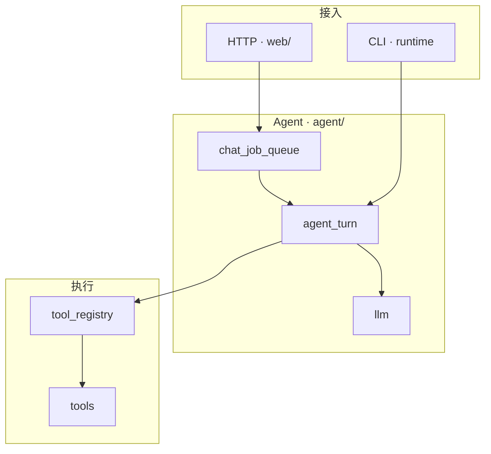
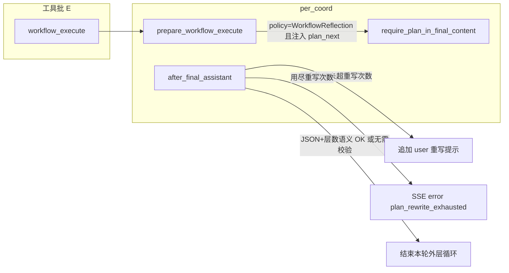

**语言 / Languages:** 中文（本页）· [English](en/DEVELOPMENT.md)

# 开发文档（架构概要）

本文面向**二次开发/维护**，说明 **CrabMate 的主要模块与数据流**；**不**逐文件罗列源码树。功能使用见 **`README.md`**；配置与环境变量见 **`docs/配置说明.md`**；CLI 与 HTTP 路由见 **`docs/命令行与路由.md`**；SSE 契约见 **`docs/SSE协议.md`**；内置工具说明见 **`docs/工具说明.md`**。

## 文档与协作约定（摘要）

- **`docs/待办清单.md`**：仅保留未完成项；完成后删除条目，历史以 Git 为准。
- **用户可见变更**：同步 **`README.md`**；协议或架构边界变化时更新本文及 **`docs/SSE协议.md`**（若涉及）。
- **架构级变更**：若增删 `src/lib.rs` 顶层模块或调整分层职责，须更新本文「主要模块」与 **Mermaid** 图，并遵守 **`.cursor/rules/architecture-docs-sync.mdc`**。
- **提交与质量**：根目录 **`.pre-commit-config.yaml`**（`cargo fmt`、根与 **`frontend/`** 的 **`cargo clippy -D warnings`**（暂存含 `frontend/` 时）、复杂度棘轮等）；提交说明 **Conventional Commits**，见 **`.cursor/rules/conventional-commits.mdc`**。
- **依赖与许可证**：改动 **`Cargo.toml`** / **`Cargo.lock`** 时核对 **`deny.toml`** 与 CI，见 **`.cursor/rules/dependencies-licenses.mdc`**。

## 总览：系统组成

- **Rust 后端（`src/`）**：OpenAI 兼容 **`chat/completions`**、Agent 主循环、HTTP API（含 SSE）、工具执行、工作区与会话等。
- **Web 前端（`frontend/`）**：Leptos + WASM，Trunk 打包；静态资源由后端提供。交互与 SSE 消费细节见 **`frontend/README.md`**、**`docs/frontend/ARCHITECTURE.md`**（若存在）。
- **CLI（`runtime/cli` 等）**：REPL / `chat` / `serve` 等入口与 **`run_agent_turn`** 共用同一套编排与工具。

## 架构设计

### 进程与分层

单体 **Tokio** 进程：**Axum** 提供 HTTP；**`runtime/`** 提供 CLI；共享 **`AgentConfig`**、**`tools`**、**`run_agent_turn`**（实现主要在 **`agent::agent_turn`**）。

**自外而内：**

1. **接入**：HTTP 路由与 handler（**`web/`**）、**`serve`** / **`cli_run`**。
2. **编排**：对话排队（**`chat_job_queue`**）、Agent 回合（**`agent/`**：**`agent_turn`**、上下文与消息管道、**`per_coord`**、可选分层 **hierarchy**、工作流 **workflow**）。
3. **模型**：共享 **`http_client`**、**`llm`**（**`complete_chat_retrying`** → 默认 **`OpenAiCompatBackend`** → **`api::stream_chat`**）、厂商适配 **vendor**。
4. **工具**：表驱动 **tools**、按名分发 **tool_registry**、可选 Docker 沙盒 **tool_sandbox**、结构化结果 **tool_result**。
5. **契约**：**types**（OpenAI 兼容消息）、**sse**（控制面与版本 **`crabmate-sse-protocol`**）、**config**。

### 配置

运行态 **`AgentConfig`** 由多段 TOML / 环境变量合并并经 **`finalize`** 校验；**`POST /config/reload`** 可热更新多数字段（会话库路径等例外见 **`config/hot_reload`**）。

### Agent 主循环（心智模型）

- **调用模型**：业务侧统一经 **`llm::complete_chat_retrying`**；**不要**在 **`agent`** 里绕过它直接打 **`api::stream_chat`**（测试与 **`llm`** 内部除外）。
- **P / R / E**：**P** = 向模型要一轮输出；**R** = 助手消息后的反思/终答门控（**`reflect`**、**`per_coord`**）；**E** = **工具执行**（**`execute_tools`** → **tool_registry** / **workflow**）。
- **消息变换**：出站供应商正文前的 strip/normalize 在 **`message_pipeline`** / **`context_window`**，与 **`llm::api`** 出站兜底一致。

### Web 流式对话（概要）

`POST /chat/stream` → **`ChatJobQueue`** → **`run_agent_turn`** → **`llm`** SSE → 若有 **`tool_calls`** 则 **串行或并行只读批** 执行工具 → 结果以 **`role: tool`** 写回 → 控制面事件经 **`sse::protocol`** 下发。详细事件键与错误码以 **`docs/SSE协议.md`** 为准；前后端字段变更须同步 **`frontend`** 与 **`crabmate-sse-protocol`**。

### 可观测性（概要）

**`observability`**：初始化 tracing；默认日志时间戳为本机本地时区（RFC3339）。Web 任务可有 **`TracingChatTurn`**（**`chat_turn`** span：**`job_id`**、**`conversation_id`**、**`outer_loop_iteration`**、工具展示的短 **`tool_call_id`** 标签等）。JSON 日志 **`CM_LOG_JSON`**。

---

## 主要模块一览（按职责，非文件清单）

| 区域 | 职责 |
|------|------|
| **`agent/`** | 单轮与多轮编排：**`agent_turn`**（外层循环、分阶段规划 **staged**、**`staged_plan_intent_gate`**（可选 **`staged_plan_intent_gate_advisory_bypass=true`** 时在架构/重构咨询启发式下绕过分阶段）、意图门控、工具执行 **execute_tools**）、**`context_window`** / **`message_pipeline`**、**`per_coord`**（终答与工作流协调）、**`workflow`**（DAG）、可选 **`hierarchy`**（分层 Manager/Operator）。 |
| **`llm/`** | **`complete_chat_retrying`**、请求构造、**vendor** 适配、**`api`** HTTP/SSE。 |
| **`tools/`** | Function Calling 工具实现、**`run_tool`**、Schema 与 **tool_specs_registry**。 |
| **`tool_registry/`** | 按工具名分发、并行策略、Web/CLI 审批与超时。 |
| **`sse/`** | **`SsePayload`**、编码、流 hub、与前端对齐的控制面分类（见协议 crate）。 |
| **`web/`** | Axum 路由、**`AppState`**、chat/workspace/tasks/upload/status 等 handler。 |
| **`chat_job_queue/`** | `/chat` 与 `/chat/stream` 排队与 worker。 |
| **`config/`** | 加载、合并、**finalize**、热重载。 |
| **`workspace/`** | 工作区路径策略与安全打开（与工具、Web 一致）。 |
| **`memory/`** | 长期记忆、可选语义索引等。 |
| **`runtime/`** | REPL、chat 单次、**`chat_export`**、TUI 桥接、benchmark 辅助等。 |
| **`tool_result/`** | 工具输出信封、与 SSE **`tool_result`** 对齐。 |
| **`types/`** | OpenAI 兼容消息与请求类型；含 **`message_lineage`**（派生消息来源，不落盘）、**`chat_api`**。 |
| **`observability.rs`** | tracing 初始化与 **`TracingChatTurn`**。 |

**细分源码路径**（如 **`agent_turn/staged`**、**`tools/file`**）请在仓库内按模块浏览或检索；本文不再维护「逐文件索引」表，以免与 **`lib.rs`** 的 `mod` 列表重复且易过时。

---

## 前端（`frontend/`）

Leptos CSR：**`api`** / **`sse_dispatch`** 消费 SSE；**`app/`** 聊天与工作区 UI；**`message_format`** 与渲染管线。组件拆分与依赖约定见 **`docs/frontend/ARCHITECTURE.md`**（若仓库中存在）。构建：**`cd frontend && trunk build`**。

---

## 数据与持久化（概要）

- **会话**：内存或 SQLite（**`conversation_store`**）；可选会话条目不写入供应商请求的规则见 **`message_pipeline`**。
- **工作区**：工具与 **`POST /workspace`** 共用当前工作目录；**`.crabmate/`** 下可有提醒、导出等（详见 **`README`** / **`docs/配置说明.md`**）。
- **前端**：**`localStorage`** 存主题、部分 LLM 草稿等；**会话列表**按 **`GET /workspace` 返回的根路径**分桶（键派生见 **`frontend/src/storage.rs`** 的 **`sessions_json_storage_key`**，与旧版默认键 **`agent-demo-sessions-v1`** 并存）；切换工作区时换桶加载（见 **`session_workspace_partition.rs`**）。

---

## 常见扩展点

- **新工具**：在 **tools** 表驱动注册 + Schema + **`docs/工具说明.md`**；复杂执行策略时在 **tool_registry** 登记；遵守 **`.cursor/rules/security-sensitive-surface.mdc`**。
- **SSE / API 变更**：同步 **Rust 路由**、**`crabmate-sse-protocol`**、**前端 dispatch**、**`docs/SSE协议.md`**（见 **`.cursor/rules/api-sse-chat-protocol.mdc`**）。
- **新 HTTP 路由或配置键**：同步 **`README.md`**、**`docs/配置说明.md`** 与本节若涉及架构叙述。

---

## 上下文管道（观测）

同步消息管道（**`message_pipeline::apply_session_sync_pipeline`**）在每轮 **P** 步前改写会话侧 `messages`；**阶段顺序**与实现细节见 **`src/agent/message_pipeline.rs`** 模块文档及下文「**上下文窗口策略**」条目。

- **`GET /status`**：返回 **`message_pipeline_trim_count_hits`**、**`message_pipeline_trim_char_budget_hits`**、**`message_pipeline_tool_compress_hits`**、**`message_pipeline_orphan_tool_drops`**，均为**自进程启动以来**的累计命中次数（**非**单会话），用于对照配置是否实际触发了按条数/字符裁剪、工具正文压缩、孤立 `tool` 丢弃等逻辑。
- **日志**：**`RUST_LOG` 含 debug**（如 **`crabmate=debug`**）时 **`context_window`** 在每轮 P 步前打一行汇总 **`message_pipeline session_sync: …`**；更细可设 **`RUST_LOG=crabmate::message_pipeline=trace`**，每步一行 **`session_sync_step`**（`stage=`、`message_count=`、`non_system_chars_est=` 等），无需把全局日志开到 trace。
- **配置告警**：**`config::finalize`** 在 **`context_char_budget > 0`** 且 **`context_min_messages_after_system >= max_message_history`** 时 **`warn`**：按字符删旧消息在「条数上限已吃满」时往往难以生效，宜检查 **`CM_CONTEXT_*`** / **`max_message_history`** 等组合（键说明见 **`docs/配置说明.md`**）。

### 系统提示词动态组装（目标架构与现状）

本节描述 **CrabMate 如何把「系统提示」与各类注入拼进 `messages`**：既是**维护者心智模型**，也是后续重构时的**目标分层**。实现散布在 **`config/finalize`**、**`AgentConfig::system_prompt_for_new_conversation`**、Web **`chat_handlers/chat/turn_build`**、**`context_bootstrap/conversation_turn_bootstrap`**、**`tool_stats::ToolOutcomeRecorder::augment_system_prompt`**、**`agent_turn`**（意图门控 / 分阶段规划）等；三端应共用同一套**语义**（允许入口层薄封装差异）。

#### 设计原则

1. **P0 · 优先级（冲突时）**：安全与不可逆约束 → 用户明确指令 → **编排层**短时约束（意图门控、规划轮 coach）→ 项目规则（Cursor-like）与 Skills → 运行时统计类附录（工具成功率提示等）。**凡动态组装中出现条文冲突，均须服从本条裁决顺序（P0）。**
2. **`system` 与「注入消息」分流**：**长期稳定**的角色准则、项目规则 → 尽量落在**会话首条或持久 `system`**。**易与用户口语混淆、或仅本轮有效**的约束 → 用 **服务端注入**的独立消息承载（专用 `user` 正文前缀、`system_intent_gate_hint`、分阶段规划的 planning system / ensemble **`user`** 等），与 **`staged_plan_nl_followup_user_body`** 类文案的设计动机一致（见 **`agent_turn/staged/sse.rs`** 注释）。
3. **与用户内容的隔离**：用户输入、工具输出默认**不写回**首条 `system`；工作区规则 / Skills 视为「可信附录」，但仍需按 **`security-sensitive-surface`** 把工作区当信任边界。
4. **与工具契约一致**：`system` / coach 中对「能否调用某工具、只读/写入边界」的描述须与 **`tool_registry`**、各工具 JSON Schema、以及 **`sub_agent_policy` / `executor_kind`** 收窄语义一致，避免模型误以为可执行却被服务端拒绝。
5. **长度预算**：**`cursor_rules_max_chars`**、**`skills_max_chars` / `skills_top_k`**、上下文管道 **`context_char_budget` / `max_message_history`** 等共同约束可见历史；规则合并截断时已有「不得假定未出现条文」类提示（**`config/cursor_rules.rs`**）。
6. **可观测**：调试时可结合 **`GET /status`**、**`message_pipeline`** / **`context_window`** 日志；排查「模型为何偏」应核对**最终送入供应商的 `messages` 切片**（经 **`conversation_messages_to_vendor_body`**），而非仅磁盘上的会话 JSON。

#### 逻辑块（概念编号）

下列 **L0–L9** 为概念分层，便于讨论与演进；**不等于**代码中的单一结构体。

| 块 | 典型来源 | 组装时机 | 代码入口（锚点） |
|----|----------|----------|------------------|
| **L0 全局基底** | **`system_prompt` / `system_prompt_file`** | **`config::finalize`** | **`config/finalize.rs`** |
| **L1 项目规则** | **`.cursor/rules/*.mdc`**、可选 **`AGENTS.md`** | **`finalize`**：**`merge_system_prompt_with_cursor_rules`** | **`config/cursor_rules.rs`** |
| **L2 全局 Skills** | **`.crabmate/skills`**（目录扫描） | **`finalize`**：**`merge_system_prompt_with_skills`** | **`config/skills.rs`** |
| **L3 命名角色** | **`config/agent_roles.toml`** → 每角色 **`system_prompt_file`** / 内联正文 | **`finalize_agent_role_catalog`**：每角色再跑 L1+L2（ Skills 选用 **`merge_system_prompt_with_skills_selected`**，占位查询为空串） | **`config/agent_roles.rs`** |
| **L4 运行时附录** | **`thinking_avoid_echo_appendix`**（或内置附录）；**`agent_tool_stats`** 窗口统计 | **进程运行中**：首条 `system` 构建路径调用 **`ToolOutcomeRecorder::augment_system_prompt`** | **`tool_stats.rs`** |
| **L5 Web 本轮 Skills** | 工作区 Skills + **当前用户消息** top-k | Web **`build_messages_for_turn`**（新会话与续聊刷新首条 `system` 时） | **`web/chat_handlers/chat/turn_build.rs`** · **`builtin_skills.rs`** |
| **L6 首轮工作区上下文** | 项目画像 / living docs / 依赖摘要等 | **首条专用 `user`**（非 `system`），**`compose_new_conversation_messages`** | **`context_bootstrap/conversation_turn_bootstrap.rs`** · **`project_profile`** |
| **L7 意图门控** | **`intent_turn_gate_hint`**（只读 / 澄清 / 确认等） | **外层循环 P 步前**：**`Message::system_intent_gate_hint`** | **`agent_turn/intent/at_turn_start.rs`** · **`agent_turn/outer_loop.rs`** |
| **L8 分阶段规划** | **`staged_plan_phase_instruction`** 或 **`staged_plan_phase_instruction_default`**；**`plan_ensemble`** B/C/合并注入 | **无工具规划轮**：独立 planning **`system`** + 注入 **`user`** | **`agent_turn/staged/mod.rs`** · **`staged/sse.rs`** · **`plan_ensemble.rs`** |
| **L9 记忆与其它注入** | 长期记忆 strip、变更集等 | **`prepare_messages_for_model` / 管道前后** | **`memory`**、**`agent_turn`**、**`message_pipeline`**（各子路径） |

**运行时选用**：**`AgentConfig::system_prompt_for_new_conversation`**（**`src/config/types/mod.rs`**）在 **L3** 已展开的角色正文与全局 **`roles_prompts.system_prompt`** 之间选择；调用方再叠 **L4**（及 Web 的 **L5**）。

#### 会话生命周期中的顺序（摘要）

1. **配置装载**：L0 → L1 → L2 →（每条角色）L3。  
2. **新会话首条消息**：**`system`** = `system_prompt_for_new_conversation(role)` + **L4**（+ Web **L5**）；随后可选 **L6** `user`；再跟真实用户 `user`。  
3. **续聊（Web）**：若请求带 **`agent_role`** 或与持久化不一致，**`maybe_apply_mid_session_agent_role_switch`** 可能**重写首条 `system`**（**`agent_role_turn.rs`**），再叠 **L4** / **L5**。  
4. **从磁盘恢复会话**：**`workspace_session`** 等路径会用**当前配置**替换首条 `system`，避免陈旧 prompt 常驻（见模块注释）。  
5. **每一轮 Agent**：**L7**（如有）→ **`prepare_turn_messages_for_model`** → 若走分阶段规划则插入 **L8**；**L9** 按配置插入。

#### 按工作区与用户提问的动态组装：效果预期与风险

**与「是否改善 agent 表现」的关系**：在多数场景下**可能有益**，前提是动态块**提高相关性、减少噪声**，且不把过时信息或与本节 **P0 优先级**相冲突的指令硬塞进 `messages`；**并非**「越动态、越长就一定更好」。

**潜在收益**

- **降低无关指令权重**：固定超长 **L0–L1** 中与当前任务无关的条文会稀释模型注意力；按**项目形态**与**用户本轮意图**选材或裁剪，通常有利于「做对当下事」。
- **增强 grounding**：在 token 预算内注入与工作区相关的约定（构建方式、目录与命令习惯等），有助于减少路径/命令类胡编（仍须与 **`tool_registry` 白名单**及 **工作区安全边界**一致，见 **`.cursor/rules/security-sensitive-surface.mdc`**）。
- **更合理利用预算**：在 **`cursor_rules_max_chars`**、**`skills_max_chars` / `skills_top_k`**、**`context_char_budget` / `max_message_history`** 等约束下，用与本轮 **query** 更相关的片段替代泛化说明，往往优于在 **system** 中堆叠全局手册。

**主要风险（须在产品与运维上缓解）**

- **检索 / 选材错误**：误判意图或命中过时 profile 时，模型会以错误前提推理；应有**降级**（无可靠命中时减少注入或只用短默认说明，避免硬塞噪声）。
- **行为抖动与难复现**：同一用户相似问题若每轮首条 **system** 差异过大，输出稳定性与排障成本上升。
- **延迟与费用**：每轮额外读盘、向量化或全仓扫描会抬高首包时间；动态块过长会**挤压**对话历史与 **tool** 有效载荷。
- **削弱稳定纪律**：若频繁**整段**重写首条 **system**，可能稀释安全、输出格式、工具边界等应长期稳定的约束；与上文 **P0** 一致：**宜保留短而稳的基底（L0 及必要的 L1 纪律段），用 L5 / L6 等块做动态补充**，而非把整条 **system** 每轮替换为空壳。

**与当前实现（L0–L9）的对应**

- **已具备的工作区 + 用户语境驱动**：Web **L5**（**`skills_top_k`** 按**当前用户消息**从 **`.crabmate/skills`** 选材，**`web/chat_handlers/chat/turn_build`** · **`builtin_skills`**）；**L6** 首轮将项目画像、living docs、依赖摘要等以**专用 `user`** 注入（与首条 **system** 分工，**`context_bootstrap/conversation_turn_bootstrap`**）；**L1** 在 **finalize** 时并入 **`.cursor/rules`**（及可选 **`AGENTS.md`**）。配置变更可走 **`POST /config/reload`**（不写盘的密钥等除外，见 **`docs/配置说明.md`**）。
- **当前未提供**：统一的「每请求任意自定义回调 → 改写首条 **system**」插件点；更强动态策略属于下文 **演进方向** 或在 **`build_messages_for_turn` / CLI 首条 system 路径**上的工程扩展。

**实践建议（与 P0、上文「`system` 与注入分流」一致）**

- **system**：承载人格、安全与工具契约等**相对稳定**内容；**首轮项目上下文（L6）**与 **按轮 Skills（L5）** 承载易变、检索增强内容；避免 **system** 与 **L6 `user`** **重复粘贴**同一长篇事实以节省预算并减少自相矛盾。

配置键与环境变量逐项说明仍以 **`docs/配置说明.md`** 为准（「上下文与工具消息」等）。

#### 演进方向（可选）

下列项为**工程化改进**，不要求与当前代码一一对应：

- **块注册表**：为 L4–L8 建立「块 id → 启用条件 → 拼接顺序」表，收敛散落常量字符串。  
- **显式模板变量**：对角色 id、工作区根路径说明等提供占位符，减少文档重复与漂移。  
- **版本指纹**：prompt 文件或相关配置变更时输出可日志关联的版本号，便于对照线上行为。  
- **回归测试**：对「组装后的关键子串 / 块边界」做脱敏 golden，防止无意删掉门控句。  
- **强动态策略的统一入口**：若需「工作区快照 + 用户 query → 附加 **system** / **user** 块」的通用扩展，宜集中在 Web **`build_messages_for_turn`** 与 CLI **首条 system** 同源语义的一层，并内置失败降级与可观测性（参见上文「按工作区与用户提问的动态组装」）。

## `src/` 代码模块索引

> **维护约定**：增删 `lib.rs` 顶层 `mod`、调整目录/文件职责边界、或改变工具/路由/工作流的调用关系时，应同步更新**本节表格**与上文**架构设计**（含 Mermaid 是否与现状一致）。Cursor 规则见 **`.cursor/rules/architecture-docs-sync.mdc`**。

### 顶层模块（与 `src/lib.rs` 中 `mod` 声明一致）

| 路径 | 职责摘要 |
|------|----------|
| `agent/` | **`hierarchy` · `ManagerAgent::reflect_and_replan(ReflectAndReplanContext)`**（`ReflectAndReplanContext` 聚合失败子目标、验证信息、LLM 与 artifacts 等）：验证失败反思；首轮 **JSON 解析失败** 时再发**一次**无工具、**低温**「仅修 JSON」补叫；反射落地的 acceptance 在写入 Manager 前经 **`sanitize_reflection_acceptance`** 与 `GoalVerifier::run_verify_command` 对齐（相对路径、`sh -c` 等子 shell 串拒绝）。**`acceptance/`**：`AcceptanceSpec` / `verify_against_spec`、`json_path_resolve`（JSON Pointer + `$` 遗留 path）供 **`step_verifier`**（分阶段步验收）与 **`GoalVerifier`**（子目标 `GoalAcceptance`）共用判定内核。**`agent_turn/`**：主循环（Web + CLI 经 `run_agent_turn`）；**`run_dispatch`**（`run_agent_turn_common` 的薄分发：**`dispatch_hierarchical_turn`** / **`dispatch_non_hierarchical_turn`**（非分层下经 **`intent/staged_planning_gate`** 的 **`assess_staged_planning_gate_full_pipeline`** 产出 **`StagedPlanningGateOutcome`**）、**`execute_non_hierarchical_main_route`**（**`NonHierarchicalMainRoute`** 与三条子路径一一对应））；**`turn_orchestration`**（**`TurnOrchestrationMode`** / **`NonHierarchicalMainRoute`** / **`NonHierarchicalEntryResolution`** / **`resolve_non_hierarchical_main_route`**，与 `run_dispatch` 非分层主路径对齐，供 **`tracing`** 排障）；**`hierarchical_intent_route`**（分层 **`ProceedExecute`** 后 **`HierarchicalPostIntentRoute`** 纯函数）；子模块 **`errors`**（**`RunAgentTurnError`** / **`AgentTurnSubPhase`**：将 **`llm::LlmCompleteError`** 映射为 SSE 语义与 **`sub_phase`**）、**`plan`**（**P** 步：源码 **`plan/plan_call`**、**`plan/agent_llm_call`**、**`plan/planner_sse_gate`**；**`per_plan_call_model_retrying` 等** 仍经 **`agent_turn` 再导出**）、**`intent`**（回合起点：源码 **`intent/user`** / **`intent/at_turn_start`** / **`intent/staged_planning_gate`**；库路径仍为 **`agent_turn::intent_user`** / **`agent_turn::intent_at_turn_start`** 等）、**`messages`**（助手合并/分隔线）、**`staged/sse`**、**`params`**（**`RunLoopParams`**：`RunLoopCtx` 整场接入与配置快照 + **`RunLoopTurnState`** 可变 `messages` / `sub_phase` / **`TurnPlannerHints`**（意图时间线去重、门控临时 system、`step_executor_constraint`）/ 模型与温度覆盖；**`llm_transport_opts`**）、**`reflect`**（R）、**`execute_tools`**（E / `per_execute_tools_common`；`execute/tools/run_command_guard.rs` 负责 `run_command` 失败分类与 Cargo 预检；**`workflow_execute`** 经 **`workflow_tool_dispatch`** 调度，**不**经 **`tool_registry::dispatch_tool`**）、**`outer_loop`**（**`run_agent_outer_loop`**：**`outer_loop_fsm`**=`single_agent_outer`、**`outer_loop_step`**，源码 **`OuterLoopIterationPhase`**）、**`staged`**（分阶段与逻辑双 agent；`staged/patch_planner.rs` 收敛补丁规划轮与反馈文案；`staged/turn_fsm.rs` 回合级编排、`staged/planner_round_fsm.rs` ensemble/优化轮门控、`staged/planner_parse_fsm.rs` 解析失败/no_task 省略）、**`staged_orchestrator`**（定稿规划后 **`staged_plan_started` / 队列首条 notice**）、**`sub_agent_policy`**（分步可选 `executor_kind` 收窄工具列表并在 E 步拒绝越权，附允许工具名摘要；**`[tool_registry] sub_agent_*`** 可扩补丁/测试/只读拒绝名单）；**`plan_optimizer`**：分阶段首轮规划后的可选无工具「步骤优化」user 文案与回复解析；**`plan_ensemble`**：`staged_plan_ensemble_count`>1 时的逻辑多规划员注入文案与合并轮解析；**`message_pipeline`**：`apply_session_sync_pipeline`（工具压缩→条数/字符裁剪→孤立 tool→合并 assistant）、`conversation_messages_to_vendor_body`（会话切片→供应商 `messages`：strip UI/长期记忆与 reasoning + `types::normalize_…`）；**`context_window`**：在管道之上做可选 LLM 摘要与 `prepare_messages_for_model` 入口；**`reflection/plan_rewrite`**：终答规划重写 user 文案、`workflow_validate` 历史扫描、侧向校验**摘要**拼装与用尽原因分类（**不**调 `complete_chat_retrying`）；**`per_coord`**（**`final_plan_gate`**）：`PerCoordinator` 状态与 `after_final_assistant` / `prepare_workflow_execute` 协调；**`per_plan_semantic_check`**：侧向一致性 **LLM**；**`plan_artifact`** / **`workflow_reflection_controller`**；**`workflow_tool_dispatch`**：**`workflow_execute`** 与 **`PerCoordinator`** / **`workflow::run_workflow_execute_tool`** 的接合；**`workflow/`**：DAG 工作流；**`execute/`**（**`trace`** / **`retry`** / **`node`**（占位符、审批、按工具类型超时与退避重试）/ **`schedule`** / **`report`** / **`compensation`**）；**`chrome_trace`**（可选 Chrome Trace JSON）；`WorkflowApprovalMode::Interactive` 对应 Web SSE 审批通道。 |
| `agent_errors.rs` | Web / CLI 共用的 **`run_agent_turn`** 错误串启发式：**`is_user_cancelled_run_agent_error`**（与 **`LLM_CANCELLED_ERROR`** 对齐）、**`is_quota_or_rate_limit_llm_message`**（与 **`runtime::cli_exit::classify_model_error_message`** 共用，避免配额/限流子串判断漂移）。 |
| `agent_role_turn.rs` | **多角色工作台**：`maybe_apply_mid_session_agent_role_switch`（已有 Web 会话且请求 **`agent_role`** 与持久化不一致时刷新首条 `system`）、**`turn_allow_for_web_or_cli_job`**（按请求/持久化/`default_agent_role_id` 解析 **`allowed_tools`** 白名单）、**`filter_tools_for_agent_role`** / **`tool_calls_allow_parallel_for_role`** / **`turn_tool_denied_message`**；供 **`chat_job_queue`**、**`lib::run_agent_turn`**、**`tool_registry::dispatch_tool`**、**`agent_turn::execute_tools`** 共用。 |
| `chat_job_queue/` | **目录聚合（顶层 `mod chat_job_queue`）**：Web `/chat`、`/chat/stream` 有界队列与并发上限；**`mod.rs`** 为队列句柄与入队参数类型；**`stream_finish.rs`** 为流式回合收尾（**`post_turn_web_prepare_and_save`**、**`stream_job_outcome_after_agent_turn`**、`final_response` 兜底等）；**`worker.rs`** 为 **`run_stream_queued_job`** / **`run_json_queued_job`**；**`tests.rs`** 为单元测试。运行中任务的 `PerTurnFlight` 注册供 `GET /status` 的 `per_active_jobs`；入队参数为 **`StreamSubmitParams`** / **`JsonSubmitParams`**：**`WebChatJobEnvelope`**（**`job_id`**、`Arc<WebChatQueueDeps>`、`Arc<AppState>`、会话消息与 revision、角色、覆盖与审计等 Web/JSON 共用字段）+ 路径专有 **`reply_tx`**（JSON）或 **`stream_event_tx`** / **`web_approval_session`**（SSE）。**`Arc<WebChatQueueDeps>`**（`cfg` / `api_key` / `client` / `tools` / `chat_queue` / `long_term_memory` / `sse_stream_hub`，与 **`AppState`** 中会话/上传等字段解耦）及 **`Arc<AppState>`**（会话落盘、审批会话表）。另含 **`request_agent_role`** / **`persisted_active_agent_role`**、可选 **`WebChatLlmOverride`**（来自 JSON **`client_llm`**），在执行 **`run_agent_turn`** 前与快照 **`AgentConfig`** / 进程 **`api_key`** 合并（仅该任务，不写盘）。流式与 JSON 成功路径共用 **`post_turn_web_prepare_and_save`**；JSON 失败经 **`ChatJsonJobFailure`** 回传 **`chat_handlers`**，与 SSE 同源使用 **`RunAgentTurnError::http_api_error`** / **`sse_error_payload`**（稳定 **`code`**、用户可见 **`message`** / SSE **`error`**；SSE 的 **`reason_code`** 较宽，JSON **`ApiError.reason_code`** 仅 **`INTERNAL_ERROR`**；worker 侧 **`tracing`** 拼接 **`RunAgentTurnError::diag_log_kv()`**）。 |
| `clarification_questionnaire.rs` | **澄清问卷**协议与校验：内置工具 **`present_clarification_questionnaire`** 成功后，**`execute_tools`** 经 **`emit_tool_result_sse_and_append`**：有 SSE **`out`** 时在 **`tool_result` SSE** 之后补发 **`clarification_questionnaire`**；无 SSE 时可调用 **`RunLoopIo::clarification_questionnaire_hook`**（经 **`RunLoopCtx::io`**；**`crabmate tui`** 打开全屏表单并入队）。Web **`POST /chat*`** 可选 **`clarify_questionnaire_answers`**；TUI 经 **`repl_dispatch_chat_round`** 的 **`clarify_answers_for_next_user_message`** 与 **`expand_at_file_refs_in_user_message`** 后的正文合并（**`merge_user_text_with_clarification_answers`**）。 |
| `cargo_metadata.rs` | 工作区内 **`cargo metadata`** 子进程 **`Command` 构造**的单一真源（**`--format-version=<n>`**、可选 **`--no-deps`**、**`current_dir`**）；供 **`tools::cargo_tools::cargo_metadata`**、**`context_bootstrap::project_profile`** / **`context_bootstrap::project_dependency_brief`**、**`tools::release_docs::license_notice`** 共用，避免参数分叉。 |
| `workspace/` | **目录聚合（顶层 `mod workspace`）**：路径策略、Unix 根内打开、会话变更集、**`tasks_side`**（侧栏任务进程内存表，与 Web **`GET`/`POST /tasks`**、**`ProcessHandles::workspace_tasks_by_path`** 同源）；子文件见下行 **`workspace/path.rs`** / **`workspace/fs.rs`** / **`workspace/changelist.rs`**。Rust 路径：`crate::workspace::{path, fs, changelist, tasks_side}`。 |
| `cli_run.rs` | CLI **`run()`** 编排体：调用 **`config::cli::parse_args`**、**`observability::init_tracing_subscriber`**，按子命令 early-return（doctor / mcp / save-session / tool-replay / plugin / dry-run / models|probe），以及加载配置后 **`cli_run_session`**（**`serve`** / **`bench`** / **`chat` / `repl` / `tui`**）；**`serve`**（`AppState`、上传清理任务）内会话 SQLite / 长期记忆 / Bearer 相关读配置拆至 **`cli_run_serve.rs`**；**`lib::run`** 薄转发至此。 |
| `cli_run_serve.rs` | **`serve`** 路径专用：**`ConversationBacking`**（内存或 SQLite）、**`LongTermMemoryRuntime`** 选用、**`web_api_require_bearer=true`** 时非空密钥启动校验、Bearer 层开关与 bind 侧鉴权标志读取（供 `run_serve_branch` 组装 `AppState` 与 axum）。 |
| `cli_run_session.rs` | **`init_cli_session_start`**（加载配置后构造 HTTP 客户端、工具表、`ProcessHandles`）与 **`run_cli_main_routes`**（`serve` / `--benchmark` / `chat` / `tui` / `repl` 分流）；供 **`cli_run::run`** 调用以降低主入口圈复杂度。 |
| `context_bootstrap/` | **目录聚合（顶层 `mod context_bootstrap`）**：首轮 living docs、项目画像、依赖摘要与 **`conversation_turn_bootstrap`**；子文件见下行 **`context_bootstrap/*.rs`**。 |
| `memory/` | **目录聚合（顶层 `mod memory`）**：备忘片段、语义索引、长期记忆存储；子文件见下行 **`memory/*.rs`**。 |
| `memory/codebase_semantic_index/` | **`codebase_semantic_search`**：工作区内文本分块 + **fastembed** 向量 + SQLite **FTS5**（**`crabmate_codebase_chunks_fts`** `content=` 外挂 **`crabmate_codebase_chunks`**，触发器同步）写入同一库（与长期记忆分库）；**`crabmate_codebase_files`** 存每文件指纹供**整库**增量重建（**`codebase_semantic_rebuild_incremental`**，**`incremental:false`** 强制全量）；**子目录** **`path`** 仍为子树替换。`.rs` 嵌入前有符号提示行。**`query`** 默认 **hybrid**（**α×cosine + (1-α)×fts_norm**，**`codebase_semantic_hybrid_alpha`** / 工具 **`hybrid_alpha`**），可选 **`semantic_only`** / **`fts_only`**；**`fts_top_n`**、**`hybrid_semantic_pool`**、**`query_max_chunks`** 控制候选规模。schema **v4**。实现分层：**`params`** / **`schema`** / **`numeric`** / **`rebuild`** / **`search`**；入口 **`mod.rs`** 为 **`run_tool`**。`run_agent_turn` 在 **`codebase_semantic_search_enabled=false`** 时移除该工具。 |
| `memory/codebase_semantic_invalidation.rs` | 串行工具批中：写工具成功或 **`workspace_changed`** 后按工具参数删除向量块并同步删 **`crabmate_codebase_files`** 对应行，或整表清空（与 **`read_file`** 缓存清空时机对齐）；**`delete_dir`** / **`create_dir`** 按目录前缀删；见 **`codebase_semantic_invalidate_on_workspace_change`**。 |
| `meta_dialogue.rs` | 元对话追问（如「我刚才问了什么」）时，在 **`outer_loop_prepare_planner_context`** 首轮 **P** 前向 **`TurnPlannerHints.intent_turn_gate_hint`** 追加说明，引导先复述上一条真实 **user** 正文；与 **`Message::system_intent_gate_hint`** 同源注入并由 **`is_intent_gate_ephemeral_system`** 清理。 |
| `config/` | **组合式 **`AgentConfig`**（**`config/types/mod.rs`** + **`config/types/agent_config_sections.rs`**）**、编译嵌入 **`config/default_config.toml`** + **`config/session.toml`** + **`config/context_inject.toml`** + **`config/tools.toml`** + **`config/sandbox.toml`** + **`config/planning.toml`** + **`config/memory.toml`** + 用户文件 TOML、可选 **`config/agent_roles.toml`**（或 **`--config`** 同目录 **`agent_roles.toml`**）与环境变量覆盖、**`cli/`**（`mod.rs` 再导出；**`definitions`**：`clap` 派生与 **`ParsedCliArgs`**；**`parse`**：`parse_args` / `parse_args_from_argv`；**`legacy_argv`**：`normalize_legacy_argv`；进程日志初始化在 crate 根 **`observability::init_tracing_subscriber`**；**`root_clap_command_for_man_page`** 供 **`crabmate-gen-man`** 生成 **`man/crabmate.1`**；`parse_args`→`io::Result<ParsedCliArgs>` 具名字段含 **`agent_role_cli`** 等）；默认 **`system_prompt_file`** 指向 **`config/prompts/default_system_prompt.md`**（运行时读盘，相对路径相对 cwd / 各配置文件目录 / `run_command_working_dir` 解析）；内联 **`system_prompt`** 在仅写内联时会清除继承的 `system_prompt_file`。加载后仍可按 `cursor_rules_*` / `CM_CURSOR_RULES_*` 拼接工作区规则文件，并按 `skills_*` / `CM_SKILLS_*` 拼接 **`.crabmate/skills/*.md`**（支持 `skills_top_k` 按用户输入选取 Top-K 注入）。**多角色**：`[[agent_roles]]` / `agent_roles.toml` 落成 **`AgentConfig::roles_prompts.agent_roles`**（`id → AgentRoleSpec`：合并后 **`system_prompt`** + 可选 **`allowed_tools`**）与 **`default_agent_role_id`**；**`AgentConfig::system_prompt_for_new_conversation`** 供 Web **`build_messages_for_turn`** 与 CLI 首条 system 解析。内部拆分：**`config/types/`**（配置与枚举类型；**`web_api_bearer_token` / `web_search_api_key`** 为 **secrecy `SecretString`**，`Debug` 不落明文，取值用 **`ExposeSecret::expose_secret`**，`config` 再导出 **`ExposeSecret`**）、`config/source.rs`（TOML 段解析；**`serde(deny_unknown_fields)`** 拒绝 **`[agent]`** / **`[tool_registry]`** / 角色表中的未知键）、`config/assembly.rs`（嵌入默认分片合并顺序与实现）、`config/user_config_layers.rs`（用户 TOML 与 **`agent_roles.toml`** 侧车合并）、`config/validate.rs`（**`finalize`** 前数值范围校验：越界报错而非静默 `clamp`）、`config/agent_roles.rs`（侧车 TOML 合并与 finalize）、`config/cursor_rules.rs`（规则文件收集与拼接）、`config/skills.rs`（skills 文件收集与拼接）与 `config/workspace_roots.rs`（工作区根白名单解析）；**`config/builder.rs`**（**`ConfigBuilder`** 与 **`[agent]` / `[tool_registry]`** 段合并）、**`config/load.rs`**（**`load_config`**、**`load_config_for_cli`**：`eprintln` + **`InvalidData`**，供 **`cli_run::run`** 多子命令入口复用；库入口 **`lib::run`** 薄转发）、**`config/finalize.rs`**（**`finalize`**；**`validate_required_llm_endpoints`** / **`canonical_run_command_working_dir`** 提取；尾部标量与装配经 **`include!`** 拆到 **`config/finalize_parts/`**）、**`config/env_overrides.rs`**（**`CM_*`**；**`env_overrides_intent.rs`** / **`env_overrides_chat_queue.rs`** / **`env_overrides_part9.rs`** / **`env_overrides_per_plan_policy.rs`** / **`env_overrides_mcp_codebase.rs`** 经 **`#[path]`** 挂载；`apply_env_overrides` 仍按 **`apply_env_overrides_part_1..`** 分阶段以降低圈复杂度）、**`config/hot_reload.rs`**（**`apply_hot_reload_config_subset`**）；**`mod.rs`** 再导出 **`load_config`** / **`load_config_for_cli`** / **`apply_hot_reload_config_subset`** 与类型；**`user_config_layers`** 内含配置文件目录解析辅助。**`load_config`** 若某嵌入 shard 的 TOML 无效则返回 **`Err(String)`**（含 shard 文件名与 `toml::de::Error` 文本），不再在装载路径上 `expect`。**长期记忆**：`long_term_memory_*` 与 `CM_LONG_TERM_MEMORY_*`（见 `README.md`）；嵌入默认见 **`config/memory.toml`**（**`long_term_memory_enabled = true`、向量后端默认 `fastembed`**（本地 ONNX）；**`disabled`** 为纯时间序检索）；`finalize` 仍拒绝 **`qdrant` / `pgvector`**（尚未接外部服务）。 |
| `http_client.rs` | 进程内共享 `reqwest::Client`（连接池、超时、keepalive）。 |
| `redact.rs` | 上游 HTTP 响应体等长文本的**日志预览截断**（`preview_chars` / `single_line_preview`），供 `llm::api`、`tools::web_search` 等使用。另：**`redact_secrets_in_json_str`** 对**整段** JSON 文本做启发式密钥脱敏，供 **`turn_replay_dump`** 等落盘路径。 |
| `request_chrome_trace.rs` | 整轮 **`run_agent_turn`** 的 Chrome JSON（**`CM_REQUEST_CHROME_TRACE_DIR`** → **`turn-*.json`**）；**`RequestTurnTrace`** 经 **`RunLoopParams`** / **`CompleteChatRetryingParams`** / **`WebExecuteCtx`** / **`agent::workflow_tool_dispatch::dispatch_workflow_execute_tool`** 传递；与工作流 **`chrome_trace`** 合并时 **`maybe_write_workflow_chrome_trace(..., Some(arc))`**（工作流单独写文件时用 **`CM_WORKFLOW_CHROME_TRACE_DIR`**，见 **`agent/workflow/chrome_trace.rs`**）。 |
| `turn_replay_dump.rs` | 可选 **`CM_REPLAY_DUMP_DIR`**：**仅当环境变量设置且非空时**，每轮 **`run_agent_turn`** 执行期间在同目录**即时追加** `turn-replay-events.jsonl`（动作级 JSONL 事件）；不再写 `turn-replay-{wall_ms}.json` 快照文件。每行含 **`replay_schema_version`**（当前 **1**）与按轮单调的 **`replay_turn_seq`**（**`set_turn_replay_event_context`** 递增；同行事件共享），以及 **`seq`** / **`ts_ms`** / **`wall_start_ms`** / **`job_id`** / **`conversation_scope_id`** 等；**落盘前**对整行 JSON 字符串调用 **`redact::redact_secrets_in_json_str`**。 |
| `observability.rs` | **`init_tracing_subscriber`**：`tracing` + **`tracing-subscriber`**（**`RUST_LOG`** 与默认级别 / **`--log` 双写 stderr+文件** 与历史一致；**`tracing-log`** 桥接 `log::`）；时间戳默认 **`LocalTime::rfc_3339`**（本机时区）；**`CM_LOG_JSON`** 为真时输出 JSON 行。Web **`TracingChatTurn`**：根 span **`chat_turn`**（**`job_id`** 与 **`x-stream-job-id`** / SSE **`job_id`** 对齐；**`conversation_id`** 为截断预览并带 **`conversation_id_len`**；**`outer_loop_iteration`**；每次工具调用递增 **`tool_call_seq`**，**`tool_call_id`** 为 **`#序号·…尾部`** 展示串便于扫读，协议层仍以消息内原始 id 为准；**子 span `parallel_tool`** 的 **`tool_call_id`** 亦同款，避免嵌套 span 仍打出完整上游 id），由 **`chat_job_queue`** 创建并随 **`RunAgentTurnParams::web_chat_*`** 传入 **`run_agent_turn`**（**`Instrument`** 包裹整轮 **`run_agent_turn_common`**，可与 Chrome trace 包裹叠加）。 |
| `text_encoding.rs` | 工作区文本字节解码：**`read_file` / `extract_in_file` / `GET /workspace/file`** 共用；支持显式 **`encoding`**（`utf-8` 严格、`utf-8-sig`、常见中文区编码、`utf-16`、**`auto`**：BOM 优先否则 **chardetng** 嗅探）；用 **`encoding_rs::decode_to_string_without_replacement`**，遇 **`DecoderResult::Malformed`** 返回明确错误，避免静默乱码。 |
| `text_util.rs` | 短字符串按 Unicode 标量值截断：**`truncate_chars_with_ellipsis`**（错误摘要等）、**`truncate_str_to_max_chars`**（**`config/cursor_rules`** 规则附录硬上限）；与 **`redact`**（日志脱敏）分工不同。 |
| `text_sanitize.rs` | 用户可见正文轻量清洗（DSML 剥离、规划步骤描述自然化等）；**`materialize_deepseek_dsml_tool_calls_in_message(msg, enabled)`**：`enabled` 为 true 且不存在**可用的**原生 `tool_calls` 时，从 **`content` + `reasoning_content`** 中的 DeepSeek 风格 DSML 解析并写入 `Message.tool_calls`；物化与 **`strip_deepseek_dsml_for_display`** 前先将 **`<｜｜DSML｜｜` / `</｜｜DSML｜｜`**（及 ASCII **`<||DSML||`**）折叠为单竖线形式，避免网关偶发「双竖线」标记导致 **`extract_dsml_invokes` 为空**、出现正文像调工具却**无 `tool_calls`** 的无效轮次；**`llm::complete_chat_retrying`** 在每次成功 `stream_chat` 后按 **`AgentConfig::materialize_deepseek_dsml_tool_calls`** 调用；分阶段规划轮在丢弃网关误返回的原生 `tool_calls` 后**再次**按同一配置调用（仅从正文物化）。`enabled == false` 时不物化，强约束仅用 API `tool_calls`（与「仅一段 JSON」类结构化约定可并存为后续扩展）。 |
| `user_message_file_refs.rs` | 用户消息 **`@相对路径`**：在 Web **`POST /chat`** / **`POST /chat/stream`** 与 CLI **`repl` / `chat`**（含 **`--message-file`** 每行 `user`、**`--query`/`--user-prompt-file`**）入队模型前，经 **`tools::read_file_try_at_paths`** 展开为文末附加块（与 **`read_file`** 同源路径策略；总展开约 **512 KiB** 上限；非法 **`@/`** 等返回 **`INVALID_AT_FILE_REF`**）。Web 在未设置工作区且正文含 **`@`** 时由 **`chat_handlers`** 先返回 **`WORKSPACE_NOT_SET`**，不调用本模块。 |
| `tool_stats.rs` | **进程内全局**工具完结轻量统计（`ok` / `error_code`，与 `parse_legacy_output` 一致）；**`execute_tools::emit_tool_result_sse_and_append`** 在写入 `messages` 前 **`record_tool_outcome`**。新会话首条 **`system`** 经 **`augment_system_prompt`** 附加短 Markdown（Web **`web::chat_handlers::chat::turn_build::build_messages_for_turn`**、CLI **`resolve_system_prompt_for_chat`**、**`workspace_session::initial_workspace_messages`** / **`repl_bootstrap_messages_fast`** / **`repl_rebuild_bootstrap_messages`**；从磁盘恢复的延续会话仅刷新基底 **`system`，不拼附录）。不按会话分桶、不落盘；配置 **`agent_tool_stats_*`** / **`CM_TOOL_STATS_*`**。 |
| `health.rs` | 与 `GET /health` 一致的运行状况报告（`build_health_report`：本地项 + **`llm_http_auth_mode`** 下 **`api_key`**；**`none`** 时密钥可为空仍 **ok**）；可选 **`append_llm_models_endpoint_probe`**：配置 **`health_llm_models_probe`** 时对 **`api_base`** 复用 **`llm::fetch_models_report`**（**GET …/models**，无 completion 计费），**`health_llm_models_probe_cache_secs`** 进程内缓存；**`bearer` 且无 `API_KEY`** 时跳过并标注。CLI 依赖项含 **`dep_gh`** 等；由 **`web::chat_handlers::health_handler`** 编排。 |
| `llm/` | **`mod`**：`ChatRequest` 构造、指数退避 **`complete_chat_retrying`**（失败 **`LlmCompleteError`**；仅对 **`call_error::LlmCallError`** 中 `retryable` 为真者退避：HTTP **408/429/5xx** 及 `reqwest` 超时/连接失败；**401/400** 等 4xx 立即失败；入参含 **`ChatCompletionsBackend`**）；**`call_error`**：`LlmCallError` 与用户可见串、`http_status_retryable_for_backoff`；**`complete_error`**：**`LlmCompleteError`**（取消 / 传输 / 其它，**无**编排阶段文案）；**`chat_params`**：**`LlmRetryingTransportOpts`**、**`CompleteChatRetryingParams::new`**；**`backend`**：可插拔 **`ChatCompletionsBackend`**，默认 **`OpenAiCompatBackend`**（委托 **`api::stream_chat`**）；**`vendor`**：**`LlmVendorAdapter`**（**`llm_vendor_adapter`** 按 **`model` + `api_base`**、**`llm_vendor_adapter_for_model`** 仅按 **`model`**：内置 **`MoonshotKimiVendor`** / **`ZhipuGlmVendor`** / **`MiniMaxVendor`** / **`GenericOpenAiCompatVendor`**；出站 **`temperature`**、**`thinking`**、tool 轮是否保留 **`reasoning_content`**）；**`api`**：`chat/completions` HTTP + SSE/JSON 解析、终端 Markdown（公式见 `runtime::latex_unicode`）；CLI **`plain_terminal_stream`** 下助手 **`reasoning_content`** / **`content`** 终端分色见 **`runtime::terminal_labels`**；可选首包等待动效（**`CM_CLI_WAIT_SPINNER`**）由 **`api::stream_chat`** 与 **`runtime::cli_wait_spinner`** 衔接（stderr **indicatif**，首段 plain 输出前清除）；**`openai_models`**：CLI `models`/`probe` 用的 **`GET …/models`** 请求与解析（终端不输出响应体原文）。 |
| `workspace/path.rs` | 工作区路径**单一真源**：`WorkspacePathError`（`thiserror` 枚举：`kind()` / `user_message()` / `is_policy_denied()` 供日志与 HTTP 映射）、`absolutize_relative_under_root`（工具相对路径）、`absolutize_workspace_subpath`（Web 可绝对/相对）、`ensure_canonical_within_root`（`Path::starts_with` 分量级前缀）、`ensure_existing_ancestor_within_root`（写入路径 symlink 逃逸校验）、`resolve_web_workspace_read_path` / `resolve_web_workspace_write_path`（与 `file` 工具同边界）、`validate_workspace_set_path`（Web **`POST /workspace`** 与 REPL **`/workspace`** 绝对路径分支共用：`workspace_allowed_roots` + 敏感目录黑名单）、`validate_effective_workspace_base`（每次 Web 请求重验当前工作区根仍在 `workspace_allowed_roots` 且非敏感前缀）、`is_sensitive_workspace_path` / `is_within_allowed_roots`。`canonical_workspace_root` 供 `file` / `markdown_links` / `exec` 复用。与 **`workspace/fs.rs`** 配合：**Unix** 上在已打开根 fd 上用 **`openat2` + `RESOLVE_IN_ROOT`（Linux）** 等收窄「校验 ↔ 打开」窗口；残余风险见模块注释与 **`README`** / **`docs/配置说明.md`**。 |
| `workspace/fs.rs` | **Unix** 工作区内**打开**辅助：`open_existing_file_under_root`、`open_directory_under_root`、`open_file_write_under_root`、`unlink_file_under_root`；Linux 经 **nix** 调用 **`openat2`**（读/写/目录）与 **`unlinkat`**；非 Linux Unix 回退 `std::fs`。**`tools/file/path::resolve_for_read_open`**、**`web/workspace`** 列表与文件读写删等路径使用。依赖 **`target.'cfg(unix)'.dependencies`** 的 **nix**（`fs` + `dir`）。 |
| `runtime/` | **`tui_terminal_bridge`**（全屏 TUI 与写 stdout 子命令之间的 alternate screen 交接）、**`tui/`**（**`run_tui_session`**：**`crabmate tui`**；**`CliReplStyle::new_tui_capture`** 将 **`/`** 内建命令输出写入 transcript；**/doctor /probe /models /mcp** 经 **`tui_terminal_bridge`** 临时释放终端；工具审批走 **`CliToolRuntime::tui_blocking_approval_tx`**，入队后由 UI 线程绘制居中 **Modal**（不退出 alternate screen；**`↑↓` / jk · Enter · y/n/a · 1/2/3 · Esc**）；**未启用会话 SQLite（`conversation_store_sqlite_path` 为空）** 且 **`tui_load_session_on_start`** 为真时退出写入 **`tui_session.json`**；非空时 **`run_session/sqlite_session`**、主循环 **`session_loop`** + **`/conv`** / **`/branch`**（**`CM_TUI_CONVERSATION_ID`**）；左栏展示会话文件与会话 **`conversation_id`** 摘要；右栏展示工作区路径、快捷键，以及 **`ProcessHandles`** 提供的侧栏任务与 **`GET /workspace/changelog`** 同源摘要；**`repl_dispatch_chat_round`** 可注入 **`sse_control_mirror`**，在聊天区附录展示与 Web SSE 控制面同形的工具/规划等事件；**工作区栏聚焦时 Enter** 打开 **`workspace_modal`**（目录浏览 + 手动路径，与 Web **`POST /workspace`** / REPL **`/workspace`** 同源校验）；复用 **`repl_dispatch_chat_round`** 与 **`messages_to_transcript`** 过滤）**、`cli/`**（`mod.rs` 再导出；子模块 **`chat`** / **`commands`** / **`repl`** / **`repl_extras`** / **`repl_slash_dispatch`** / **`repl_parse`**）：`chat`（`run_chat_invocation`，消费 **`config::cli::ChatCliArgs`**：文件 system/user、整表 **`--messages-json-file`**、JSONL **`--message-file`**、**`--yes` / `--approve-commands`**）与交互式 CLI；子命令 **`save-session`**（兼容别名 **`export-session`**；**`run_save_session_command`**，读 **`tui_session.json` 或 `--session-file`**，写 **`chat_export`** 与 Web 同形）、**`tool-replay`**（**`run_tool_replay_command`**：从会话提取 **`tool_replay`** fixture / 按 **`tools::run_tool`** 重放，见 **`runtime/tool_replay.rs`**）及交互式 CLI **`/save-session`**（同子命令）与 **`/export`**（当前内存消息）；交互式 CLI **`/doctor`** / **`/probe`** / **`/models`**（**`list`** 与 **`/models choose`**）分别调用 **`cli_doctor::print_doctor_report`**、**`run_probe_cli`**、**`run_models_cli`**、**`run_models_choose_repl`**（后者拉取 **`GET …/models`** 后写入内存 **`SharedAgentConfig::model`**；与 **`crabmate doctor` / `probe` / `models`** 对齐）；**`/models`**、**`/mcp`**、**`/agent`** 的子命令由 **`runtime::cli::repl_parse`** 内静态表 **`MODELS_SUBCOMMAND_HANDLERS`** / **`MCP_PRIMARY_HANDLERS`** / **`AGENT_SUBCOMMAND_HANDLERS`** 分派（单元测试校验表项有序且名唯一；**`/agent list`** / **`/agent set <id>`** / **`/agent set default`**：列出/切换 REPL 内存中的 **`agent_role`**，**仅替换首条 `system`**（保留 transcript，与 Web 中途切换对齐）；**`cli_repl_ui::CliReplStyle`**：CLI 交互终端样式集中定义（欢迎横幅：FIGlet 风格 **CrabMate** ASCII（6 行）+ 模型/工作区与工具/内建命令/要点配置分节，消费 **`AgentConfig`** 与 **`no_stream`**；**`/config`**（`print_repl_config_summary`，与横幅同源字段+排障项，不含密钥）；`/help`、成功/错误行（行首 ✓/✗；**`NO_COLOR`** 或非 TTY 为 `[ok]`/`[err]`）；尊重 **`NO_COLOR`**、非 TTY 不着色）；**`cli_wait_spinner`**：可选 **`CM_CLI_WAIT_SPINNER`** 时 CLI 纯文本流式路径在首包前于 stderr 显示 spinner + 耗时（**`llm::api::stream_chat`** 内挂载）；**`repl_reedline::ReplSlashCompleter` + `ColumnarMenu`**：「我:」下 **`/`** 内建命令与 **`/export` / `/save-session`** 子参数的 **Tab** 补全（**`bash#:`** 时关闭）；**`cli_exit`**：**`CliExitError`** 与 `classify_model_error_message`（`main` 映射退出码 1–5）；向 `run_agent_turn` 传入 **`CliToolRuntime`**（**`auto_approve_all_non_whitelist_run_command`**、**`extra_allowlist_commands`**、**`CliCommandTurnStats`** 供 exit 4）以启用 **`run_command`** 非白名单 stdin 审批；交互式 CLI 支持 **`/clear`、`/model`、`/workspace`（含 `/cd`）、`/tools`、`/save-session`、`/export`、`/help`** 等行首内建命令（`classify_repl_slash_command` 单测），以及在工作区执行一行 shell（**`repl_reedline`**：**reedline** 于 **`spawn_blocking`** 内 **`read_repl_line_with_editor`**；TTY 下 **`CrabmatePrompt`** 左提示与 **`terminal_labels::{write_user_message_prefix, write_repl_bash_prompt_prefix}`** 同源并尊重 **`NO_COLOR`**；TTY 下**空缓冲**按 **`$`/`＄`** 即切换（**`DollarToggleEmacs`**）；仍兼容 **`$` + Enter**；历史 **`{run_command_working_dir}/.crabmate/repl_history.txt`**；非 TTY 仍 **`parse_repl_dollar_shell_line`** 行内 **`$ <命令>`**；**`run_repl_shell_line_sync`**；与 `run_command` 白名单无关，见 README），均不进入 `run_agent_turn`；**`cli_doctor`**：子命令 **`doctor` / `models` / `probe`**；`workspace_session`：**`initial_workspace_messages`**（CLI）；`terminal_labels` / `terminal_cli_transcript`；`plan_section`；**`benchmark`**；**`message_display_parts`** / **`message_display`** / **`chat_export`** / **`latex_unicode`**。 |
| `sse/` | **`protocol`**：`SsePayload` / `encode_message`（根再导出）；**协议版本**与 Leptos 共用 workspace crate **`crates/crabmate-sse-protocol`**（`SSE_PROTOCOL_VERSION`，`protocol` 再导出）；**`ToolCallSummary`**：执行前 **`tool_call`** 含 **`arguments_preview`**（与 **`redact::tool_arguments_preview_for_sse`** / **`execute_tools`** 日志同源），可选 **`arguments`**（**`AgentConfig::sse_tool_call_include_arguments`** / **`CM_SSE_TOOL_CALL_INCLUDE_ARGUMENTS`**，经 **`redact::tool_arguments_redacted_for_sse`**）；**`stream_hub`**：`SseStreamHub`（`broadcast` + 环形缓冲；`/chat/stream` 断线重连与 `Last-Event-ID`）；**`line`**：`classify_agent_sse_line` 等（与 **`frontend/src/sse_dispatch/dispatch.rs`** 语义对齐；当前无 crate 根再导出）；**`crabmate-sse-protocol`**（`control_classify`）：`classify_sse_control_outcome` 与前端同序，金样 **`fixtures/sse_control_golden.jsonl`**；**`leptos_dispatch_branch_order_snapshot_stays_aligned`** 按 `try_dispatch_sse_control_payload` 与各 `dispatch_*` 辅助函数体分段校验分支顺序（允许将长分发拆到子函数而不弱化顺序约束）；**`mpsc_send`**：`send_string_logged`；**`control_mirror`**：`SseControlMirror` / **`send_sse_control_payload_optional`**（无 HTTP SSE 发送端时仍投递 **`SsePayload`** 镜像，供 TUI 等）；**`final_response_terminal`**：`send_final_response_timeline_then_answer_phase`（`final_response` 时间线 + **`AssistantAnswerPhase`**，供分层收尾与队列流式兜底等共用）；**`web_approval`**：Web 审批决策中文标签与 `timeline_log` 下发（`tool_registry` / 工作流共用）。 |
| `tool_approval/` | 敏感工具 **Web / CLI 审批单一真源**：**`SensitiveCapability`**、**`ApprovalRequestSpec`**、**`WebApprovalSink`** / **`CliApprovalInput`**（含可选 **`tui_blocking_approval_tx`** → **`TuiApprovalRequest`**，供 **`crabmate tui`** UI 线程接管 stdin；避免 **`tool_approval` → `tool_registry`** 类型依赖）；子模块 **`cli_terminal`**：**dialoguer** TTY 菜单与管道读行（**stderr**；**`NO_COLOR`** 朴素主题；**`y`/`a`/`n`**）。**`SharedAllowlistHandles`** + **`persist_allowlist_key`**、**`interactive_gate_after_whitelist_miss`**（HTTP 与并行 prefetch 统一：交互决策 + **`AllowAlways`** 写会话 allowlist）。**`run_web_tool_approval`**（**Strict** / **Lenient**）、**`request_tool_interactive_approval`**。由 **`tool_registry`** 与 **`agent/workflow/execute/`**（工作流节点审批）调用。 |
| `tool_registry/` | **`mod.rs`** 再导出对外 API；**`meta`**：**`tool_dispatch_registry!`** 宏统一生成 **`ToolDispatchMeta`**（`all_dispatch_metadata`）与内部分发 **`HandlerId`** / **`HANDLER_MAP`**（**`HandlerId::Workflow`** 仅作元数据；**`workflow_execute`** 实际由 **`agent::workflow_tool_dispatch`** 执行，**`tool_registry` 不依赖 `agent::per_coord` / `workflow`**）。**`policy`**：并行墙钟、只读/并行批、`sync_default_runs_inline` 等；**`runtime`**：`WebToolRuntime` / `CliToolRuntime` / `ToolRuntime`；**`execute`**：`dispatch_tool`（**`DispatchToolParams::turn_allow`**：多角色工具白名单）、各 `execute_*`、`prefetch_http_fetch_parallel_approvals`。按工具名选择命令超时 / 天气与联网搜索超时 / 默认同步等策略；**`is_readonly_tool(cfg, …)`** / **`tool_ok_for_parallel_readonly_batch_piece(cfg, …)`** / **`tool_calls_allow_parallel_sync_batch(cfg, …)`** / **`prefetch_http_fetch_parallel_approvals`** 供同轮安全并行判定（**`[tool_registry]`** TOML 可覆写 HTTP **`spawn_blocking`** 外圈超时、`parallel_wall_timeout_secs` 子表、并行拒绝/内联/写副作用名单，见 **`docs/配置说明.md`**）（**`mcp__*`** 代理名视为非只读、且不参与并行批；**`http_request`** 等变更类 HTTP 亦不并行）。**`parallel_tool_wall_timeout_secs`** / **`execution_class_for_tool`**：并行只读批与 **`SyncDefault` + `spawn_blocking`** 的墙上时钟与串行 **`dispatch_tool`**、各 **`execute_*_web`** 的 **`tokio::time::timeout`** 秒数一致。**`CliToolRuntime`**：`run_command` CLI 路径的审批、**`--yes`/`--approve-commands`** 自动批准与 **`CliCommandTurnStats`**（`agent_turn` 每回合开头 **`reset_command_stats`**）。**`dispatch_tool`** 入口可选 **`tool_call_explain`**：非只读工具要求 JSON 顶层 **`crabmate_explain_why`** 后剥离再执行；MCP 仅剥离不要求。**Docker 沙盒**（**`sync_default_tool_sandbox_mode = docker`**）：**`SyncDefault`** 经 **`run_sync_default_in_docker`**；**`RunCommand` / `RunExecutable` / `GetWeather` / `WebSearch` / `HttpFetch` / `HttpRequest`** 在各自 **`execute_*`** 路径完成审批与白名单解析后，经 **`dispatch_non_sync_tool_to_docker`** → **`tool_sandbox::run_tool_in_docker`**（**`write_runner_config_json_with_allowed_commands`** 用于 **`run_command`** 审批扩展白名单）；否则保持 **`spawn_blocking`** 等原路径。 |
| `tool_sandbox/` | 沙盒子模块：**`backend`**（`SyncDefaultSandboxBackend` trait + `SandboxRunRequest`，含 **`user`** → bollard **`Config.user`**）；**`docker_bollard`**（默认 **bollard** 实现）；**`runner`**（`SandboxToolRunnerConfig` 临时 JSON、`tool_runner_internal_main` 按 **`ToolInvocationLine.kind`** 分派）。**`run_tool_in_docker`** / **`run_sync_default_in_docker`** 组装请求并经全局 **`SANDBOX_BACKEND`** 执行。面向使用者的启用步骤、镜像与网络说明见 **`docs/配置说明.md`**「SyncDefault 工具 Docker 沙盒」。 |
| `tool_call_explain.rs` | **`require_explain_for_mutation`** / **`strip_explain_why_if_present`** / **`annotate_tool_defs_for_explain_card`**（**`cli_run::run`** 在 `build_tools()` 后为副作用工具追加描述说明）。 |
| `tool_result/` | 工具输出的结构化 `ToolResult` 与旧式字符串兼容；失败显式类型 **`ToolError`** / **`ToolFailureCategory`**（**`tool_error.rs`**），与 **`parse_legacy_output`** / **`tools::run_tool_try`** 衔接；**`failure_category_for_error_code`** 将 **`error_code`** 映射为与 **`ToolFailureCategory::as_str`** 一致的蛇形字符串（写入 **`crabmate_tool.failure_category`** 与 SSE **`tool_result.failure_category`**）；**`tool_error_retryable_heuristic`** 对 **`timeout`**、**`rate_limited`**、工作流汇合类码等为 `true`。**`crabmate_tool` 载荷版本 `v`**（当前 **1**，常量 **`CRABMATE_TOOL_ENVELOPE_VERSION_V1`**）经 **`normalize::NormalizedToolEnvelope`** 统一读路径（`normalize_tool_message_content`）；可选 **`structured_payload`**（**`structured_payload_for_tool`**：`run_command_exit_v1`、`subprocess_exit_v1`、`http_tool_response_v1` 等，见 **`docs/工具说明.md`**）。**`encode_tool_message_envelope_v1`** / **`tool_message_payload_for_inner_parse`** / **`maybe_compress_tool_message_content`** 供写入模型上下文与再解析。SSE **`ToolResultBody.result_version`** 与信封 **`crabmate_tool.v`** 对齐（区别于顶层 **`SseMessage.v`**）。金样 **`fixtures/tool_result_envelope_golden.jsonl`**（`cargo test tool_result_envelope_golden`）。信封与 SSE **`tool_result`** 均含 `tool_call_id`、`execution_mode`、`parallel_batch_id`（并行只读批）、失败时 **`failure_category`**、**`retryable`**（启发式）。 |
| `tools/` | 全部 Function Calling 定义、`ToolContext`、`run_tool`（表驱动 runner 仍返回 `String`）、**`run_tool_try` / `run_tool_result`** → **`Result<…, tool_result::ToolError>`**（**`run_command`**、**`cargo_*` / `rust_test_one` / `rust_rustc`**、**`read_file`**、**`search_in_files`** 在 `run_tool_dispatch` 中经 **`command::run_try`** / **`cargo_tools::*_try`** / **`file::read_file_try`** / **`grep_try::search_in_files_try`** 得到显式 **`error_code`** 与 **`ToolFailureCategory`**；其余工具仍主要由 [`tool_result::parse_legacy_output`] 从正文推断）；再导出 **`WorkspacePathError`**；`resolve_workspace_path_for_read`（`Result<_, WorkspacePathError>`）、`resolve_repl_workspace_switch_path`（`ReplWorkspaceSwitchError`：用法提示 + `Path(WorkspacePathError)`）；REPL **`/workspace`** 相对路径走 `resolve_for_read` 语义，绝对路径委托 **`crate::workspace::path::validate_workspace_set_path`**。`tools/mod.rs` 与 **`tools/markdown_links/`** 的测试已外移到同名子目录 **`tests.rs`**，并把工具调用摘要逻辑拆到 `tools/tool_summary.rs` 与 `tools/tool_summary_args.rs`（`serde` 入参形状；**`tool_summary_args/`** 为 **`include!`** 分片），降低主文件长度；子模块见下表。 |
| `types/` | 目录（**`mod.rs` + `message.rs` + `chat_api.rs`**）：`Message`、`Tool`、流式 chunk 等 OpenAI 兼容类型；**`Message.content`** 为 **`MessageContent`**（`Text` 或 OpenAI 兼容 **`Parts`** 多模态数组，含 **`image_url`**）；`Message::system_only` / `user_only`、`messages_chat_seed` 供 Web 首轮与 CLI 共用。**`is_message_excluded_from_llm_context_except_memory`**：合并 `is_chat_ui_separator` 与 `is_chat_timeline_marker`，供上下文摘要 / 分阶段规划等过滤。**`messages_for_api_stripping_reasoning_skip_ui_separators`** 与 **`normalize_messages_for_openai_compatible_request`**：由 **`agent::message_pipeline`** 的出站函数组合调用（`conversation_messages_to_vendor_body` / `normalize_stripped_messages_for_vendor_body`）。 |
| `conversation_store.rs` | Web 会话可选 **SQLite**：`conversation_id` → `messages` JSON + **`active_agent_role`** + `revision` + `updated_at_unix`（`migrate` 内 **`ALTER TABLE` 幂等补列**）；TTL/条数上限与内存模式一致；`SaveConversationOutcome` 定义于此；按 revision 条件更新 JSON 的共性在 **`update_messages_json_if_revision`**。 |
| `context_bootstrap/conversation_turn_bootstrap.rs` | Web **`web::chat_handlers::chat::turn_build::build_messages_for_turn`** 与 CLI **`prepend_cli_first_turn_injection`** / **`workspace_session::initial_workspace_messages`** / **`repl_rebuild_bootstrap_messages`** 共用的首轮拼装：**`first_turn_project_context_user_message`**（可选 **`spawn_blocking`**，与 `project_profile_inject_*` / `project_dependency_brief_inject_*` 对齐）、**`compose_new_conversation_messages`**（末条用户消息为整颗 **`Message`**，以支持多模态首轮）、**`augmented_system_for_new_conversation_lenient`**（角色解析失败时退回全局 `system_prompt`，与 **`repl_bootstrap_messages_fast`** 一致）。 |
| `dynamic_tools.rs` | 工作区 **`plugins/*.json`** 动态工具：回合开始扫描并注册到 `tools_defs`（名称需前缀 **`dyn__`**）；执行阶段由 `tool_registry::dispatch_tool` 解析并运行。安全边界：命令仍受 **`allowed_commands`** 白名单约束，执行目录固定为当前工作区；并发策略按“未知副作用”默认非只读（不进只读并行批）。 |
| `memory/long_term_memory_store.rs` | 长期记忆表 **`crabmate_long_term_memory`**（`scope_id`、正文、`embedding` BLOB、可选 **`expires_at_unix`** / **`tags_json`** / **`source_kind`**）；与会话库可同文件；过期行在读写前清理。 |
| `memory/long_term_memory.rs` | 每轮在 `prepare_messages_for_model` 前注入 `user` 条（`name=crabmate_long_term_memory`，**不**发往上游：`llm` 构造请求时过滤）；Web 成功后异步索引 user/assistant 终答（可由 **`long_term_memory_auto_index_turns`** 关闭）；自动条可选默认 TTL（**`long_term_memory_default_ttl_secs`**）；显式 API 供工具 **`long_term_remember` / `long_term_forget` / `long_term_memory_list`**；**`tool_context_memory_extras`** 为 `ToolContext` 挂载运行时与 scope。CLI 用 `run_command_working_dir/.crabmate/long_term_memory.db` 或 `long_term_memory_store_sqlite_path`。 |
| `context_bootstrap/living_docs.rs` | 工作区 **`.crabmate/living_docs/`**（可配置）下 **`SUMMARY.md` / `map.md` / `pitfalls.md` / `build.md`** 的只读摘要，供首轮上下文注入（在备忘与项目画像之前合并）；路径经 **`absolutize_relative_under_root`**。 |
| `mcp/mod.rs` | **MCP**：**客户端**（stdio 子进程）`try_open_session_and_tools`（`rmcp` + `TokioChildProcess`），按 **`mcp_enabled` + `mcp_command` 指纹** 在**进程内复用**连接；远端 `tools/list` → OpenAI `Tool`（`mcp__{slug}__{name}`）合并；执行经 `tool_registry::dispatch_tool` → `tools/call`（超时 `mcp_tool_timeout_secs` 等）。**服务端**（`mcp/server.rs`）：CLI **`crabmate mcp serve`** 在 stdin/stdout 上 `serve_server`，`tools/call` → **`tools::run_tool`**（与配置白名单、工作区、`tool_call_explain_*` 一致；**无传输层鉴权**）。**安全**：`mcp_command` 等价允许启动子进程；**未**复用 `run_command` 白名单。Streamable HTTP / 多 server / 鉴权见 **`docs/待办清单.md`**。 |
| `memory/agent_memory.rs` | 工作区相对路径备忘文件读取（`load_memory_snippet`）；与 **活文档摘要**、**项目画像**、**依赖结构摘要** 合并后首轮消息组装在 **`context_bootstrap::project_profile::build_first_turn_user_context_markdown`**（Web **`web::chat_handlers::chat::turn_build::build_messages_for_turn`**、CLI **`prepend_cli_first_turn_injection`**、CLI 路径 **`workspace_session::initial_workspace_messages`**）。 |
| `context_bootstrap/project_profile.rs` | **项目画像**：只读扫描 `Cargo.toml` / `package.json` / 顶层目录 / **tokei** 语言占比 / 可选 **`cargo metadata --no-deps`**，生成 Markdown；Web **`GET /workspace/profile`**；首轮与备忘、**`project_dependency_brief`** 合并见 **`build_first_turn_user_context_markdown`**（**`project_profile_inject_*`**）。 |
| `context_bootstrap/project_dependency_brief.rs` | **依赖结构摘要**：工作区内执行 **`cargo metadata`**（完整 resolve，**非** `--locked`），从 **`resolve.nodes[].deps`** 提取 **workspace 成员包之间**的边，输出 **Mermaid**（`flowchart LR`，节点/边上限制）与 **JSON**（`crabmate_project_dependency_brief_version` + `cargo` / `npm`）；npm 仅统计仓库根 `package.json`（若存在）。首轮注入预算 **`project_dependency_brief_inject_*`**。 |
| `read_file_turn_cache.rs` | 单轮 **`run_agent_turn`** 内 **`read_file`** 结果缓存（键：canonical 路径 + 行区间等；校验 **mtime + size**）。**`execute_tools`** 在任意非只读工具执行后或 **`workspace_changed`** 时 **`clear`**，避免脏读。容量 **`read_file_turn_cache_max_entries`**（`0` 关闭）；嵌入方可选传入 **`RunAgentTurnParams::read_file_turn_cache`** 覆盖默认句柄。 |
| `readonly_tool_ttl_cache.rs` | 进程内 **`run_command`** 短时 TTL 缓存（键：工作区路径 + 工具名 + 参数 JSON）；仅 **`run_command_invocation_ttl_cache_eligible`** 且 **`parse_legacy_output` 成功** 时写入。串行工具路径与 **`ProcessHandles::readonly_tool_ttl_cache`** 对齐；写副作用工具、非白名单 **`run_command`**、**`workspace_changed`** 或失败时按工作区键 **`invalidate_workspace`** / **`remove`**。配置 **`readonly_tool_ttl_cache_secs`**（`0` 关闭）、**`readonly_tool_ttl_cache_max_entries`**。 |
| `workspace/changelist.rs` | **会话级**工作区写入追踪：按作用域键（**`long_term_memory_scope_id`**；Web 为 **`conversation_id`**；无则为 **`__default__`**）在 **`create_file` / `modify_file` / `copy_file` / `move_file` / `delete_file` / `append_file` / `search_replace` / `apply_patch` / `structured_patch`** 成功写盘后累积相对路径与「本会话首次触碰」基线；**`prepare_messages_for_model`** 在可选 LLM 摘要**之后**注入 **`user.name=crabmate_workspace_changelist`**（unified diff 摘要，受 **`session_workspace_changelist_max_chars`** 约束）。Web **`GET /workspace/changelog`**（**`chat_handlers::workspace_changelog`**）对前端暴露同源 Markdown 预览。**`workflow_execute` 节点**内工具经独立 **`ToolContext`**，**不**写入此表。

### 分层 Agent 模块（src/agent/hierarchy）改进建议

此部分记录了分层多 Agent 架构（`src/agent/hierarchy/`）的当前状态及潜在改进方向，供维护者参考。

#### 与 `agent_turn` / `per_coord` 变更同步（维护清单）

改下列能力时，**除** `src/agent/hierarchy/` 外，请交叉核对 **`agent_turn/hierarchy.rs`**（分层入口、`hierarchical_phase` 日志）、**`agent_turn/task_level_evidence/`**（`common` / `verify` / `render`；任务级验收与「关键证据」Markdown）、**`per_coord::final_plan_gate`** / **`plan_rewrite`**、**`staged`** 路径及 **`docs/规划执行验证架构.md`** 是否需同步文案或行为：

- **`final_plan_requirement` / `plan_rewrite_max_attempts`**、终答 **`agent_reply_plan`** 静态规则或 **`StopTurnPendingPlanConsistencyLlm`** 语义；
- **`workflow_reflection`** 注入与 **`PlanRequirementSource`**；
- **分阶段** `staged_plan_*`、步级验收与 **`run_agent_outer_loop`** 回落（分层「话语型」仍可能走 **`run_agent_outer_loop`**）。
- **分层 vs PER/分阶段职责边界**：以 **`docs/规划执行验证架构.md`** **§2.5** 合同表为准；**终答/反思责任矩阵与回归测命令**见同文档 **§2.5.1–§2.5.2**（与 **`docs/en/PLAN_EXECUTE_VERIFY_ARCHITECTURE.md`** §2.5 对照）。

模块实现了 Manager + Operator 分层架构：
- **Router**: 根据任务复杂度选择执行模式
- **Manager**: 任务分解与协调；LLM 输出的子目标可含 **`consumes_from_dependencies`（+ 可选 `only_kinds`）** 与 **`build_requirements`**，用于声明从哪些前序子目标**消费**何种产物。分解/重规划 prompt 要求**显式 I/O 契约**（`description` 中写清输入/输出、占位符约定）。调用分解 LLM **之前**，**`pre_decompose_snapshot`** 对用户任务中出现的相对目录（及若无匹配时对若干一级子目录）自动执行轻量 **`list_tree`**，将真实目录树注入 **`build_decomposition_prompt`** / **`build_replan_prompt`**，减轻子目标描述中臆造文件名。**`manager_json_repair`**：分解输出与验证失败反思共用的 JSON 提取/诊断与「最多一次」无工具低温 JSON 修复补调用（**`one_shot_json_repair_llm_response`**）。初次分解与重规划共用的「分解硬性规则」集中在 **`ManagerAgent::DECOMPOSITION_RULES_HIERARCHICAL`**（第 1～10 条基线 + 第 11～13 条验证与滚动规划；见下节），避免两处 `format!` 文案漂移。
- **Operator**: 子目标执行（ReAct 循环：思考→行动→观察）
- **Execution / DAG**：分层按依赖拓扑调度与子目标执行的核心编排：**`execute_with_result`**（DAG 构建、按层调度、失败阈值与收尾 SSE）见 **`execution_with_result.rs`**（由 **`execution.rs`** 引入）；**`execution.rs`** 承载 **`HierarchicalExecutor`** 构造与进度 SSE 辅助；单目标重试/验收/**`execute_single`** 见 **`execution_execute_single.rs`**；**`TaskResult`→`BuildState`** 增量更新见 **`execution_build_state_apply.rs`**；预留 **`try_replan`** 见 **`execution_try_replan.rs`**；顺序/并行与同文件内的 **`execute_single_impl`**、反思、Manager 决策等仍见 **`execution_impl.rs`**（由 **`execution.rs`** 引入）；同层 **`execute_parallel`** 见 **`execution_parallel.rs`**，单个子目标的 spawn 任务体与 **`ParallelSubgoalTask`** 见 **`execution_parallel_spawn.rs`**；**DAG 构建与拓扑分层、`trim_for_detail` / 证据摘要** 等纯逻辑见 **`execution_helpers.rs`**；**`supplement_subgoal_required_tools`** 见 **`subgoal_required_tools.rs`**（由 **`hierarchy/mod.rs`** 再导出）；**`ExecutionError`** 独立为 **`execution_error.rs`**（供 `execution` 与 `execution_helpers` 共用，避免与 `execution.rs` 形成模块依赖环）。原 `include!("execution_body.inc.rs")` 已移除，改为显式子模块以改善导航与可维护性。
- **ArtifactStore** / **`subgoal_context`**: 全局产物存储；`get_dependencies(depends_on)` 仍返回每个前置子目标的**全部**登记产物；注入到 Operator 前经 **`filter_dependencies_for_injection`**（`only_kinds` 白名单或**默认**排除 `BuildLog` 与无 path 的 `CommandOutput` 等）。**`normalize_subgoal_io_contracts`** 在 Manager 解析与执行前**去重/过滤** `consumes_from_dependencies`（`from_goal_id` 须 ∈ `depends_on`）。注入文本含 **`{ref:<produced_by>:<artifact_id>}`** 与 **`{artifact:...}`** 说明；`Operator` 在工具参数 JSON 字符串中展开 **`{ref:...}`** 为**工作区相对**路径（`ArtifactResolver::resolve_ref`）。`HierarchicalExecutor` 在 **user** 附加上下文中还拼接**最近若干步**的结构化步摘要（**`build_prior_subgoals_summary_block_with_limits`**，默认步数与整块字符上限见 **`PriorSummaryLimits`**，从尾部保留较新步、避免与依赖节抢上下文）。并行同层执行前将**当时**的共享 `ArtifactStore` **快照**合并进子任务子 store，使**跨层/跨级**前序产物可见；**同层并行**子目标**彼此**当轮产物**互不可见**（见 `execute_parallel` 日志与注释）。**同层并行**分支内 `Operator::execute_with_tools` 受 `tokio::spawn` 的 `Send + 'static` 约束，仍固定走进程内 **`OPENAI_COMPAT_BACKEND`**；`RunAgentTurnParams.transport.llm_backend` 等自定义后端经 **`with_context` 注入后仅覆盖顺序 / 非 spawn 路径**（集成测见 `tests/run_agent_turn_orchestration_mock.rs` 的 `run_hierarchical_*`）。Manager **反思** JSON 的 `updated_goal` 可带 **`consumes_from_dependencies` / `build_requirements`**，与分解 schema 对齐。**`GoalAcceptance`**（`task.rs`）可与分阶段 **`PlanStepAcceptance`** 对齐使用 **`expect_stdout_contains` / `expect_stderr_contains` / `expect_json_path_equals` / `expect_http_status`**（在 **`TaskResult.output` / `error`** 与合并文本上判定；**`expect_http_status`** 亦可借助 **`tools_invoked`** 末项为 `http_request` / `http_fetch` 时的工具名启发）；**`expect_output_contains`** 仍为合并文本上的**大小写不敏感**子串列表。

#### Manager 分解硬性规则（单源维护）

- **位置**：`src/agent/hierarchy/manager/agent_core.rs` 内 `impl ManagerAgent` 的关联常量 **`DECOMPOSITION_RULES_HIERARCHICAL`**（`manager/` 目录为拆分后的实现）。
- **用途**：`build_decomposition_prompt`（首轮分解）与 `build_replan_prompt`（失败/反思后重规划）在「## 分解硬性规则（必须遵守）」下**注入同一段**规则（含 C++ + CMake 默认链路、**按项目栈选择验证**、滚动「下一步」须含验证节点、**`add_executable` 目标名**须与后续子目标一致等约束）。
- **维护约定**：调整上述通用分解约束时**只改该常量**；其余段落（任务类型指导、CMake/Cargo 附加小节、JSON schema 示例等）仍各自在对应 `build_*_prompt` 中维护。

#### 主要改进点

**A. Manager 代码质量**
- **目录**: `src/agent/hierarchy/manager/`（`types` / `agent_core` / `manager_prompts` / **`pre_decompose_snapshot`**（分解前 `list_tree` 注入） / `output_parse` / `session_compile` / `reflect` / `manager_tail` 等；JSON 提取与一次修复补调用仍在 **`manager_json_repair.rs`**；分解/重规划共用的「硬性规则」见 **`DECOMPOSITION_RULES_HIERARCHICAL`**）
- **问题**: 函数过长且复杂（如 `decompose_with_llm` ~200行，`execute_subgoal` ~300行）
- **建议**: 继续提取其余提示词片段至独立常量/函数，将执行循环拆分为更小的状态处理函数

**B. 错误处理不一致**
- **问题**: 某些地方使用 `unwrap()` 或期望特定结果，重试逻辑硬编码
- **建议**: 标准化错误类型，将重试次数、退避策略设为可配置参数

**C. 状态管理可改进**
- **问题**: 某些状态分散在多个结构中，执行历史和产物追踪可能不够完整
- **建议**: 考虑引入执行上下文对象来追踪完整执行轨迹，增加执行指标收集

**D. Operator 实现细节**
- **目录**: `src/agent/hierarchy/operator/`（`mod.rs` 汇总；**`react_loop`**：`execute_with_tools`；**子模块 `react_loop::process_tool`**（`react_loop_process_tool.rs`）：**`process_single_tool_call`**（SSE / 轻量缓存 / 重复命令）；**`agent_impl`**：`execute` / LLM 与产物上下文；**`operator_tool_analysis`**：工具执行结果启发式（任务完成判定）；**`prompt`**：系统提示与按任务类型的执行指导；**`compile`**：编译错误分类与收敛指标；**`compile_error_match`**：编译器输出 → `CompileErrorInfo` 启发式规则；**`inject`**：占位符注入与工作目录探测；**`text`**：轨迹截断；**`state`**：ReAct 内部状态；**`types`**：`OperatorAgent` / **`OperatorConfig`**（**`policy: OperatorPolicy`** + **`runtime: OperatorRuntimeHandles`**）/ `OperatorError` 等）
- **系统提示（默认）**: `prompt.rs` 的 `build_system_prompt` 含「首轮复述」：针对当前子目标，在**首次调用任何工具之前**用短文复述交付物、范围、约束与验收；用户已用「【交付】」等分条标签时须逐条对照；用户明确要求勿复述、或无需调用工具的极简纯问答为例外。`execution_guides::DEFAULT` 与之对齐。
- **问题**: ReAct 主循环仍较长，与提示词/编译启发式同目录并列，后续可继续按「单轮迭代」拆小函数
- **建议**: 将 ReAct 循环的三个阶段解耦为可替换的组件，提供更好的工具契约验证

**E. 缺失的可观测性**
- **问题**: 监控和调试支持不足，缺乏结构化日志
- **建议**: 在关键决策点添加结构化日志事件，考虑实现执行追踪 ID 传播

**F. 测试覆盖**
- **问题**: 单元测试可能不足，复杂的业务逻辑缺乏充分测试
- **建议**: 增加针对管理器分解逻辑的单元测试，为操作员的 ReAct 循环添加模拟测试

#### 具体改进方向
1. **短期**: 提取复杂函数，标准化错误处理，改进日志
2. **中期**: 状态机重构，依赖注入，配置外化
3. **长期**: 执行回放，自适应策略，协作增强

这些改进应当与代码库其他部分保持一致，遵循现有的错误处理模式、日志惯例和配置系统。

| `web/` | Web（HTTP）专用 axum 模块：**`http_types/`**（仅 serde：`chat` / `workspace` / `tasks`，供 handler 与 **`routes/*`** 并列引用，避免路由模块与 handler 环依赖）、**`routes/`**（**`chat`**：`/chat*`、**`POST /chat/async`**、**`GET /chat/jobs/{job_id}`**、`/upload*`、**`GET /conversation/messages`**（只读会话快照）；**`workspace`**：`/workspace*`（含 changelog handler 挂载）；**`tasks`**：`/tasks`；**`config`**：`/config/reload`；**`system`**：`/health`、`/status`；各子模块导出对应 `router()`）、**`openapi/`**（**`GET /openapi.json`**：`mod.rs` 聚合 **`openapi_paths`** / **`openapi_components`** 生成 OpenAPI 3.0 摘要，与路由对齐；由 `server` 单独 `route` 挂载；SSE 行协议仍以 **`docs/SSE协议.md`** 为准）、**`async_chat_job.rs`**（**`POST /chat/async`** 任务状态与 Webhook payload）、**`app_state`**（组合式 **`AppState`**：**`http`**→**`AppStateHttpCore`**（**`cfg`** 为 **`Arc<RwLock<AgentConfig>>`**、**`config_path_for_reload`**、`client` / `api_key` / `tools`、工作区覆盖、上传目录）、**`chat`**→**`AppStateChatRuntime`**（**`chat_queue`** + **`WebChatQueueDeps`**）、**`conversation`**→**`AppStateConversationRuntime`**（**`ConversationBacking`**：内存或 SQLite；**`conversation_id_counter`**）、**`aux`**→**`AppStateWebAux`**（审批表、**`long_term_memory`**、**`web_tasks_by_workspace`**、模型探测缓存、**`sse_stream_hub`**、**`process_handles`**、**`async_chat_jobs`**）；**`MemoryConversationEntry`** / SQLite 行含 **`active_agent_role`**；**`ConversationTurnSeed`** 携带 **`persisted_active_agent_role`**；SQLite 路径下 **`save` / `truncate`** 经统一 **`sqlite_conversation_store_op`** 包装）、**`cron_scheduler`**（**`[[scheduled_agent_task]]`**：`tokio-cron-scheduler`；与 **`chat_handlers`** 共用 **`prepare_json_chat_enqueue`**，走 **`chat_job_queue` JSON** 路径）、**`audit`**（写副作用工具审计：客户端 IP、共享密钥 SHA-256 短指纹；**不**记密钥明文）、**`chat_handlers/`**（**`mod`** 再导出；子模块 **`parse`** / **`conflict`** / **`upload`** / **`auth`** / **`chat`**（**`enqueue`** / **`async_chat`** / **`stream`** / **`builtin_skills`** / **`turn_build`**） / **`workspace_changelog`** / **`health_status`** / **`config_reload`**；**`CONVERSATION_CONFLICT_*`** 与 **`conversation_conflict_sse_line`** 供 HTTP 与 SSE 冲突文案一致）、`server`（`merge` 各域 `router()` 与 **`/openapi.json`**；Web API 鉴权中间件（**`Authorization: Bearer`** / **`X-API-Key`**）是否在启动时挂载由 **`web_api_bearer_layer_enabled`** 决定）、**`workspace/`**（handler 实现；含 **`GET /workspace/profile`**）、`task`（`/tasks` handler）。`open_conversation_sqlite` 会 **`LongTermMemoryRuntime::migrate_on_connection`**；`AppState` 由 `lib.rs::run` 装配；`SaveConversationOutcome` 在 **`conversation_store`**，crate 根再导出供 `chat_job_queue` 等使用。**第三方 HTTP 集成（IM 桥接、自动化、多租户增强方向）设计备忘见 `docs/design/web_api_integration.md`。** |
| `web_static_dir.rs` | **`resolve_web_static_dir`**：`serve`、**`config --dry-run`** 与 **`GET /health`** 的 **`frontend_static_dir`** 检查共用的静态资源根；固定为仓库内 **`frontend/dist`**（Leptos + Trunk 的 WASM 构建产物）。 |

### `lib.rs` 额外职责（非独立文件但需知）

- `run()` 中创建 `AppState`、监听地址与清理任务，Router 组装下沉到 `web::server::build_app`（**`GET /openapi.json`**、chat、status、health、workspace、tasks、upload、静态前端目录由 **`web_static_dir::resolve_web_static_dir()`** 解析等）。
- **`AppState`**：定义于 **`web::app_state`**，由 **`AppStateHttpCore`**（**`SharedAgentConfig`**、**`config_path_for_reload`**、`client` / `api_key` / `tools`、工作区覆盖、上传目录）、**`AppStateChatRuntime`**（**`chat_queue`**、**`Arc<WebChatQueueDeps>`**，与队列 worker 共享 `cfg` / `client` / `tools` / `sse_stream_hub` 等）、**`AppStateConversationRuntime`**（**`ConversationBacking`** 内存或 SQLite、**`conversation_id_counter`**）、**`AppStateWebAux`**（审批会话表、**`long_term_memory`**、模型探测缓存、**`sse_stream_hub`**、**`process_handles`**（含 **`workspace_tasks_by_path`** 侧栏任务表）、**`async_chat_jobs`**）组合而成；**`effective_workspace_path`** 在尚未 **`POST /workspace`** 时为**空串**（**不**把 **`run_command_working_dir`** 当作已选 Web 工作区）；**`chat_handlers`** 与 **`tool_registry`**（**`workspace_is_set`**、**SyncDefault** 门禁、**`@`** 展开 **`WORKSPACE_NOT_SET`**）及 **`GET /health`**（空时依赖探测用 **`run_command_working_dir`**）与之对齐。**`chat_job_queue`** 在每轮 **`run_agent_turn`** 前 **`read`+`clone`** 得快照 `Arc<AgentConfig>`，避免长跑任务与热重载互相撕裂；crate 根 `pub(crate) use` 保持 `chat_job_queue` / `web/workspace` 等路径不变。
- **`RunAgentTurnParams`**：库根 `run_agent_turn` 的唯一入参（Web / CLI / benchmark 共用）。**`shared: RunAgentTurnSharedInputs`** 聚合 **`client` / `api_key` / `cfg` / `tools`**；其余字段：**`messages`**、**`effective_working_dir`**、**`workspace_is_set`**、**`transport`**（**`AgentTurnTransport`**：`out` / `cancel` / `per_flight` / Web·CLI 审批上下文 / `plain_terminal_stream` / **`llm_backend`**）、**`llm`**（**`AgentTurnLlmOverrides`**：`temperature_override`、planner/executor **model** 与 **api_base** / **api_key** 覆盖、`seed_override`）、记忆作用域、可选 **`read_file_turn_cache`**、**`turn_allowed_tool_names`**、**`tracing_chat_turn`**、可选 **`request_audit`**（Web/异步/流式/定时入队为 **`WebRequestAudit`**；CLI/bench 为 **`None`**）、**`process_handles`**（**`Arc<process_handles::ProcessHandles>`**：工作区变更集注册表、工具结果统计、**`HandlerLookupTable`**、**`sync_default_sandbox_backend`**、CLI 长期记忆；Web/CLI 由入口注入；**`benchmark_batch`** 与部分测试对 **`ProcessHandles::default_arc_process_handles()`** 取独立默认实例，**非**进程级 `static` 单例）。**`WebChatStreamBuildArgs` / `WebChatJsonBuildArgs` / `CliTerminalChatBuildArgs`** 复用同一 **`RunAgentTurnSharedInputs`**。关联函数 **`web_chat_stream` / `web_chat_json` / `cli_terminal_chat` / `benchmark_batch`** 仍封装各入口默认组合。可选 **`llm_backend`**（`None` 时与历史一致，**`llm::default_chat_completions_backend()`** / **`OPENAI_COMPAT_BACKEND`**）。**`turn_allowed_tool_names`**：多角色白名单；**`run_agent_turn`** 在合并 MCP 后裁剪 **`tools_for_turn`** 并写入 **`RunLoopParams::ctx.tools_defs`**。**`cli_tool_ctx`** 在 **`transport`** 内，**`run_command`** 非白名单审批等语义不变。`agent_turn` 入口对 CLI 上下文 **`reset_command_stats`** 不变。
- **`CliExitError`**：crate 根 `pub use`；`main` 对 `run()` 的 `Err` **downcast** 后按 **`code`** 调用 **`process::exit`**（0 成功；1 一般；2 用法；3 模型；4 本回合全部 `run_command` 被拒；5 配额/限流启发式）。详见 **`README.md`**「`chat` 退出码」。

### `src/tools/` 子文件（实现域一览）

与 `tools/mod.rs` 中 `mod` 声明保持一致；新增工具文件时请在此**增行**。

| 文件 | 职责域 |
|------|--------|
| `calc.rs` | 数学表达式（`bc`） |
| `unit_convert.rs` | `convert_units`：基于 [`uom`](https://crates.io/crates/uom) 的长度/质量/温度/信息量/时间/面积/压强/速度换算 |
| `cargo_tools.rs` | Cargo 子命令封装（含 `cargo_outdated` / `cargo_machete` / `cargo_udeps` 等）与 **`rust_rustc`**（工作区内 `rustc`） |
| `ci_tools.rs` | 本地 CI / 流水线类工具 |
| `code_metrics.rs` | 代码度量与分析：**`code_stats`**、**`coverage_report`**；**`dependency_graph`** 由 **`code_metrics_dependency_graph.rs`** 组装并由本文件 **`pub use`** |
| `code_metrics_dependency_graph.rs` | **`dependency_graph`** 入口：参数解析、按 manifest 分发；Cargo 树渲染在 **`code_metrics_dep_graph_cargo.rs`** |
| `code_metrics_dep_graph_cargo.rs` | **`cargo_dep_graph`** 及 `cargo tree` → Mermaid/DOT 文本 |
| `code_nav.rs`（`code_nav_outline.rs`：`rust_file_outline` 的正则匹配） | 代码导航、文件大纲等 |
| `call_graph_sketch.rs` | **`call_graph_sketch`**：启发式变更影响面草图（符号 `use`/词边界命中，按目录聚合清单；非 rustc 调用图） |
| `command_line_prepare.rs` | **`run_command` 入参规范化**：`split_command_prefix_if_embedded`（整段 `command` → 可执行名 + `args`）、**`is_arg_safe`**、**`cd <相对> && …` 前缀**（`peel_workspace_cd_prefix` / **`CdPeelError`**，无 shell） |
| `command.rs` | **`cmd_mate`**（**`crates/cmd_mate`**）**`split_command_line`**：拆分逻辑由 **`command_line_prepare`** 复用。`run_command`：`RunCommandError`（JSON/白名单/参数/限流/启动失败等可判别）、`run`（兼容字符串输出）、`run_checked`（`Result`）；**`prepare_run_command_invocation`** / **`prepare_run_command_for_pty_spawn`**（供 **`terminal_session`** PTY）/ **`run_cargo_test_with_optional_cache`** / **`run_command_execute_workspace_binary`** 拆分执行路径；可选 `cargo test …` 路径经 **`test_result_cache`**；**`error_playbook::playbook_run_commands`** 对校验失败打 **`warn`**（含 `kind`）；全局限流可在 **`cargo test`** 下经 crate 根 **`reset_process_tool_globals_for_tests`** 清空 |
| `terminal_session/` | **`terminal_session`**：Linux **`nix::pty::forkpty`** + 会话表；Web 流式输出增量走 SSE **`ToolOutputChunk`**；异步调度 **`tool_registry::HandlerId::TerminalSession`** |
| `test_result_cache.rs` | 进程内 LRU：**`cargo_test` / `rust_test_one`**、**`npm_run` `script=test`**、**`run_command` `cargo`+`test`**（无 `--nocapture`/`--test-threads`）；指纹为工作区内 `.rs`/`.toml`/`Cargo.lock`（Rust）或 `package.json`/lock（npm）的 mtime+size；**`cargo test`** 下可经 crate 根 **`reset_process_tool_globals_for_tests`** 与 **`run_command`** 限流一并重置 |
| `package_query.rs` | `package_query`：apt/rpm 只读包查询（安装状态/版本/来源统一抽象） |
| `runners.rs` | 内置工具的 **`runner_*`** 薄封装、[`ToolSpec`] / [`ToolSummaryKind`]、Git runner 宏生成；由 **`tool_specs_registry`** 引用；**`read_file_try_dispatch`** / **`read_file_try_at_paths`** 与 `read_file` 同源 |
| `parse_args.rs` | **`parse_args_json`**：各 runner 的 `args_json` → [`serde_json::Value`]，统一「参数 JSON 无效」文案（`mod.rs` 再导出） |
| `tool_args_validate.rs` | 首次访问时把各内置工具的 `FunctionDef::parameters` 预编译为 [`jsonschema::Validator`]；`run_tool` / `run_tool_dispatch` 在解析 JSON 后、执行 runner 前做**全量** Schema 校验，错误正文含 `JSON Schema` 与路径提示 |
| `tool_param_types/` | `mod.rs` 汇总 **`use` + `include!("part_*.inc.rs")`**：含 **`part_basic`** / **`part_ecosystem`** / **`part_schedule`** / **`part_structured`** 及 **`part_tool_params_*`**（Git/Cargo/`run_command`/文件与诊断等）；分片拼入**同一模块**以保持 serde **`default = "…"`** 辅助函数作用域一致；内置工具入参 **`Deserialize` + `schemars::JsonSchema`** 真源，与发给模型的 `parameters` 及 `jsonschema` 校验对齐（见 `tool_json_schema`） |
| `tool_json_schema.rs` | **`tool_parameters_schema_value<T>()`**：由类型生成 OpenAI 兼容 `parameters` JSON（`schemars`）；**`tool_params::params_*`** 应优先调用本函数并与 **`tool_param_types`** 共用类型，避免手写 `json!` 漂移 |
| `debug_tools.rs` | 调试辅助类工具 |
| `diagnostics.rs` | `diagnostic_summary`：脱敏环境/工具链/工作区路径摘要 |
| `error_playbook.rs` | `error_output_playbook`：对已脱敏错误输出做启发式归类，并给出经 `allowed_commands` 过滤的 `run_command` 建议字符串（不执行）；`playbook_run_commands`：同上启发式后依次执行建议命令（内部 `command::run`） |
| `dev_tag.rs` | Development 子域标签：`tags_for_tool_name`、**`suggest_tags_from_manifest_files`**（Rust/前端/Python 等按文件存在性拆函数）、**`suggest_shell_tag_if_scripts`**、`suggest_dev_tags_for_workspace`（供 `build_tools_with_options` 过滤）；标签含 `general`/`rust`/`frontend`/`python`/`cpp`/`vcs`/`quality`/`go`/`security`/`shell`/`docker` |
| `exec.rs` | `run_executable`；**`run_command_invocation_targets_workspace_script_or_executable`**（工作区相对路径脚本/可执行：`run_command` 白名单外免检入参） |
| `structured_preview.rs` | **`merge_sse_structured_preview`** / **`structured_preview_for_tool_sse`**：`read_*` / `list_tree` 首行 **`crabmate_tool_output`**；**`run_command`** 等与 **`crabmate_tool.structured_payload`** 合并，供 SSE **`tool_result.structured_preview`**；**`augment_run_command_preview_with_git_diff`**：stdout 为 **`diff --git` / `diff --cc`** 的 **`git diff`**，或 **`git status`** 且输出形态匹配时，附加 **`workspace_write_diff`** 预览头（与写工具 Web 展示同源） |
| `write_sse_preview.rs` | 写盘工具成功路径：**`workspace_write_diff`**（每文件 **`unified_diff`**，总字符预算）；正文首行单行 JSON 与 SSE **`structured_preview`** 同源（**非**审批闸门） |
| `file/` | 工作区文件工具目录：`mod.rs` 再导出各 `pub fn`；`path`（`resolve_for_read`/`resolve_for_write` 等）、`write_ops`、**`replace_lines_stream`**（`modify_file` 的 **`replace_lines`** 流式实现）、**`read_tool`**（入口：`read_file` / **`read_file_try`**；成功路径在正文前加一行 **`crabmate_tool_output` v1**；**`read_tool_parse`**：`read_file` 入参解析与 `anchor_line` 窗口）、**`read_file_pipeline`**（嗅探编码、按行 UTF-8/解码读取、`count_total_lines` 上限守卫与结构化错误）、`directory`（**`read_dir`** 成功路径同样首行 **`crabmate_tool_output`**）、`tree_glob`（**`list_tree`** 成功路径首行 **`crabmate_tool_output`**）、`inspect`、`extract`、**`rust_brace_scan`**（`extract` 的 `rust_fn_block` 花括号扫描状态）、**`mutate`**（**`search_replace`** 与 **`apply_search_replace_inner`** / **`search_replace_dry_run_preview`**）、`perm`、`symlink`、`display_fmt`；单元测试 `tests.rs` |
| `format.rs` / `lint.rs` | 格式化（Rust/Python/C++/Go/Shell/JS·TS/Markdown/YAML/XML/SQL + `prettier`）与 lint 聚合 |
| `frontend_tools.rs` | 前端 npm 脚本类 |
| `git/` | Git 只读查询（status/diff/log/blame 等）与受控写入（stage/commit/checkout/push/merge/rebase/stash/tag/reset/cherry-pick/revert 等）：**`helpers`**（参数解析、`run_diff_mode`、`ensure_git_repo`）、**`read_ops`**、**`write_ops`** |
| `github_cli/` | GitHub CLI（`gh`）封装：**`mod.rs`**（再导出 **`gh_*`**；**`pub(crate) use common::…`** 供 **`api`**）；**`api.rs`**（`gh_api` 等）；**`common`**（校验、`run_gh_vec`、JSON 附加块）；**`pr_issue`** / **`pr_workflow`** / **`run_release_search`**（`gh pr`/`issue`/`run`/`release`/`search` 命令族）；列表类经 **`command::run`** |
| `go_tools.rs` | Go 工具链：`go build`/`test`/`vet`/`mod tidy`/`gofmt -l`/`golangci-lint` |
| `jvm_tools.rs` | JVM：`maven_compile`/`maven_test`/`gradle_compile`/`gradle_test`（工作区根、构建描述文件探测、参数校验） |
| `container_tools.rs` | 容器：`docker_build`/`docker_compose_ps`/`podman_images`（相对路径与镜像引用校验） |
| `grep.rs` / `grep_try.rs` / `symbol.rs` | `search_in_files`：`grep_try` 显式 **`ToolError`** + 成功输出首行 **`crabmate_tool_output` v1**；`grep` 薄封装；Rust 符号见 `symbol` |
| `nodejs_tools.rs` | Node.js 生态：`npm install`/`npm run`/`npx`/`tsc --noEmit` |
| `spell_astgrep_tools.rs` | `typos_check`、`codespell_check`（拼写，只读；支持项目词典参数）、`ast_grep_run`（结构化搜索）、`ast_grep_rewrite`（结构化改写，默认 dry-run，写盘需 confirm） |
| `markdown_links/` | **`markdown_check_links`**（**`check`/`core`**）：Markdown 相对链接 + `#fragment` 锚点检查，支持 text/json/sarif 输出，可选外链前缀 HEAD（同 URL 去重）；单元测试 **`tests.rs`** |
| `structured_data.rs` / `structured_data_patch/` | `structured_validate` / `structured_query` / `structured_diff` / `structured_patch`：JSON·YAML·TOML·CSV·TSV 校验、路径查询、结构化 diff；**`structured_patch`** 实现在 **`structured_data_patch/`**（`mod.rs` + **`execute.rs`**；默认 dry-run 预览） |
| `table_text.rs` | `table_text`：CSV/TSV 等分隔文本的预览、列数校验、列筛选与聚合（与 `structured_*` 互补） |
| `tool_summary.rs` | `summarize_tool_call`：薄封装，委托 `tool_summary_args` 中各 `summary_*` |
| `tool_summary_args.rs` | **Dynamic** 摘要入参的 `serde` 结构体 + `ToolSummaryLine`；`summarize_from_value` 用 `serde_json::from_value`（失败则无摘要，与缺必填键行为一致）；**`include!`** 分片在 **`tool_summary_args/`** |
| `tool_params/` | 各工具 **`params_*`** 按领域拆分子文件，`mod.rs` 再导出；实现多为 **`tool_parameters_schema_value::<T>()`** 薄封装（`pub(in crate::tools)`，供 **`tool_specs_registry`** 引用） |
| `schema_check.rs` | **`workflow_tool_args_satisfy_required`**：与 `run_tool` 相同，对照内置 `parameters` 的 **JSON Schema 全量**校验 `tool_args`（工作流解析阶段；历史名保留） |
| `tool_specs_registry/` | `tool_specs()`：`specs/*.inc.rs` 为数组字面量，`include!` 载入后在 `OnceLock` 中拼接为 `&'static [ToolSpec]`（name/description/category/parameters/runner） |
| `text_transform.rs` | `text_transform`：纯内存 Base64/URL 编解码、短哈希、按行合并与按分隔符切分（不落盘，有长度上限） |
| `text_diff.rs` | `text_diff`：两段 UTF-8 文本或工作区内两文件的行级 unified diff（与 Git 无关，输出可截断） |
| `patch.rs` | unified diff 应用 |
| `precommit_tools.rs` | `pre-commit run` 封装（依赖 `.pre-commit-config.yaml`） |
| `process_tools.rs` | 进程与端口管理（只读）：`port_check`（ss/lsof）、`process_list`（ps 过滤） |
| `python_tools.rs` | Python：`ruff check`、`python3 -m pytest`、`mypy`、`uv sync` / `uv run`、`python_snippet_run`（工作区内临时 `.py` 执行，可 `import` 第三方包）、可编辑安装（uv / pip）；供 `format`（`.py` 的 ruff format）、`lint`、`quality_workspace`、`ci_pipeline_local` 调用 |
| `quality_tools.rs` | 工作区质量组合检查；**`quality_workspace`** 输出失败启发式拆为 **`section_failed_*`** |
| `release_docs.rs` | `changelog_draft`（git log → Markdown 草稿）、`license_notice`（cargo metadata → 许可证表） |
| `repo_overview/`（`mod.rs` · `parse.rs` · `sweep.rs`） | `repo_overview_sweep`：可选 **项目画像**（`project_profile::build_project_profile_markdown`，与 Web 首轮注入同源）+ 文档预览 + 源码树 + 构建/清单路径 glob 汇总（只读聚合；结论由模型撰写） |
| `contract_map.rs` | `crate_contract_map`：只读 **契约地图**（`src/lib.rs`、`docs/SSE协议.md`、前端 `api.rs`/`sse_dispatch/dispatch.rs`、`control_classify.rs`、金样、`config/default_config.toml`、配置/路由文档等锚点的短预览 + 关键字行节选；可选 `extra_paths`） |
| `docs_health_sweep.rs` | `docs_health_sweep`：文档预览 + typos + codespell + `markdown_check_links`（外链 HEAD 不经 http_fetch 审批） |
| `rust_ide.rs`（`rust_ide_lsp_request.rs`：单次 rust-analyzer JSON-RPC 与参数解析） | 编译器 JSON、rust-analyzer LSP（goto/references/hover/documentSymbol 等）；**`lsp_rust_analyzer_handshake`** / **`ra_lsp_request_method_params`** / **`lsp_rust_analyzer_run`** 拆分 stdio 会话 |
| `schedule.rs` | 提醒与日程持久化；**`update_event`** 入参解析为 **`EventUpdateFields`**，字段写入 **`apply_event_updates`** |
| `security_tools.rs` | 安全审计类 |
| `source_analysis_tools.rs`（`source_analysis_tools_shellcheck.rs` / `source_analysis_tools_semgrep.rs` / **`source_analysis_tools_bandit.rs`** / **`source_analysis_tools_lizard.rs`** 分装 ShellCheck、Semgrep、Bandit、Lizard 命令行） | 源码分析工具：`shellcheck_check`（Shell 脚本静态分析）、`cppcheck_analyze`（C/C++ 静态分析）、`semgrep_scan`（多语言 SAST）、`hadolint_check`（Dockerfile lint）、`bandit_scan`（Python 安全分析）、`lizard_complexity`（圈复杂度） |
| `time.rs` / `weather.rs` / `web_search.rs` | 时间、天气（Open-Meteo）、联网搜索（Brave/Tavily） |
| `http_fetch.rs` | `http_fetch`（GET/HEAD）与 `http_request`（POST/PUT/PATCH/DELETE + 可选 JSON body）；共享重定向记录、体长上限、`encoding_rs`+`chardetng` 正文解码、可选 **`text_format: html_text`**（**`scraper`/html5ever** 抽纯文本）、**`User-Agent: crabmate/<版本>`** 与 `http_fetch_allowed_prefixes` 的**同源 + 路径前缀边界**校验；**Web 流式 + 审批会话**与 **CLI** 下二者未匹配前缀均可审批（`http_request` 永久键含 **METHOD**）；**`workflow_execute` 同步节点**仍仅白名单 |

## 核心机制：Agent 主循环与工具调用

核心流程在 `src/lib.rs` 的 `run_agent_turn(RunAgentTurnParams { shared, … })`：内部组装 **`RunLoopParams`** 后调用 **`run_agent_turn_common`**（实现见 **`src/agent/agent_turn/mod.rs`**；模式分发见 **`run_dispatch.rs`**；顶层编排形态枚举与 **`NonHierarchicalEntryResolution`**（门控+配置→主路径及单 Agent 外循环根因）见 **`turn_orchestration.rs`**（**`NonHierarchicalMainRoute`**：`Staged(NonHierarchicalStagedKind)` / **`SingleAgentOuterLoop`**）；分层意图后路由见 **`hierarchical_intent_route.rs`**，结构化日志目标 **`crabmate::agent_turn`**、字段 **`turn_orchestration_mode`**）。

- **MCP（可选）**：`[agent] mcp_enabled` + 非空 `mcp_command` 时，`run_agent_turn` 在回合开头尝试连接 stdio MCP server；成功则 **`RunLoopParams::ctx.mcp_session`** 持有 `Arc<Mutex<RunningService<…>>>`，并将合并后的工具表作为 **`tools_defs`**。失败则打 `warn` 并仅使用内建工具。配置键与环境变量见 **`README.md`**（`CM_MCP_*`）。
- **输入**：构造 `ChatRequest`（`src/types/mod.rs` 或 `types::` 再导出）并携带 `tools`（Function Calling 定义）。
- **P（命名上的「规划」步）**：`per_plan_call_model_retrying(PerPlanCallModelParams { … })` —— **一次** `stream_chat`，由模型产出正文或 `tool_calls`，并非独立规划器。
- **调用模型**：默认经 **`llm::OpenAiCompatBackend`** 调用 **`src/llm/api/mod.rs`** 的 `stream_chat`（`POST {api_base}/chat/completions`）；实现按职责拆分为同级 **`sse_parser`**（SSE 行与 delta）、**`terminal_render`**（CLI 输出）、**`error_handler`**（HTTP/JSON 错误与请求体日志）；`stream: true`（SSE 增量）。CLI `--no-stream` 或 `RunAgentTurnParams { transport: AgentTurnTransport { no_stream: true, … }, … }` 时为 `stream: false`，按 OpenAI 兼容 `ChatResponse` 解析 `choices[0].message`（有正文则经 `out` 整段下发）。**DSML 物化**在 **`llm::complete_chat_retrying`** 成功返回后执行（见 **`materialize_deepseek_dsml_tool_calls`**），不在 `stream_chat` 内。**自定义后端**：实现 **`llm::ChatCompletionsBackend`** 并在 **`RunAgentTurnParams { transport: AgentTurnTransport { llm_backend: Some(&your_backend), … }, … }`** 中传入；须保持与现有 `Message` / `tool_calls` / SSE `out` 语义一致。其它协议形态可在该 trait 内适配。**CLI 终端输出**：`RunAgentTurnParams { transport: AgentTurnTransport { plain_terminal_stream: true, … }, … }`（仅 `runtime::cli`）时 `render_to_terminal && out.is_none()` 下助手为纯文本流式/整段（**`reasoning_content`** 与 **`content`** 分色，不经 `message_display` 剥规划 JSON）；Web 队列等传 `plain_terminal_stream: false`，`out.is_none()` 时仍可用 `markdown_to_ansi`（避免污染服务端 stdout 的误用）。
- **分阶段规划**（`[agent] staged_plan_execution` / `CM_STAGED_PLAN_EXECUTION`）：为 true 时 `run_agent_turn_common` 先走规划轮（`llm::no_tools_chat_request_from_messages`，在 `agent_turn::staged` 内拼好消息并剥离 `reasoning_content` 后构造请求；出站 **`max_tokens`** 另与 **`llm::STAGED_PLANNER_MIN_COMPLETION_TOKENS`（3072）取较大值**，减轻推理占满完成额度；语义与 `tools: []` + `tool_choice: "none"` 的禁止工具调用一致），解析 `agent_reply_plan` v1 后按 `steps` 顺序多次进入外层 Agent 循环。当前实现已落地**固定单步 + 步后 replan（rolling horizon）**：默认 `no_task=false` 时每轮规划仅允许 1 条 `steps`；每步执行完成后自动重入下一轮无工具规划；`workflow_validate_only` 绑定场景保留多步例外（每步需显式 `workflow_node_id`，并由绑定校验兜底）。该行为目前**无独立配置项/环境变量**。详细设计与边界见 **`docs/分阶段规划单步设计.md`**。**滚动不变层**：`turn_planner_hints.staged_immutable_user_goal` 懒缓存时间序首条合格用户正文（跳过首轮工作区画像等 `user.name` 注入）；每次无工具规划在 **`staged_plan_phase_instruction`** 所成 planning **`system`** 末尾追加该原文与硬约束；每步 **`staged_injected_step_user_body`** 亦带同一快照的短前缀（见 **`plan_optimizer`**）。**蓝图冻结**（`[agent] staged_plan_baseline_mode` / **`CM_STAGED_PLAN_BASELINE_MODE`**）：默认 **`immutable_goal_only`**（与历史一致）；**`goal_plus_baseline_plan`** 与 **`strict_baseline_steps`** 在 ensemble/优化轮/NLP 之后、进入分步循环前将定稿 **`agent_reply_plan` v1** 快照写入 **`turn_planner_hints.staged_baseline_plan`**，后续无工具规划（含滚动视界下一轮、**`patch_planner`**）在 planning **`system`** 末尾追加蓝图摘要与自检约束（**`plan_optimizer::staged_baseline_plan_planner_system_appendix`**）；**`strict_baseline_steps`** 下 **`patch_planner`** 合并结果在失败步索引之前的前缀上须与蓝图逐步 **`id`** 一致（**`plan_artifact::validate_staged_patch_merged_strict_baseline_ids`**，不一致则丢弃该补丁轮）。**维护约定（防回归）**：涉及 validate-only 绑定语义的解析路径（如 `staged` 主规划/ensemble/patch、`per_coord::final_plan_gate`、`plan_rewrite::classify_exhausted_reason`）应使用 `plan_artifact::parse_agent_reply_plan_v1_with_validate_only_binding_ids`（或 from_assistant 对应版本）；`parse_agent_reply_plan_v1` 仅用于不带绑定上下文的通用解析。**步级子代理（规划 JSON）**：`steps[].executor_kind` 可选 `review_readonly` / `patch_write` / `test_runner`（`test_runner` 默认在可见工具中含 `run_command`，实际可执行命令仍仅限 `allowed_commands` 白名单，便于 `cargo build` / `cargo check` 等）；该步内 P 步仅下发收窄后的 `tools` 定义，E 步对越权 `tool_calls` 返回拒绝说明（仍记入 `role: tool`）；与 **`tool_registry::is_readonly_tool`** / **`write_effect_tools`** 一致，**不**替代 `run_command` 白名单或 MCP 审批语义。**`staged_plan_optimizer_round`**（默认 true，`CM_STAGED_PLAN_OPTIMIZER_ROUND`）与 **`staged_plan_optimizer_requires_parallel_tools`**（默认 true，`CM_STAGED_PLAN_OPTIMIZER_REQUIRES_PARALLEL_TOOLS`）：当 `steps.len() >= 2` 且优化轮开启时，若后者为 true 且 `plan_optimizer::parallel_batchable_tool_names_csv_from_defs` 为空则**跳过**优化轮；否则在 `send_staged_plan_started` 之前再跑一轮无工具优化（`prepare_staged_planner_no_tools_request` + `complete_chat_retrying`），注入 `plan_optimizer::staged_plan_optimizer_user_body`；解析成功则追加优化 assistant 并替换 `steps`，失败或用户取消则回退首轮规划（取消时弹出优化 user 以免孤立上下文）。**`staged_plan_ensemble_count`**（默认 1，钳制 1–3，`CM_STAGED_PLAN_ENSEMBLE_COUNT`）与 **`staged_plan_skip_ensemble_on_casual_prompt`**（默认 true，`CM_STAGED_PLAN_SKIP_ENSEMBLE_ON_CASUAL_PROMPT`）：大于 1 时在首轮 assistant 已入史后、`send_staged_plan_started` 与优化轮之前，若后者为 true 且 `plan_optimizer::staged_plan_trigger_user_content` + `staged_plan_user_prompt_looks_like_casual_or_trivial` 命中则跳过 `maybe_run_staged_plan_ensemble_then_merge`；否则串行调用无工具规划（`plan_ensemble` 注入的 B/C 角色 user；**辅助规划员 assistant 不入会话**），再跑合并轮（合并 assistant 入史）；某辅助轮解析失败则停止追加；有效草案不足 2 份则跳过合并。在 `workflow_validate_only` 绑定上下文下，为避免重排破坏节点绑定语义，staged 路径会主动跳过 ensemble 与 optimizer 轮。若 JSON 中 **`no_task: true` 且 `steps` 为空**，表示模型判定用户无具体可拆任务：`run_staged_plan_with_prepared_request` **不**发分步 SSE，将规划轮 assistant **追加**后直接 **`run_agent_outer_loop`**。**`staged_plan_allow_no_task`**（默认 true，`CM_STAGED_PLAN_ALLOW_NO_TASK`）：仅影响内置规划说明是否包含 `no_task` 约定；为 false 时仍**尊重**模型返回的合法 `no_task` JSON（打 `warn`）。**`staged_plan_feedback_mode`**（嵌入默认 `patch_planner`，见 **`config/planning.toml`**；遇错即停可设 `fail_fast`，`CM_STAGED_PLAN_FEEDBACK_MODE`）：`patch_planner` 时在某步 `run_agent_outer_loop` 返回 `Err` 或该步范围内存在失败 `role: tool`（信封 `ok: false` 或传统解析）时，注入反馈 user 并无工具重跑规划轮，将补丁 `steps` 与「当前步及之后」合并（`plan_artifact::merge_staged_plan_steps_after_step_failure`）后继续；次数受 **`staged_plan_patch_max_attempts`**（`CM_STAGED_PLAN_PATCH_MAX_ATTEMPTS`，默认 2）限制。**`staged_plan_cli_show_planner_stream`**（`CM_STAGED_PLAN_CLI_SHOW_PLANNER_STREAM`，默认 true）：CLI（`out: None`）下首轮与补丁无工具规划轮的 `complete_chat_retrying` 可单独关闭 `render_to_terminal`，不在终端打印该轮模型原文（`staged_plan_notice`、分步注入与执行步输出不变）。**`staged_plan_two_phase_nl_display`**（`CM_STAGED_PLAN_TWO_PHASE_NL_DISPLAY`，默认 false）：为 true 时，在 ensemble/合并与优化轮（若有）之后、`send_staged_plan_started` 之前，或对 **`no_task`** 在转入外层循环之前，对已完成的无工具规划类 `complete_chat_retrying` 抑制用户侧流式（与 `staged_plan_cli_show_planner_stream` 相与），再经 `run_staged_plan_nl_followup_round` 追加桥接 user 与仅自然语言的无工具补全轮；**patch_planner** 步内再次定稿的规划不跑该补全。规划轮在解析 `agent_reply_plan` 前**丢弃** API返回的原生 `tool_calls`（部分网关在 `tool_choice: none` 下仍返回占位或误生成），再按 **`materialize_deepseek_dsml_tool_calls`** 调用 **`materialize_deepseek_dsml_tool_calls_in_message`**：若物化出非空 `tool_calls`，则 `push` 助手后走 **`per_reflect_after_assistant` → `per_execute_tools_web`**，再 **`run_agent_outer_loop`**。若 **JSON 解析失败**且未走该分支，打 `warn` 后追加 assistant 再 **`run_agent_outer_loop`**；**不再**下发 `code: staged_plan_invalid`。`plan_artifact::staged_plan_invalid_run_agent_turn_error` / `is_staged_plan_invalid_run_agent_turn_error` 仍保留供测试与 `chat_job_queue` 历史兼容分支。
- **规划器/执行器模式（阶段 1）**（`[agent] planner_executor_mode` / `CM_PLANNER_EXECUTOR_MODE`）：
  - `single_agent`（默认）：沿用历史单 agent 逻辑。
  - `logical_dual_agent`：同进程逻辑双 agent。规划轮仅消费去分隔线、去 `tool`、去空 assistant 的自然语言上下文，再追加规划 system 指令产出 `agent_reply_plan`；执行轮仍由既有外层循环负责工具调用与反思校验。该模式可减少工具原始输出对规划拆解的干扰，且不改变 HTTP/SSE 协议形状。
- **意图门控（L0/L1/可选 L2，共用）**：
  - 管线构成：`intent_l0` 在澄清/确认流中做**路由文本**与特征（可合并前序 user + 当前短续接、含 `role: tool` 近期失败位）；L1 规则在 `intent_pipeline`；L0 提级由 `intent_l0_routing_boost_enabled` 门控。默认 **`intent_l2_enabled=true`** 时经 `intent_l2_classifier` 无工具 LLM（合并路由 + 当前句，失败 fail-open），`assess_and_route_with_l2` 按 `intent_l2_min_confidence` 是否覆盖 L1；可在配置中关闭以省一次调用。**`IntentContext`**（近期 user 合并、尾部工具失败、`l2_min_confidence`、`l0_routing_boost_enabled`）由 **`agent_turn/intent/context.rs`** 的 **`build_intent_routing_context`** 统一装配；**非分层**主路径在 **`intent/staged_planning_gate.rs`** 的 **`assess_staged_planning_gate_full_pipeline`** 与 **`intent/at_turn_start`** 共用同一 **L0+L1+可选 L2** 管线（同步 **`assess_staged_planning_gate`** 仅保留 L1，供单测与快速探测）。
  - 观测：`[INTENT_PIPELINE]` 与 SSE `intent_analysis`（`IntentMergeMeta` 含 `used_merged_continuation` 与 L0 字段，含 `tool_fail`）。
  - **非** `Hierarchical`：`agent_turn::intent_at_turn_start` 在 `intent_at_turn_start_enabled=true` 时，于主循环分支前多跑**同一**条管线；阈值优先使用 `intent_non_hier_execute_low/high_threshold`（缺省回退 `intent_execute_low/high_threshold`）。`Hierarchical` 在 `hierarchy::run_hierarchical_agent` 内**始终**走 `run_intent_for_hierarchical`，不依赖 `intent_at_turn_start_enabled`，且继续使用全局 `intent_execute_low/high_threshold`；若 **`intent_router::intent_reply_delegates_to_main_model`**（寒暄、`qa.meta*`、`qa.explain`），或动作为 **`ClarifyThenExecute` / `ConfirmThenExecute`**，或 **`Qa` + `qa.readonly*`**（设 `turn_planner_hints.step_executor_constraint = ReviewReadonly`），则**不再**进入 `hierarchy::runner::run_hierarchical`，直接 **`run_agent_outer_loop`**。澄清/确认/只读回合可带 **`RunLoopParams::turn.turn_planner_hints.intent_turn_gate_hint`**，由 **`outer_loop`** 首轮 P 前插入 **`Message::system_intent_gate_hint`**，P 结束后从会话剔除（`crabmate_intent_gate_hint`）。
  - `hierarchy::runner` 在 Router 后可按 `intent_mode_bias_enabled` 偏置。键见 **`docs/配置说明.md`** 与 `config::finalize`。SmartRouter 完成后由 **`HierarchyRoutingResolution`** 聚合可选偏置后的 **`RouterOutput`**、**`HierarchyRunnerRoute`**（`simple_fallback` / `full_decomposed_execution`）及 **`intent_bias_modified_router`**（偏置是否实际改写路由档位）。**`HierarchyRunnerPhase`**（如 `routing_resolved`、`manager_sse_started`、`manager_decomposed`、`subgoal_execution`）与结构化日志字段 **`hierarchy_runner_phase`** 对齐；首条 **`routing_resolved`** 日志另含 **`intent_mode_bias_enabled`**，便于区分「未启用偏置」与「启用但未触发上调」。结构化日志目标 **`crabmate::hierarchy`**，字段 **`hierarchy_runner_route`**、**`hierarchy_runner_phase`**、**`router_mode`** 对齐排障。
  - 进入 **`hierarchy::runner::run_hierarchical`** 前，**`HierarchyRunnerParams`** 由 **`RunLoopParams::hierarchy_runner_params`**（`agent_turn/params.rs`）从当前回合参数装配（含 Web **`web_tool_ctx`** 的审批通道克隆），避免 `run_hierarchical_agent` 内与其它入口字段映射漂移。
  - **编排 mock 集成测**：`tests/run_agent_turn_orchestration_mock.rs`（`run_agent_turn` 分层端到端与直连 `runner::run_hierarchical`）；分层 user 须为 **Execute** 类意图，避免 **`Qa` + `qa.readonly*`** 等走 **`run_agent_outer_loop`** 话语型回落（mock 仅一次 `stream_chat`）。

#### 配置与 P/R/E 路径对照（`run_agent_turn_common`）

**P/R/E 含义**（与 `agent_turn/mod.rs` 注释一致）：**P** = 一次 `complete_chat_retrying`（向模型要本轮输出）；**R** = `per_reflect_after_assistant`（`async`）→ 终答时 `per_coord::after_final_assistant`（可选 `StopTurnPendingPlanConsistencyLlm` 再经 `per_plan_semantic_check` 侧向 `complete_chat_retrying`）；**E** = `per_execute_tools_web`。**`staged_plan_phase_instruction`**（`CM_STAGED_PLAN_PHASE_INSTRUCTION`）：仅在有「无工具规划轮」时生效——非空则作为该轮追加的 **system** 规划指令，空则使用 `staged/sse.rs` 内 `staged_plan_phase_instruction_default()`（内嵌 `plan_artifact::PLAN_V1_SCHEMA_RULES`，**无**寒暄类 `no_task` 硬提示段落）。**`staged_plan_allow_no_task`** / **`CM_STAGED_PLAN_ALLOW_NO_TASK`**：兼容保留，已无运行时效果。**`final_plan_requirement`** / **`plan_rewrite_max_attempts`** 只作用于 **R**（模型以非 `tool_calls` 结束的轮次），**不**作用于分阶段的首轮无工具规划 assistant（该轮走 JSON 解析而非 `after_final_assistant`）。**工作流反思**：`prepare_workflow_execute` 在注入 `instruction_type == workflow_reflection_plan_next` 时置位 `plan_requirement_source`；`append_tool_result_and_reflection` 对 **`workflow_reflection_next`** 同样置位，使后续轮次终答仍与 `final_plan_requirement = workflow_reflection` 一致。

**设计稿（可选重构）**：见 **`docs/design/per_state_machine_consolidation.md`**（用显式状态机收拢 `after_final_assistant` 与分阶段编排分支；**未**承诺实现时间表）。

**HTTP 第三方集成（IM / 自动化 / Webhook 桥接）**：见 **`docs/design/web_api_integration.md`**（桥接参考架构、当前 Web API 基线、鉴权与 SSE 约束、多租户与幂等等可选增强方向；**未**承诺实现时间表）。飞书 MVP 二进制与配置见 **`docs/design/feishu_bridge_mvp.md`**（`crates/crabmate-im-bridge`）。

**顶层分支**（代码顺序：**`planner_executor_mode` 优先**；`logical_dual_agent` 时**无论** `staged_plan_execution` 真假都会走分阶段式「规划轮 + 分步外层循环」）：

| planner_executor_mode | staged_plan_execution | 顶层入口 | 首轮 P | 后续每步 |
|-----|-----|-----|-----|-----|
| `logical_dual_agent` | `false` 或 `true` | `run_logical_dual_agent_then_execute_steps` | 无工具 P 一轮；上下文 `build_logical_dual_planner_messages` + 规划 system（见上） | 每步：`run_agent_outer_loop` → 多轮 **P（带 tools）→ R → E** 直至该步终答 |
| `single_agent` | `true` | `run_staged_plan_then_execute_steps` | 无工具 P 一轮；上下文 `build_single_agent_planner_messages`（**保留** `role: tool`）+ 规划 system | 同上 |
| `single_agent` | `false` | `run_agent_outer_loop` | 无单独规划轮；每圈 **P（带 tools）→ R → E** | （同一循环直至本轮结束） |

**终答规划策略**（与分阶段是否开启**正交**：只要某路径进入 `run_agent_outer_loop`，每步结束时的 R 均受下表约束）：

| final_plan_requirement | plan_rewrite_max_attempts | R（无 `tool_calls` 的 assistant） |
|-----|-----|-----|
| `never` | — | 不强制 `agent_reply_plan` v1；`StopTurn` |
| `workflow_reflection`（默认） | `N`（配置 `1..=20`，默认 `2`） | 仅在工作流路径置位「需要终答规划」后校验；不合格则追加重写 user，**至多 `N` 次**（用尽 → SSE `plan_rewrite_exhausted`） |
| `always` | `N` | 每次终答均校验；同上重写上限 |

- **上下文窗口策略**（`src/agent/context_window.rs` + **`src/agent/message_pipeline.rs`**）：每次 P 步前 `prepare_messages_for_model`（**`agent_turn`** 主路径经 **`RunLoopParams::prepare_turn_messages_for_model`** 绑定 **`PrepareMessagesForModelHooks`**：`per_coord` 缓存失效 + **`RunLoopTurnState::messages_revision`** 递增；其它调用点仍可自构 **`PrepareMessagesForModelHooks`**）先经 **`message_pipeline::apply_session_sync_pipeline`**（从 **`AgentConfig`** 派生 **`MessagePipelineConfig`**；管道使用的近似字符预算为 **`AgentConfig::effective_context_char_budget_for_pipeline()`**（显式 **`context_char_budget`** 与按 **`llm_context_tokens`** 推导值取更小）；单测可用 **`apply_session_sync_pipeline_with_config`**）做同步变换。**顺序契约**以 `message_pipeline.rs` 模块文档编号列表为准（与 `MessagePipelineStage` 一一对应）。**方案级设计说明（裁剪动机、两阶段架构、评审清单）见 `docs/design/context_trimming_scheme.md`。** **`planner_executor_mode = hierarchical`** 时：Operator 子目标 ReAct（**`hierarchy/operator/agent_impl.rs`** **`call_llm`**）在每次请求模型前对 **[`ReactState::messages`]** 调用 **`prepare_messages_before_model_call_sync`**；分层 **Manager** 分解/重规划/反思、**`manager_json_repair`** 补调用、**`dynamic_decomposer`**、**`hierarchy/router`** 的 LLM 路由等在组装 **`no_tools_chat_request_for_hierarchical_manager`** 前对**临时** `messages` 调用 **`prepare_messages_for_hierarchical_llm_sync`**（与上式同属 **`apply_session_sync_pipeline`**，**`/status`** 的 **`message_pipeline_*_hits`** 一致累计）。上述分层路径均**不**自动执行 **`maybe_summarize_with_llm`**（与子目标/结构化 JSON 隔离上下文一致）。 **`/status` 计数、日志与配置告警**见上文**架构设计**「**上下文管道（观测）**」。再可选 **`maybe_summarize_with_llm`**（摘要触发阈值默认可取 **`AgentConfig::effective_context_summary_trigger_chars()`**）。变换含：**`tool` 消息正文压缩**（`tool_message_max_chars`；若正文为 **`tool_result::encode_tool_message_envelope_v1`** 的 `crabmate_tool` 形状且内层 **`output`** 超长，则 **`tool_result::maybe_compress_tool_message_content`** 对其做**首尾采样**并写入 **`output_truncated`** / **`output_original_chars`** / **`output_kept_head_chars`** / **`output_kept_tail_chars`**，便于模型引用「原文规模 + 保留片段」；非信封正文仍按前缀截断）、**按条数保留**（沿用 `max_message_history`）、可选 **按近似字符删旧消息**（有效预算见上）；若摘要触发阈值大于 0 且非 system 总字符超阈值，则额外发起**无 tools** 的 `chat/completions` 将「中间段」压成一条 user 摘要，尾部保留 `context_summary_tail_messages` 条。Web/CLI 侧 `messages` 会随裁剪/摘要变化（工具截断不改变条数）。发往供应商的 **`ChatRequest.messages`** 由 **`message_pipeline::conversation_messages_to_vendor_body`**（或已 strip 时的 **`normalize_stripped_messages_for_vendor_body`**）统一拼装，**`llm::api::stream_chat`** 在 HTTP 前对请求体再跑一遍同一出站路径以兜底直连 `ChatRequest`。**`tool_result_envelope_v1`**（默认 true）：经 `execute_tools::emit_tool_result_sse_and_append` 写入历史的 `role: tool` 为单行 JSON，顶层键 **`crabmate_tool`**，字段含 **`v`/`name`/`summary`/`ok`/`exit_code`/`error_code`/`output`**（`summary` 与 SSE `ToolResultBody.summary` 及 `summarize_tool_call*` 同源）；经消息管道压缩后另可有 **`output_truncated`** 等元数据。`per_coord::last_workflow_validate_layer_count` 等需解析工具 JSON 的路径使用 **`tool_result::tool_message_payload_for_inner_parse`** 剥离信封后读内层。**`per_coord` 非空时**，函数结束时会调用 **`PerCoordinator::invalidate_workflow_validate_layer_cache_after_context_mutation`**，避免 `per_coord` 内缓存的 `workflow_validate` **`layer_count`** 在删旧消息后仍指向已不存在的工具结果。**`hooks.run_loop_messages_revision` 传入 `Some(&mut turn.messages_revision)` 时**，同一成功路径末尾额外 **`wrapping_add(1)`**，与直接 `push`/`truncate` 等缓冲改写独立计数，便于排障对照 **`messages.len()`**；**`RunLoopTurnState`** 对底层 `Vec` 持有 **`messages_buf`**（crate 内装配），业务路径优先 **`messages()`** / **`messages_buffer_mut()`** 与内置 **`push_*` / `retain_*`**，减少绕过修订号语义的就地改写。分阶段规划中弹出教练 / ensemble 注入的临时 **`user`**（**`RunLoopTurnState::pop_last_staged_planner_coach_user_if_present`**，底层 **`agent_turn::messages::pop_last_staged_planner_coach_user_if_present`**）亦递增 **`messages_revision`**。配置见 `config/default_config.toml` 与 **`llm_context_tokens`** / `CM_LLM_CONTEXT_TOKENS` / `CM_CONTEXT_*` / `CM_TOOL_MESSAGE_MAX_CHARS` / **`CM_TOOL_RESULT_ENVELOPE_V1`**。**会话工作区变更集**：若 **`session_workspace_changelist_enabled`**（默认 true），在 **`maybe_summarize_with_llm`** 之后调用 **`workspace_changelist::sync_changelist_user_message`**（**`push`** 到 `messages` **末尾**，使含 `tool` 结果的回合里摘要紧邻「最近上下文」；下一轮 P 步开头先 **`strip`** 再跑同步管道）；**`types::messages_for_api_stripping_reasoning_skip_ui_separators`** 与长期记忆的「最后 user 查询」启发式均跳过该条。
- **单轮墙钟预算**（`src/agent/turn_budget.rs`）：**`max_turn_duration_seconds`**（`0` 表示不限制）超出判定与文案由 **`turn_wall_clock_exceeded`** / **`turn_wall_clock_limit_user_message`** 统一；**`agent_turn::outer_loop`**、**`staged/`** 步循环与 **`hierarchy` Operator ReAct** 共用，与会话 **`context_window` / `message_pipeline` 裁剪**正交。
- **系统提示词规则拼接**（`[agent] cursor_rules_enabled` / `CM_CURSOR_RULES_ENABLED`，**默认开启**）：在 `config::load_config` 阶段，`system_prompt`/`system_prompt_file` 读取后可追加 `cursor_rules_dir`（默认 `.cursor/rules`）下 `*.mdc`，并可选附加工作区根 `AGENTS.md`（`cursor_rules_include_agents_md`）；按文件名排序拼接，附加段受 `cursor_rules_max_chars` 限制，超出截断并加提示。该拼接结果即后续 `messages_chat_seed` 使用的首条 `system`。
- **长期记忆与向量检索**：已实现 **会话级** SQLite 存储 + 可选 **fastembed**（CPU）余弦检索；注入条目标记 **`crabmate_long_term_memory`** 不进入供应商请求体。`/status` 暴露 `long_term_memory_*` 字段。外部 **Qdrant/pgvector** 仍为后续工作。`LongTermMemoryScopeMode` 当前仅 `conversation`；**对外多租户身份与网关隔离**共识见 **`docs/未来规划功能.md`**，部署与安全基线见 **`README.md`**。
- **处理结束原因**：
  - `finish_reason != "tool_calls"`：本轮对话结束，最后一条 assistant message 即最终回复。
  - `finish_reason == "tool_calls"`：解析 tool calls，逐个执行本地工具，把工具结果作为 `role: "tool"` 的消息追加进 `messages`，然后继续下一轮请求，直到模型返回最终文本。
- **SSE 通道协作**：若本轮由 `/chat/stream` 触发，会通过 channel 向前端发送：
  - 文本 delta（assistant 内容增量）
  - **控制类 JSON**（由 **`src/sse/protocol.rs`** 序列化）：统一带版本字段 `v`（**`crabmate_sse_protocol::SSE_PROTOCOL_VERSION`**），并与原有键名兼容，例如：
    - `tool_running`、`tool_result`（可选 `summary`：与 `summarize_tool_call` 同源，与 `output` 同帧；**不再**在工具执行前单独下发 `tool_call`，避免 Web 在工具未完成时先插入摘要）、`workspace_changed`
    - `error`（+ 可选 `code`）、`command_approval_request`（Web / 工作流审批）
    - `staged_plan_notice`（+ 可选 `staged_plan_notice_clear`）：分阶段规划进度；Leptos **`sse_dispatch`** 识别为控制面并吞掉，避免当作正文 delta
    - `staged_plan_started` / `staged_plan_step_started`（可选 `executor_kind`）/ `staged_plan_step_finished`（可选 `executor_kind`，与 started 对齐）/ `staged_plan_finished`：分阶段规划结构化进度事件（含 `plan_id`、`step_id`、`step_index`、`status: ok|cancelled|failed` 等），用于前端按状态机消费，避免解析自然语言文案；**Leptos** 在收到 step started/finished 时向本地会话追加带前缀的 `role: system` 时间线旁注（**不**上送模型）
    - 预留 `plan_required` 等扩展键
- **协议版本 `v`**：演进时递增 **`crates/crabmate-sse-protocol`** 的 **`SSE_PROTOCOL_VERSION`**；**`POST /chat`** / **`/chat/stream`** 可选 **`client_sse_protocol`**；首帧 **`sse_capabilities.supported_sse_v`** 与官方 Web 本地常量核对。Leptos **`send_chat_stream`**（**`SendChatStreamParams`**）已按字段形状解析（`tool_call` / `tool_result` / `plan_required` / `error.code` 等），新事件需在前后端同步扩展。

### PER 与终答 `agent_reply_plan` 强制策略

- **`agent::per_coord::PerCoordinator`**（`src/agent/per_coord/mod.rs` + 同目录 **`coordinator_impl.rs`**（`PerCoordinator` 方法体）、**`per_turn_state.rs`**（本回合计数 / `workflow_validate` 层数缓存 / 工具失败短路表；与配置镜像、反思控制器分离）；单元测试见 **`tests.rs`**；终答门控实现见同目录 **`final_plan_gate.rs`**：显式 **Final Plan Gate** 相位/路由枚举、`resolve_final_plan_gate_phase` / **`run_final_plan_gate`**（`(相位, 事件)` 一步）与 **`step_check_structured_plan`**；`after_final_assistant` 为薄包装）在 Web 与 CLI 共用：由 **`PerCoordinatorInit`** 构造（生产路径用 **`PerCoordinatorInit::from_agent_config`** 与 **`AgentConfig`** 中反思/终答规划相关字段对齐，供 **`run_agent_turn_common`** 与分层「话语型」回落外循环共用，避免两处手写字段漂移）；**工作流反思**仍经 **`workflow_reflection_controller`**（`prepare_workflow_execute` / `append_tool_result_and_reflection`）。**终答规划**的静态规则与重写文案、历史扫描、侧向校验摘要见 **`agent::reflection::plan_rewrite`**；**`after_final_assistant`** 委托 **`per_coord::final_plan_gate`** 并维护 **`counters.plan_rewrite_attempts`** 等状态。**`workflow_validate_result` → `spec.layer_count`** 扫描结果在 **`workflow_validate_cache`** 内按 `messages.len()` 缓存；**`prepare_messages_for_model` 就地改写**后须 **`invalidate_workflow_validate_layer_cache_after_context_mutation`**。反思注入序列化失败仍 **`warn`** 并写占位 user JSON。
- **`agent_reply_plan` v1 步骤 `id`**：须 **唯一**，且符合稳定语法（ASCII 字母或数字开头，仅含 `-` `_` `.` `/`，总长 ≤128），便于日志与跨产物对齐。**可选 `workflow_node_id`**：若出现则语法同上且在规划内唯一，且须为历史中**最近一次** `workflow_execute` 工具结果（`workflow_validate_result` 或 `workflow_execute_result`）里 **`nodes[].id`** 的子集；否则触发与缺规划同类的重写提示（与 `layer_count` 规则可同时生效）。**`final_plan_require_strict_workflow_node_coverage`**（默认 `false`）：为 `true` 时，若**任一步**填写了 `workflow_node_id`，则 `steps` 中出现的 `workflow_node_id` 须**覆盖**该次工具结果中的**全部** `nodes[].id`（每 id 至少一步）；见 `plan_artifact::validate_plan_covers_all_workflow_node_ids`。**工作流反思 validate_only → Do**：当最近一次结果为 **`workflow_validate_result`** 且 **`nodes` 非空**时，另由 **`plan_artifact::validate_plan_binds_workflow_validate_nodes`** 要求 **`steps.len() == nodes.len`**、**每步必填 `workflow_node_id`**、且 `workflow_node_id` 的**多重集合**与 **`nodes[].id`** 完全一致（含重复；顺序可与 DAG 不同）；用尽重写次数时 SSE **`reason_code`** 为 **`plan_validate_only_node_binding_mismatch`**。
- **`plan_artifact::format_plan_steps_markdown` / `format_agent_reply_plan_for_display`**：对合法 v1 规划生成**简单 Markdown 有序列表**（后者另含围栏前自然语言段落）；**`format_plan_steps_markdown_for_staged_queue`** 为 CLI 终端「队列」风格摘要（步骤前 `[ ]`/`[✓]`，仅展示 `description`），每步完成后 **`send_staged_plan_notice(clear_before: true)`** 整段刷新；前端 `agentPlanDisplay` / `ChatPanel` 展示用，**不**改写 `Message.content`。解析与 **`strip_agent_reply_plan_fence_blocks_for_display`** 将围栏首行 **`json` / `markdown` / `md`**（忽略大小写，可含前导空行）视为等价语言标签；**无**语言行的裸 \`\`\` 围栏内即使以 `{` 开头也不当作规划 JSON 流式缓冲（与 `message_display` / 前端 `agentPlanDisplay` 对齐）。
- **配置项** `[agent] final_plan_requirement`（环境变量 `CM_FINAL_PLAN_REQUIREMENT`）→ `FinalPlanRequirementMode`：
  - **`never`**：不进入「缺规划则追加 user 重写提示」循环；反思注入仍会下发，但不置位强制标记。
  - **`workflow_reflection`（默认）**：仅当工具路径注入了 `instruction_type == workflow_reflection_controller::INSTRUCTION_WORKFLOW_REFLECTION_PLAN_NEXT` 时，对随后的**最终** assistant 校验；避免与反思 JSON 的字符串散落耦合。
  - **`always`**（实验性）：每次 `finish_reason != tool_calls` 的终答均校验。只要终答缺合格 `agent_reply_plan`，就会计入重写次数并可能再调模型，**轮次与费用通常明显高于** `workflow_reflection`；适用于强约束输出形态、联调规划解析、或审计场景。低成本/闲聊场景不建议开启。
- **`[agent] plan_rewrite_max_attempts`**（`CM_PLAN_REWRITE_MAX_ATTEMPTS`，默认 `2`， clamp `1..=20`）：终答规划不合格时，最多追加多少次「请重写」user 消息；用尽后结束外层循环，并在 **有 SSE 通道** 时发送 `{"error":"…","code":"plan_rewrite_exhausted","reason_code":"…"}`（`reason_code` 为 `per_coord::PlanRewriteExhaustedReason` 的稳定子码，见 `docs/SSE协议.md`；与 `sse::SsePayload::Error` 一致）。侧向语义校验判定不一致时也会递增同一计数器并追加重写 user：正文含一段 **Markdown `json` 代码围栏**，内为 **`crabmate_plan_semantic_feedback` v1**（`violation_codes` 字符串数组、`rationale` 可选），其后仍为规划 JSON 重写要求；用尽时 `reason_code` 为 `plan_semantic_inconsistent`。
- **规则化语义（相对 `workflow_validate_only`）**：当策略要求校验规划，且历史中最近一次 `workflow_execute` 的 tool 结果为 `report_type == workflow_validate_result` 时，读取 `spec.layer_count`（拓扑层数），要求 `agent_reply_plan.steps.len() >= layer_count`；否则仅做 JSON 形态校验。重写提示中会附带 `layer_count` 说明。若步骤含 **`workflow_node_id`**，另与最近一次 **`nodes[].id`** 列表做子集校验（见上条）；当 **`nodes` 非空**时另施加上述**逐步绑定**规则；重写提示在可用时附带 **`validate_only 绑定点（必守）`** 段落（节点 id 列表与三条硬约束）。
- **可选二次 LLM（默认关）**：**`final_plan_semantic_check_enabled`**（`CM_FINAL_PLAN_SEMANTIC_CHECK_ENABLED`）为 `true`、且 **`final_plan_requirement = workflow_reflection`**、且本轮已置位终答规划需求时：静态规则通过后，若 `summarize_messages_for_final_plan_semantic_check` 能构造出非空摘要（自尾向前若干条 `role: tool`，受 **`final_plan_semantic_check_max_non_readonly_tools`** 与内置高风险工具名启发式约束），则 `after_final_assistant` 返回 **`StopTurnPendingPlanConsistencyLlm`**，由 **`per_plan_semantic_check::evaluate_plan_consistency_with_recent_tools_llm`** 再请求一次无工具 `chat/completions`（`max_tokens` 来自 **`final_plan_semantic_check_max_tokens`**，clamp 32..=1024）。侧向模型**优先**只输出 JSON：`{"consistent":true}` 或 `{"consistent":false,"violation_codes":["…"],"rationale":"…"}`（`violation_codes` 经服务端规范化：小写/数字/下划线、`consistent:false` 且缺码时补 `semantic_mismatch_unspecified`）；**兼容**旧式单行 `CONSISTENT` / `INCONSISTENT`（后者映射为 `semantic_mismatch_legacy`）。解析失败或 HTTP 错误时 **fail-open**（视为一致）。**不**在侧向请求的 user 中粘贴完整密钥或整段 tool 原文；摘要经截断与信封 `summary`/`ok`/output 预览组装。
- **可观测性**：`log` 目标 `crabmate::per`（`RUST_LOG=crabmate::per=info` 或 `RUST_LOG=info`）记录 `after_final_assistant` 的 outcome、`reflection_stage_round`、`plan_rewrite_attempts` 等；`workflow_reflection_controller::WorkflowReflectionController::stage_round()`；**crate 内**可 **`reflection_fsm_phase()`**（**`WorkflowReflectionFsmPhase`**，`Display` 为 `inactive` / `reflecting` / `session_closed`）供排错对照反思轮次与会话相位。
- **CLI 消息打印路径**：`log` 目标 **`crabmate::print`**（`RUST_LOG=crabmate::print=debug`）在 `terminal_labels::write_user_message_prefix`、`terminal_cli_transcript::{print_staged_plan_notice, print_tool_result_terminal}`（工具标题 **`### 工具 · name : …`**：有详情时 **`name` 与摘要之间统一为 ` : `**；摘要与 SSE 同源的 **`summarize_tool_call`** 或单行截断的 `args`；若摘要以与工具名同义的 **`verb:`** 开头则去掉动词短语、**保留冒号与后续**（如 `create file: x` → `: x`）以免与 `name` 重复；**`read_file` / `read_dir` / `list_tree`** 在终端经 **`src/runtime/terminal_cli_transcript.rs`** 的 **`read_*_result_terminal_summary` / `list_tree_result_terminal_summary`** 打印摘要（元数据或目录/树头 + 前若干行）；完整结果进消息历史）、`llm::api::terminal_render_agent_markdown` 及 `runtime::cli`（交互式 CLI / **`chat` 单次**）等处记录即将打印的正文预览（截断），便于对照终端实际输出。

- **`GET /status`** 返回 `final_plan_requirement`、`plan_rewrite_max_attempts`、`final_plan_require_strict_workflow_node_coverage`、`final_plan_semantic_check_enabled`、`final_plan_semantic_check_max_non_readonly_tools`、`final_plan_semantic_check_max_tokens`、`staged_plan_cli_show_planner_stream`、`staged_plan_optimizer_requires_parallel_tools`、`staged_plan_skip_ensemble_on_casual_prompt`、`staged_plan_baseline_mode`，便于与 `reflection_default_max_rounds` 一起核对运行态；另返回 **`per_active_jobs`**（仅队列内**正在执行**的 `/chat`、`/chat/stream` 任务）：每项含 `job_id`、`awaiting_plan_rewrite_model`（已追加**终答**规划重写 user 消息、等待下一轮模型输出）、`plan_rewrite_attempts`（**终答** `plan_rewrite` 已用次数）、`staged_plan_patch_planner_rounds_completed`（**分阶段补丁规划**已成功合并轮次，与前者独立）、`staged_plan_patch_max_attempts_config`（配置镜像，便于对照本步失败分支补丁上界）、`require_plan_in_final_content`。与前端「会话」无稳定 id 对应；若需按会话展示，需扩展请求体/存储后再关联 `job_id` 或自建会话字段。

## 后端模块说明（`src/`）

**按文件/目录的职责一览见上文「`src/` 代码模块索引」与「`src/tools/` 子文件」**；本节按主题补充实现细节与扩展点。

### `src/lib.rs` / `src/main.rs`

- **`lib.rs`**：crate 根模块；Agent 主循环（`run_agent_turn`）、Axum Web 路由与 handler 等。**`run()`** 薄转发至 **`cli_run::run`**（CLI 编排体）。**对外再导出** `run`、`load_config`、`AgentConfig`、`Message`、`Tool`、`build_tools`、`build_tools_filtered`、`build_tools_with_options`、`ToolsBuildOptions`、`dev_tag` 等，供集成测试与其它二进制复用；**`pub mod agent`** 供测试等工作流相关集成调用（如 **`agent::workflow::run_workflow_execute_tool`**）。
- **`main.rs`**：薄入口，仅 `#[tokio::main] async fn main() { crabmate::run().await }`；**`CliExitError`** 映射约定退出码（契约见 **`tests/cli_contract.rs`**）。
- **CLI 契约测试**：集成测试 **`tests/cli_contract.rs`** 加载 **`tests/fixtures/cli/*.json`**，覆盖 **`normalize_legacy_argv`**、**`parse_args_from_argv`**（测试内串行并清理 **`CM_HTTP_HOST`**）及 **`classify_model_error_message`** / **`EXIT_*`** 常量。库根再导出 **`parse_args` / `parse_args_from_argv` / `normalize_legacy_argv`** 等供该套件使用。
- **运行模式**：由 **`cli_run::run`** 内解析 CLI。推荐使用 **子命令**：`serve`（Web）、`repl`（交互，**未写子命令时默认进入 repl**）、**`tui`**（全屏终端 UI；与 **`repl`** 相同经 **`cli_run`** 加载 **`AgentConfig`** / 工具 / HTTP 客户端；**`suppress_stdout_render`** 不向 stdout 刷助手输出；**`--no-stream`** 控制上游 SSE；**`/api-key`** 已接入，见 **`runtime/tui`**）、`chat`（单次 `--query` / `--stdin`）、`bench`（批量测评）、`config`（自检；`--dry-run` 可选且行为相同）、**`doctor`**（一页本地诊断，**不要**求 `API_KEY`）、**`save-session`**（兼容 **`export-session`**；从会话文件导出 JSON/Markdown 到 `.crabmate/exports/`，与 Web 同形，**不要**求 `API_KEY`）、**`tool-replay`**（从会话提取工具步骤 fixture / 重放，**不要**求 `API_KEY`；见 **`runtime/tool_replay.rs`**）、**`models`** / **`probe`**（`GET {api_base}/models` 列模型或探测连通性，需 `API_KEY`；输出脱敏，不打印响应体）。**`help`**：`crabmate help` → 根级 `--help`；`crabmate help serve` 等 → 子命令 `--help`。全局选项 `--config` / `--workspace` / `--no-tools` / **`--llm-context-tokens`** / `--log` 须写在子命令**之前**（如 `crabmate --config x serve`）。**兼容**：未写子命令时，历史平铺 flag（`--serve`、`--query`、`--benchmark`、`--dry-run` 等）会在 `parse_args` 前经 `normalize_legacy_argv` 改写为上述子命令形式；若 argv 中**任意位置**出现显式子命令名则不再插入默认 `repl`（契约见 `tests/fixtures/cli/legacy_normalize.json`）。旧脚本无需修改。**日志**：`serve` 默认 **info**；`repl` / `chat` / `tui` / `bench` / `config` / `save-session`（及别名 **`export-session`**）/ **`tool-replay`** 默认 **warn**（未设 `RUST_LOG` 时）；`--log <FILE>` 在未设置 `RUST_LOG` 时默认 **info**，并同时写 stderr 与文件。`--serve` 默认绑定 `127.0.0.1`；`0.0.0.0` 需 `serve --host` 或环境变量 `CM_HTTP_HOST`。非 loopback 且无 Bearer 时默认拒绝启动（见 README）。
- **Web 服务**：使用 axum 路由，核心接口包括：
  - `POST /chat`：非流式对话（请求体 `message` + 可选 `conversation_id`；可选 `temperature`（0～2）、`seed`（整数）、`seed_policy`（`omit`/`none` 表示本回合不带 seed，与 `seed` 互斥）；响应含 `conversation_id`）
  - `POST /chat/stream`：SSE 流式对话（同上；响应头 `x-conversation-id` 回传会话 ID；可选 `approval_session_id` 用于 Web 审批会话绑定）
  - `POST /chat/approval`：Web 审批回传（`deny` / `allow_once` / `allow_always`）
  - `GET /status`：状态栏数据（模型、`api_base`、**`llm_http_auth_mode`**（`bearer` / `none`）、`max_tokens`、**`llm_context_tokens`**、**`effective_context_char_budget`**、`temperature`、**`llm_seed`**（默认 seed，未配置为 `null`）、**`tool_count` / `tool_names` / `tool_dispatch_registry`**、`reflection_default_max_rounds`、**`final_plan_requirement` / `plan_rewrite_max_attempts`**、**`max_message_history` / `tool_message_max_chars` / `context_char_budget` / `context_summary_trigger_chars`**、**`message_pipeline_trim_count_hits` / `message_pipeline_trim_char_budget_hits` / `message_pipeline_tool_compress_hits` / `message_pipeline_orphan_tool_drops`**（自进程启动以来同步管道**实际**触发次数，累计非会话级）、**`chat_queue_*` / `parallel_readonly_tools_max` / `chat_queue_recent_jobs` / `per_active_jobs`**、`conversation_store_entries`、**`long_term_memory_enabled` / `long_term_memory_vector_backend` / `long_term_memory_store_ready` / `long_term_memory_index_errors`**）
  - `GET /health`：健康检查（API_KEY/静态目录/工作区可写/依赖命令）；实现见 `health.rs`。
  - `GET|POST /workspace` + `GET|POST|DELETE /workspace/file`：工作区浏览与读写文件（`GET /workspace/file` 仅读取不超过 1 MiB；正文解码与 `read_file` 一致，可选查询参数 **`encoding`**，默认 UTF-8 严格，非法序列返回错误而非有损替换）。`POST /workspace` 对非空路径执行目录存在性、`workspace_allowed_roots` 白名单与敏感系统目录黑名单校验，避免把运行时工作区切到 `/proc`、`/sys`、`/dev`、`/etc`、`/usr` 等区域。
  - `GET|POST /tasks`：任务清单读写
  - `POST /upload` + `GET /uploads/...`：上传与静态访问
- **状态与工作区选择**：`AppState` 内维护 `workspace_override`，由前端调用 `/workspace` POST 来设置，影响 Agent 的工具执行工作目录与文件 API 根目录。
- **Web 对话队列**：**`src/chat_job_queue/`**（**`mod.rs`**）的 `ChatJobQueue` 对 `/chat`、`/chat/stream` 做**有界**排队与**并发上限**（`chat_queue_max_concurrent` / `chat_queue_max_pending`）；满则 **503** + `QUEUE_FULL`。流式任务在 **`mpsc::Receiver` drop** 时经 **`Sender::closed()`** 置位 **`AtomicBool` cancel**（打 **info**）；`llm::api::stream_chat` 在 **`out` 投递失败**且提供 **`cancel`** 时由 **`sse::send_string_logged_cooperative_cancel`** 协作置位，尽快结束上游 SSE 消费。任务标记为取消且 **SSE 仍可投递** 时补发控制面 **`error` + `code: STREAM_CANCELLED`**（见 **`docs/SSE协议.md`**）。`/status` 暴露 `chat_queue_completed_ok` / `chat_queue_completed_cancelled` / `chat_queue_completed_err` 与 `chat_queue_recent_jobs[*].cancelled`。单进程内协调，多副本需外部代理（见 `TODOLIST`）。

### `src/llm/mod.rs`

- **与大模型交互的封装层**（在 `backend` / `api` / **`vendor`** 之上）：`tool_chat_request` / `no_tools_chat_request` 从 `AgentConfig` + `messages`（+ `tools`）构造 `ChatRequest`（含 `temperature`、`seed` 可选字段与 `tool_choice`）。`tool_chat_request` 经 **`llm_vendor_adapter(cfg)`** 取 **`LlmVendorAdapter`**，写入 **`temperature`** / **`thinking`**，并经 **`agent::message_pipeline::conversation_messages_to_vendor_body(..., fold_system, preserve_reasoning_on_assistant_tool_calls, preserve_deepseek_thinking_reasoning_roundtrip)`** 生成 `messages`（Kimi 的 `preserve` 由 **`preserve_assistant_tool_call_reasoning`** 决定；DeepSeek 官方 **`api_base`** 时 **`preserve_deepseek`** 与 **`vendor::deepseek_json_output_eligible`** 同源，按 [思考模式 · 工具调用](https://api-docs.deepseek.com/zh-cn/guides/thinking_mode) **仅对含 `tool_calls` 的助手**回传 **`reasoning_content`**；strip UI/长期记忆、按策略处理 **`reasoning_content`** + `normalize_messages_for_openai_compatible_request`，可选再 **`fold_system_messages_into_following_user`**）。**`no_tools_chat_request_from_messages`**：接受已按规划规则处理过的 `Vec<Message>`，经 **`normalize_stripped_messages_for_vendor_body`**。`stream_chat` 在发送 HTTP 前对 `req.messages` 再执行 **`conversation_messages_to_vendor_body`**（含同一折叠与 **`StreamChatParams` 的 Kimi / DeepSeek 思维链保留开关**），防止绕过构造器。**`complete_chat_retrying`** 对 **`&dyn ChatCompletionsBackend`** 调用 `stream_chat`，并做 **指数退避重试**（`api_max_retries` / `api_retry_delay_secs`）。**`llm_fold_system_into_user`**：代码与**嵌入 TOML** 默认 **`false`**（与默认 **`model = deepseek-chat`** 一致）；接 **MiniMax** 等常拒独立 **`system`** 条的网关时请设 **`true`**（见 **`docs/配置说明.md`**「MiniMax」）。
- **Agent 主循环**（`agent::agent_turn::per_plan_call_model_retrying`）与 **`context_window`** 经同一后端引用调用本模块，避免在 P 步与摘要路径重复拼装重试逻辑。
- HTTP 路径片段见 `types::OPENAI_CHAT_COMPLETIONS_REL_PATH`（`api` / 文档共用）；模型列表见 `types::OPENAI_MODELS_REL_PATH`（**`openai_models`** / CLI `models`、`probe`）。

### `src/llm/vendor/mod.rs`

- **`LlmVendorAdapter`**：对单次 **`ChatRequest`** 的厂商差异（**`coerce_temperature`**、**`thinking_field`**、**`preserve_assistant_tool_call_reasoning`**）。**`llm_vendor_adapter(cfg)`** 优先按 **`model`** 族路由，其次 **`api_base`**（如 **`bigmodel.cn`** → 智谱、**`minimax`** → MiniMax）；**`llm_vendor_adapter_for_model`** 仅 **`model`**。内置：**`ZhipuGlmVendor`**（**`glm-*` / 智谱 base**：**`llm_bigmodel_thinking`** → **`thinking`**）、**`MiniMaxVendor`**（**`MiniMax-*` / `abab*` / MiniMax `api_base`**：不写智谱 **`thinking`**；**`llm_reasoning_split`** 未配置时默认 **`true`**，见 **`vendor::default_llm_reasoning_split_for_gateway`**；**`reasoning_split`** 仍在 **`ChatRequest`** 层；**`system`→`user`** 见 **`llm::fold_system_into_user_for_config`**）、**`MoonshotKimiVendor`**、**`GenericOpenAiCompatVendor`**（不写 **`thinking`**）。新增网关：实现 trait 并在上述两入口注册。

### `src/llm/openai_models.rs`

- **`fetch_models_report`**：`GET {api_base}/models`；**`llm_http_auth_mode=bearer`** 时带 **`Authorization: Bearer {API_KEY}`**，**`none`** 时不发送该头。解析 OpenAI 形 `data[].id`；**不**将响应体写入日志或终端全文；展示用 URL 若含 query 则折叠为 `?…`。

### `src/llm/backend.rs`

- **`ChatCompletionsBackend`**：`async_trait` trait，与 `api::stream_chat` 同签名；默认实现 **`OpenAiCompatBackend`**（进程内单例 **`OPENAI_COMPAT_BACKEND`**），**`default_chat_completions_backend()`** 返回其 `&dyn` 引用。
- 库根再导出 **`ChatCompletionsBackend`**、**`OpenAiCompatBackend`**、**`OPENAI_COMPAT_BACKEND`**、**`default_chat_completions_backend`**，供嵌入 `run_agent_turn` 时注入自定义后端。

### `src/http_client.rs`

- **`build_shared_api_client`**：`run()` 内构造**唯一**异步 `reqwest::Client` 写入 `AppState`，供所有 `chat/completions` 与工具内嵌 HTTP 调用以外的模型流量复用。
- **连接优化**（非 WebSocket）：`connect_timeout` 与整请求 `timeout` 分离；`pool_max_idle_per_host`、`pool_idle_timeout`、`tcp_keepalive` 便于 **HTTP Keep-Alive / 连接池** 在多轮对话中复用 TLS（OpenAI 兼容 API 为 HTTP+SSE，无「单条模型 WebSocket」协议）。

### `src/llm/api/`（`mod.rs` + `sse_parser` / `terminal_render` / `error_handler`）

- **单次 HTTP 传输**（`stream_chat` + **`sse_parser`**）：`POST {api_base}/chat/completions`，`stream: true` 时对响应进行 `data: ...` 行拆解，聚合 assistant content 与 tool_calls（按 index 累积 arguments）。流结束时若缓冲区内仍有**未以换行结尾**的最后一帧，会在关闭读循环后补解析一次，避免尾部 delta 丢失（此前仅按 `\n` 切行时易丢末包）。**MiniMax `reasoning_split`**：当 **`AgentConfig::llm_reasoning_split`** 为真时，`ChatRequest` 带 **`reasoning_split: true`**；SSE 中除 **`delta.reasoning_content`** 外，若存在 **`delta.reasoning_details`**（JSON 数组、元素常含 **`text`**），按「相对上一块的累积全文」做增量追加到 **`reasoning_acc`**（与 **`reasoning_content`** 共用下游展示）；非流式响应在解析后对 assistant **`Message`** 调用 **`merge_reasoning_details_into_reasoning_content`**。**智谱 GLM-5**：**`llm_bigmodel_thinking`** 为真时请求体含 **`thinking`**；流式思维链可走既有 **`delta.reasoning_content`** 路径。**Moonshot Kimi（kimi-k2.5）**：**`llm_kimi_thinking_disabled`** 为真且 **`model`** 为 **kimi-k2.5** 系列时请求体含 **`thinking: { "type": "disabled" }`**（与 [Kimi Chat API](https://platform.moonshot.cn/docs/api/chat) 一致）；与智谱同时配置且满足上一条时 **Kimi 的 disabled 优先**（见 **`vendor::MoonshotKimiVendor::thinking_field`** / 薄封装 **`chat_request_thinking_from_cfg`**）。**`temperature`**：由当前 **`LlmVendorAdapter::coerce_temperature`**（薄封装 **`vendor_temperature_for_model`**）按 Kimi 模型 ID 钳制（**`kimi-k2.5*`** 与 **`kimi-k2-thinking*`** → **`1.0`**；其它 **`kimi-k2` / `kimi-k2-*`** → **`0.6`**）。**历史消息**：默认 thinking 下 Kimi 要求含 **`tool_calls`** 的 assistant 带 **`reasoning_content`**；出站由 **`message_clone_stripping_reasoning_for_api`** 在 **`llm_vendor_adapter` → `preserve_assistant_tool_call_reasoning`**（薄封装 **`kimi_k2_5_vendor_requires_tool_call_reasoning`**）为真时对该类消息保留或补空 **`reasoning_content`**。
- **终端输出（CLI）**（**`terminal_render`**）：`render_to_terminal` 为 true 时，SSE **不在**收包过程中向 stdout 写正文（避免半段 Markdown）；**整段到达后**与 **`--no-stream`** 一致：先输出加粗着色的 **`Agent: `** 前缀（`runtime::terminal_labels::write_agent_message_prefix`，洋红），正文经 **`message_display::assistant_markdown_source_for_display`** 再 **`markdown_to_ansi`**。**交互式 CLI**（TTY）左提示由 **`repl_reedline`** 渲染，字节与 **`write_user_message_prefix`（`我: ▸ `）** / **`write_repl_bash_prompt_prefix`（`bash#: ▸ `）** 一致；**空行**按 **`$`/`＄`** 即切换 shell 模式（仍兼容 **`$` + Enter**）。当 **`out: None`**（`run_agent_turn` 的 CLI 路径）时，另由 **`runtime::terminal_cli_transcript`** 打印 **`staged_plan_notice` 等价文本**（`send_staged_plan_notice` 内；经 **`user_message_for_chat_display`**）、**分步注入 user**（`agent_turn` 在 `echo_terminal_staged` 时另调 **`print_staged_plan_notice`**）以及**各工具返回**（与 **`message_display::tool_content_for_display_full`** 一致，超长按 `command_max_output_len` 截断）；行颜色与 **`cli_repl_ui::CLI_REPL_HELP_*_FG`** 同源并尊重 **`NO_COLOR`**／非 TTY。**不得**用光标上移 + `Clear(FromCursorDown)` 整屏重绘，以免与 **run_command** 等子进程输出错位。

### `src/sse/protocol.rs`

- **SSE 控制帧**：`SseMessage { v, payload }` + `SsePayload`（`serde` untagged），`encode_message` 生成单行 JSON；Web **`agent::agent_turn`**、**`agent::workflow`** 审批、流式错误等均经此发出，避免手写 JSON 拼写错误。**`v`** 与 **`crabmate_sse_protocol::SSE_PROTOCOL_VERSION`** 一致（crate 再导出）。
- **对外文档**：版本号、`error`/`code` 与 `tool_result.error_code` 枚举、控制面变体表、与 Leptos 的对齐清单见 **`docs/SSE协议.md`**（修改协议时须同步 **`crates/crabmate-sse-protocol`** 与 **`frontend/src/sse_dispatch/dispatch.rs`**）。

### `src/sse/line.rs`

- **消费侧分类**：将单条 SSE `data:` 字符串分为工具状态、`tool_call`（含 `name/summary`）、审批请求、`tool_result`（含 `name/summary/ok/exit_code/error_code`）、工作区刷新、流错误、忽略或正文（`Plain`）；与 **`protocol`** 反序列化及若干历史裸 JSON 键名兼容。与 **`frontend/src/sse_dispatch/dispatch.rs`** 语义对齐；当前 crate 根**不**再导出本模块符号。

### `src/types/`

- **统一数据结构**：请求/响应、message、tool schema、stream chunk 等类型。
- **关键点**：tool calling 依赖 `Tool`（function 名、描述、JSON schema）与 `Message.tool_calls` / `role: "tool"` 消息回填。**`MessageContent`**：`serde(untagged)` 序列化为 OpenAI 兼容的 **`content` 字符串**或 **`content` 数组**（`text` + `image_url`）；**`fold_system_messages_into_following_user`** 对 **`Parts`** 会合并到首段 `text` 或前置新 `text` 块。Web **`POST /chat`** / **`/chat/stream`** 可选 **`image_urls`**（仅 **`/uploads/…`**），服务端用 **`message_user_with_images`** 组装末条 `user`。**`ChatRequest::reasoning_split`**：可选布尔，序列化为供应商字段 **`reasoning_split`**。**`ChatRequest::thinking`**：可选 JSON——智谱 **GLM-5** 深度思考时由 **`AgentConfig::llm_bigmodel_thinking`** 写入 **`{ "type": "enabled" }`**（[GLM-5 文档](https://docs.bigmodel.cn/cn/guide/models/text/glm-5)）；Moonshot **kimi-k2.5** 且 **`llm_kimi_thinking_disabled`** 时写入 **`{ "type": "disabled" }`**（[Kimi Chat API](https://platform.moonshot.cn/docs/api/chat)）；二者同时满足 k2.5 条件时 **disabled 优先**。**`ChatRequest::response_format`**：可选 OpenAI 兼容对象；分层 **Manager** / **dynamic_decomposer** 经 **`llm::no_tools_chat_request_for_hierarchical_manager`** 在 **`llm::vendor::deepseek_json_output_eligible`**（**`api_base`** 含 **`deepseek`**）时写入 **`{"type":"json_object"}`**（[DeepSeek JSON Output](https://api-docs.deepseek.com/zh-cn/guides/json_mode)）。**`Message::reasoning_details`**：部分供应商（如 MiniMax）在 **`reasoning_split`** 下返回的结构化思维链片段；出站前通常与 **`reasoning_content`** 一并处理：先 **`merge_reasoning_details_into_reasoning_content`**，再经 **`message_clone_stripping_reasoning_for_api(..., preserve_reasoning_on_assistant_tool_calls)`**（Kimi k2.5 + 默认 thinking 时对含 **`tool_calls`** 的 assistant 保留 **`reasoning_content`**，其余消息仍剥离）。
- **发往供应商前的消息管线**：`messages_stripping_reasoning_for_api_request`（可配置是否保留 tool-call assistant 的 reasoning）；`messages_for_api_stripping_reasoning_skip_ui_separators`（同上 + 跳过 `crabmate_ui_sep`）；`normalize_messages_for_openai_compatible_request`（合并相邻 assistant 等，仅用于 `ChatRequest.messages` 拼装）。

### `src/tools/file/`（节选）

- 实现由 **`file/mod.rs`** 聚合子模块，对外仍通过 **`tools::file::read_file`** 等路径调用（`tools/mod.rs` 中 `mod file` 不变）。
- **`rust_brace_scan`**：`extract` 的 **`rust_fn_block`** 模式在跳过注释/字符串的前提下配对花括号。
- 除 `read_dir` 外，`glob_files`（`glob` crate 模式 + 工作区内递归）与 `list_tree`（先序目录树）均带 **深度/条数上限**，并对 `canonicalize` 结果做工作区根校验，避免符号链接逃逸。
- **`resolve_for_read`**、**`canonical_workspace_root`** 为 `pub(crate)`（由 **`file/mod.rs`** 再导出），供 `markdown_links`、`structured_data`、`table_text` 等只读工具复用（`resolve_for_read` 要求目标已存在）。

### `src/tools/mod.rs`（工具注册与分发的“表驱动”中心）

- **工具注册**：通过 `ToolSpec { name, description, category, parameters, runner }` 静态表定义每个工具。
- **顶层分类 `ToolCategory`**（供 `build_tools_filtered` 与文档）：**`Basic`（基础工具）**——时间/计算/天气、`web_search`、`http_fetch` / `http_request`、日程提醒等；**`Development`（开发工具）**——工作区文件、Git、**Rust**（Cargo/RA）、**前端**（npm）、**Python**（ruff、pytest、mypy、`uv sync`/`uv run`、pip/uv 可编辑安装）、**pre-commit**、Lint 聚合、补丁、符号搜索、工作流等。
- **Development 子域标签**（`src/tools/dev_tag.rs`）：按 **工具名** 映射到字符串标签（可多枚），用于在不增加 `ToolCategory` 枚举的前提下按语言栈/场景裁剪发给模型的工具列表。约定标签名：`general`（工作区/壳/编排/元数据等跨语言）、`vcs`（Git）、`rust`（Cargo/RA 等）、`frontend`（npm 脚本类）、`python`（ruff/pytest/mypy/uv/pip 等）、`quality`（Lint/审计/CI 聚合等与质量相关的工具，常与 `rust`/`frontend`/`python` 重叠）。**`workflow_execute`** 映射为 **`general` + `rust` + `quality`**，便于 Rust 栈裁剪时仍保留 DAG 编排入口。映射函数为 `dev_tag::tags_for_tool_name`；**新增 `Development` 工具时须在该 `match` 中补全对应分支**（未列出的名称会回落到仅 `general`，便于不崩，但应显式维护）。
- **构建与过滤**：
  - `build_tools()`：等价于 `build_tools_with_options(ToolsBuildOptions::default())`，不按分类与标签过滤。
  - `build_tools_filtered(categories)`：仅按 `ToolCategory` 过滤；`dev_tags` 为不限制。
  - `build_tools_with_options(ToolsBuildOptions { categories, dev_tags })`：`categories` 为 `None` 或空切片时不按分类过滤；`dev_tags` 为 `None` 或空切片时不按标签过滤；否则 **仅对 `Development` 工具** 要求 `tags_for_tool_name(name)` 与 `dev_tags` **有交集**，`Basic` 仍只受 `categories` 约束。
  - `dev_tag::suggest_dev_tags_for_workspace(root)`：根据是否存在 `Cargo.toml`、**`frontend/package.json`（用户仓库中常见 npm 子项目；与本仓库内置 Web UI 无必然关系）**或根目录 `package.json`、`pyproject.toml` / `setup.py` / `setup.cfg` / `requirements.txt` 等，返回建议标签列表（始终含 `general` 与 `vcs`）。
- **对外接口**（库根 `lib.rs` 再导出 `build_tools_filtered`、`build_tools_with_options`、`ToolsBuildOptions`、`dev_tag`）：
  - `tool_context_for(cfg, allowed_commands, working_dir)`：从 `AgentConfig` 构造 `ToolContext`（含 `web_search_*` 等）。
  - `run_tool(name, args_json, &ToolContext)`：按 name 分发执行。
  - `summarize_tool_call(...)`：生成 Web/SSE/TUI/CLI 共用的英文「工具调用摘要」。
  - `is_compile_command_success(...)`：识别编译命令成功以触发工作区刷新。
- **扩展内置工具的推荐顺序**（按依赖关系自上而下；多数工具落在 **`SyncDefault`**，无需改 **`tool_registry`**）：
  1. **设计与安全**：是否子进程、出网、写盘；与 **`run_command` 白名单**、**`http_fetch_allowed_prefixes`** / **`http_request`** 审批、工作区路径策略、**`tool_call_explain_*`** / **`[tool_registry] write_effect_tools`**（只读判定）是否一致；见 **`.cursor/rules/security-sensitive-surface.mdc`**。
  2. **实现逻辑**：在合适的 **`src/tools/*.rs`**（或子目录模块）中实现；参数解析优先 **`parse_args_json`**（**`tools/parse_args.rs`**）；需要可判别失败时走 **`run_tool_try` / `run_tool_result`** 路径并给出稳定 **`error_code`**。
  3. **JSON Schema**：在 **`tools/tool_params*.rs`**（或既有 `params_*` 模块）中增加与运行时解析一致的 **`parameters_*`** 构建函数；**推荐**在 **`tools/tool_param_types/`**（**`part_*.inc.rs`** 由 **`include!`** 拼入 **`mod.rs`**）定义 `Deserialize + JsonSchema` 后由 **`tools/tool_json_schema::tool_parameters_schema_value`** 生成 schema，与 **`runner_*`** 共用同一结构体，减少与 `jsonschema` 校验漂移。
  4. **规格表注册**：在 **`src/tools/tool_specs_registry/specs/*.inc.rs`** 中增加 **`ToolSpec`**（`name` / `description` / **`ToolCategory`** / `parameters` / `runner` / **`ToolSummaryKind`**）；若为**新** `include!` 文件，还要在 **`tool_specs_registry/mod.rs`** 中增加对应 **`static SPECS_*`**、**`extend_from_slice`** 与 **`cap` 累加**。
  5. **`tools/mod.rs`**：若有新源文件则 **`mod xxx;`**，并保留 **`runner_*`** 薄封装供 **`ToolSpec`** 引用（与当前表驱动风格一致）。
  6. **工具调用摘要**（Web/SSE/TUI 卡片）：若 `summary` 为 **`Dynamic`**，在 **`tool_summary_args.rs`** + **`tool_summary.rs`** 中补 **`Deserialize` 参数形状**与 **`summary_xxx`**。
  7. **`tool_registry`（仅当需要「非默认」执行策略时）**：默认未在 **`src/tool_registry/meta.rs`** 的 **`tool_dispatch_registry!`** 中出现的工具名走 **`HandlerId::SyncDefault`**（同步 **`tools::run_tool`**）。若需与 **`run_command`** / **`web_search`** 等相同的 **`spawn_blocking` + 墙上时钟**、或其它专用分支，则在 **`tool_dispatch_registry!`** 中增一行，并在 **`src/tool_registry/execute.rs`** 的 **`match hid`** 中补 **`HandlerId::…`** 分支（与 **`tool_registry/mod.rs`** 模块注释一致）。
  8. **`workflow_execute` 节点**：`schema_check::workflow_tool_args_satisfy_required` 与 **`run_tool`** 共用 **JSON Schema** 校验；新增工具时只需保证 **`tool_params`** 与 `runner` 行为一致，无需在 `schema_check` 中单独补「required 键」规则。
  9. **`Development` 分类**：在 **`src/tools/dev_tag.rs`** 的 **`tags_for_tool_name`** 中为该工具名增加标签映射（供 **`build_tools_with_options`** 裁剪）；**`Basic`** 可跳过。
  10. **配置 / 环境变量**（若有新键）：**`config/`** 分片、**`docs/配置说明.md`**，以及规则要求的 **README / DEVELOPMENT** 摘要。
  11. **用户可见文档与索引**：**`docs/工具说明.md`**（能力说明与 JSON 示例）；若增删 **`tools/mod.rs` 的 `mod`**，更新本节 **「`src/tools/` 子文件」**表（**`.cursor/rules/architecture-docs-sync.mdc`**）；**`README.md`** 仅在行为或能力对用户可见时同步。
  - **路线图（与单工具 PR 脱钩）**：对标开源 Agent 的工具调用层演进维度（并行编排、沙箱、观测、MCP、人机协同、`run_command` 映射等）见 **`docs/design/tool_calling_evolution.md`**；落地任务仍写入 **`docs/待办清单.md`** 并随实现删除条目。

### 典型工具实现说明（`src/tools/`）

- **`time.rs`**：本地时间与月历格式化（`mode=time|calendar|both`）。
- **`calc.rs`**：通过 `bc -l` 计算表达式（避免 shell 注入：通常用 stdin 传参、限制输出）。
- **`unit_convert.rs`**：`convert_units`，基于 **`uom`**（`si` + `f64`）做长度/质量/温度/信息量/时间/面积/压强/速度换算；不执行外部程序。
- **`weather.rs`**：调用 Open‑Meteo（无需 key），带超时控制。
- **`web_search.rs`**：`reqwest::blocking` + `serde` 调用 Brave Web Search 或 Tavily；Key 与 `web_search_provider` 来自 `AgentConfig`。Web 路径在 `tool_registry` 中登记为 `WebSearchSpawnTimeout`（`spawn_blocking` + 超时）。
- **`http_fetch.rs`**：`http_fetch`（阻塞 GET/HEAD）与 `http_request`（阻塞 POST/PUT/PATCH/DELETE + 可选 JSON body）；共用 `redirect::Policy` 记录重定向跳数与响应截断。二者在 **`tool_registry` 异步路径**（Web 流式 + 审批会话、CLI）下未匹配 `http_fetch_allowed_prefixes` 时均可走审批（`http_request` 白名单键为 **`http_request:<METHOD>:<URL>`**）；**`run_tool` / workflow 节点**仍仅白名单前缀。
- **`command.rs`**：命令白名单 + 超时 + 输出截断；配合 `allowed_commands` 与工作区路径限制。
- **`github_cli/`**：GitHub CLI 封装（`gh_pr_*`（含 **`gh_pr_checks`**、**`gh_pr_create`**）/ `gh_issue_*` / `gh_run_*` / `gh_release_*` / `gh_search` / `gh_api`）：结构化参数；**退出码 0** 且 **stdout 整段为合法 JSON** 时附加格式化块（不限于传入 `fields`）。`gh_search` 将 **`scope` 限制为 issues/prs/repos** 并校验 **`query`**；`gh_run_view` 支持 **`log`/`job`**（日志受输出上限截断）；**`gh_pr_create`** 将正文写入工作区内临时文件后以 **`gh pr create --body-file`** 调用；**`gh_api`** 限制 `path`；**`gh_api`** 与 **`gh_pr_create`** 列入写副作用工具。依赖 **`allowed_commands` 含 `gh`**，列表类命令复用 `command::run`。
- **`package_query.rs`**：Linux 包查询（`dpkg-query` / `rpm`）只读封装，统一返回安装状态、版本与来源字段，不执行安装/卸载。
- **`exec.rs`**：仅允许在工作区内运行相对路径可执行文件（禁止绝对路径与 `..` 越界）；与 **`run_command`** 共享路径解析语义，供 **`run_command_invocation_targets_workspace_script_or_executable`** 判定是否跳过白名单外审批。
- **`file/`**：工作区内创建/覆盖/复制/移动文件；`resolve_for_read` / `resolve_for_write` 与祖先 symlink 校验是安全边界的关键（见 **`file/path.rs`**）；`copy_file` / `move_file` 仅针对常规文件，`overwrite` 控制目标已存在时的覆盖策略；`hash_file` 仅对常规文件流式哈希（`sha256` / `sha512` / `blake3`），可选 `max_bytes` 前缀模式。
- **`schedule.rs`**：提醒/日程；以 JSON 持久化到 `<working_dir>/.crabmate/reminders.json` 与 `events.json`。
- **`spell_astgrep_tools.rs`**：`typos_check` / `codespell_check` 仅传相对路径、不写回；`typos_check` 支持 `config_path`（项目词典通常通过 typos 配置维护），`codespell_check` 支持 `dictionary_paths`（`-I`）与 `ignore_words_list`（`-L`）；`ast_grep_run` 调用 `ast-grep run` 做结构化搜索；`ast_grep_rewrite` 在此基础上增加 `--rewrite`，默认 dry-run，`dry_run=false` 时需 `confirm=true` 才执行 `--update-all` 写盘。
- **`grep.rs` / `format.rs` / `lint.rs`**：面向开发工作流的辅助能力（搜索/格式化/静态检查聚合）；`format` 对 `.py` 使用 `ruff format`，对 `.c` / `.h` / `.cpp` / `.cc` / `.cxx` / `.hpp` / `.hh` 使用 `clang-format`（检查模式为 `--dry-run --Werror`）；`run_lints` 可选聚合 `ruff check`（`run_python_ruff`）。`run_command` 默认 **`allowed_commands`**（见 `config/tools.toml`）另含常用 **coreutils 类**（如 `stat`、`readlink`、`find`、`mkdir`、`grep`/`egrep`/`fgrep`、`sort`/`uniq`/`cut`/`tr`、`diff`/`cmp`、`which`/`whereis`…）、**系统与进程信息**（`ps`、`free`、`uptime`、`hostname`、`lscpu`、`nproc`、`lsblk`…）、**二进制查看**（`xxd`、`hexdump`、`od`、`ldd`）、**压缩流读出**（`zcat`、`bzcat`、`xzcat`）、**jq**，以及 **`git` / `gh` / `cargo` / `rustc`**、**`bash` / `sh`**（复合命令经 **`bash -c` / `sh -c`**；勿将 `&&` 等拆入 `args`）与 **编译链**（`cmake`、`ctest`、`ninja`、`gcc`、`clang`、`make`、Autotools…）及 **GNU Binutils**（`objdump`、`nm`、`readelf`、`strings`、`size`、`ar`）。嵌入默认**仅**提供 **`allowed_commands`**（见 **`config/tools.toml`**）；生产环境若需收窄，请直接修改覆盖配置中的 **`allowed_commands`** 或使用 **`CM_ALLOWED_COMMANDS`**。`cmake`、`ctest`、`c++filt` 与 `clang-format` 等可选依赖会在 **`GET /health`** 中体现为 `dep_cmake` / `dep_ctest` / `dep_cxxfilt` / `dep_clang_format`；**Binutils** 对应 `dep_objdump` / `dep_nm` / `dep_readelf` / `dep_strings_binutils` / `dep_size` / `dep_ar`；可选 CLI **typos** / **codespell** / **ast-grep** 对应 `dep_typos` / `dep_codespell` / `dep_ast_grep`（缺失为 degraded，不阻止启动）。**`run_command` 参数**仍禁止 `..` 与以 `/` 开头的实参，CMake 场景宜使用相对 `-S`/`-B` 与 `--build`。Autotools 与 `git`/`cargo` 会执行项目内逻辑，仅宜在**可信工作区**使用。
- **`python_tools.rs` / `precommit_tools.rs`**：见上表；`quality_workspace` / `ci_pipeline_local` 可选步骤含 ruff/pytest/mypy，以及可选 **`run_maven_*` / `run_gradle_*` / `run_docker_compose_ps` / `run_podman_images`**；`pre_commit_run` 依赖仓库根 `.pre-commit-config.yaml`（或 `.yml`）。
- **`source_analysis_tools.rs`**：源码分析工具（均为只读）；实现按 CLI 分片为 **`source_analysis_tools_shellcheck.rs`**（ShellCheck 路径收集与参数装配）、**`source_analysis_tools_semgrep.rs`**（Semgrep 扫描参数校验与装配）、**`source_analysis_tools_bandit.rs`**（Bandit）、**`source_analysis_tools_lizard.rs`**（lizard 圈复杂度与 CLI 参数装配）；`shellcheck_check` 递归查找 `.sh`/`.bash` 文件并运行 ShellCheck；`cppcheck_analyze` 对 C/C++ 代码运行 cppcheck；`semgrep_scan` 运行 Semgrep SAST 安全扫描；`hadolint_check` 对 Dockerfile 运行 Hadolint lint；`bandit_scan` 对 Python 代码运行 Bandit 安全分析；`lizard_complexity` 运行 lizard 圈复杂度分析。均需本机安装对应 CLI，缺失时返回说明性错误。对应 health 检查项：`dep_shellcheck` / `dep_cppcheck` / `dep_semgrep` / `dep_hadolint` / `dep_bandit` / `dep_lizard`。

### `src/web/*` 与 `src/runtime/*`

- **`web`**：承载 Web 侧的“工作区/任务”等 axum handler（与前端面板直接对应）。
- **`runtime`**：CLI 运行时逻辑，负责交互式 CLI、**`chat` 单次**与调用 `run_agent_turn`。
  - **`runtime/workspace_session`**：`.crabmate/tui_session.json` 加载；**`initial_workspace_messages`** 供 CLI，且**仅当** `[agent] repl_initial_workspace_messages_enabled` 为 true（默认 false；**`CM_REPL_INITIAL_WORKSPACE_MESSAGES_ENABLED`**）时在 **`run_repl`** 中经 **`std::thread::spawn`** 后台构建，主循环 **`try_merge_background_initial_workspace`** 合并；否则启动始终为 **`repl_bootstrap_messages_fast`**（仅一条 `system`）。**仅当** `tui_load_session_on_start` 为 true 时从磁盘恢复，并按 `tui_session_max_messages` / `CM_TUI_SESSION_MAX_MESSAGES` 截断。**`tui`** 在启用会话 SQLite 时退出**不**调用 **`save_workspace_session`**（避免与 **`conversation_store`** 双轨）；未启用时仍写 **`tui_session.json`**。**`save_workspace_session`** / **`export_*`** 供 **`repl`** 与上述 **`tui`** 路径。Web 与 CLI 在**会话持久、审批、导出**上的产品差异见 **`docs/命令行与路由.md`**「CLI 与 Web 能力对照」。
  - **`runtime/benchmark/`**：批量无人值守测评子系统（SWE-bench / GAIA / HumanEval 等）。由 CLI `--benchmark` + `--batch` 触发，在 **`cli_run::run`** 中分派。**评测路线、HumanEval 判分对接、测试策略与文档维护约定**见专文 **`docs/基准测试规划.md`**（避免与通用功能文档混写）；**任务集设计原则与证据采集**见 **`docs/评测任务集设计.md`**。**契约测试用最小 JSONL** 见 **`fixtures/benchmark/tasks_smoke.jsonl`**（与 **`types::parse_task_jsonl_line`**、`adapter` 单测对齐）；HumanEval 官方 JSONL 转换与 **`benchmark_results.jsonl`** 外挂判分见 **`scripts/humaneval_official_to_crabmate_jsonl.py`**、**`scripts/humaneval_score_benchmark_results.py`**（**`基准测试规划.md`** §5）。
  - **`runtime/cli_doctor`**：`doctor` / `models` / `probe` 子命令实现；`doctor` 复用 `tools::capture_trimmed` 与 **`canonical_workspace_root`**（`tools/mod` `pub(crate)` 再导出）。
  - **`runtime/cli_mcp`**：**`mcp list`** 只读输出进程内 MCP 缓存（`mcp::cached_mcp_status`）；可选 **`--probe`** 调用 `try_open_session_and_tools` 刷新缓存。交互式 CLI **`/mcp`**、**`/mcp list`**、**`/mcp probe`** 走同一实现（`run_mcp_list`，`repl_context=true` 时提示语指向 **`/mcp probe`**）。
  - **`runtime/cli_repl_ui`**：**`CliReplStyle`** 横幅与 `/help` 等终端样式；**`banner_highlights_section.rs`** 承载启动横幅「要点配置」分节（从 `mod.rs` 拆出以降低单文件行数棘轮）。
  - **`runtime/config_reload`**：**`reload_shared_agent_config`**：`load_config` → **`apply_hot_reload_config_subset`** → **`mcp::clear_mcp_process_cache`**；供交互式 CLI **`/config reload`** 与 **`POST /config/reload`** 共用。
  - **`runtime/tool_replay`**：从 **`ChatSessionFile`** 消息序列提取 `assistant.tool_calls` 与对应 `tool` 消息，写出 **`ToolReplayFile`** fixture；**`tool-replay run`** 按步调用 **`tools::run_tool`**（与 Agent 路径相同，**无** LLM、**无** CLI 审批交互）。**`--compare-recorded`** 与 `recorded_output` 全等比较失败时退出码 **`EXIT_TOOL_REPLAY_MISMATCH`（6）**。

## 前端模块说明（`frontend/`）

### 样式结构

- 样式加载：**`frontend/index.html`** 内多条 **`data-trunk` `rel="css"`**：先 **`frontend/styles/tokens.css`**（间距/排版/动效 + **默认深色色板** `:root`，等价 **`data-theme="dark"`**），再 **`frontend/themes/*.css`**（当前 **`light.css`**、**`material.css`**、**`high-contrast.css`**；新增预设见 **`frontend/themes/README.md`**），随后 **`styles/`** 下 `base.css`、`components.css`、`layout-chat.css`、`shell-ds.css`（DeepSeek 式左栏 + 居中线程 + 底栏一体输入；**`shell-main-toolbar`** 在 **`side-column`** 顶部，不占聊天列；工作区与任务均关时 **`side-column-rail-only`** 保留窄轨宽度；**`session-ctx-*`** 为左栏会话右键菜单）、`sidebar.css`、`status.css`、`approval.css`、`modal.css`、`motion.css`（顺序即层叠顺序；Trunk 不会跟随根目录 `styles.css` 的 `@import` 复制子文件，故须在此声明）。设计 token 与模块边界见各文件头注释。
- **多套预设主题（扩展 `data-theme`）**：当前 Web 为 **`dark`**（默认 `:root`）、**`light`**、**`material`**、**`high-contrast`**（`localStorage` **`crabmate-theme`**、`<html data-theme>`、**`app_prefs::THEME_SLUGS`** 白名单）；扩展约定见 **`docs/design/web_theme_presets.md`**。
- **Trunk / wasm-opt**：根目录 **`index.html`** 中 **`rel="rust"`** 不写 **`data-wasm-opt`** 时，**`trunk build`**（非 release）跳过 **`wasm-opt`**（调试迭代快）；**`trunk build --release`** 使用 Trunk 默认优化级别以减小 WASM 体积。发布或打包 `.deb` 前应对前端执行 **`trunk build --release`**。若需显式关闭或改为偏体积的级别，可在该标签上使用 **`data-wasm-opt="0"`** / **`"z"`** 等（见 Trunk 文档）。
- 视觉回归手测项：**`docs/frontend/VISUAL_REGRESSION_CHECKLIST.md`**。

### 单元测试（`frontend`）

- **宿主目标（默认）**：仓库根执行 **`cargo test -p crabmate-web`**（或 **`cd frontend && cargo test`**）。覆盖 `session_ops`、`session_search`、`markdown`、`message_render`（`#[test]`）、**`debounce_schedule`** 等纯逻辑与 HTML 净化断言。
- **WASM 目标（可选）**：`wasm-bindgen-test` 用例在 **`markdown.rs`** 的 **`wasm_bindgen_tests`** 子模块（`#[wasm_bindgen_test]`）。需已安装与依赖 **`wasm-bindgen`** 版本一致的 **`wasm-bindgen-cli`**（提供 **`wasm-bindgen-test-runner`**），且本机有 **Node** 等 runner 所需运行时。示例：
  - `cargo install wasm-bindgen-cli --version 0.2.114 --locked`（版本以 **`Cargo.lock`** 中 **`wasm-bindgen`** 为准）
  - `CARGO_TARGET_WASM32_UNKNOWN_UNKNOWN_RUNNER=wasm-bindgen-test-runner cargo test --target wasm32-unknown-unknown -p crabmate-web`
- **`lib.rs`**：crate 为 **`cdylib`** 时，测试 profile 下对 **`wasm32`** 启用 **`#![cfg_attr(all(test, target_arch = "wasm32"), no_main)]`**，避免与测试 harness 的入口符号冲突。

### E2E（`e2e/`，Playwright）

- **前置**：`cd frontend && trunk build`（须存在 **`frontend/dist/index.html`**）；本机需 **Node.js** 与浏览器引擎（Chromium）。
- **安装与运行**（仓库根）：
  - `cd e2e && npm ci`
  - `npx playwright install chromium`
  - `npm test`（默认 **`playwright.config.ts`** 会 **`cargo run -- serve --port 18081`** 并等待 **`GET /health`**；可用环境变量 **`E2E_PORT`** 换端口）
- **范围**：**`e2e/tests/smoke.spec.ts`** 对 **`POST /chat/stream`** 与 **`GET/POST /workspace`** 做 **route 桩**，覆盖「发送消息 → 助手正文 + 工具卡片」「侧栏切到工作区 → 文件树」；不调用真实 LLM。关键 DOM 使用 **`data-testid`**（如 **`chat-composer-input`**、**`chat-tool-card`**、**`workspace-file-tree`**），与纯样式 class 解耦。
- **Linux 构建**：若 **`cargo run`** 在 **`wayland-sys`** 处因缺少 **`wayland-client.pc`** 失败，请安装 **`libwayland-dev`**（与可选 **`rfd`** 原生依赖一致；仓库 **Dockerfile** 若用于 E2E 亦需包含该包）。

### `frontend/src/api.rs`

- 浏览器 `fetch` 封装与 `/chat/stream` SSE 读取（UTF-8 分块安全拼接、`data:` 分发、`[DONE]` 处理）；**`upload_files_multipart`**（`POST /upload`）与 **`send_chat_stream(SendChatStreamParams { … })`**（请求体 **`image_urls`**，与后端多模态 `user` 对齐）。
- **`post_workspace_set`**：`POST /workspace` 设置或恢复工作区根；错误响应解析 `error` 字段供侧栏展示。
- **`fetch_workspace_pick`**：`GET /workspace/pick` 触发服务端 `rfd` 选目录，返回路径后前端立即 `POST /workspace` 并刷新列表；手动改输入框后按 **Enter** 同样提交。
- 纯文本 `data:` 作为 delta；JSON `data:` 的控制面解析见 **`frontend/src/sse_dispatch/`**（**`dispatch.rs`** 中 **`try_dispatch_sse_control_payload`**，与 **`crabmate_sse_protocol`** 同序）。
- 审批决策通过 `submit_chat_approval` 发送到 `POST /chat/approval`。
- **`fetch_web_ui_config`**：`GET /web-ui`（**`markdown_render`** 与 **`CM_WEB_DISABLE_MARKDOWN`**；**`apply_assistant_display_filters`** 与 **`CM_WEB_RAW_ASSISTANT_OUTPUT`**；均**无** TOML 字段）；启动后拉取一次，分别控制 Markdown 与助手展示层过滤。

### `frontend/src/sse_dispatch/`

- **`types.rs`**：控制面载荷形状（**`ToolResultInfo`** 等）与 **`SseControlSink`** 回调分组。
- **`dispatch.rs`**：**`try_dispatch_sse_control_payload`** 及各 **`dispatch_*` / `handle_*`**；分支顺序须与 **`crates/crabmate-sse-protocol`** 及 **`fixtures/sse_control_golden.jsonl`** 一致。
- **`sse_control_order_tests.rs`**（`#[cfg(test)]`）：**`golden_sse_control_leptos_dispatch_matches_shared_classify`** 等。

### `frontend/src/markdown.rs`

- **`pulldown-cmark`** 将 Markdown 转为 HTML 片段，**`ammonia::clean`** 白名单净化后供助手气泡 **`innerHTML`** 注入（含多级标题、列表、代码块、表格、任务列表等）。
- **`plaintext_to_safe_html`**：调试路径下不做 Markdown 解析，仅 HTML 转义并以 ` ` 保留换行。
- 单测：宿主目标下 **`#[test]`** 校验表格、脚本剔除、围栏代码等；**`wasm32`** 下另有 **`#[wasm_bindgen_test]`** 烟测（与生产同路径调用 **`to_safe_html`**）。

### `frontend/src/debounce_schedule.rs`

- 侧栏「筛选会话」「搜索消息」防抖的**纯代数规则**（**`debounce_should_apply`**）：与 **`app/sidebar_nav.rs`** 中 **`Cell<u64>`** 递增一代一致，超时回调仅在「当前代数仍等于派发时代数」时写入防抖目标信号。

### `frontend/src/lib.rs`

- **入口**：`#[wasm_bindgen(start)]` **`main`** → **`mount_to_body(<App />)`**；子模块见下（含 **`chat_session_state`**、**`client_llm_presets`**、**`debounce_schedule`**、**`session_sort`**、**`timeline_scan`**、`i18n`、`a11y`）。
- **目标架构与分阶段重构方向**（页面分层、依赖规则、`wire_*` 约定）：[`docs/frontend/ARCHITECTURE.md`](frontend/ARCHITECTURE.md)。

### `frontend/src/client_llm_presets.rs`

- Web「设置」里 **`client_llm.api_base`** 的常用 OpenAI 兼容网关 URL 预设（与文档/README 供应商示例一致）；**`settings_modal`** 下拉选择与 **`api_base_select_value_for_draft`** 映射逻辑。

### `frontend/src/i18n.rs`

- **`Locale`**：**`zh-Hans`** / **`en`**；**`localStorage`** 键 **`crabmate-locale`**（与 **`app_prefs::LOCALE_KEY`** 一致）。设置弹窗可切换语言；**`<html lang>`** 由 **`app_shell_effects::wire_sync_locale_html_lang`** 同步。
- 用户可见文案按模块集中为函数；新增/修改 UI 字符串时优先在此维护，便于后续接 ICU 或更多语言。

### `frontend/src/a11y.rs`

- **`focus_first_in_modal_container`** / **`trap_tab_in_container`**：用于 **`settings_modal`**、**`session_list_modal`**、**`changelist_modal`** 打开时首焦与 **Tab** 循环（跳过 **`aria-hidden`** 子树）。

### `frontend/src/app/`

- **`mod.rs`**：单根 **`App`**；**`RwSignal`** 声明、调用 **`app_shell_effects`** 与各域聚合 **`wire_*`**（**`chat::wire_chat_session_lifecycle_effects`**、**`wire_workspace_domain_effects`**、**`wire_status_tasks_domain_effects`**、**`chat::wire_chat_domain_effects`** 等）、主 `view!` 组合子视图；**`/status`、侧栏 `/tasks`** 的拉取闭包与「初始化后补拉 / 切到任务侧栏再拉」由 **`status_tasks_wiring::wire_status_tasks_domain_effects`** 注册。与 **`GET /conversation/messages`** 对齐的会话水合仍由 **`session_hydrate::wire_session_hydration`** 实现，安装顺序由 **`chat::wire_chat_session_lifecycle`** 与原先在 **`App` 内一致**；**`ChatSessionSignals`**（见 **`chat_session_state`**）在侧栏、聊天列、会话管理模态、状态栏等处整包下传；**`StatusTasksSignals`**（见 **`status_tasks_state`**）供底栏与右栏任务区。聊天主路径（流式、滚动、查找、主列 UI）见 **`chat`** 子模块；Workspace 树与变更集侧栏级 **`Effect`** 见 **`wire_workspace_domain`**（内部再调 **`workspace_panel`**、**`changelist_modal`** 的细粒度 **`wire_*`**）。
- **`app_shell_effects/`**（**`mod.rs`** 再导出；实现按职责分子文件）：**`ShellEscapeSignals`** 与壳级 **`wire_*`**——**`session_storage`**（首启 **`localStorage`**、**`GET /web-ui`**、会话列表写回；**`wire_persist_chat_sessions`** 对 **`sessions`/`active_id`** 防抖后落盘）、**`persist_prefs`**（侧栏视图 / 底栏 / 角色 / 宽度 / 左侧栏收起等）、**`sync_dom`**（**`data-theme`** / **`lang`** / **`data-bg-decor`**）、**`approval_follow`**（待审批会话切换时审批条展开态）、**`settings_llm_open`**（打开设置时填充 LLM 草稿；**`status_snapshot_for_llm_drafts`** 刻意 **`get_untracked`**）、**`escape`**（**全局 `Escape`**，在 **`input`/`textarea`/`contenteditable` 外**按层级关闭菜单 / 查找 / 模态——**`wire_escape_key_layered_dismiss`**）。**`mod.rs`** 文档说明各块与「勿隐式订阅」边界；注册顺序见 **`app_shell_bootstrap::bootstrap_app_shell`**（别名 **`app_shell_init::init_app_shell`**）。
- **`shell_prefs_storage.rs`**：首屏壳 UI 读 **`localStorage`** 单入口 **`read_shell_ui_initial_snapshot`**（供 **`ShellUISignals::new`**）；主题 **`data-theme`** / 经纪人角色键等与 DOM 同步写回仍在本模块或 **`app_shell_effects`**。
- **`chat_session_state.rs`**（`frontend/src/`，**非**仅 `app/`）：**`ChatSessionSignals`**——会话列表、活动 id、**`SessionSyncState`**、水合 nonce、**`stream_transport`**（[`ChatStreamTransport`]：attach 代际 + **Idle / Bound** 车道及 **`job_id`**）、**`stream_last_sse_event_seq`**（SSE `id:` 热路径单独信号）、**`stream_text_overlay`**；[`ChatStreamCallbackCtx::bound_stream_session_id`] 与 Bound 内 `session_id` 对齐；**`bind_stream_to_session`** / **`bump_stream_attach_generation`** / **`clear_stream_resume_handles`**（Idle + 清零 seq）为显式迁移入口；**`update_sessions_hydration` / `update_sessions_composer` / `update_sessions_stream_sse` / `update_sessions_branch` / `update_sessions_message_row`** 为 **`sessions` 向量**更新提供按来源命名的薄封装。置于 crate 根以便 **`session_modal_row`** 与 **`app/`** 共用，避免 `app` ↔ 根模块循环依赖。
- **`session_hydrate.rs`**：**`wire_session_hydration`**：订阅水合 nonce，拉取 **`GET /conversation/messages`** 并与本地 **`ChatSession`** 对齐（用户轮次保护、**`session_sync.apply_saved_revision`** 等），从 **`mod.rs`** 拆出以隔离同步语义；由 **`chat::wire_chat_session_lifecycle_effects`** 在首启 / Web UI 配置之后注册。
- **`wire_workspace_domain.rs`**：**`wire_workspace_domain_effects(WireWorkspaceDomainEffectsArgs { … })`**：集中注册变更集 **`wire_changelist_fetch_effects`**、**`wire_changelist_body_inner_html`** 与 Workspace 侧栏可见时 **`wire_workspace_refresh_when_visible`**（阶段 B 从 **`mod.rs`** 迁入）。
- **`workspace_panel_state.rs`**：**`WorkspacePanelSignals`**：工作区目录树、根路径草稿、设置/浏览忙状态等 **`RwSignal`** 聚合，供 **`make_refresh_workspace`**、**`side_column_view`** 传递。
- **`workspace_panel.rs`**：**`make_refresh_workspace`**、**`make_insert_workspace_path_into_composer`**（树双击 **`@{path}`** 写入输入框）；**`wire_workspace_refresh_when_visible`**：切换到 Workspace 侧栏时自动拉取（域级入口见 **`wire_workspace_domain`**）。
- **`status_tasks_state.rs`**：**`StatusTasksSignals`**： **`GET /status`** 快照、加载态、拉取错误，以及 **`/tasks`** 列表与错误、加载态的 **`RwSignal`** 聚合。
- **`status_tasks_wiring.rs`**：**`make_refresh_status`** / **`make_refresh_tasks`** / **`make_toggle_task`**；**`wire_status_fetch_if_missing_after_init`**、**`wire_tasks_refresh_when_tasks_panel_visible`**（与 **`workspace_panel`** 侧栏可见刷新模式一致）；**`wire_status_tasks_domain_effects`** 将上述两条 **`Effect`** 按顺序集中注册（阶段 B）。
- **`sidebar_nav/`**：左侧导航与会话列表（**`mod.rs`** 组装；**`debounce`** / **`context_menus`** / **`search_panel`** / **`session_rail`**）；会话项 **右键菜单**含收藏/置顶切换；列表顺序见 **`session_sort`**。**`debounce_signal_to_effect`** 对会话标题筛选与跨会话消息搜索做 **`TimeoutFuture`** 防抖（规则见 **`debounce_schedule`**）。**`mobile_shell_header.rs`**：窄屏顶栏。
- **`status_bar.rs`**：底栏芯片含 **`StatusBarContextChip`**：本地估算当前会话消息 + 草稿字符数，对照 **`GET /status`** 的 **`context_char_budget`** 显示进度条；在存在 **`conversation_id`** 时并列展示 SSE 下发的 **`conversation_revision`**（`rev N`）。**`ChatSessionSignals`** 整包传入，切换角色下拉时调用 **`clear_stream_resume_handles`**；**`/status`** 相关 **`RwSignal`** 来自 **`StatusTasksSignals`**。
- **`side_column.rs`**：右列（工作区/任务、`SideColumnTasksCard` 等）；任务区 **`RwSignal`** 由 **`StatusTasksSignals`** 解包；工作区滚动区骨架与已加载内容在 **`side_column_workspace_scroll.rs`**（**`WorkspaceSideCardScrollInner`**）。
- **`approval_bar.rs`**：工具审批条；**`session_list_modal.rs`**、**`settings_modal.rs`**、**`changelist_modal.rs`**：各模态（含变更集 fetch 副作用）。
- **`scroll_guard.rs`**：程序化滚底与 `on:scroll` 协调（**`MessagesScrollFromEffectGuard`**）。
- 左栏「最近」会话 **`contextmenu`** 打开菜单；导出 JSON/Markdown 与删除与 **`SessionModalRow`** 共用 **`session_ops::export_session_*_for_id` / `delete_session_after_confirm`**。
- 流式消息与自动跟底策略（用户上滚时禁用、回到底部附近恢复）。

### `frontend/src/app/chat/`

- **`mod.rs`**：聊天域 **`pub`** 再导出（供 **`app::App`**）；与 [`docs/frontend/ARCHITECTURE.md`](frontend/ARCHITECTURE.md) **「`app/chat_*`」** 对齐。
- **`wire_chat_session_lifecycle.rs`**：**`wire_chat_session_lifecycle_effects`**——按顺序调用 **`app_shell_effects`** 的 **`wire_initial_sessions_from_storage`**、**`wire_web_ui_config_once_after_init`**、**`session_hydrate::wire_session_hydration`**、**`wire_persist_chat_sessions`**（阶段 B 从 **`App`** 迁入，顺序与原先一致；会话写盘带防抖）。
- **`wire_chat_domain.rs`**：**`wire_chat_domain_effects`**——在 **`App`** 组装好 **`ComposerStreamShell`** 后，集中调用 **`wire_session_switch_clears_chat_state`**、**`wire_draft_sync_to_buffer_and_textarea`**、**`wire_messages_auto_scroll`**、**`wire_chat_find_matches`**、**`wire_focus_message_after_nav`**、**`wire_chat_composer_streams`**（落实壳与域分离阶段 B）。
- **`composer_follow_up.rs`**：**`ComposerStreamFollowUp`**——截断再生与失败助手重试的**单一待发队列**（单 **`RwSignal`**，取代原先两个 `Option` 信号）；由 **`composer_wires`** 内唯一 **`Effect`** 在门闩通过后清空并 **`attach`**。
- **`stream_user_abort.rs`**：**`apply_user_abort_of_inflight_stream`**——用户停止在途 **`/chat/stream`**：`AbortController`、在 **`effective_stream_message_session_id`** 对应会话上收尾 assistant/工具 **`Loading`** 占位，并回落 **`status_busy` / `tool_busy`**（**`composer_wires`** 的 **`cancel_stream`** 仅调用此处）。
- **`handles.rs`**：**`ChatColumnShell`**（内嵌 **`ComposerStreamShell`**，与流式接线共用 `status_busy` / `status_err` / `pending_clarification` 等）、**`WireComposerStreamsArgs`**、**`ComposerStreamShell`**（流式与壳层共享的 `RwSignal`/中止/工作区刷新等聚合）— 压缩 **`App` → `chat_column_view` / `wire_chat_composer_streams`** 的参数面，并与 **`composer_stream/context`**（**`ChatStreamCallbackCtx`**）成组使用。
- **`composer_stream/`**：**`/chat/stream`** 接线拆分——**`mod.rs`**（**`ComposerStreamHandles`**、**`make_attach_chat_stream`**（**`bump_stream_attach_generation`**、**`finalize_superseded_assistant_loading_rows_except`**）与 **`spawn_local`**）、**`context.rs`**（**`ChatStreamCallbackCtx`**）、**`stream_turn_scratch_state`**（单轮流 **lane + 尾泡 id + post_tool + 工具 FIFO** 收进 **一处 `RefCell`**，与 Leptos 信号解耦）、**`stream_sse_scratch`**（**`StreamSseScratch`** 委托上述状态）、**`stream_turn_state`**（**`StreamModelOutputLane`** 及 `lane_*` 的 `Cell` 薄封装）、**`callbacks/`**（**`mod.rs`** 再导出 **`build_chat_stream_callbacks`**；**`stream_session_access`** 含 **`append_stream_assistant_chunk`** / **`ChatStreamCallbackCtx::append_assistant_chunk`**、**`with_stream_write_session_*`** 与 **`ChatStreamCallbackCtx::update_bound_session` / `read_bound_session`**；**`assemble`** 内 **`push_timeline_system_bubble_with_tail`** 收口分步时间线系统气泡 + **`ensure_streaming_assistant_tail_last`**；**`helpers`** / **`builders`** / **`assemble`** 分担各 **`on_*`** 装配为 **`ChatStreamCallbacks`**，与 **`api::send_chat_stream`** 对齐）。
- **`composer.rs`**：草稿缓冲与 textarea 同步、发送 / 停止 / 重试 / 截断再生、新会话（流式细节见上）；**`staged_plan_step_*`** 与 **`tool_result`** 写入消息时附带 **`timeline_scan`** 的 **`cm_tl`** JSON（**`StoredMessage.state`**，仅本机 UI）；**`pending_images`** 与 **`column`** 内隐藏 file input 上传附图（最多 6 张预览），发送时写入 **`StoredMessage.image_urls`**。
- **`scroll.rs`**：消息列表指纹变化时的自动跟底、**`focus_message_id_after_nav`** 滚入视图。
- **`find.rs`**：主区查找匹配 id、光标与首条 **`scroll_message_into_view`**。
- **`column.rs`**：中部消息列表与输入区（接收 **`ChatColumnShell`**）。
- **`find_bar.rs`**：主区内查找条。
- **`message_chunks.rs`**：将 **`StoredMessage`** 列表折叠为 **`ChatChunk`**（单条 / 连续工具 / 分阶段时间线组），供 **`column`** 迭代；同一轮分阶段旁注若仅被**工具消息**隔开，会合并为**一条**待办卡片后再按序插入其间各工具块（避免多条分散「系统」气泡）。
- **`staged_plan_todo.rs`**：待办行优先用本簇前最近助手 **`agent_reply_plan.steps[].description`** 一次列出全部步骤（`Pending` / 进行中 / 完成等），时间线旁注只补状态与缺省标题。
- **`message_row/`**：单条消息气泡与操作条（复制 / 重试 / 分支等）；**`mod.rs`**（**`ChatMessageRowSignals`**、测试）、**`helpers.rs`**（分层子目标与样式类辅助）、**`views.rs`**（元信息 / 正文 / 工具抽屉 / 操作条）、**`row.rs`**（**`chat_message_row`** 根视图）；与 **`POST /chat/branch`** 及本地截断再生的副作用在 **`message_row_actions.rs`**。
- **`message_row_actions.rs`**：**`MessageRowActionSignals`**（用户行「再生 / 分支」所需 `RwSignal` 子集，含 **`stream_follow_up`**）、**`spawn_scroll_to_linked_user_message`**、**`spawn_regenerate_from_user_line`** / **`spawn_branch_at_user_line`**（`post_chat_branch`、`apply_branch_success_revision`、**`session_ops`** 截断）。
- **`message_group_views.rs`**：连续工具输出与分阶段时间线分组折叠视图（供 **`column`**）。
- **`timeline.rs`**：可折叠的「规划 / 工具时间线」索引（**`timeline_scan`** 扫描消息；点击跳转到 **`#msg-{id}`**）。

### `frontend/src/app_prefs.rs`

- **`localStorage`** 键与侧栏视图枚举（**`SidePanelView`**）、**`crabmate-timeline-panel-expanded`**（时间线面板展开态）、**`crabmate-sidebar-rail-collapsed`**（桌面端左侧会话栏收起）、状态栏用的本机/服务端 **`api_base` / `model`** 合并展示、侧栏宽度钳制与读写。

### `frontend/src/timeline_scan.rs`

- 从 **`StoredMessage`** 抽取时间线条目：流式写入的 **`state`** JSON（键 **`cm_tl`**，**仅**本机 UI，**不**发往模型）与无前缀数据的**旧会话**回退（**`STAGED_TIMELINE_SYSTEM_PREFIX`** 旁注、`is_tool` 工具卡）。供 **`app/chat/timeline.rs`** 与 **`app/chat/composer_stream/`**（SSE 回调写入 `state`）共用。

### `frontend/src/message_format/`

- 工具卡摘要去重、**`agent_reply_plan`** 围栏/流式缓冲与 **`assistant_text_for_display`**（单测在此模块）；**`filter_redacted_thinking_for_display`** 在默认过滤开启时对 **`reasoning_text`** 与 **`text`** 成对去掉 redacted_thinking（plain、反引号包裹、开闭标签 ASCII 大小写不敏感；流式未闭合与尾部半段开标签）；**`assistant_text_for_display`** 末尾再滤一道以防规划/围栏路径漏网；**`message_text_for_display_ex`** 供气泡、搜索、导出复用（**`apply_assistant_display_filters`** 与 **`GET /web-ui`** 对齐）。**`tool_card/`** 子目录：**`mod.rs`** 再导出 **`tool_card_compact_text` / `tool_card_text`**；紧凑副标题解析在 **`tool_card/compact_key.rs`**。

### `frontend/src/message_render.rs`

- **消息渲染单一入口（HTML）**：**`fragment_to_chat_safe_html`** 按 **`markdown_render`** 统一走 **`markdown::to_safe_html`** 或 **`plaintext_to_safe_html`**（变更集模态、助手 **`innerHTML`** 等）；**`assistant_body_plain_for_stream`** 将 **`reasoning_text` + `text`** 经 **`message_format`** 助手链压成展示用纯文本，与 **`assistant_body`** 流式 **`Effect`** 同源。

### `frontend/src/assistant_body/`

- 助手**非工具**消息：**`assistant_markdown_collapsible_view`**（**`view.rs`**）：**`Effect` + `request_animation_frame`** 写入 **`innerHTML`**（经 **`message_render`**：**`assistant_body_plain_for_stream`** + **`fragment_to_chat_safe_html`**）；**`mod.rs`** 记录 **`Effect` 顶层 `.get()` 与块内 `get_untracked` 的订阅边界**；**`helpers`** 提供 **`snapshot_assistant_message_for_mid`**，与折叠按钮、`class=` 分支共用，避免重复 **`find`**。超长（阈值 **`LONG_ASSISTANT_COLLAPSE_THRESHOLD`**）时**默认全文**，**`collapsed_long_assistant_ids`** 记录用户手动折叠；用户 / 工具 / 系统消息在 **`app/`（聊天列）** 中仍为纯文本 **`span.msg-body`**。

### `frontend/src/session_sync.rs`

- **`SessionSyncState`**：单一 `RwSignal` 聚合 `conversation_id`、`last_known_revision`（SSE `conversation_saved`）、`branch_conflict`（`POST /chat/branch` 失败后直至再次对齐）；**`SessionPersistence`** / **`SessionSyncKind`** 描述本地-only 与已绑定服务端等阶段。流式与分支 UI 经 **`branch_id_and_expected_revision`**、**`stream_conversation_id`**、**`changelog_conversation_id`** 读写，避免 `conversation_id` + `revision` 两信号隐含组合散落各处。

### `frontend/src/session_ops.rs`

- 会话补丁、重试准备、标题 **`title_from_user_prompt`**（首条用户消息且标题仍为默认时改写侧栏名）、导出/删除、右键菜单锚点与 **`approval_session_id`**（单测：标题生成）。**`set_session_pinned` / `set_session_starred`**：仅改 **`ChatSession.pinned` / `starred`**，不刷新 **`updated_at`**。

### `frontend/src/session_sort.rs`

- **`sort_sessions_for_display`** / **`sorted_sessions_clone`**：侧栏与会话管理模态共用排序：**置顶**（`pinned`）> **收藏**（`starred`）> **`updated_at` 降序**（同刻按 `id` 稳定）。

### `frontend/src/session_modal_row.rs`

- 「管理会话」模态中单行 **`SessionModalRow`**；入参聚合为 **`SessionModalRowBundle`**（勿命名为 `*Props`，与 Leptos 组件宏生成类型冲突），内含 **`ChatSessionSignals`**（与主界面共享会话/同步句柄），避免与 **`App`** 之间重复传递 **`sessions` / `active_id` / `session_sync`**。

### `frontend/src/workspace_shell.rs`

- **`reload_workspace_panel`**（`GET /workspace`）、主/侧列 **`begin_side_column_resize`**（全局 mousemove/mouseup）。**工作区列表行**：按扩展名与常见无后缀名（`Makefile`、`Dockerfile` 等）归类为 **`WorkspaceFileKind`**，**`workspace_list_row_class`** / **`workspace_list_row_icon`** 供 **`workspace_tree.rs`** 与侧栏渲染不同 SVG 与 **`workspace-file-kind--*`** 样式（见 **`sidebar.css`**）。刷新根列表时会清空 **`App`** 中子目录展开/缓存/加载中的 **`RwSignal`**，避免切换工作区根后树状态串台。

### `frontend/src/workspace_tree.rs`

- **`WorkspaceFilesystemTree`**：右侧工作区文件列表的树形 UI；目录默认折叠，展开时对子路径调用 **`GET /workspace?path=`**（**`api::fetch_workspace`**），结果缓存在 **`HashMap`** 中；**`workspace_child_rel`** 与后端相对路径规则一致。

### `frontend/src/storage.rs`

- `localStorage` 会话持久化（会话列表、活动会话、草稿等）。**`ChatSession`** 含 **`pinned` / `starred`**（侧栏排序与展示；旧数据缺省为 `false`）。
- **`DEFAULT_CHAT_SESSION_TITLE`**：新建会话默认标题，与 **`app/mod.rs`** 首条消息自动命名（**`session_ops::title_from_user_prompt`**）条件一致。
- 与导出结构保持兼容：Web 下载的 JSON 与 **`runtime/chat_export::ChatSessionFile`** 一致，含 **`schema`**（`crabmate.chat_session`）、**`schema_version`**（SemVer 信封）、**`version`**（`messages` 约定）、**`messages`**；见 **`docs/命令行与路由.md`** **`save-session`**。

## 数据与文件持久化约定

- **工作区根目录（后端当前生效目录）**：
  - Web 侧栏**任务清单**：仅存 **`serve` 进程内存**（`/tasks`），**不**在此目录落盘。
  - `.crabmate/`：提醒与日程（`reminders.json` / `events.json`）
- **前端本地存储（`localStorage`）**：
  - 工作区路径选择（`agent-demo-workspace-dir`）
  - 聊天输入框高度（`agent-demo-input-height`）
  - Web 设置中的 `client_llm` 覆盖项（`api_base` / `model` / `temperature` / `llm_context_tokens` / `llm_thinking_mode` / `api_key`）与 `executor_llm` 覆盖项（`api_base` / `model` / `api_key`）

## 常见扩展点与注意事项

- **新增/调整工具**：优先在 `src/tools/mod.rs` 的表驱动体系里注册，保证 schema/runner/分类一致。
- **安全边界**：
  - `run_command` 以 **`allowed_commands`** 为主白名单；**工作区内**已存在的相对路径可执行文件或常见脚本（`command` 形如 `./…`、`subdir/…`，不含 `..`）在已设置工作区时**跳过**白名单外 Web/CLI 审批（与「本次允许」等效，见 **`tools/exec.rs`** / **`tool_registry::execute`**）。运行此类程序仍**优先**用 **`run_executable`**（专用工具、语义更清晰）；裸命令名仍须落在白名单或走审批。
  - 文件读写与 `run_executable` 必须做路径归一化与越界限制。
  - Web 模式下的工作区设置会影响“工具执行目录”，需要明确这一点避免误操作。
  - **密钥与日志**：勿将真实 API key、token、`.env` 内容写入代码、示例配置、commit message 或日志；日志与错误回显须脱敏。Cursor 规则见 **`.cursor/rules/secrets-and-logging.mdc`**。
  - 已知 HTTP 鉴权（共享密钥模型与网关分工）、监听地址、`workspace_set` 等安全与协议债见 [`docs/待办清单.md`](待办清单.md) 与 [`docs/未来规划功能.md`](未来规划功能.md)。
- **SSE 协议演进**：载荷形状以 **`sse::protocol::SseMessage` / `SsePayload`**（及 `sse/mod.rs` 再导出）为事实来源；**版本号**以 **`crates/crabmate-sse-protocol`** 与 Leptos 共享。Rust 侧行分类见 **`sse/line.rs`**；浏览器侧在 **`frontend/src/sse_dispatch/dispatch.rs`**（由 `frontend/src/api.rs` 调用）。**人读契约与错误码表**：**`docs/SSE协议.md`**。**控制面分类契约测试**：`fixtures/sse_control_golden.jsonl` + `cargo test golden_sse_control`（**`crabmate-sse-protocol`** + **frontend** 对齐）。

## 延伸阅读（设计稿与专题）

分阶段规划、工作流编排、上下文裁剪方案、Web 主题等**专题设计**仍以仓库内 **`docs/`** 下各专题文档为准；本文仅提供入口级索引，不复制全文。
