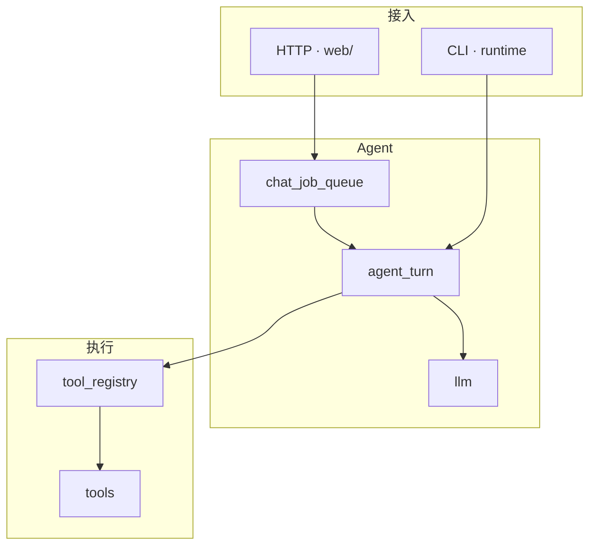

**语言 / Languages:** 中文（本页）· [English](en/DEVELOPMENT.md)

# 开发文档（架构概要）

面向**二次开发/维护**：主要模块与数据流。**不**维护逐文件源码树（易过时；以 `src/lib.rs` 与专题文档为准）。

| 主题 | 文档 |
|------|------|
| 功能与快速开始 | **`README.md`** |
| 配置 / 环境变量 | **`docs/配置说明.md`** |
| CLI 与 HTTP 路由 | **`docs/命令行与路由.md`** |
| SSE / AG-UI | **`docs/SSE协议.md`** |
| 内置工具 | **`docs/工具说明.md`** |
| 单轮展示顺序 | **`docs/Turn布局设计.md`** |
| 调试 | **`docs/调试指南.md`** |
| 前端结构 | **`docs/frontend/`**（本仓指针）· 源码 **`../crabmate-client/frontend`** |

## 文档与协作（摘要）

- **待办**：`docs/待办清单.md` 只保留未完成项；完成后删除，历史以 Git 为准。
- **用户可见变更**：同步 **`README.md`**；协议边界同步 **`docs/SSE协议.md`**。
- **架构级变更**：增删 `src/lib.rs` 顶层模块或调整分层时，更新下文「主要模块」与 Mermaid，见 **`.cursor/rules/architecture-docs-sync.mdc`**。
- **质量**：`.pre-commit-config.yaml`；提交说明 Conventional Commits（中英双语 subject）。
- **依赖**：改 `Cargo.toml` / 锁文件时核对 **`deny.toml`** 与 CI。
- **工作区临时产物**：Agent 生成的临时文档、分析报告、设计草稿等非代码产物放 **`agent_space/`**（已被 `.gitignore` 忽略，不入库），保持 `docs/` 与仓库根整洁。

## 总览

- **后端（`src/` + workspace crates）**：OpenAI 兼容 `chat/completions`、Agent 回合、HTTP/SSE、工具、工作区与会话。
- **官方 UI（Client 仓 `../crabmate-client/frontend`）**：Leptos + WASM（Trunk）；本仓 `serve` 可经 **`CM_WEB_STATIC_DIR`** 托管其 `dist`，或 **`--no-web`** 纯 API。
- **CLI / TUI（`runtime/`）**：与 Web 共用 **`run_agent_turn`** 与工具执行面。

## 架构设计

### 进程与分层

单体 **Tokio** 进程：Axum HTTP + `runtime` CLI；共享 `AgentConfig`、tools、`run_agent_turn`。

1. **接入**：`web/`、`serve` / `cli_run`
2. **编排**：`chat_job_queue`、`agent/`（`agent_turn`、消息管道、`per_coord`、workflow）
3. **模型**：`llm`（`complete_chat_retrying` → `OpenAiCompatBackend` → `api::stream_chat`）、vendor
4. **工具**：tools 表驱动、`tool_registry`、可选沙盒、`tool_result`
5. **契约**：`crabmate-types` / `config` / `llm` / `agent`、`crabmate-api-contract`（HTTP JSON DTO + OpenAPI schemars）、`crabmate-sse-protocol`、`crabmate-web-host`（handler 壳再导出契约）

```mermaid
flowchart TB
  subgraph entry [接入]
    WEB["HTTP · web/"]
    CLI["CLI · runtime"]
  end
  subgraph agent [Agent]
    Q[chat_job_queue]
    AT[agent_turn]
    LL[llm]
  end
  subgraph exec [执行]
    TR[tool_registry]
    TS[tools]
  end
  WEB --> Q --> AT
  CLI --> AT
  AT --> LL
  AT --> TR --> TS
```

### 配置

`AgentConfig`：多段 TOML + `CM_*` → `finalize`。**`POST /config/reload`** 热更新多数字段（会话库路径等例外见 `config/hot_reload`）。键说明见 **配置说明**。

### Agent 主循环（心智模型）

- 业务侧只经 **`llm::complete_chat_retrying`**（勿在 `agent` 直连 `api::stream_chat`）。
- **P / R / E**：P = 一轮模型；R = 反思 / 终答门控（`per_coord`）；E = `execute_tools` → `ToolExecutionHost`。
- 出站消息变换：`message_pipeline` / `context_window`。
- 运行时主路径：**session_mode →（Act 句关键词启发式）→ `assess_turn_routing` → ReAct 外循环**；相位词汇见 **`phase_vocabulary`**；设计见 **`docs/design/per_state_machine_consolidation.md`**。

### Web 流式（概要）

`POST /chat/stream` → `ChatJobQueue` → `TurnRunner`（默认 `run_agent_turn`）→ LLM SSE → 工具（串行或只读并行批）→ SSE 控制面。事件与错误码以 **SSE协议** 为准；布局见 **Turn布局设计**（含 §15 过渡债、§16 Phase E）。

### 可观测性（概要）

`observability`：tracing（本地时区 RFC3339）；Web 可选 `TracingChatTurn`；JSON 日志 `CM_LOG_JSON`。管道命中计数等见 **`GET /status`**（字段以 OpenAPI / handler 为准，本文不枚举）。

## 主要模块（按职责）

增删顶层职责或 crate 边界时更新本表；**细分路径请检索源码**，不在此维护逐文件表。工具清单与参数见 **工具说明**；HTTP 面见 **命令行与路由**。

| 区域 | 职责 |
|------|------|
| **`agent/`** | 回合编排：`agent_turn`、管道、`per_coord`、workflow 接合 |
| **`llm/`** | 重试完成、vendor、`api` 流式；领域类型多在 **`crabmate-llm`** |
| **`tools/`** / **`tool_registry/`** | 工具实现与分发、审批、超时；`run_command` / `terminal_session` 在配置开启时可对 argv 级区外路径做 **`WorkspaceExternalPath`** 三态预检（`skip_arg_safety`） |
| **`sse/`** | 控制面载荷 / 编码 / hub（**`crabmate-sse-protocol`**） |
| **`web/`** | Axum、`AppState`、域路由；JSON DTO 在 **`crabmate-api-contract`**（WASM 与 OpenAPI 同源），handler 经 **`crabmate-web-host`** 再导出 |
| **`chat_job_queue/`** | `/chat*` 排队与 worker |
| **`config/`** | 加载、`finalize`、热重载（**`crabmate-config`**） |
| **`workspace/`** | 路径策略与安全打开 |
| **`memory/`** | 长期记忆 / 可选语义索引 |
| **`runtime/`** | REPL、`chat`、导出、TUI、bench |
| **`tool_result/`** | 工具输出信封 |
| **`crabmate-types`** | `Message` / `Tool` / 网关预设等 |
| **`crabmate-api-contract`** | `POST /chat*`、`ApiError`、`GET /status?view=shell` 等 HTTP JSON；`schemars` 生成 OpenAPI `components` |
| **`crabmate-agent`** | 意图、外循环 FSM、完成判定等**领域核**；根包承载执行面 IO |
| **`crabmate-turn-layout`** | canonical Turn → Web/TUI 投影 |
| **`crabmate-approval`** | Web 工具审批类型与 SSE 往返 |
| **`crabmate-chat-export`** | 会话导出信封（raw / display） |
| **`crabmate-connect`** | 桌面/移动 Tauri 共用连接页：`/health` 探测、Bearer hash 交接、钥匙串 Bearer（**仅** Client 仓 `../crabmate-client/crates/crabmate-connect`；本仓已移除） |
| **`observability`** | tracing 初始化 |

物理实现多在 `crates/*`，根包再导出以保持 `crate::…` 路径稳定。禁边见 **`scripts/check-crate-deps.sh`**、**`docs/design/crate_dep_policy.md`**、**`docs/design/web_host_extract.md`**。

## 前端（摘要）

业务 UI **源码不在本仓**（路径 A）。Leptos CSR：Client `frontend/src/api/` + `sse_dispatch` 消费 SSE；`app/` 聊天与工作区。设计笔记见 **`docs/frontend/ARCHITECTURE.md`**。构建：`cd ../crabmate-client && make frontend`。

状态权威（避免第三真源）：壳层偏好 → `/user-data/prefs`；会话列表 → 内存 + 工作区分桶 `web_sessions.json`；流式尾段 → `stream_text_overlay`（收尾合并回 sessions）。展示全文须含 overlay 时走 `message_text_for_display_including_stream_overlay`。

## 数据与持久化（摘要）

- **会话**：默认工作区 SQLite（`conversation_store_sqlite_path`）；可关。
- **工作区**：工具与 `POST /workspace` 共用当前根；`.crabmate/` 提醒/导出等。
- **用户数据**：`/user-data/*` → `$XDG_DATA_HOME/crabmate`（见 **`docs/design/user_data_dir.md`**）；**不**用浏览器 `localStorage` 存会话/偏好/LLM 覆盖。
- **桌面**：业务数据走本机或远程 `serve` 的 `/user-data`；壳**不** spawn 后端，启动后走共用**连接页**（默认预填 `http://127.0.0.1:8080/`；Bearer 首次写入钥匙串 `tauri_connect_web_api_bearer`），与 Client 仓 **`mobile-tauri`** 对齐（**`../crabmate-client/crates/crabmate-connect`**）。

## 常见扩展点

- **新工具**：表驱动注册 + Schema + **工具说明**；复杂策略进 `tool_registry`；安全面见 **`.cursor/rules/security-sensitive-surface.mdc`**。
- **SSE / HTTP**：同步 Rust、协议 crate、前端、**SSE协议** / 路由文档（**api-sse-chat-protocol**）。
- **配置键 / 路由**：同步 **README**、**配置说明**、**命令行与路由**。
- **编排侧向能力**：挂现有 P/R，不开并行阶段机；见 **`run_loop_state_ownership.md`**、**`audience_critic_role.md`**。
- **系统提示组装**：分层 L0–L8 见 **`docs/design/system_prompt_assembly.md`**（勿把实现清单堆回本文）。

## 延伸阅读

| 专题 | 文档 |
|------|------|
| 回合拆分 / 宿主解耦 | `docs/design/agent_turn_split.md`、`turn_host_decouple.md`、`turn_runtime_placement.md`（P4）、`web_host_p5_placement.md`（P5：queue/handler 暂不迁 web-host）、`client_turn_smoke_runbook.md`（B3 三端/壳冒烟） |
| 官方 Client / 本仓只维护 Server | `docs/design/client_shell_split.md`（ADR：路径 A）、`client_shell_split_todo.md`（分阶段执行）、`client_contract_versioning.md`（Phase 1：契约 semver / git tag 钉法） |
| 三机 / 相位 | `docs/design/per_state_machine_consolidation.md` |
| 状态归属 | `docs/design/run_loop_state_ownership.md` |
| 系统提示组装 | `docs/design/system_prompt_assembly.md` |
| 规划执行验证 | `docs/规划执行验证架构.md` |
| 依赖策略 | `docs/design/crate_dep_policy.md` |
| 其它 design 稿 | `docs/design/` |

本文只做入口级索引，不复制专题全文。
