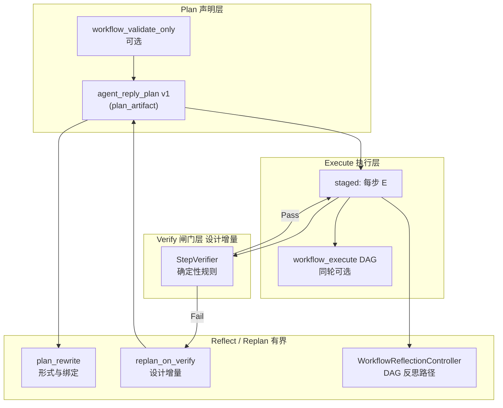

# 结构化规划—执行—验证（P-E-V）闭环：架构与设计

**状态**：设计稿（**未**承诺实现时间表）。**受众**：维护者、产品与协议设计者。  
**语言**：中文。  
**关联文档**：**`docs/工作流编排架构.md`**（轮内 DAG / FSM 扩展边界）、**`docs/开发文档.md`**（**`agent_turn` / `per_coord` / `plan_artifact` / 分阶段规划**）、**`docs/工具说明.md`**（**`workflow_execute` / `agent_reply_plan`** 字段约定）、**`docs/配置说明.md`**（**`final_plan_*` / `staged_plan_*` / `reflection_*`**）。

### 仓库嵌入默认（把闭环「用满」而不改代码）

- **`staged_plan_feedback_mode`**：嵌入 **`config/planning.toml`** 默认为 **`patch_planner`**（步内工具失败或 **`acceptance`** 不通过时回灌 planner 重规划，有界于 **`staged_plan_patch_max_attempts`**）；需整轮遇错即停可改 **`fail_fast`**。
- **`staged_plan_patch_max_attempts`**：嵌入默认 **3**（与 **`steps[].max_step_retries`** 配合：前者为**补丁规划轮**上限，后者为**单步局部重试**上限，二者均须有界）。
- **`steps[].executor_kind` / `acceptance` / `max_step_retries`**：由模型在无工具规划轮产出的 **`agent_reply_plan` v1** 填写；典型范式为 **读（`review_readonly`）→ 写（`patch_write`）→ 跑测（`test_runner` + `acceptance`）**。单步滚动规划下每轮通常 1 条 `steps`，验收对准**本步最后一条** `role: tool`（见 **`docs/工具说明.md`**）。

**可复制 JSON 片段 A（单步：先检查再改再验，占位路径）**：

```json
{
  "type": "agent_reply_plan",
  "version": 1,
  "steps": [
    {
      "id": "scan-contract",
      "description": "只读查看关键契约文件（占位：YOUR_ANCHOR_FILE.md）",
      "executor_kind": "review_readonly",
      "max_step_retries": 1
    }
  ]
}
```

**可复制 JSON 片段 B（下一步规划可接：写补丁 + 确定性验收；`run_command` 仍受白名单约束）**：

```json
{
  "type": "agent_reply_plan",
  "version": 1,
  "steps": [
    {
      "id": "apply-and-verify",
      "description": "运行占位检查命令并断言退出码为 0",
      "executor_kind": "test_runner",
      "max_step_retries": 2,
      "acceptance": {
        "expect_exit_code": 0,
        "expect_stdout_contains": "YOUR_EXPECTED_SUBSTRING"
      }
    }
  ]
}
```

---

## 1. 目标与对标

在**不否定模型创造性**的前提下，降低对**单次模型输出**的隐式依赖，形成可观测、可上限、可测试的闭环：

| 能力 | 含义 |
|------|------|
| **显式子任务拆解** | 结构化步骤列表、稳定 **`id`**、可选与 **DAG 节点** / **工具角色**绑定。 |
| **执行** | 分阶段 **E**、**`executor_kind`** 收窄工具；可选 **同轮 `workflow_execute` DAG**。 |
| **验证** | 对**执行结果**的**确定性或可重复**判定（退出码、结构化输出、diff 指纹等），而非仅「再问一次模型好不好」。 |
| **反思 / 重试** | **有界**：区分「规划形式错误」与「世界未满足验收」；与 **SSE / trace** 对齐。 |

对标 **AutoGPT / SWE-agent** 类外环时须注意：本仓库**已有**多轮 **`agent_turn`**、**终答规划校验与重写**、**工作流反思**与 **可选侧向 LLM 一致性检查**；本文定义**缺口**与**推荐增量**，避免与现有 **`plan_rewrite`**、**`workflow_reflection_controller`** 语义重叠或 silent 分叉。

---

## 2. 现状能力谱系（实现已存在）

### 2.1 结构化规划（Plan）

- **`agent_reply_plan` v1**（**`src/agent/plan_artifact.rs`**）：**`type` / `version` / `steps[]`**；每步 **`id`**、**`description`**；可选 **`workflow_node_id`**（与 **`workflow_execute` / `workflow_validate_only`** 结果中 **`nodes[].id`** 对齐）；可选 **`executor_kind`**（**`review_readonly` / `patch_write` / `test_runner`**）收窄该步 **E** 可见工具。  
- **`workflow_validate_only`**：只生成 **`workflow_validate_result`**，用于「先校验 DAG 再让模型写规划」及 **validate-only 逐步绑定**规则（见 **`plan_artifact`** 错误 **`ValidateOnlyPlanNodeBindingMismatch`** 等）。

### 2.2 执行（Execute）

- **分阶段规划**（**`agent_turn::staged`**）：无工具规划轮 → 将 **`steps`** 注入为多条 **user** → 每步跑完整工具子循环（**E**），并由 **`sub_agent_policy`** 按 **`executor_kind`** 拒绝越权 **`tool_calls`**。  
- **`workflow_execute`**：同轮 **DAG**；与「分阶段单步」正交，可由规划 **`workflow_node_id`** 对齐责任。

### 2.3 验证（Verify）— **已实现**

- **确定性验证闸门**（**`step_verifier.rs`**）：在分阶段路径下，对「**当前分步**」内最后一条 `role: tool` 与 **`steps[].acceptance`** 比对（**步界**为：本分步 `user` 注入之后、**下一条**普通 `user` 或片段结束之前，与分阶段扫描「本步工具是否均成功」的范围一致；**不**再使用会话全局最后一条 `tool`，避免一步多工具或后续步已追加消息时验错对象）。支持以下验收规则：
  - **`expect_exit_code`**：退出码验证（如 `cargo test` → 0）
  - **`expect_stdout_contains`**：stdout 是否包含指定字符串
  - **`expect_stderr_contains`**：stderr 是否包含指定字符串
  - **`expect_file_exists`**：文件是否存在
  - **`expect_json_path_equals`**：JSON path 验证（Legacy：`$.field.nested`、`$[0].field`、`$.items[0][1]`；JSON Pointer：`/a/0`；空白路径表示整份 JSON；失败文案含 `invalid_json:` / `invalid_path_syntax:` / `path_not_found:`）
  - **`expect_http_status`**：HTTP 状态码验证（对 `http_request`/`http_fetch` 类工具生效）
- **隐式验证**：工具返回的 **`error_code` / 退出码 / 结构化 `crabmate_tool` 信封** 已构成事实；模型在后续轮读取。  
- **`final_plan_semantic_check_enabled`**（**`per_plan_semantic_check`**）：在静态 **PER** 规则通过后，可选 **再调一次无工具 LLM**，判断「终答规划 vs 最近工具摘要」是否明显矛盾（**fail-open** 等语义以配置为准）——偏 **「规划一致性」**，**不是**通用「验收测试通过」闸门。
- **观众角色（侧向点评，规划中）**：更泛化的「对规划 / 执行 / 反思片段做结构化点评」能力的设计草案见 **`docs/design/audience_critic_role.md`**；落地时须与本节 **`plan_rewrite` / `patch_planner` / `per_plan_semantic_check`** 的边界与计数语义对齐，避免重复侧向调用与 silent 分叉。

### 2.4 反思与重试（Reflect / Retry）— 当前「部分存在」

- **`final_plan_requirement` + `plan_rewrite_max_attempts`**（**`per_coord::after_final_assistant`** + **`reflection/plan_rewrite`**）：终答缺合格 **`agent_reply_plan`**、或与 **workflow 节点覆盖 / validate-only 绑定**不符时，追加重写 **user** 再进入下一轮 **P**。  
- **`WorkflowReflectionController`**（**`src/agent/workflow_reflection_controller.rs`**）：控制 **是否再执行 `workflow_execute`**、是否注入 **`workflow_reflection_plan_next`**、是否对参数打 **`validate_only`** 补丁等（**`WorkflowReflectionDecision`**）。  
- **分阶段失败策略**：**`staged_plan_feedback_mode`**（**`fail_fast` / `patch_planner`**）等（见 **`docs/配置说明.md`**）。在 **`patch_planner`** 下，补丁规划注入的 **user** 正文对**验证失败**附带 `step_verifier` 的确定性原因，并在步上配置了 **`acceptance`** 时另附 **参考 r** 摘要（非空字段的键值罗列，与观测偏差分列）；对**执行子循环 `run_agent_outer_loop` 返回 `Err`** 附带**截断后的** `RunAgentTurnError::to_string()` 摘要（与工具失败路径的固定指引并列），便于规划器下一轮 JSON 对齐真实失败态。
- **计数与上限语义（与 `plan_rewrite` 分离）**：**`PerCoordinator`** 维护 **`plan_rewrite_attempts`**（终答 **`after_final_assistant`** 路径）与 **`staged_plan_patch_planner_rounds_completed`**（**`patch_planner`** 成功解析并合并 `steps` 的补丁规划轮次数，**不**计入前者）；**`GET /status`** 的 **`per_active_jobs[*]`** 同步暴露二者及配置镜像 **`staged_plan_patch_max_attempts_config`**；补丁 **user** 正文与 **`StepRetryExhausted`** 错误串末尾附 **`[计数]`** 脚注，便于日志对照。

### 2.5 分层（`hierarchy`）与 PER / 分阶段：双轨职责（收敛边界）

**双轨**指：会话轮末 **`per_coord::final_plan_gate`** + **`plan_rewrite`** +（可选）**`per_plan_semantic_check`**（侧向语义完成后由 **`run_final_plan_gate_semantic_completed`** 收口），与 **Manager / Operator** 在 **`src/agent/hierarchy/`** 内的分解—执行—子目标验收—**`reflect_and_replan`** **不共用同一套类型与计数器**，但产品语义上同属 P-E-V。**收敛目标**是「合同与可观测一致」，**不是**把 Manager 硬塞进 `AfterFinalAssistant`。

| 主题 | PER / `outer_loop` / `staged` | `hierarchy`（分层） | 维护时注意 |
|------|-------------------------------|---------------------|-------------|
| **终答 `agent_reply_plan` v1 与 `plan_rewrite`** | **`after_final_assistant`** → **`final_plan_gate`**；计数 **`plan_rewrite_attempts`** | Manager 产出 **`SubGoal`** 等结构化 JSON，**不经**终答门控；**话语型 / 澄清确认** 回落 **`run_agent_outer_loop`** 后才进入 PER | 勿把 **`ManagerAgent::reflect_and_replan`** 称为 `plan_rewrite`；改终答规则只动 **`per_coord/final_plan_gate`** 与 **`agent_turn/reflect`** |
| **步级 / 子目标验收** | **`step_verifier`**（分阶段步界）；**`GoalAcceptance`** 与 **`verify_against_spec`** 共用内核 | **`GoalVerifier::run_verify_command`** 等；失败驱动 **`reflect_and_replan`** | 改 **`acceptance`** 语义或工具输出判定时，**同时**核对 **`step_verifier`** 与 **`hierarchy/goal_verifier`**（及 Manager 反思 prompt 中的验收描述） |
| **工作流 DAG 反思** | **`WorkflowReflectionController`**、`INSTRUCTION_WORKFLOW_REFLECTION_PLAN_NEXT` | DAG 在 **`workflow_execute`** 内执行；Manager 另有反思路径 | 若新增与反思注入「同形」指令，须 **`开发文档.md`** 与 **`workflow_reflection_controller`** 常量并列说明，避免 silent 分叉（见上文 §6 表） |
| **侧向语义 LLM（规划 vs 工具摘要）** | **`per_plan_semantic_check`** + **`final_plan_gate::run_final_plan_gate_semantic_completed`** | **无**默认等价路径 | 不把分层子目标反思误当成 **`final_plan_semantic_check`** |
| **可观测** | **`target: crabmate::agent_turn`**：`turn_orchestration_mode`；**`target: crabmate::per`**：`gate_route` 等 | 同 target 下 **`hierarchical_phase`**（**`agent_turn/hierarchy.rs`**）；**`[HIERARCHICAL]`** `log` 保留 | 排障时同时看 **`turn_orchestration_mode`** 与 **`hierarchical_phase`**；维护清单见 **`docs/开发文档.md`**「与 `agent_turn` / `per_coord` 变更同步」 |

#### 2.5.1 终答与反思：责任矩阵（源码锚点）

下表与 §2.5 表互补：突出「**终答从哪条链路产出**」与「**反思/重写由谁驱动**」，避免把分层 Manager 反思与 **`plan_rewrite`** 混称。

| 能力 | PER / `outer_loop` / `staged` 轨 | `hierarchy` 分层主路径 | 交汇轨（话语型等 → `outer_loop`） |
|------|----------------------------------|-------------------------|-------------------------------------|
| **会话末条助手「终答」形态** | 可能须含可解析 **`agent_reply_plan` v1**（视 **`final_plan_requirement`**）；经 **`per_coord::after_final_assistant`** / **`final_plan_gate`** | **`handle_execution_result`** 聚合 Markdown（**不**走 **`agent_reply_plan` 门控**） | 与左侧 PER 轨相同：进入 **`run_agent_outer_loop`** 后终答规则由 **`per_coord`** 决定 |
| **`plan_rewrite` 计数与耗尽** | **`PerCoordinator::plan_rewrite_attempts`**；耗尽文案 **`PLAN_REWRITE_EXHAUSTED_SSE`** | **不计数**（不经 **`after_final_assistant`**） | 回落后 **计入** PER 轨（新构造 **`PerCoordinator::new(PerCoordinatorInit::from_agent_config(...))`**） |
| **子目标 / 步失败后的「反思」** | 分阶段：**`patch_planner`** / **`fail_fast`** 等；非结构化外环：**`per_reflect_after_assistant`** 语境下的终答策略 | **`ManagerAgent::reflect_and_replan`**（验证失败等）；**不是** `plan_rewrite` | 回落后 **无** Manager；回到 **`outer_loop`** 的 R 步语义 |
| **工作流 DAG 与规划对齐** | **`WorkflowReflectionController`**、**`workflow_tool_dispatch`** | 节点在 Operator 内 **`workflow_execute`**；与 **`agent_reply_plan` 的 `workflow_node_id`** 对齐规则见 **`plan_artifact`** | 同左：回落后工具调用走 **`per_execute_tools_*`** + PER |
| **侧向语义 LLM（规划 vs 工具）** | **`per_plan_semantic_check`**（可选） | **无**对等默认路径 | 回落后 **适用** PER 轨开关 |

**源码锚点（便于 code review 跳转）**

- PER 终答门控：**`src/agent/per_coord/final_plan_gate.rs`**，重写策略 **`src/agent/reflection/plan_rewrite.rs`**，协调状态 **`src/agent/per_coord/mod.rs`**（**`AfterFinalAssistant`**）。
- 分层入口与话语型回落：**`src/agent/agent_turn/hierarchy.rs`**（**`HierarchicalRunPhase::DiscourseFallbackOuter`** → **`run_agent_outer_loop`**）。
- 回落路由纯函数：**`src/agent/agent_turn/hierarchical_intent_route.rs`**（**`resolve_hierarchical_post_intent_route`**）；单测 **`hierarchical_intent_route::tests`**。
- 分层意图门控（与 `intent_at_turn_start` 共用 L0/L1/L2 拼装）：**`src/agent/agent_turn/intent/at_turn_start.rs`**（**`run_intent_for_hierarchical`**）。
- 分层终答聚合：**`src/agent/agent_turn/hierarchy.rs`**（**`handle_execution_result`** / **`emit_hierarchical_final_assistant`**）。

#### 2.5.2 自动化回归触点（双轨）

| 触点 | 命令或测试名 | 说明 |
|------|----------------|------|
| 单 Agent 外环 + 工具 + 终答（PER 轨 **`run_agent_outer_loop`**） | **`cargo test -p crabmate run_agent_turn_outer_loop_tool_round_then_final_assistant`** | 集成测 **`tests/run_agent_turn_orchestration_mock.rs`** |
| 分层 Router→Manager→Operator（不经 **`PerCoordinator` 终答门控**） | **`cargo test -p crabmate run_agent_turn_hierarchical_end_to_end_mock_llm_sequence`**（及同文件 **`run_hierarchical_router_manager_operator_mock_llm_sequence`**） | 钉 **`run_agent_turn` → `run_hierarchical_agent` → `runner::run_hierarchical`** |
| **分层话语型 → `outer_loop`（PER 与分层交汇）** | **`cargo test -p crabmate run_agent_turn_hierarchical_discourse_fallback_uses_per_outer_loop`** | 同文件；用户任务 **`你好`** → 意图 **`DiscourseFallbackOuter`** → **仅一次** mock LLM（与 **`PerCoordinator`** 终答链共用） |
| 回落路由纯函数 | **`cargo test -p crabmate hierarchical_intent_route`**（模块内测试） | 变更 **`resolve_hierarchical_post_intent_route`** 时必跑 |

变更 **`final_plan_requirement` / `plan_rewrite` / `after_final_assistant` / `WorkflowReflectionController`**：至少跑 **PER 轨** 触点；若动意图管道再加 **`cargo test -p crabmate golden_intent_regression`**（**`fixtures/intent_regression.jsonl`**）。变更 **Manager 反思 / 子目标验收**：跑 **分层** 触点 + 必要时 **`hierarchy`** 下单元测。变更 **话语型回落或意图阈值**：跑 **交汇** 触点 + **`hierarchical_intent_route`**。

---

## 3. 缺口与设计原则

### 3.1 缺口

1. **缺少「步级验收」一阶对象**：验收条件多散落在 **`description` 自然语言**或模型自行理解中，难以 **确定性重放**。  
2. **`plan_rewrite` 与「执行失败」未统一**：**`plan_rewrite`** 主要解决 **规划 JSON / 绑定契约**；**测试失败 / 业务未达成** 不自动等价于「应触发同一条重写路径」。  
3. **外环有界性**：多轮依赖模型自省时，须有与 **`plan_rewrite_max_attempts` / `reflection_default_max_rounds`** 同哲学的 **全局步级/验证级上限**，并在 **SSE** 用 **`reason_code`** 区分失败类别。

### 3.2 设计原则

| 原则 | 说明 |
|------|------|
| **单一结构化计划源** | 继续以 **`plan_artifact`** 为规划真源；扩展字段须 **serde 向后兼容**、文档与 OpenAPI（若有）同步。 |
| **验证优先确定性** | 能解析 **`tool` 输出 / 退出码 / 文件指纹**的不要用 LLM；LLM 仅用于**解释**或**草案 replan**（可选）。 |
| **与 `plan_rewrite` 正交** | **形式与绑定** → **`plan_rewrite`**；**世界未满足 acceptance** → **Verifier 闸门**（新语义，新配置与 SSE 码）。 |
| **有界循环** | 任意外环须 **三重上限**（步内重试次数、重规划次数、墙钟/token），默认保守。 |
| **可观测** | 验证结果进入 **`messages`**（如 **`user.name=crabmate_step_verify`** 占位约定）或 **trace** 扩展事件；禁止仅 stderr 黑箱。 |

---

## 4. 推荐架构：三层 + 闸门



**注**：**Verify → Pass → ST** 为抽象画法，表示「本步验收通过后，由**分阶段编排**进入**下一步 E** 或进入 **PER / 终答**」；**不**表示在同一轮 `tool_calls` 内无意义地回到同一执行入口。

**说明**：

- **Plan**：模型或模板产出 **`agent_reply_plan`**；可选先 **`workflow_validate_only`** 再要求 **`workflow_node_id`** 全绑定（已有规则）。  
- **Execute**：**分阶段 E** 为主；**`workflow_execute`** 承载同轮并行/流水线。  
- **Verify（建议新增）**：在每步 **E** 结束（或整轮终答前）运行 **Verifier**：输入为本步相关 **`tool` 消息**（及配置中的 **`acceptance`** / 工具名白名单），输出 **`Pass | Fail(reason) | EscalateHuman`**。  
- **Reflect / Replan**：**`Fail`** 且未超限时 → **追加结构化 user**（含 verifier 摘要、**`step_id`**、**`workflow_run_id`** 指针）→ 下一轮 **P**（**replan**）或 **仅重跑本步 E**（**局部 retry**）；与 **`plan_rewrite`** 并行时须 **文档定义优先级**（建议：**先**解决形式规划 **`plan_rewrite`**，**再**进入 **verify** 闸门）。

---

## 5. `PlanStepV1` 扩展方向（可选字段，设计级）

以下字段名为**设计提案**，实现前须走 serde 与 **`docs/工具说明.md`** 契约评审：

| 字段（提案） | 类型 | 用途 |
|--------------|------|------|
| **`step_kind`** | 枚举可选 | **`implement` / `verify` / `gate`**：指导 UI 与 Verifier 是否在本步强制跑验收。 |
| **`acceptance`** | 对象可选 | 如 **`{ "tool": "cargo_test", "expect_exit_code": 0 }`** 或 **`{ "json_path": "…", "equals": … }`**——须限制表达能力，避免 Turing-complete 配置。 |
| **`max_step_retries`** | 整数可选 | 本步 **E** 内或跨轮 **局部**上限；与全局上限组合取 min。 |

**兼容**：全部可选；省略时行为与当前一致（仅靠模型与 **`executor_kind`**）。

---

## 6. 与现有模块的衔接清单

| 模块 | 衔接方式 |
|------|----------|
| **`plan_artifact`** | 解析/校验扩展字段；错误枚举新增须 **不破坏**现有 **`PlanArtifactError`** 处理路径。 |
| **`agent_turn::staged`** | 每步 **E** 结束后调用 **Verifier**（若启用）；决定 **继续下一步 / 重跑本步 / 中止并 SSE**。 |
| **`per_coord`** | **终答后** **`plan_rewrite`** 逻辑保持不变；**Verifier 触发的 replan** 建议走 **独立计数器**（如 **`verify_replan_attempts`**），避免与 **`plan_rewrite_attempts`** 混用导致排障困难。 |
| **`workflow_reflection_controller`** | **DAG 反思路径**不变；若 **分阶段步级验证失败** 需注入与 **`INSTRUCTION_WORKFLOW_REFLECTION_PLAN_NEXT`** 类似指令，应 **复用或并列新常量**，并在 **`开发文档.md`** 说明语义差异。 |
| **`final_plan_semantic_check`** | 保持 **「规划 vs 工具摘要」**；**步级 Verifier** 不应用侧向 LLM 替代确定性验收。 |
| **SSE** | 新增控制面事件或 **`reason_code`** 须在 **`docs/SSE协议.md`**、**`crabmate-sse-protocol`**、**`frontend`** 同步（见仓库 **api-sse-chat-protocol** 规则）。 |

---

## 7. 非目标与风险（当前共识）

- **不在首版**引入任意表达式语言作为 **`acceptance`** 的通用求值器（安全与测试成本）。  
- **不把** **`workflow_execute` DAG** 改成通用「验证图灵机」；验证外环仍以 **会话级 `agent_turn` + `plan_artifact`** 为主（与 **`工作流编排架构.md`** 一致）。  
- **默认不**无界 **「直到模型满意」** 循环；所有 **replan / retry** 须有配置上限与可观测 **耗尽** 事件。

---

## 8. 演进阶段（建议）

| 阶段 | 状态 | 内容 | 产出 |
|------|------|------|------|
| **P0** | ✅ 完成 | 文档化「推荐验收模式」 | **`docs/工具说明.md` + 本稿附录示例** |
| **P1** | ✅ 完成 | **Verifier** 支持 **退出码 + JSON 路径 + HTTP 状态** | **Rust 闸门 + 单测** |
| **P2** | 🔄 进行中 | **`PlanStepV1`** 可选字段 **`step_kind` / `acceptance` / `max_step_retries`** | **serde 迁移 + 前端展示（若有）** |
| **P3** | ⏳ 待办 | 与 **Chrome trace / `/status`** 对齐的 **verify 事件** | **观测性完备** |

---

## 9. 相关源码索引

| 主题 | 路径 |
|------|------|
| 规划 JSON | `src/agent/plan_artifact.rs` |
| 分阶段执行 | `src/agent/agent_turn/staged/mod.rs`、`sub_agent_policy` |
| **步级验收闸门** | `src/agent/step_verifier.rs` |
| PER / 重写 | `src/agent/per_coord/`（含 `final_plan_gate.rs`）、`src/agent/reflection/plan_rewrite.rs` |
| 工作流反思 | `src/agent/workflow_reflection_controller.rs` |
| 侧向规划检查 | `src/agent/per_plan_semantic_check.rs` |
| 分层（Manager/Operator） | `src/agent/hierarchy/`；入口 **`agent_turn/hierarchy.rs`**（`hierarchical_phase` 日志） |
| DAG 执行 | `src/agent/workflow/`、`src/agent/workflow_tool_dispatch.rs` |
| validate-only | `src/agent/workflow/run.rs` |

---

## 10. 修订记录

| 日期 | 摘要 |
|------|------|
| 2026-04-12 | 初稿：P-E-V 分层、与现有能力映射、Verifier 闸门与 `plan_rewrite` 正交、演进阶段与非目标。 |
| 2026-05-01 | 分阶段 **`patch_planner`** 与终答 **`plan_rewrite`** 计数分离；`/status` **`per_active_jobs`** 与补丁反馈脚注。 |
| 2026-05-01 | 新增 **§2.5**：分层 **`hierarchy`** 与 **PER / staged** 双轨职责边界与收敛原则。 |
| 2026-05-02 | 新增 **§2.5.1–§2.5.2**：终答/反思责任矩阵、源码锚点与 **`cargo test`** 回归触点（含分层话语型 **`run_agent_outer_loop`** 交汇测）。 |

## 附录：`acceptance` 使用示例

### 基础退出码验证

```json
{
  "type": "agent_reply_plan",
  "version": 1,
  "steps": [
    {
      "id": "run-tests",
      "description": "运行项目测试",
      "executor_kind": "test_runner",
      "acceptance": {
        "expect_exit_code": 0
      }
    }
  ]
}
```

### 多规则组合验证

```json
{
  "steps": [
    {
      "id": "build",
      "description": "编译项目",
      "executor_kind": "patch_write",
      "acceptance": {
        "expect_exit_code": 0,
        "expect_stderr_contains": "Finished"
      }
    },
    {
      "id": "verify-build-artifact",
      "description": "验证构建产物",
      "executor_kind": "review_readonly",
      "acceptance": {
        "expect_file_exists": "target/release/myapp"
      }
    }
  ]
}
```

### JSON Path 验证

```json
{
  "steps": [
    {
      "id": "api-check",
      "description": "调用健康检查 API",
      "acceptance": {
        "expect_exit_code": 0,
        "expect_json_path_equals": {
          "path": "$.status",
          "value": "healthy"
        },
        "expect_http_status": 200
      }
    }
  ]
}
```

### 带重试与控制流

```json
{
  "steps": [
    {
      "id": "apply-fix",
      "description": "应用修复补丁",
      "executor_kind": "patch_write",
      "max_step_retries": 3,
      "transitions": [
        {
          "condition": "on_verify_fail",
          "target_step_id": "apply-fix",
          "max_loops": 3
        }
      ]
    },
    {
      "id": "verify",
      "description": "运行测试验证",
      "executor_kind": "test_runner",
      "step_kind": "verify",
      "acceptance": {
        "expect_exit_code": 0,
        "expect_stdout_contains": "all tests passed"
      }
    }
  ]
}
```
